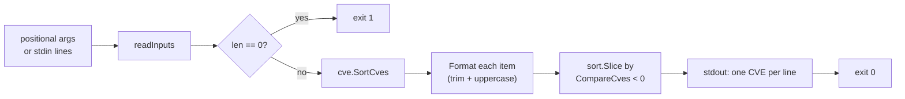

# cve compare sort

:::tip 📂 View Source
[`cmd/compare.go:27`](https://github.com/scagogogo/cve-skills/blob/main/cmd/compare.go#L27-L46) — open the cobra command definition on GitHub (lines L27–L46).
:::

Sort a list of CVE identifiers into **ascending order by year and then sequence number**, emitting each one per line in standardized uppercase form.

:::tip 🖥️ When to use
- Ordering an unsorted list of CVEs for a time-sequenced vulnerability report or timeline view.
- Prepping data extracted from advisory text (`cve extract`) so the oldest CVEs appear first and the newest last.
- Establishing a canonical line-up before set operations or diffs, so two pipelines produce comparable output.
:::

## Command syntax

```bash
cve compare sort [cve-id...]
```

The command is a child of `cve compare`. It accepts CVE identifiers as positional arguments or, when none are given, reads them from stdin one per line.

## Arguments and options

- `[cve-id...]` (positional, repeatable): Zero or more CVE identifiers. Each argument is treated as a **single, whole CVE** — this command does **not** split on commas, unlike list-taking commands such as `filter-valid`.
- stdin fallback: When no positional arguments are supplied and stdin is piped, each non-empty line is read as one CVE. Empty lines are skipped.
- This command defines **no flags** of its own. The global `-q, --quiet` flag is inherited from the root command.

## Examples

Sort three CVEs passed as arguments — output is ascending by year, then by sequence within the same year, and every line is uppercased:

```bash
$ cve compare sort CVE-2022-2222 CVE-2020-1111 CVE-2022-1111
CVE-2020-1111
CVE-2022-1111
CVE-2022-2222
```

Mixed-case input is normalized — `cve-...` becomes `CVE-...` and surrounding whitespace is trimmed:

```bash
$ cve compare sort " cve-2022-9 " CVE-2021-100
CVE-2021-100
CVE-2022-9
```

Feed an unsorted list from stdin, the natural shape for a pipeline:

```bash
$ printf 'CVE-2024-5\nCVE-2019-1\nCVE-2024-2\n' | cve compare sort
CVE-2019-1
CVE-2024-2
CVE-2024-5
```

Chain it after extraction to present CVEs in chronological order:

```bash
$ cve extract "affects CVE-2022-12345 and CVE-2020-5 and CVE-2022-1" | cve compare sort
CVE-2020-5
CVE-2022-1
CVE-2022-12345
```

Duplicated entries are **not** merged — both copies print, sorted into place. Pipe through `cve filter dedup` afterward for a deduplicated set:

```bash
$ cve compare sort CVE-2022-1 CVE-2022-1 CVE-2020-1
CVE-2020-1
CVE-2022-1
CVE-2022-1
```

## How it works



## Corresponding Go API

This command is a thin wrapper around [`SortCves`](/api/functions/sort-cves), which copies the input slice, runs `Format` over every entry, then orders them with `sort.Slice` using `CompareCves` as the comparator. All ordering and normalization logic lives in the library. Use the Go function directly when you need the sorted slice in code rather than printed text.

## Exit codes and output

- Exit code `0`: the command ran to completion and printed one line per input CVE.
- Exit code `1`: no input was supplied (neither positional arguments nor piped stdin).
- stdout: one CVE per line in ascending order, each in standardized uppercase form (`CVE-YYYY-NNNNN`, surrounding whitespace trimmed). Invalid-looking entries are not validated — they are still formatted and sorted, so a malformed item appears wherever `CompareCves` places it.
- stderr: silent on success; on the no-input failure case nothing is written to stdout and the process exits `1`.

## Notes

- Sorting is by **year first, then sequence number** — the same ordering `cve compare` uses for pairwise `-1 / 0 / 1` results. Two CVEs with the same year and sequence are considered equal and retain their relative order (stable-ish via `sort.Slice`).
- This command does **not** split arguments on commas — `cve compare sort "CVE-2022-1,CVE-2020-1"` treats the whole string as one (invalid) entry. Pass items as separate arguments or as separate stdin lines instead.
- Entries are **not validated** — `cve compare sort` will happily order malformed tokens. Run `cve filter-valid` first if you need only well-formed CVEs in the output.
- Duplicates are **kept**. Combine with `cve filter dedup` for a sorted, deduplicated list.
- The year upper bound is **not** enforced here (sorting does not reject future years); validation-based filtering belongs to `filter-valid` or `validate`.

## Internal Implementation

The `sortCmd` cobra command (`cmd/compare.go:27-L46`) is registered as a child of `compareCmd` in `init()`. Its `Run` function does the following:

1. **No flag parsing in `Run`.** The command defines no flags of its own; it relies solely on the positional `args []string` passed in by cobra and on the inherited root flags. Cobra has already split the command line before `Run` is entered.
2. **Input collection via `readInputs(args)`.** A shared helper gathers CVE identifiers: when `args` is non-empty it uses the arguments directly; when `args` is empty it falls back to stdin, reading one CVE per non-empty line. This is why the command transparently supports both argument and pipeline input.
3. **Empty-input guard.** Immediately after collecting, `if len(inputs) == 0 { os.Exit(1) }` aborts with exit code `1` before any sorting happens — there is no error message printed, the process simply terminates.
4. **Sort and print.** `sorted := cvepkg.SortCves(inputs)` delegates all normalization (trim + uppercase via `Format`) and ordering (`sort.Slice` with `CompareCves`) to the library. The `Run` function then loops `for _, c := range sorted { fmt.Println(c) }`, writing one standardized CVE per line to stdout. Nothing is written to stderr.

## Argument Flow

```text
+--------------------------+     +--------------------------+
| argv: cve compare sort   |     | stdin (when no args)     |
|        CVE-... CVE-...   |     | one CVE per line         |
+-----------+--------------+     +-----------+--------------+
            |                              |
            |  args []string               |  read line by line
            v                              v
          +----------------------------------+
          |  readInputs(args)                |
          |  - args present? use args        |
          |  - else read stdin non-empty     |
          +----------------+-----------------+
                           |
                           v
                +-----------------------+
                |  len(inputs) == 0 ?   |
                +----+-------------+----+
                     | yes         | no
                     v             v
              +-------------+   +-----------------------+
              | os.Exit(1)  |   | cvepkg.SortCves       |
              | (no output) |   |  - copy slice         |
              +-------------+   |  - Format each entry  |
                                |  - sort.Slice +        |
                                |    CompareCves         |
                                +-----------+-----------+
                                            |
                                            v
                              +-----------------------------+
                              | for _, c := range sorted   |
                              |   fmt.Println(c) -> stdout |
                              +-----------------------------+
                                            |
                                            v
                                    +---------------+
                                    |  exit 0       |
                                    +---------------+
```

## Edge Cases

| Input | Behavior | Exit code / output |
| --- | --- | --- |
| No positional args, stdin not piped (a TTY) | `readInputs` returns an empty slice; the guard fires | Exit `1`, nothing on stdout or stderr |
| No positional args, stdin piped but empty (`printf '' \| cve compare sort`) | No non-empty lines collected; `len(inputs) == 0` | Exit `1`, no output |
| Positional args supplied | Args used as-is, stdin is not read even if piped | Exit `0`, sorted lines on stdout |
| Mixed-case or whitespace-padded token (`" cve-2022-9 "`) | `SortCves` runs `Format` → trimmed and uppercased to `CVE-2022-9` | Exit `0`, normalized form printed |
| Malformed token (`CVE-2022-1,CVE-2020-1` as one arg) | Not split on commas; treated as one entry, formatted and sorted by `CompareCves` | Exit `0`, the malformed line appears wherever the comparator places it |
| Duplicate entries | Not merged; each copy is formatted and sorted into place | Exit `0`, duplicates printed |
| stdin with blank lines between CVEs | Blank lines skipped by `readInputs` | Exit `0`, only non-empty lines sorted and printed |

## Exit Codes

- **Exit `0`** — success. `Run` completes the print loop and returns normally; cobra exits with `0`. stdout holds one CVE per line.
- **Exit `1`** — no input. Triggered explicitly by `os.Exit(1)` when `len(inputs) == 0`. This is a hard, immediate process termination: nothing is written to stdout or stderr, and deferred cleanup in the `main` goroutine does not run.
- **stderr** — the command writes nothing to stderr in any code path. Error signaling is done purely through the exit code; there is no `fmt.Fprintln(os.Stderr, ...)` call in `sortCmd`'s `Run`. Unknown flags or cobra-level usage errors are handled by cobra itself (printed to stderr, exit `1`) before `Run` is reached.

## Related commands

- [cve compare](/cli/commands/compare) — pairwise comparison of two CVEs, returning `-1 / 0 / 1`.
- [cve compare by-year](/cli/commands/compare-by-year) — compare two CVEs by year only.
- [cve filter dedup](/cli/commands/filter-dedup) — remove duplicates, often chained after `compare sort`.
- [cve filter-valid](/cli/commands/filter-valid) — drop malformed entries before sorting.
- [CLI Reference](/cli) — full command tree and I/O conventions.
