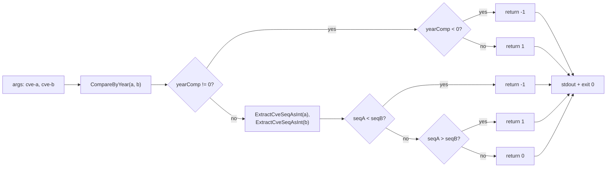

# cve compare

:::tip 📂 View Source
[`cmd/compare.go:11`](https://github.com/scagogogo/cve-skills/blob/main/cmd/compare.go#L11-L25) — open the cobra command definition on GitHub (lines L11–L25).
:::

Compare two CVE identifiers by **year and sequence number**, printing a stable `-1 / 0 / 1` tri-state — `-1` when the first is smaller, `0` when they are equal, `1` when the first is larger.

:::tip 🖥️ When to use
- Decide which of two CVEs is newer when de-duplicating or merging advisory records.
- Provide a lightweight ordering predicate inside a shell pipeline, where only the sign of the result matters.
- Build ad-hoc comparisons by hand when the full `cve compare sort` pipeline is more than you need.
:::

## Command syntax

```bash
cve compare <cve-a> <cve-b>
```

The command takes exactly two positional arguments and writes a single integer (`-1`, `0`, or `1`) to stdout. It does **not** read from stdin — both CVEs must be supplied as arguments.

## Arguments and options

- `<cve-a>` (positional, required): The first CVE identifier, e.g. `CVE-2021-44228`.
- `<cve-b>` (positional, required): The second CVE identifier, e.g. `CVE-2022-12345`.
- This command defines **no flags** of its own. The global `-q, --quiet` flag is inherited from the root command.
- Argument count is enforced by `cobra.ExactArgs(2)`: supplying fewer or more than two arguments exits with code `1` and a usage error on stderr.

## Examples

Different years — the earlier year sorts first, so the result is `-1`:

```bash
$ cve compare CVE-2021-44228 CVE-2022-12345
-1
```

Same year, the first sequence is smaller — year is equal so sequence decides, giving `-1`:

```bash
$ cve compare CVE-2022-1111 CVE-2022-2222
-1
```

Fully identical identifiers — both year and sequence match, so the result is `0`:

```bash
$ cve compare CVE-2022-2222 CVE-2022-2222
0
```

The first is larger (later year or, same year, larger sequence) — the result is `1`:

```bash
$ cve compare CVE-2023-1111 CVE-2021-2222
1
```

Use the sign in a shell conditional to branch on which CVE is newer:

```bash
$ if [ "$(cve compare CVE-2024-1 CVE-2021-1)" -gt 0 ]; then echo "newer"; fi
newer
```

## How it works



## Corresponding Go API

This command is a thin wrapper around [`CompareCves`](/api/functions/compare-cves), which compares year first via `CompareByYear`; if the years differ, the result is immediately `-1` or `1`. When the years are equal, the sequence numbers (extracted with `ExtractCveSeqAsInt`) decide. The CLI simply prints the returned integer. Unlike [`CompareByYear`](/api/functions/compare-by-year) (the raw year difference), the magnitude is always collapsed to a sign — use the Go function directly when you need the comparator in code rather than printed text.

## Exit codes and output

- Exit code `0`: the command ran to completion and printed one integer to stdout.
- Exit code `1`: the argument count was not exactly two. The error `accepts 2 arg(s), received N` is printed to stderr.
- stdout: a single line containing `-1`, `0`, or `1`.
- stderr: only the argument-count error above. The comparison result never goes to stderr.

## Notes

- The output is the **sign** of the comparison, not a magnitude. `CVE-2025-1` vs `CVE-2020-1` prints `1`, not `5`. If you need the raw year gap, use `cve compare by-year` instead.
- Comparison order is **year first, then sequence**; a later year always wins regardless of sequence magnitude (e.g. `CVE-2021-9999` < `CVE-2023-0001`).
- Malformed input does not panic — invalid CVEs fall back to year `0` and sequence `0` via the underlying extractors, so they sort to the front. Validate inputs first with `cve validate` if this matters.
- Year extraction is purely textual; there is no check that the year falls in `1999..currentYear`. A hypothetical `CVE-1800-1` parses to year `1800` without error.
- Letter case and surrounding whitespace are not normalized before comparison — pass already-formatted identifiers, or run `cve format` first.

## Internal Implementation

The `compareCmd` cobra command (defined in `cmd/compare.go:11-L25`) is a minimal positional-argument wrapper with no flags of its own:

- **Argument intake**: `Run: func(cmd *cobra.Command, args []string)` receives the two CVEs directly through `args`. No `cobra.Flag` is registered on `compareCmd`; the only flags it sees are inherited globals such as `-q, --quiet`, which the comparison logic ignores.
- **Arity guard**: `Args: cobra.ExactArgs(2)` runs before `Run`, so cobra itself rejects any call that does not pass exactly two positional arguments — `Run` is never entered with the wrong count.
- **Library call**: the body is a single statement, `result := cvepkg.CompareCves(args[0], args[1])`. The CLI does no parsing itself; `CompareCves` is responsible for extracting year and sequence and producing the `-1 / 0 / 1` sign.
- **Output**: `fmt.Println(result)` writes the integer plus a trailing newline to stdout. No formatting, no labels, no stderr write — the printed value is the sole output, making it safe to capture with `$(...)`.

## Argument Flow

```text
+-------------------------+
| shell: cve compare A B  |
+-----------+-------------+
            |
            v
+-------------------------+
| cobra parses argv       |
| enforces ExactArgs(2)   |
+-----------+-------------+
            |
            v
+-------------------------+
| compareCmd.Run(args)    |
| args[0]=A  args[1]=B    |
+-----------+-------------+
            |
            v
+-------------------------+
| cvepkg.CompareCves(A,B) |
|  -> CompareByYear       |
|  -> ExtractCveSeqAsInt  |
|  returns -1 / 0 / 1     |
+-----------+-------------+
            |
            v
+-------------------------+
| fmt.Println(result)     |
| -> stdout: integer\n    |
+-------------------------+
```

## Edge Cases

| Input | Behavior | Exit code / output |
|---|---|---|
| No arguments (`cve compare`) | `cobra.ExactArgs(2)` fails before `Run` | exit `1`; stderr `accepts 2 arg(s), received 0` |
| One argument (`cve compare CVE-2021-1`) | arity check fails | exit `1`; stderr `accepts 2 arg(s), received 1` |
| Three or more arguments | arity check fails | exit `1`; stderr `accepts 2 arg(s), received N` |
| Identical identifiers (`A == B`) | year and sequence both equal | exit `0`; stdout `0` |
| Malformed CVE (e.g. `CVE-ABC-1`) | extractors fall back to year `0`, seq `0`; no panic | exit `0`; stdout `-1`, `0`, or `1` |
| Stdin supplied (`echo CVE-2021-1 \| cve compare CVE-2021-2`) | stdin is **not** read; the piped data is ignored | exit `1` if fewer than 2 args, else exit `0` with normal stdout |
| Flags only, no CVEs (`cve compare -q`) | `-q` is consumed as a flag, leaving 0 positional args | exit `1`; stderr arity error |

## Exit Codes

- **Success** (exit `0`): `Run` executes `CompareCves` and `fmt.Println` to completion. The exit code is the process default `0`; the source does not call `os.Exit` on the success path.
- **Arity failure** (exit `1`): raised by `cobra.ExactArgs(2)` before `Run` is entered. Cobra writes the message `accepts 2 arg(s), received N` to stderr, followed by the command usage, and exits the process with code `1`.
- **stderr**: the only stderr output the command can produce is the cobra arity error above. `CompareCves` never returns an error and never writes to stderr — malformed inputs are silently coerced to `0`, so they do not surface as exit-code failures.
- **stdout**: always exactly one line — `-1`, `0`, or `1` plus a trailing newline — and only on the success path.

## Related commands

- [cve compare by-year](/cli/commands/compare-by-year) — compare by year only, returning the signed year difference.
- [cve compare sort](/cli/commands/compare-sort) — sort a list ascending by year then sequence.
- [cve validate](/cli/commands/validate-batch) — check CVE identifiers before comparing.
- [cve format](/cli/commands/format) — normalize case and formatting before comparison.
- [CLI Reference](/cli) — full command tree and I/O conventions.
