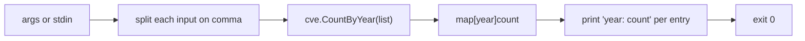

# cve count-by-year

:::tip 📂 View Source
[`cmd/stats.go:12`](https://github.com/scagogogo/cve-skills/blob/main/cmd/stats.go#L12-L31) — open the cobra command definition on GitHub (lines L12–L31).
:::

Group a list of CVE identifiers by year and print how many CVEs fall into each year — a quick histogram of vulnerability distribution over time.

:::tip 🖥️ When to use
- Getting a per-year tally of a CVE corpus to spot publication spikes or gaps.
- Building a year-over-year distribution report from a flat list of identifiers.
- Summarizing the output of another `cve` command (e.g. `filter`, `extract`) before piping it onward.
:::

## Command syntax

```bash
cve count-by-year <cve-list>...
```

The command takes one or more positional arguments. Each argument may itself contain comma-separated CVEs, so `CVE-2021-1,CVE-2022-1` and `CVE-2021-1 CVE-2022-1` are equivalent. When no arguments are supplied and stdin is piped, it reads CVE identifiers line by line (empty lines skipped).

## Arguments and options

- `<cve-list>` (positional, at least one required): One or more CVE identifiers, e.g. `CVE-2021-44228`. Multiple CVEs can be passed as separate arguments or as a single comma-separated argument.
- stdin fallback: if no arguments are given and stdin is not a terminal, each non-empty line is treated as one input (then comma-split as well).
- This command defines **no flags** of its own. The global `-q, --quiet` flag is inherited from the root command.
- If no arguments and no piped stdin are provided, the command exits with code `1` and the error `requires at least 1 argument (CVE list)`.

## Examples

Count three CVEs across two years:

```bash
$ cve count-by-year CVE-2021-44228 CVE-2022-12345 CVE-2021-7
2021: 2
2022: 1
```

A single comma-separated argument is split the same way:

```bash
$ cve count-by-year CVE-2024-1,CVE-2024-2,CVE-2023-9
2023: 1
2024: 2
```

Pipe a list from another command — each line becomes one input:

```bash
$ printf 'CVE-2020-1\nCVE-2020-2\nCVE-2019-5\n' | cve count-by-year
2019: 1
2020: 2
```

Mix arguments and commas together to tally a mixed corpus:

```bash
$ cve count-by-year CVE-2018-1000 CVE-2019-1,CVE-2019-2 CVE-2018-5
2018: 2
2019: 2
```

Combine with `cve filter valid` to drop malformed entries before counting:

```bash
$ cve filter valid CVE-2021-1 not-a-cve CVE-2022-3 | cve count-by-year
2021: 1
2022: 1
```

## How it works



## Corresponding Go API

This command is a thin wrapper around [`CountByYear`](/api/functions/count-by-year), which walks the list, extracts the year from each CVE, and returns a `map[int]int` of year to count. The CLI iterates that map and prints `year: count` per entry. Use the Go function directly when you need the structured map in code rather than printed text — for example, to feed a charting library or to compute a sorted breakdown.

## Exit codes and output

- Exit code `0`: the command ran to completion and printed one `year: count` line per distinct year.
- Exit code `1`: no inputs were provided (neither arguments nor piped stdin). The error `requires at least 1 argument (CVE list)` is printed to stderr.
- stdout: one line per year, formatted `<year>: <count>`.
- stderr: only the missing-argument error above.

## Notes

- The output order is **not sorted** — it follows Go map iteration, which is randomized. Pipe through `sort -n` if you need years in ascending order.
- Year extraction is purely textual; malformed CVEs are mapped to year `0` by `ExtractCveYearAsInt`. Such entries appear as `0: <count>` in the output. Pre-filter with `cve validate` or `cve filter valid` if this matters.
- There is no validation that the year falls in `1999..currentYear`. A hypothetical `CVE-1800-1` counts toward year `1800` without error.
- Letter case and surrounding whitespace are not normalized before counting — pass already-formatted identifiers, or run `cve format` first.
- Comma-splitting applies to **every** input, including each line read from stdin. A line like `CVE-2021-1, CVE-2022-2` yields two entries (note the leading space on the second is not trimmed).

## Internal Implementation

The command is a cobra command whose `RunE` (cmd/stats.go L16-L30) drives the whole flow:

- **Argument intake**: `inputs := readInputs(args)` collects positional args first; when none are given and stdin is piped, it falls back to reading non-empty lines from stdin. The function owns the args/stdin merge, so `RunE` never inspects stdin directly.
- **No flags**: the command declares no local flags and only inherits the root command's `-q, --quiet`. `RunE` does not call `cmd.Flags()`; it works purely from `args`.
- **Comma splitting**: each collected input is split on `,` via `strings.Split(input, ",")` and the pieces are appended into a single `cveList []string`. This is why `CVE-2021-1,CVE-2022-1` and `CVE-2021-1 CVE-2022-1` are equivalent.
- **Library call and output**: `counts := cve.CountByYear(cveList)` returns a `map[int]int`; `RunE` ranges it and prints each entry with `fmt.Printf("%d: %d\n", year, count)`, then returns `nil`. The empty-input guard (`len(inputs) == 0`) returns `fmt.Errorf("requires at least 1 argument (CVE list)")` before the library is ever called.

## Argument Flow

```text
+----------------------+    +---------------------------+
| CLI args (positional)|    | stdin (only if no args &  |
|  CVE-2021-1 CVE-2022 |    |   piped, line by line)    |
+----------+-----------+    +-------------+-------------+
           |                              |
           +--------------+---------------+
                          v
              +---------------------------+
              | readInputs(args)          |
              |  - merge args + stdin     |
              |  - skip empty stdin lines |
              +-------------+-------------+
                            |
                            v
              +---------------------------+
              | for each input:           |
              |  strings.Split(input, ",")|
              |  append to cveList        |
              +-------------+-------------+
                            |
                            v
              +---------------------------+
              | len(inputs) == 0 ?        |
              |   yes -> error returned   |
              +-------------+-------------+
                            | no
                            v
              +---------------------------+
              | cve.CountByYear(cveList)  |
              |  -> map[int]int           |
              +-------------+-------------+
                            |
                            v
              +---------------------------+
              | for year, count := range  |
              |   fmt.Printf("%d: %d\n")  |
              +-------------+-------------+
                            |
                            v
                  +-----------------+
                  | return nil      |
                  | exit code 0     |
                  +-----------------+
```

## Edge Cases

| Input | Behavior | Exit code / output |
|---|---|---|
| No args, stdin is a terminal (no piped input) | `readInputs` returns empty slice; guard fires | Exit `1`; stderr: `requires at least 1 argument (CVE list)` |
| No args, empty piped stdin (e.g. `printf '' \| cve ...`) | stdin lines all empty, `inputs` empty | Exit `1`; same stderr error |
| Args present, all malformed (e.g. `not-a-cve`) | Year extraction maps each to year `0`; `CountByYear` returns `{0: N}` | Exit `0`; stdout: `0: N` |
| Single comma-separated arg (e.g. `CVE-2021-1,CVE-2022-2`) | One input split into two CVEs | Exit `0`; per-year counts |
| Mixed args and commas (e.g. `CVE-2018-1 CVE-2019-1,CVE-2019-2`) | Each arg split independently, then concatenated | Exit `0`; per-year counts |
| Stdin line with trailing comma (e.g. `CVE-2021-1,`) | `strings.Split` yields `["CVE-2021-1", ""]`; empty piece counted as year `0` | Exit `0`; may include a `0:` line |
| Stdin line with spaces (e.g. `CVE-2021-1, CVE-2022-2`) | Split on `,` only; no trimming, so second piece keeps leading space | Exit `0`; malformed piece maps to year `0` |
| Empty result from `CountByYear` (cannot happen here) | Guard prevents empty `cveList`, so the map always has at least one entry | N/A |

## Exit Codes

- **Success — exit `0`**: `RunE` returns `nil` after printing. Cobra exits `0`. stdout carries one `<year>: <count>` line per distinct year (order randomized by Go map iteration).
- **Failure — exit `1`**: when `len(inputs) == 0`, `RunE` returns `fmt.Errorf("requires at least 1 argument (CVE list)")`. Cobra prints this error to stderr and exits `1`. This is the only explicitly returned error.
- **No other explicit error paths**: `RunE` does not call `os.Exit` and does not wrap library errors; `cve.CountByYear` itself returns no error. Any non-`0` exit therefore comes solely from the missing-input guard (or an unexpected panic, which cobra surfaces as a non-zero exit).

## Related commands

- [cve year-range](/cli/commands/year-range) — get the earliest and latest year in a list.
- [cve seq-range](/cli/commands/seq-range) — get the sequence-number range for a given year.
- [cve filter by-year](/cli/commands/filter-by-year) — keep only CVEs of a given year.
- [cve filter group-by-year](/cli/commands/filter-group-by-year) — group CVEs into per-year buckets.
- [CLI Reference](/cli) — full command tree and I/O conventions.
