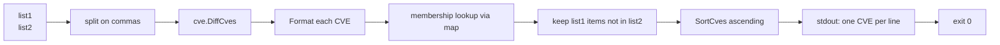

# cve diff

:::tip 📂 View Source
[`cmd/set.go:49`](https://github.com/scagogogo/cve-skills/blob/main/cmd/set.go#L49-L66) — open the cobra command definition on GitHub (lines L49–L66).
:::

Compute the difference of two CVE lists — every CVE that appears in `<list1>` but is **absent** from `<list2>` comes out once, in ascending order. This is the set-theoretic subtraction `list1 - list2`.

:::tip 🖥️ When to use
- Finding which CVEs your internal scanner flagged but the vendor advisory has not yet acknowledged.
- Subtracting a "known / accepted / false-positive" list from a fresh scan result to surface only newly seen CVEs.
- Reconciling two feeds: "what did we drop when we applied the upstream allowlist?"
:::

## Command syntax

```bash
cve diff <list1> <list2>
```

Both `<list1>` and `<list2>` are comma-separated CVE lists. Each is split on commas before the set operation, so `"CVE-2021-1,CVE-2022-2"` is equivalent to passing the two identifiers as separate tokens. The result is the CVEs in `<list1>` that are not found in `<list2>`.

## Arguments and options

- `<list1>` (positional, required): The minuend — the list to subtract *from*. Commas inside the argument are treated as separators, so each argument may carry one or many CVEs.
- `<list2>` (positional, required): The subtrahend — the list to remove. Parsed the same way as `<list1>`.
- stdin fallback: When no positional arguments are supplied and stdin is piped, each non-empty line is treated as an input. Because the diff operation requires **two** lists, stdin must provide at least two lines — the first line is `<list1>`, the second is `<list2>`.
- This command defines **no flags** of its own. The global `-q, --quiet` flag is inherited from the root command.

## Examples

Subtract the second list from the first; the CVE present in both is dropped, the rest of list1 is printed sorted:

```bash
$ cve diff "CVE-2021-1,CVE-2022-2" "CVE-2022-2,CVE-2023-3"
CVE-2021-1
```

Case differences are normalized away — `Format` upper-cases the `CVE` prefix before comparing, so a lowercase match in list2 still removes the entry from list1:

```bash
$ cve diff "cve-2022-1,CVE-2022-2,CVE-2022-3" "CVE-2022-1,CVE-2022-3"
CVE-2022-2
```

Pass the two lists as separate arguments instead of comma-packed strings — the result is identical:

```bash
$ cve diff "CVE-2020-5,CVE-2021-9,CVE-2024-1" "CVE-2021-9"
CVE-2020-5
CVE-2024-1
```

Feed both lists from stdin (first line = list1, second line = list2) to diff the output of two upstream commands:

```bash
$ printf 'CVE-2021-1,CVE-2022-2\nCVE-2022-2,CVE-2023-3\n' | cve diff
CVE-2021-1
```

An empty subtrahend leaves list1 untouched (deduplicated and sorted), since nothing is removed:

```bash
$ cve diff "CVE-2022-3,CVE-2022-1" ""
CVE-2022-1
CVE-2022-3
```

## How it works



## Corresponding Go API

This command is a thin wrapper around [`DiffCves`](/api/functions/diff-cves), which takes two `[]string` slices and returns the difference `list1 - list2` as a sorted, de-duplicated `[]string`. Internally every identifier is run through `Format` (so letter case and surrounding whitespace are normalized before comparison), the entries of list2 are loaded into a map for O(1) membership tests, only list1 entries absent from that map are kept, and the final slice is passed through `SortCves` so the output is always in ascending year-then-sequence order. Use the Go function directly when you need the difference slice in code rather than printed lines.

## Exit codes and output

- Exit code `0`: the difference was computed and printed. An empty result (list1 empty, or list1 fully covered by list2) prints nothing and still exits `0`.
- Exit code `1`: fewer than two inputs were supplied (neither two positional arguments nor two piped stdin lines). The error `requires exactly 2 arguments (two CVE lists)` is printed to stderr.
- stdout: one CVE per line, sorted ascending, de-duplicated. No output when the difference is empty.
- stderr: only the usage error above. Result lines never go to stderr.

## Notes

- Each input is normalized with `Format` before the set operation, so `cve-2022-1`, `CVE-2022-1`, and `  CVE-2022-1 ` are all treated as the same CVE.
- The output is **always sorted** (year, then sequence) — the command is not order-preserving. If you need list1's original order with list2 removed, post-process the output yourself or use `cve filter dedup` on list1 and then filter against list2.
- Invalid or malformed tokens are not filtered out — they are formatted as-is and passed through. Run `cve filter-valid` first if you want only well-formed CVEs in the difference.
- The operation is **asymmetric**: `cve diff A B` and `cve diff B A` generally produce different results. Use `cve intersect` for the shared part and `cve union` for the combined set.
- Empty inputs are safe: an empty list2 removes nothing; an empty list1 yields an empty result.

## Internal Implementation

The `diffCmd` is a cobra command defined in `cmd/set.go` (L49-L66) with `RunE` returning an `error`. Its execution path:

- **Argument intake**: `RunE` receives the raw `args []string` and immediately delegates to `readInputs(args)`, the shared helper that normalizes positional args and stdin into an ordered `[]string` of inputs. No cobra flags are defined on this command — only the inherited global flags apply.
- **Arity check**: `if len(inputs) < 2` returns `fmt.Errorf("requires exactly 2 arguments (two CVE lists)")`. Cobra surfaces this non-nil error on stderr and exits with code `1`.
- **Splitting**: each of the two inputs is split on commas via `strings.Split(inputs[0], ",")` and `strings.Split(inputs[1], ",")`, yielding `list1` and `list2` as `[]string`. Any commas inside a single argument are treated as separators, so comma-packed and separate-token forms are equivalent.
- **Library call and output**: `result := cve.DiffCves(list1, list2)` performs the normalized, de-duplicated, sorted subtraction; the loop `for _, v := range result { fmt.Println(v) }` writes one CVE per line to stdout. The function returns `nil`, so the process exits `0` even when `result` is empty.

## Argument Flow

```text
+--------------------------+
| CLI: cve diff A B        |
| (or stdin: line1,line2) |
+-----------+--------------+
            |
            v
+--------------------------+
| readInputs(args)         |
| collect positional args, |
| fall back to stdin lines |
+-----------+--------------+
            |
            v
   len(inputs) < 2 ?  --yes-->  return error
            |                       "requires exactly 2 arguments"
           no                       -> cobra prints to stderr, exit 1
            |
            v
+--------------------------+
| strings.Split(inputs[0]) |  list1 []
| strings.Split(inputs[1]) |  list2 []
+-----------+--------------+
            |
            v
+--------------------------+
| cve.DiffCves(list1,list2)|
|  Format -> map lookup -> |
|  keep list1 not in list2 |
|  -> SortCves ascending   |
+-----------+--------------+
            |
            v
+--------------------------+
| for _, v := range result |
|   fmt.Println(v)         |  stdout, one CVE per line
+-----------+--------------+
            |
            v
       return nil  -->  exit 0
```

## Edge Cases

| Input | Behavior | Exit code / output |
|---|---|---|
| No arguments, stdin not piped | `readInputs` returns an empty slice; `len(inputs) < 2` triggers the arity error | exit `1`; stderr: `requires exactly 2 arguments (two CVE lists)` |
| One positional argument only | `len(inputs) == 1 < 2`; arity error | exit `1`; stderr: `requires exactly 2 arguments (two CVE lists)` |
| Two positional arguments, both non-empty | Normal path: split, `DiffCves`, print sorted difference | exit `0`; stdout: one CVE per line |
| Empty `list2` argument (`""`) | `strings.Split("", ",")` yields a single empty string; `DiffCves` treats it as no removals | exit `0`; stdout: list1 deduplicated and sorted |
| Empty `list1` argument (`""`) | Nothing to subtract from; result is empty | exit `0`; no stdout output |
| `list1` fully covered by `list2` | Every list1 item is removed; result is empty | exit `0`; no stdout output |
| stdin piped with fewer than two lines | `readInputs` returns one input; arity error | exit `1`; stderr: `requires exactly 2 arguments (two CVE lists)` |
| stdin piped with two lines | First line is `list1`, second is `list2`; normal path | exit `0`; stdout: difference |
| Malformed tokens (not valid CVEs) | Not filtered; passed through `Format` and `DiffCves` as-is | exit `0`; stdout includes the malformed tokens |
| Mixed letter case (`cve-` vs `CVE-`) | `Format` normalizes case before comparison; matching tokens are removed | exit `0`; stdout: normalized (upper-cased) form |

## Exit Codes

- **Success (exit `0`)**: `RunE` returns `nil` after printing the difference. This holds for every successful computation, including an empty result (empty `list1`, empty `list2`, or `list1` fully subtracted). Nothing is written to stderr on success.
- **Failure (exit `1`)**: the only explicit failure path is `len(inputs) < 2`, which returns `fmt.Errorf("requires exactly 2 arguments (two CVE lists)")`. Cobra prints this error to stderr and sets exit code `1`. The command performs no validation of CVE token format, so malformed inputs do not raise a non-zero exit — they flow through `DiffCves` and are printed as-is.
- **stderr**: used solely for the arity error above. Result lines always go to stdout.

## Related commands

- [cve intersect](/cli/commands/intersect) — keep only the CVEs present in both lists.
- [cve union](/cli/commands/union) — combine both lists into one de-duplicated, sorted set.
- [cve filter dedup](/cli/commands/filter-dedup) — remove duplicates from a single list, preserving first-seen order.
- [cve compare sort](/cli/commands/compare-sort) — sort a single list ascending.
- [CLI Reference](/cli) — full command tree and I/O conventions.
