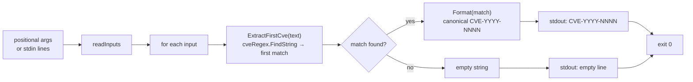

# cve extract first

:::tip 📂 View Source
[`cmd/extract.go:37`](https://github.com/scagogogo/cve-skills/blob/main/cmd/extract.go#L37-L53) — open the cobra command definition on GitHub (lines L37–L53).
:::

Extract the **first** CVE identifier found in free text and print it on a single line, normalized to the standard uppercase form. Unlike `extract seq`/`extract year`, the argument here is prose that *contains* CVEs, not a single well-formed CVE.

:::tip 🖥️ When to use
- Pull the leading CVE out of a changelog, advisory, or sentence when the first-mentioned identifier is the one you care about.
- Normalize a single CVE buried in free text to canonical `CVE-YYYY-NNNN` form for storage or reporting.
- Feed many lines of prose through a pipeline and collect only the first CVE per line, in input order.
:::

## Command syntax

```bash
cve extract first [text...]
```

Each argument is treated as free text and is scanned in full for CVE identifiers. When no arguments are supplied and stdin is piped, one non-empty line is read per input.

## Arguments and options

- `[text...]` (positional, repeatable): One or more chunks of free text. Each argument is scanned independently for CVEs, and the first CVE found in it (if any) is printed.
- stdin fallback: When no positional arguments are supplied and stdin is piped, each non-empty line is treated as one text input. Empty lines are skipped.
- This command defines **no flags** of its own. The global `-q, --quiet` flag is inherited from the root command.

## Examples

Extract the first CVE from a single piece of text:

```bash
$ cve extract first "CVE-2021-44228 and CVE-2022-12345"
CVE-2021-44228
```

Pass multiple arguments — one result per argument, in input order:

```bash
$ cve extract first "fixed CVE-2021-44228" "backported CVE-2023-0001 from CVE-2022-99999"
CVE-2021-44228
CVE-2023-0001
```

The result is normalized to canonical uppercase form regardless of the input case:

```bash
$ cve extract first "affected by cve-2022-00001"
CVE-2022-00001
```

Feed lines of prose from stdin to collect the first CVE per line in a pipeline:

```bash
$ printf 'patched CVE-2021-44228 and CVE-2022-12345\nno cves here\n' | cve extract first
CVE-2021-44228

```

Text with no CVE yields an empty line — the command does not drop it, so the line count of the output matches the count of inputs:

```bash
$ cve extract first "CVE-2022-12345 is fixed" "nothing to see"
CVE-2022-12345

```

## How it works



## Corresponding Go API

This command is a thin wrapper around [`ExtractFirstCve`](/api/functions/extract-first-cve), which runs `cveRegex.FindString` on the full text to capture the first match and then passes it through `Format` to produce canonical uppercase `CVE-YYYY-NNNN`; when there is no match it returns `""`. The CLI simply calls `ExtractFirstCve` once per input and prints the result. Use the Go function directly when you need the first CVE string in code rather than printed text; use [`ExtractLastCve`](/api/functions/extract-last-cve) when you need the last match instead.

## Exit codes and output

- Exit code `0`: the command ran to completion over at least one input. Inputs with no CVE are **not** errors — they print an empty line and the command still exits `0`.
- Exit code `1`: no input was supplied (neither positional arguments nor piped stdin when stdin is a non-terminal). Nothing is printed.
- stdout: one line per input, in input order. An input containing at least one CVE prints the first CVE in canonical form; an input with no CVE prints an empty line.
- stderr: no output in the normal case.

## Notes

- ⚠️ This command scans **free text** — `CVE-2021-44228` and a sentence containing it both work. Contrast with `extract seq`/`extract year`, which expect each argument to be a whole, exact CVE.
- ⚠️ Inputs with no CVE are **not dropped** — they emit an empty line so that output line count matches input line count. If you need only non-empty results, filter the output (e.g. `| grep -v '^$'`) or pre-filter with `cve filter-valid`.
- The returned CVE is always normalized to canonical uppercase form (`CVE-YYYY-NNNN`) via `Format`, so `cve-2022-00001` becomes `CVE-2022-00001`.
- The regex match is case-insensitive; surrounding prose is ignored, only the CVE token is captured.
- "First" means the first match in scan order (left-to-right), not the lowest-numbered CVE. To order CVEs, pipe through `cve sort` after extraction.
- There is **no comma-splitting** here — each argument (or stdin line) is one text input scanned as a whole.

## Internal Implementation

The cobra command `extractFirstCmd` is defined at `cmd/extract.go:37-53` with `Use: "first [text...]"`. Its `Run` function does the following:

- Receives `args []string` directly from cobra's positional arguments and passes them to `readInputs(args)`, which gathers inputs from `args` first and falls back to non-empty stdin lines when `args` is empty and stdin is piped.
- Defines **no flags** of its own; only the inherited global `-q, --quiet` from the root command applies.
- After collecting inputs, checks `if len(inputs) == 0 { os.Exit(1) }` — the only explicit non-zero exit path, covering both "no args and no piped stdin" cases.
- Loops `for _, input := range inputs` and calls `cvepkg.ExtractFirstCve(input)` once per input, printing the result with `fmt.Println`. The library function returns `""` when no CVE matches, so an empty line is printed and the loop continues without error.

## Argument Flow

```text
+----------------------+     +----------------------+     +------------------------------+
| CLI invocation       |     | cobra dispatches     |     | Run(cmd, args)               |
| cve extract first    | --> | extractFirstCmd      | --> | inputs := readInputs(args)   |
| [text...] / stdin    |     | (cmd/extract.go:37)  |     | if empty -> os.Exit(1)       |
+----------------------+     +----------------------+     +--------------+---------------+
                                                                         |
                                                          for each input |
                                                                         v
                                                          +------------------------------+
                                                          | cvepkg.ExtractFirstCve(input)|
                                                          | cveRegex.FindString + Format |
                                                          +--------------+---------------+
                                                                         |
                                                                         v
                                                          +------------------------------+
                                                          | fmt.Println(result)          |
                                                          | stdout: CVE or empty line    |
                                                          +--------------+---------------+
                                                                         |
                                                                         v
                                                          +------------------------------+
                                                          | exit 0 (loop finished)       |
                                                          +------------------------------+
```

## Edge Cases

| Input | Behavior | Exit code / output |
| --- | --- | --- |
| No positional args, stdin is a terminal | `readInputs` returns empty | Exit `1`, nothing printed |
| No positional args, stdin piped but empty (only blank lines) | All lines skipped, `inputs` empty | Exit `1`, nothing printed |
| Argument with no CVE (e.g. `"nothing here"`) | `ExtractFirstCve` returns `""` | Exit `0`, prints one empty line |
| stdin line with no CVE | `ExtractFirstCve` returns `""` | Exit `0`, prints one empty line for that line |
| Mixed-case CVE (e.g. `cve-2022-00001`) | Regex matches case-insensitively, `Format` upper-cases | Exit `0`, prints `CVE-2022-00001` |
| Multiple args, some with CVEs and some without | One line printed per arg, in order | Exit `0`, line count equals arg count |
| Argument containing multiple CVEs | Only the first (leftmost) match returned | Exit `0`, prints that single CVE |

## Exit Codes

- `0` (success): the `for` loop over `inputs` completes normally. This happens whenever at least one input was collected, including inputs that contain no CVE — those just print an empty line and are not treated as failures.
- `1` (failure): triggered explicitly by `os.Exit(1)` when `len(inputs) == 0`, i.e. neither positional arguments nor piped non-empty stdin were supplied. In this path nothing is written to stdout or stderr.
- stderr: the `Run` function writes nothing to stderr in either path. Error reporting relies solely on the numeric exit code; cobra's own flag-parsing errors (e.g. an unknown inherited flag) are emitted to stderr by the cobra root before `Run` is reached.

## Related commands

- [cve extract](/cli/commands/extract) — extract all CVE identifiers from free text; returns every match rather than only the first.
- [cve extract last](/cli/commands/extract-last) — extract the last CVE identifier instead of the first.
- [cve extract year](/cli/commands/extract-year) — once you have the first CVE, pull its year segment.
- [cve extract split](/cli/commands/extract-split) — split a CVE into year and sequence in one pass.
- [CLI Reference](/cli) — full command tree and I/O conventions.
