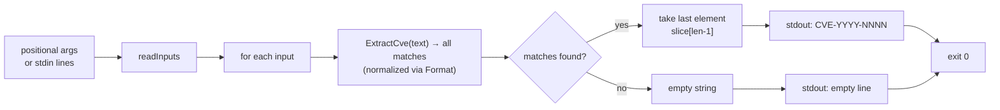

# cve extract last

:::tip 📂 View Source
[`cmd/extract.go:55`](https://github.com/scagogogo/cve-skills/blob/main/cmd/extract.go#L55-L71) — open the cobra command definition on GitHub (lines L55–L71).
:::

Extract the **last** CVE identifier found in free text and print it on a single line, normalized to the standard uppercase form. Unlike `extract seq`/`extract year`, the argument here is prose that *contains* CVEs, not a single well-formed CVE.

:::tip 🖥️ When to use
- Pull the trailing CVE out of a changelog, advisory, or sentence when the last-mentioned identifier is the one you care about.
- Normalize a single CVE buried in free text to canonical `CVE-YYYY-NNNN` form for storage or reporting.
- Feed many lines of prose through a pipeline and collect only the last CVE per line, in input order.
:::

## Command syntax

```bash
cve extract last [text...]
```

Each argument is treated as free text and is scanned in full for CVE identifiers. When no arguments are supplied and stdin is piped, one non-empty line is read per input.

## Arguments and options

- `[text...]` (positional, repeatable): One or more chunks of free text. Each argument is scanned independently for CVEs, and the last CVE found in it (if any) is printed.
- stdin fallback: When no positional arguments are supplied and stdin is piped, each non-empty line is treated as one text input. Empty lines are skipped.
- This command defines **no flags** of its own. The global `-q, --quiet` flag is inherited from the root command.

## Examples

Extract the last CVE from a single piece of text:

```bash
$ cve extract last "CVE-2021-44228 and CVE-2022-12345"
CVE-2022-12345
```

Pass multiple arguments — one result per argument, in input order:

```bash
$ cve extract last "fixed CVE-2021-44228" "backported CVE-2023-0001 from CVE-2022-99999"
CVE-2021-44228
CVE-2022-99999
```

The result is normalized to canonical uppercase form regardless of the input case:

```bash
$ cve extract last "affected by cve-2022-00001"
CVE-2022-00001
```

Feed lines of prose from stdin to collect the last CVE per line in a pipeline:

```bash
$ printf 'patched CVE-2021-44228 and CVE-2022-12345\nno cves here\n' | cve extract last
CVE-2022-12345

```

Text with no CVE yields an empty line — the command does not drop it, so the line count of the output matches the count of inputs:

```bash
$ cve extract last "CVE-2022-12345 is fixed" "nothing to see"
CVE-2022-12345

```

## How it works



## Corresponding Go API

This command is a thin wrapper around [`ExtractLastCve`](/api/functions/extract-last-cve), which delegates to `ExtractCve` (a `cveRegex.FindAllString` scan of the full text, with each match run through `Format` to produce canonical uppercase `CVE-YYYY-NNNN`) and then returns the final element of the resulting slice, or `""` when the slice is empty. The CLI simply calls `ExtractLastCve` once per input and prints the result. Use the Go function directly when you need the last CVE string in code rather than printed text; use [`ExtractFirstCve`](/api/functions/extract-first-cve) when you need the first match instead.

## Exit codes and output

- Exit code `0`: the command ran to completion over at least one input. Inputs with no CVE are **not** errors — they print an empty line and the command still exits `0`.
- Exit code `1`: no input was supplied (neither positional arguments nor piped stdin when stdin is a non-terminal). Nothing is printed.
- stdout: one line per input, in input order. An input containing at least one CVE prints the last CVE in canonical form; an input with no CVE prints an empty line.
- stderr: no output in the normal case.

## Notes

- ⚠️ This command scans **free text** — `CVE-2021-44228` and a sentence containing it both work. Contrast with `extract seq`/`extract year`, which expect each argument to be a whole, exact CVE.
- ⚠️ Inputs with no CVE are **not dropped** — they emit an empty line so that output line count matches input line count. If you need only non-empty results, filter the output (e.g. `| grep -v '^$'`) or pre-filter with `cve filter-valid`.
- The returned CVE is always normalized to canonical uppercase form (`CVE-YYYY-NNNN`) via `Format`, so `cve-2022-00001` becomes `CVE-2022-00001`.
- The regex match is case-insensitive; surrounding prose is ignored, only the CVE token is captured.
- "Last" means the last match in scan order (left-to-right), not the highest-numbered CVE. To order CVEs, pipe through `cve sort` after extraction.
- There is **no comma-splitting** here — each argument (or stdin line) is one text input scanned as a whole.

## Internal Implementation

The cobra command is defined at `cmd/extract.go:55-71` as `extractLastCmd`, a subcommand of `extractCmd` registered in `init()`. Its `Run` function is a small loop:

- **Input gathering**: `Run` receives `args []string` directly from cobra and calls `readInputs(args)` (see `cmd/helpers.go`). That helper returns `args` unchanged when any are present; otherwise it stats stdin and, only when stdin is **not** a char device (i.e. piped/redirected), scans it line by line via `bufio.Scanner`, skipping empty lines.
- **No flags**: the command defines no flags of its own, so the flag set is never parsed inside `Run` — `args` is used verbatim.
- **Library call**: for each input string it calls `cvepkg.ExtractLastCve(input)` (the `github.com/scagogogo/cve-skills` package) exactly once. That function runs the package's CVE regex over the full text, normalizes each match through `Format`, and returns the final match (or `""`).
- **Output**: each return value is written to stdout with `fmt.Println`, so one line is emitted per input, in input order. There is no buffering, no deduplication, and no stderr output.

## Argument Flow

```text
+--------------------------+        +---------------------------------+
| CLI invocation           |        | readInputs(args) [helpers.go]   |
| cve extract last [text…] | -----> |  if len(args)>0 -> return args  |
| (cobra parses argv)      |        |  else if stdin piped:           |
+--------------------------+        |     scan non-empty lines        |
                                    |  else (stdin is a TTY) -> nil    |
                                    +---------------+-----------------+
                                                    |
                                                    v
                                    +---------------+-----------------+
                                    | len(inputs)==0 ?                |
                                    +---------------+-----------------+
                                       |           |
                                  yes  |           | no
                                       v           v
                              +-----------+  +-----------------------------------+
                              | os.Exit(1)|  | for input := range inputs {       |
                              | (no print)|  |   s := cvepkg.ExtractLastCve(in) |
                              +-----------+  |   fmt.Println(s)  // stdout       |
                                             | }                                  |
                                             +----------------+------------------+
                                                              |
                                                              v
                                             +----------------+------------------+
                                             | stdout: one line per input        |
                                             | (last CVE in canonical form, or   |
                                             |  empty line if no match)          |
                                             +-----------------------------------+
```

## Edge Cases

| Input | Behavior | Exit code / output |
|---|---|---|
| No positional args, stdin is a TTY | `readInputs` returns `nil`; `len(inputs)==0` triggers `os.Exit(1)` | exit `1`, no stdout, no stderr |
| No positional args, stdin piped but empty (e.g. `printf '' \| cve extract last`) | `readInputs` scans stdin, collects no non-empty lines → `nil` | exit `1`, no output |
| No positional args, stdin piped with only blank lines | Blank lines are skipped by `readInputs` → `nil` | exit `1`, no output |
| One argument containing multiple CVEs | `ExtractLastCve` returns the last match in scan order | exit `0`, one line: last CVE |
| One argument containing no CVE | `ExtractLastCve` returns `""` | exit `0`, one empty line printed |
| Multiple arguments, some without CVEs | Each argument prints independently; no-CVE args print an empty line (not dropped) | exit `0`, one line per arg in order |
| Lowercase or mixed-case CVE in text | Match is case-insensitive; result normalized via `Format` to uppercase `CVE-YYYY-NNNN` | exit `0`, canonical form |
| Stdin line with text but no CVE | `ExtractLastCve` returns `""` for that line | exit `0`, empty line for that input |

## Exit Codes

- **Success — exit `0`**: whenever at least one input reaches the print loop. The `Run` function falls off the end of `for` loop normally, and cobra exits `0`. Note that "no CVE found in a given input" is **not** a failure — it prints an empty line and still exits `0`.
- **Failure — exit `1`**: only when no input was collected (`len(inputs)==0`), i.e. no positional args and stdin either a TTY or empty/blank-only. The source calls `os.Exit(1)` directly, so no deferred cleanup runs.
- **stderr**: the source writes nothing to stderr in either path. All diagnostics would come from cobra's own flag/error handling, which is not triggered here since no flags are defined.

## Related commands

- [cve extract](/cli/commands/extract) — extract all CVE identifiers from free text; returns every match rather than only the last.
- [cve extract first](/cli/commands/extract-first) — extract the first CVE identifier instead of the last.
- [cve extract year](/cli/commands/extract-year) — once you have the last CVE, pull its year segment.
- [cve extract split](/cli/commands/extract-split) — split a CVE into year and sequence in one pass.
- [CLI Reference](/cli) — full command tree and I/O conventions.
