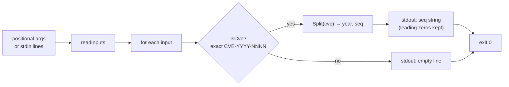

# cve extract seq

:::tip 📂 View Source
[`cmd/extract.go:91`](https://github.com/scagogogo/cve-skills/blob/main/cmd/extract.go#L91-L107) — open the cobra command definition on GitHub (lines L91–L107).
:::

Extract the **sequence number** segment from one or more CVE identifiers and emit each one on its own line, preserving leading zeros exactly as written.

:::tip 🖥️ When to use
- Pull the sequence part out of a CVE so it can be stored or displayed on its own, separate from the year.
- Preserve the original sequence string (leading zeros intact) for audit or downstream string-based tooling that expects a token rather than a number.
- Build per-sequence keys or identifiers from a batch of CVEs in a single pipeline pass.
:::

## Command syntax

```bash
cve extract seq [cve-id...]
```

Each argument is treated as a single, complete CVE identifier — there is no comma-splitting here (unlike list-taking subcommands such as `filter-valid`). When no arguments are supplied and stdin is piped, one non-empty line is read per CVE.

## Arguments and options

- `[cve-id...]` (positional, repeatable): One or more CVE identifiers, one per argument. Each argument must be a **whole** CVE, not free text containing a CVE.
- stdin fallback: When no positional arguments are supplied and stdin is piped, each non-empty line is treated as one CVE identifier. Empty lines are skipped.
- This command defines **no flags** of its own. The global `-q, --quiet` flag is inherited from the root command.

## Examples

Extract the sequence from a single CVE:

```bash
$ cve extract seq CVE-2022-12345
12345
```

Pass multiple CVEs as separate arguments — one sequence per line, in input order:

```bash
$ cve extract seq CVE-2022-12345 CVE-2021-44228 CVE-2023-0001
12345
44228
0001
```

Leading zeros are preserved verbatim because the result is a string, not a parsed integer:

```bash
$ cve extract seq cve-2022-00001
00001
```

Feed CVEs from stdin to extract sequences in a pipeline:

```bash
$ printf 'CVE-2022-12345\nCVE-2021-44228\n' | cve extract seq
12345
44228
```

Inputs that are not valid CVEs yield an empty line — the command does not drop them, so the line count of the output matches the count of inputs:

```bash
$ cve extract seq CVE-2022-12345 not-a-cve CVE-2021-44228
12345

44228
```

## How it works



## Corresponding Go API

This command is a thin wrapper around [`ExtractCveSeq`](/api/functions/extract-cve-seq), which first gates the input with `IsCve` (an **exact** match — the string must be a whole CVE, optionally with surrounding whitespace) and then delegates to `Split` to return the sequence segment as a string. The CLI simply calls `ExtractCveSeq` once per input and prints the result. Use the Go function directly when you need the sequence string in code rather than printed text; use `ExtractCveSeqAsInt` if you need an integer for numeric comparison.

## Exit codes and output

- Exit code `0`: the command ran to completion over at least one input. Invalid CVEs are **not** errors — they print an empty line and the command still exits `0`.
- Exit code `1`: no input was supplied (neither positional arguments nor piped stdin when stdin is a non-terminal). Nothing is printed.
- stdout: one line per input, in input order. A valid CVE prints its sequence string (leading zeros preserved); an invalid input prints an empty line.
- stderr: no output in the normal case.

## Notes

- ⚠️ The validity gate is `IsCve`, an **exact** match — `CVE-2022-12345` is valid, but text that merely *contains* a CVE (e.g. `"affected by CVE-2022-12345"`) is not, and yields an empty line. To pull CVEs out of free text, run [`cve extract`](/cli/commands/extract) first, then pipe the results into `extract seq`.
- ⚠️ Invalid inputs are **not dropped** — they emit an empty line so that output line count matches input line count. If you need only valid sequences, filter the output or pre-filter with `cve filter-valid`.
- The sequence is returned as a string, so leading zeros are kept (`00001` stays `00001`). If you need numeric comparison or sorting, use the integer variant `ExtractCveSeqAsInt` instead.
- Input is case-insensitive and tolerates surrounding whitespace, consistent with `IsCve`.
- There is **no comma-splitting** here — each argument (or stdin line) is one whole CVE. To split a comma-separated list, use a list-taking command or `tr ',' '\n'` before piping.

## Internal Implementation

The `extractSeqCmd` cobra command (`cmd/extract.go:91-L107`) does its work in a small `Run` closure with no flags of its own:

- It receives the positional `args` slice and immediately hands it to `readInputs(args)`, which merges any positional arguments with the non-empty lines read from piped stdin. The returned `inputs` slice is the canonical, ordered list of strings to process.
- If `len(inputs) == 0` (no arguments and no piped stdin), it calls `os.Exit(1)` straight away — there is no error message printed, just a non-zero exit before any processing.
- Otherwise it loops `for _, input := range inputs` and calls `cvepkg.ExtractCveSeq(input)` once per input. That library function gates the string with `IsCve` (exact match, whitespace-tolerant, case-insensitive) and delegates to `Split` to return the sequence segment as a string.
- Each result is written with `fmt.Println(c)`, so exactly one line is emitted per input — a valid CVE yields its sequence string (leading zeros preserved), an invalid input yields an empty string and therefore a blank line. Output goes to stdout; nothing is written to stderr.

## Argument Flow

```text
+-------------------+     +-------------------+     +------------------------+     +-------------------------+
| CLI args / stdin  | --> | readInputs(args)  | --> | ExtractCveSeq(input)   | --> | fmt.Println(seq)        |
| [cve-id...]       |     | merge & deblank   |     |  IsCve? --yes--> Split |     | one line per input      |
| one CVE per token |     | ordered []string  |     |        --no---> ""      |     | stdout, leading zeros   |
+-------------------+     +-------------------+     +------------------------+     +-------------------------+
                                |                                                            ^
                                | len==0                                                     |
                                v                                                            |
                          os.Exit(1)                                                    (loop next input)
                          no output
```

## Edge Cases

| Input | Behavior | Exit code / output |
| --- | --- | --- |
| No positional args, stdin is a terminal (not piped) | `readInputs` returns an empty slice; the command exits before processing | Exit `1`; nothing on stdout or stderr |
| No positional args, stdin piped but empty (or only blank lines) | Blank lines are skipped, so `inputs` is empty | Exit `1`; no output |
| A single valid CVE, e.g. `CVE-2022-12345` | `ExtractCveSeq` returns `"12345"` | Exit `0`; stdout: `12345` |
| Lowercase / padded CVE, e.g. `cve-2022-00001` | `IsCve` is case-insensitive and whitespace-tolerant; `Split` returns the raw sequence string | Exit `0`; stdout: `00001` (leading zeros kept) |
| An argument that is not a whole CVE, e.g. `not-a-cve` or `"affected by CVE-2022-12345"` | `IsCve` exact-match fails; `ExtractCveSeq` returns `""` | Exit `0`; stdout: one blank line (line is not dropped) |
| Mixed valid and invalid arguments | Each input is processed independently in order | Exit `0`; stdout: one line per input, blank for the invalid ones |
| Multiple CVEs via stdin, one per line | Each non-empty line becomes one input | Exit `0`; stdout: one sequence per line in input order |

## Exit Codes

- **Success — exit `0`:** reached whenever `len(inputs) >= 1`. The loop runs to completion over every input. Note that invalid CVEs are *not* a failure condition: they print an empty line and the command still exits `0`.
- **Failure — exit `1`:** triggered only by the `len(inputs) == 0` guard, i.e. no positional arguments and no piped stdin (or stdin containing only blank lines). The exit is via `os.Exit(1)` with no preceding `fmt.Fprintln` to stderr, so stderr stays empty in this case too.
- **stderr:** the `Run` closure never writes to stderr explicitly. Diagnostics from cobra itself (e.g. unknown subcommand or flag parse errors) are the only source of stderr text and follow cobra's own exit behavior.

## Related commands

- [cve extract](/cli/commands/extract) — extract all CVE identifiers from free text; chain before `extract seq` to go from prose to sequences.
- [cve extract year](/cli/commands/extract-year) — extract the year segment instead of the sequence.
- [cve extract split](/cli/commands/extract-split) — emit both year and sequence in one pass, separated by a tab.
- [cve filter-valid](/cli/commands/filter-valid) — drop malformed CVEs before extracting sequences.
- [CLI Reference](/cli) — full command tree and I/O conventions.
