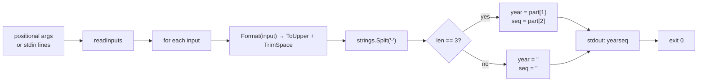

# cve extract split

:::tip 📂 View Source
[`cmd/extract.go:109`](https://github.com/scagogogo/cve-skills/blob/main/cmd/extract.go#L109-L128) — open the cobra command definition on GitHub (lines L109–L128).
:::

Split one or more CVE identifiers into their **year** and **sequence number** components and emit each pair on its own line, separated by a single tab character (`year<TAB>sequence`).

:::tip 🖥️ When to use
- Break each CVE into its two structural parts (year, sequence) in a single pass, instead of running `extract year` and `extract seq` separately.
- Produce a tab-separated `year<TAB>sequence` layout that `cut`, `awk`, or a spreadsheet can split on the tab without re-parsing the CVE string.
- Build year/sequence keys for a batch of CVEs in one pipeline step while preserving the original sequence string (leading zeros intact).
:::

## Command syntax

```bash
cve extract split [cve-id...]
```

Each argument is treated as a single, complete CVE identifier — there is no comma-splitting here. When no arguments are supplied and stdin is piped, one non-empty line is read per CVE.

## Arguments and options

- `[cve-id...]` (positional, repeatable): One or more CVE identifiers, one per argument. Each argument is treated as a whole CVE token.
- stdin fallback: When no positional arguments are supplied and stdin is piped, each non-empty line is treated as one CVE identifier. Empty lines are skipped.
- This command defines **no flags** of its own. The global `-q, --quiet` flag is inherited from the root command.

## Examples

Split a single CVE into year and sequence, separated by a tab:

```bash
$ cve extract split CVE-2022-12345
2022	12345
```

Pass multiple CVEs as separate arguments — one `year<TAB>sequence` line per CVE, in input order:

```bash
$ cve extract split CVE-2022-12345 CVE-2021-44228 CVE-2023-0001
2022	12345
2021	44228
2023	0001
```

Input is case-insensitive — the CVE is normalized to uppercase first, then split, so the parts are unaffected by the input case:

```bash
$ cve extract split cve-2022-00001
2022	00001
```

Feed CVEs from stdin to split them in a pipeline — pair with `cut -f1`/`cut -f2` to isolate either column:

```bash
$ printf 'CVE-2022-12345\nCVE-2021-44228\n' | cve extract split
2022	12345
2021	44228
```

## How it works



## Corresponding Go API

This command is a thin wrapper around [`Split`](/api/functions/split), which first normalizes the input via `Format` (`strings.ToUpper(strings.TrimSpace(cve))`) and then splits the string on the literal `-`. When the resulting slice has exactly three elements (i.e. the input had the shape `<prefix>-<year>-<seq>`), `Split` returns `year, seq = part[1], part[2]`; otherwise it returns two empty strings. The CLI simply calls `Split` once per input and prints the pair as `fmt.Printf("%s\t%s\n", year, seq)`. Note that, unlike `extract year` and `extract seq`, this subcommand does **not** gate the input with `IsCve` — `Split` itself does no format validation, only a dash-count check. Use the Go function directly when you need the `(year, seq)` pair in code rather than printed text; use [`ExtractCveYear`](/api/functions/extract-cve-year) or [`ExtractCveSeq`](/api/functions/extract-cve-seq) when you need a single segment with `IsCve` validation.

## Exit codes and output

- Exit code `0`: the command ran to completion over at least one input. Inputs that do not split into three dash-separated parts are **not** errors — they still emit a line and the command exits `0`.
- Exit code `1`: no input was supplied (neither positional arguments nor piped stdin when stdin is a non-terminal). Nothing is printed.
- stdout: one line per input, in input order, formatted as `year<TAB>sequence`. A well-formed CVE prints both parts; a malformed input prints a line that is just a tab (two empty fields).
- stderr: no output in the normal case.

## Notes

- ⚠️ Unlike `extract year` and `extract seq`, this subcommand does **not** validate the input with `IsCve` — it only checks that the string splits into exactly three dash-separated parts. Any `<prefix>-<year>-<seq>` token (e.g. `XYZ-2022-12345`) yields a non-empty result. Pre-filter with [`cve filter-valid`](/cli/commands/filter-valid) if you need only genuine CVEs.
- ⚠️ Malformed inputs are **not dropped** — they emit a line consisting of a single tab (two empty fields), so the output line count always matches the input count. Filter the output if you need only populated rows.
- 📥 The two fields are separated by a **literal tab** (`\t`). When copying output or embedding it in a shell heredoc, the tab may render as spaces — pipe through `cat -A` to verify the separator.
- The sequence part is returned as a string, so leading zeros are preserved (`00001` stays `00001`). If you need numeric comparison, combine with `extract seq`'s `ExtractCveSeqAsInt` in Go.
- Input is case-insensitive and tolerates surrounding whitespace, because `Format` upper-cases and trims before splitting.
- There is **no comma-splitting** here — each argument (or stdin line) is one whole CVE. To split a comma-separated list, use `tr ',' '\n'` before piping.

## Internal Implementation

The cobra command `extractSplitCmd` (`cmd/extract.go:109-128`) wires up a thin `Run` function with no flags of its own:

- **Input gathering**: `Run` receives the raw positional `args` slice and passes it to `readInputs(args)`, the shared helper that prefers positional arguments and falls back to non-empty stdin lines when `args` is empty. No flag is consulted — the command reads only positional args / stdin.
- **Empty-input guard**: `if len(inputs) == 0 { os.Exit(1) }` short-circuits before any library call, so a terminal with no piped stdin produces exit `1` with nothing printed.
- **Per-input library call**: for each `input`, the loop calls `cvepkg.Split(input)` — i.e. `github.com/scagogogo/cve-skills.Split` — which returns `(year, seq string)`. Note that `Split` (unlike `ExtractCveYear`/`ExtractCveSeq`) is **not** gated by `IsCve`; it only checks that the dash-split slice has length 3.
- **Output formatting**: each pair is written to stdout via `fmt.Printf("%s\t%s\n", year, seq)` — a literal tab between the two fields, one line per input, in input order. There is no buffering, deduplication, or sorting; output line count equals input count exactly.

## Argument Flow

```text
+---------------------------+      +------------------+      +-------------------------+
| CLI: cve extract split    | ---> | readInputs(args) | ---> | []string inputs         |
| [cve-id...] / stdin lines |      | (args, fallback  |      | (positional first, then |
+---------------------------+      |  to stdin lines) |      |  non-empty stdin lines) |
                                   +------------------+      +-------------------------+
                                                                        |
                                                                        v
                                                            +-----------------------+
                                                            | len(inputs) == 0 ?    |
                                                            +-----------------------+
                                                              |                 |
                                                           yes|              no |
                                                              v                 v
                                              +--------+            +-----------------------+
                                              | Exit 1 |            | for _, input := range |
                                              | (no    |            | inputs {              |
                                              |  print)|            +-----------------------+
                                              +--------+                       |
                                                                               v
                                                              +---------------------------------+
                                                              | year, seq := cvepkg.Split(input)|
                                                              | (Format -> ToUpper/TrimSpace,  |
                                                              |  split on '-', len==3 check)   |
                                                              +---------------------------------+
                                                                               |
                                                                               v
                                                              +---------------------------------+
                                                              | fmt.Printf("%s\t%s\n", year,seq)|
                                                              |  -> stdout, one line per input |
                                                              +---------------------------------+
                                                                               |
                                                                               v
                                                                     +-------------------+
                                                                     | loop next input,  |
                                                                     | then exit 0       |
                                                                     +-------------------+
```

## Edge Cases

| Input | Behavior | Exit code / Output |
| --- | --- | --- |
| No positional args, stdin is a terminal (not piped) | `readInputs` returns empty slice; `len(inputs) == 0` triggers the early return | Exit `1`; nothing on stdout or stderr |
| No positional args, stdin piped but all lines empty | Empty stdin lines are skipped by `readInputs`, yielding an empty slice | Exit `1`; no output |
| One well-formed CVE, e.g. `CVE-2022-12345` | `Split` splits on `-` into 3 parts, returns `("2022", "12345")` | Exit `0`; stdout: `2022\t12345` |
| Multiple CVEs as separate args | Loop iterates in input order, one `Printf` per input | Exit `0`; one `year<TAB>seq` line per CVE, in order |
| Lowercase / whitespace-padded input, e.g. `  cve-2022-00001  ` | `Format` upper-cases and trims before splitting, so leading zeros and case are normalized | Exit `0`; stdout: `2022\t00001` |
| Non-CVE with 3 dash parts, e.g. `XYZ-2022-12345` | `Split` only checks `len == 3`, not `IsCve`; returns `("2022", "12345")` | Exit `0`; stdout: `2022\t12345` (not an error) |
| Malformed input, wrong dash count, e.g. `CVE-2022` or `CVE-2022-12345-extra` | Dash-split slice length is not 3; `Split` returns `("", "")` | Exit `0`; stdout: a line that is just a tab (two empty fields) |
| CVEs piped via stdin | Each non-empty line becomes one input; same per-input processing | Exit `0`; one line per non-empty stdin line |
| Input with embedded commas, e.g. `CVE-2022-12345,CVE-2021-44228` | No comma-splitting; the whole string is one input; dash-split length is not 3 | Exit `0`; stdout: a single tab line (pre-split with `tr ',' '\n'` to fix) |

## Exit Codes

Per the source in `cmd/extract.go:118-127`, exit-code handling is explicit only for the empty-input case; all other paths complete normally and fall through to the implicit `0`:

- **Exit `0`** — the command processed at least one input. This is the implicit success path: the `for` loop finishes and `Run` returns without calling `os.Exit`. Malformed inputs are **not** errors here, so even a line that is just a tab still yields exit `0`.
- **Exit `1`** — `readInputs(args)` returned an empty slice (`len(inputs) == 0`), i.e. no positional arguments and no non-empty piped stdin. The command calls `os.Exit(1)` immediately, before invoking `Split`, so **nothing is printed**.
- **stderr** — the source writes nothing to stderr in either path; there are no `fmt.Fprintln(os.Stderr, ...)` calls. Any error diagnostics would come only from cobra's own flag-parsing or command-resolution layer, not from this `Run` function.

## Related commands

- [cve extract year](/cli/commands/extract-year) — emit only the year segment (with `IsCve` validation).
- [cve extract seq](/cli/commands/extract-seq) — emit only the sequence segment (with `IsCve` validation).
- [cve extract](/cli/commands/extract) — extract all CVE identifiers from free text; chain before `extract split` to go from prose to year/sequence pairs.
- [cve filter-valid](/cli/commands/filter-valid) — drop malformed CVEs before splitting so only genuine CVEs reach the output.
- [CLI Reference](/cli) — full command tree and I/O conventions.
