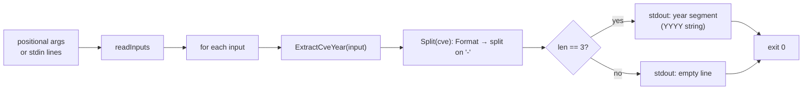

# cve extract year

:::tip 📂 View Source
[`cmd/extract.go:73`](https://github.com/scagogogo/cve-skills/blob/main/cmd/extract.go#L73-L89) — open the cobra command definition on GitHub (lines L73–L89).
:::

Extract the **year** segment from one or more CVE identifiers and emit each one on its own line.

:::tip 🖥️ When to use
- Pull the year out of a CVE so it can be stored, displayed, or grouped on its own, separate from the sequence number.
- Build per-year keys, buckets, or filenames from a batch of CVEs in a single pipeline pass.
- Use the year as a string token in downstream tooling that expects `YYYY` rather than a parsed number.
:::

## Command syntax

```bash
cve extract year [cve-id...]
```

Each argument is treated as a single, complete CVE identifier — there is no comma-splitting here (unlike list-taking subcommands such as `filter-valid`). When no arguments are supplied and stdin is piped, one non-empty line is read per CVE.

## Arguments and options

- `[cve-id...]` (positional, repeatable): One or more CVE identifiers, one per argument. Each argument must be a **whole** CVE, not free text containing a CVE.
- stdin fallback: When no positional arguments are supplied and stdin is piped, each non-empty line is treated as one CVE identifier. Empty lines are skipped.
- This command defines **no flags** of its own. The global `-q, --quiet` flag is inherited from the root command.

## Examples

Extract the year from a single CVE:

```bash
$ cve extract year CVE-2022-12345
2022
```

Pass multiple CVEs as separate arguments — one year per line, in input order:

```bash
$ cve extract year CVE-2022-12345 CVE-2021-44228 CVE-2023-0001
2022
2021
2023
```

Input is case-insensitive and tolerates surrounding whitespace, consistent with `Format`:

```bash
$ cve extract year " cve-2022-12345 "
2022
```

Feed CVEs from stdin to extract years in a pipeline:

```bash
$ printf 'CVE-2022-12345\nCVE-2021-44228\n' | cve extract year
2022
2021
```

Inputs that do not match the `CVE-YYYY-NNNN` shape yield an empty line — the command does not drop them, so the line count of the output matches the count of inputs:

```bash
$ cve extract year CVE-2022-12345 not-a-cve CVE-2021-44228
2022

2021
```

## How it works



## Corresponding Go API

This command is a thin wrapper around [`ExtractCveYear`](/api/functions/extract-cve-year), which delegates to `Split`: the input is first normalized by `Format` (trimmed, uppercased), then split on `-`; if the result has exactly three parts the second part is returned as the year string, otherwise the empty string is returned. The CLI simply calls `ExtractCveYear` once per input and prints the result. Use the Go function directly when you need the year string in code rather than printed text; use `ExtractCveYearAsInt` if you need an integer for numeric comparison or range checks.

## Exit codes and output

- Exit code `0`: the command ran to completion over at least one input. Malformed inputs are **not** errors — they print an empty line and the command still exits `0`.
- Exit code `1`: no input was supplied (neither positional arguments nor piped stdin when stdin is a non-terminal). Nothing is printed.
- stdout: one line per input, in input order. A well-formed CVE prints its year segment (`YYYY`); a malformed input prints an empty line.
- stderr: no output in the normal case.

## Notes

- ⚠️ The year is taken from the **shape** of the identifier (`CVE-YYYY-NNNN`), not from a calendar-range check — `Split` does not validate that the year is between 1999 and the current year. Use [`cve validate-year-ok`](/cli/commands/validate-year-ok) to enforce a real year range.
- ⚠️ Inputs that merely *contain* a CVE (e.g. `"affected by CVE-2022-12345"`) are not whole CVEs and yield an empty line. To pull CVEs out of free text, run [`cve extract`](/cli/commands/extract) first, then pipe the results into `extract year`.
- ⚠️ Malformed inputs are **not dropped** — they emit an empty line so that the output line count matches the input line count. If you need only valid years, filter the output or pre-filter with [`cve filter-valid`](/cli/commands/filter-valid).
- The year is returned as a string. If you need numeric comparison, sorting, or arithmetic, use the integer variant `ExtractCveYearAsInt` instead.
- Input is case-insensitive and tolerates surrounding whitespace, consistent with `Format`.
- There is **no comma-splitting** here — each argument (or stdin line) is one whole CVE. To split a comma-separated list, use a list-taking command or `tr ',' '\n'` before piping.

## Internal Implementation

The `Run` function of the `extractYearCmd` cobra command (defined at `cmd/extract.go:80-88`) is a thin loop over each input:

- **Argument intake**: `Run` receives `args []string` directly from cobra. It does **not** register or read any flag of its own — it passes `args` straight into the shared helper `readInputs(args)`. When `args` is non-empty, `readInputs` returns it verbatim; when `args` is empty and stdin is piped (i.e. stdin is not a char device), it reads non-empty lines via a `bufio.Scanner`; otherwise it returns `nil`.
- **Empty-input guard**: if `len(inputs) == 0`, the command calls `os.Exit(1)` immediately — no library function is invoked and nothing is printed.
- **Library call**: for each `input`, it calls `cvepkg.ExtractCveYear(input)` once. `ExtractCveYear` normalizes the input via `Format` (trim + uppercase), splits on `-`, and returns the second segment when exactly three parts result, otherwise the empty string.
- **Output formatting**: each result is written to stdout with `fmt.Println`, i.e. the year string (or empty string) followed by a single newline, one line per input, in input order. There is no separator, header, or aggregation.

## Argument Flow

```text
+-------------------+     +---------------------------------+     +---------------------------+
| CLI args          |     | readInputs(args)                |     | []string inputs           |
| [cve-id...]       | --> | - args non-empty? use args      | --> | (one entry per arg/line)  |
| or piped stdin    |     | - else scan stdin non-empty     |     +---------------------------+
+-------------------+     |   lines; char-device -> nil     |                |
                          +---------------------------------+                v
                                                                     +-------------------+
                                                                     | len(inputs) == 0? |
                                                                     +-------------------+
                                                                       | yes        | no
                                                                       v            v
                                                                  os.Exit(1)   for each input
                                                                                    |
                                                                                    v
                                                                     +------------------------------+
                                                                     | cvepkg.ExtractCveYear(input) |
                                                                     |  Format -> split on '-'      |
                                                                     |  -> parts[1] if len==3 else ""|
                                                                     +------------------------------+
                                                                                    |
                                                                                    v
                                                                     +-----------------------------+
                                                                     | fmt.Println(year) -> stdout |
                                                                     | one line per input          |
                                                                     +-----------------------------+
                                                                                    |
                                                                                    v
                                                                             exit 0 (loop done)
```

## Edge Cases

| Input | Behavior | Exit code / output |
| --- | --- | --- |
| No positional args, stdin is a terminal (no pipe) | `readInputs` returns `nil`; empty-input guard fires | Exit `1`; nothing on stdout or stderr |
| No positional args, stdin piped but empty (e.g. `printf '' \| cve extract year`) | `readInputs` reads zero non-empty lines, returns empty slice; guard fires | Exit `1`; no output |
| No args, stdin piped with only blank lines | Blank lines are skipped by the scanner, so `inputs` is empty; guard fires | Exit `1`; no output |
| No args, stdin piped with CVEs | Each non-empty line becomes one input | Exit `0`; one year (or empty line) per stdin line |
| Whole CVE, well-formed (`CVE-2022-12345`) | `ExtractCveYear` returns `2022` | Exit `0`; stdout `2022\n` |
| Free text containing a CVE (`affected by CVE-2022-12345`) | Not a whole CVE; `Split` does not yield three parts | Exit `0`; stdout is an empty line |
| Lowercase / padded (`" cve-2022-12345 "`) | `Format` trims and uppercases before splitting | Exit `0`; stdout `2022\n` |
| Malformed token (`not-a-cve`) | Not three `-`-delimited parts; `ExtractCveYear` returns `""` | Exit `0`; stdout is an empty line (not dropped) |
| Multiple args, mix of valid and malformed | Loop prints a year for each valid arg and an empty line for each malformed one | Exit `0`; output line count equals input count |

## Exit Codes

- **Exit `0`** — the loop completed over one or more inputs. This is the normal path: malformed inputs are **not** errors, they just produce an empty line, and the command still exits `0`. The source code does not call `os.Exit(0)` explicitly; cobra returns `nil` from `Run` and the process exits `0` by default.
- **Exit `1`** — `readInputs` returned an empty slice (no args and no piped stdin, or piped stdin with only blank lines). The `Run` function calls `os.Exit(1)` directly, short-circuiting before any library call or output.
- **stderr** — the command writes nothing to stderr in either path. All diagnostic output (none, here) would have to be emitted explicitly by `Run`; the source emits only stdout via `fmt.Println`. Error messages from cobra (e.g. unknown subcommand) only apply before `Run` is entered.

## Related commands

- [cve extract](/cli/commands/extract) — extract all CVE identifiers from free text; chain before `extract year` to go from prose to years.
- [cve extract seq](/cli/commands/extract-seq) — extract the sequence number segment instead of the year.
- [cve extract split](/cli/commands/extract-split) — emit both year and sequence in one pass, separated by a tab.
- [cve count-by-year](/cli/commands/count-by-year) — tally CVEs per year after you have isolated the year.
- [CLI Reference](/cli) — full command tree and I/O conventions.
