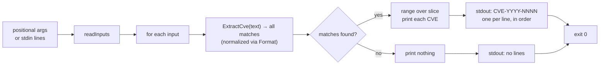

# cve extract

:::tip 📂 View Source
[`cmd/extract.go:11`](https://github.com/scagogogo/cve-skills/blob/main/cmd/extract.go#L11-L35) — open the cobra command definition on GitHub (lines L11–L35).
:::

Extract **all** CVE identifiers from free text and print each one on its own line, normalized to the standard uppercase form. The argument is prose that *contains* CVEs, not a single well-formed CVE, so advisories, changelogs, and log lines all work as input.

:::tip 🖥️ When to use
- Pull every CVE ID out of a security advisory, release note, or email body in one pass.
- Normalize mixed-case mentions (e.g. `cve-2022-12345`) into canonical `CVE-YYYY-NNNN` form while preserving their order of appearance.
- Feed many lines of prose through a pipeline and collect all CVEs per line, in input order, for downstream dedup or sort.
:::

## Command syntax

```bash
cve extract [text...]
```

Each argument is treated as free text and is scanned in full for CVE identifiers. When no arguments are supplied and stdin is piped, one non-empty line is read per input.

## Arguments and options

- `[text...]` (positional, repeatable): One or more chunks of free text. Each argument is scanned independently for CVEs, and every CVE found in it (if any) is printed, one per line.
- stdin fallback: When no positional arguments are supplied and stdin is piped, each non-empty line is treated as one text input. Empty lines are skipped.
- This command defines **no flags** of its own. The global `-q, --quiet` flag is inherited from the root command.

## Examples

Extract all CVEs from a single piece of text — one match per line, in order of appearance:

```bash
$ cve extract "System affected by CVE-2021-44228 and CVE-2022-12345"
CVE-2021-44228
CVE-2022-12345
```

Pass multiple arguments — each argument's matches are printed together, arguments processed in order:

```bash
$ cve extract "fixed CVE-2021-44228" "backported CVE-2023-0001 from CVE-2022-99999"
CVE-2021-44228
CVE-2023-0001
CVE-2022-99999
```

Results are normalized to canonical uppercase form regardless of the input case:

```bash
$ cve extract "affected by cve-2022-00001 and CVE-2023-00002"
CVE-2022-00001
CVE-2023-00002
```

Feed lines of prose from stdin to collect all CVEs per line in a pipeline:

```bash
$ printf 'patched CVE-2021-44228 and CVE-2022-12345\nno cves here\n' | cve extract
CVE-2021-44228
CVE-2022-12345
```

Text with no CVE yields no output for that input — the command emits nothing and still exits 0:

```bash
$ cve extract "CVE-2022-12345 is fixed" "nothing to see"
CVE-2022-12345
```

## How it works



## Corresponding Go API

This command is a thin wrapper around [`ExtractCve`](/api/functions/extract-cve), which runs the pre-compiled regex `(?i)(CVE-\d+-\d+)` over the full text via `FindAllString(-1)`, then passes each raw match through `Format` (`strings.ToUpper(strings.TrimSpace(...))`) to produce canonical uppercase `CVE-YYYY-NNNN`. Matches are returned in the order they appear in the input — the same CVE mentioned twice appears twice. The CLI simply ranges over the slice returned by `ExtractCve` and prints each element on its own line. Use the Go function directly when you need the full CVE slice in code rather than printed text; use [`ExtractFirstCve`](/api/functions/extract-first-cve) or [`ExtractLastCve`](/api/functions/extract-last-cve) when only one match is needed.

## Exit codes and output

- Exit code `0`: the command ran to completion over at least one input. Inputs with no CVE are **not** errors — they emit no lines and the command still exits `0`.
- Exit code `1`: no input was supplied (neither positional arguments nor piped stdin when stdin is a non-terminal). Nothing is printed.
- stdout: every CVE found, one per line, in order of appearance within each input and across inputs in argument order. An input with no CVE contributes no lines.
- stderr: no output in the normal case.

## Notes

- ⚠️ This command scans **free text** — `CVE-2021-44228` and a sentence containing it both work. Contrast with `extract seq`/`extract year`, which expect each argument to be a whole, exact CVE.
- ⚠️ The result is **not deduplicated** — if the same CVE appears N times in an input, it is printed N times. Chain with `cve filter-dedup` (or `RemoveDuplicateCves` in Go) when uniqueness is required.
- The returned CVEs are always normalized to canonical uppercase form (`CVE-YYYY-NNNN`) via `Format`, so `cve-2022-00001` becomes `CVE-2022-00001`.
- The regex match is case-insensitive; surrounding prose is ignored, only the CVE token is captured.
- Only the syntactic shape `CVE-<digits>-<digits>` is matched; the year and sequence are not range-checked. A token like `CVE-9999-0` will be extracted and formatted — validate with `cve validate` if you need semantic correctness.
- There is **no comma-splitting** here — each argument (or stdin line) is one text input scanned as a whole.

## Internal Implementation

The `extract` command is a cobra command whose `Run` function (defined at `cmd/extract.go:23-34`) does the following:

1. **Receives args without flags** — the signature is `Run: func(cmd *cobra.Command, args []string)`. The command defines no flags of its own, so `args` carries the raw positional text chunks verbatim. It never calls `cmd.Flag(...)` or `cmd.Flags().GetString(...)`.
2. **Normalizes input via `readInputs(args)`** — this helper (in `cmd/helpers.go:11`) returns `args` as-is when non-empty; otherwise it falls back to stdin, returning `nil` when stdin is a character device (a terminal with no piped input). Empty stdin lines are skipped.
3. **Guards against empty input** — `if len(inputs) == 0 { os.Exit(1) }`. With no args and no piped stdin, the process exits `1` immediately, before any library call.
4. **Calls `cvepkg.ExtractCve(input)` per input** — for each input string it invokes the library function `ExtractCve` (from package `github.com/scagogogo/cve-skills`), which returns a `[]string` of normalized CVEs. The `Run` function then ranges over that slice and prints each element with `fmt.Println(c)`, one CVE per line. There is no buffering or dedup — output is streamed per input, in argument order.

## Argument Flow

```text
+--------------------------+
| command-line invocation  |
| cve extract [text...]    |
+--------------------------+
            |
            v
+--------------------------+
| cobra parses args[]      |
| (no flags declared)      |
+--------------------------+
            |
            v
+--------------------------+
| readInputs(args)         |
|  args non-empty? -> args |
|  else stdin piped?       |
|    scan non-empty lines  |
|  else stdin is tty -> nil|
+--------------------------+
            |
            v
+--------------------------+
| len(inputs) == 0 ?       |
|   yes -> os.Exit(1)      |
|   no  -> continue        |
+--------------------------+
            |
            v
+--------------------------+
| for each input string:   |
|  cves := ExtractCve(s)   |
|    regex FindAllString   |
|    + Format (ToUpper)    |
+--------------------------+
            |
            v
+--------------------------+
| for each c in cves:      |
|   fmt.Println(c)         |
+--------------------------+
            |
            v
+--------------------------+
| stdout: CVE-YYYY-NNNN    |
| one per line, in order   |
| exit 0                   |
+--------------------------+
```

## Edge Cases

| Input | Behavior | Exit code / output |
| --- | --- | --- |
| No args, stdin is a terminal (no pipe) | `readInputs` returns `nil`; `len(inputs) == 0` triggers `os.Exit(1)` | exit `1`, no stdout, no stderr |
| No args, stdin piped but empty (e.g. `printf '' \| cve extract`) | `readInputs` returns an empty (non-nil) slice after scanning zero lines; `len(inputs) == 0` triggers `os.Exit(1)` | exit `1`, no output |
| Args provided, none contain a CVE (e.g. `cve extract "nothing here"`) | `ExtractCve` returns an empty slice; the inner range prints nothing | exit `0`, no stdout |
| Stdin line with no CVE (e.g. `printf 'no cves\n' \| cve extract`) | That line yields an empty slice; nothing printed for it; other lines still processed | exit `0` (if at least one input), no lines for that input |
| A single argument contains the same CVE twice | `ExtractCve` returns both occurrences (no dedup); both printed | exit `0`, two identical lines |
| Mixed-case input (e.g. `cve-2022-00001`) | Regex is case-insensitive; `Format` uppercases the match | exit `0`, `CVE-2022-00001` |
| Token matching the shape but semantically invalid (e.g. `CVE-9999-0`) | Only the syntactic shape `CVE-\d+-\d+` is matched; no range check | exit `0`, `CVE-9999-0` printed as-is |
| Multiple args, some empty string (e.g. `cve extract "" "CVE-2021-1"`) | `args` is non-empty so `readInputs` returns it directly, including the empty string; `ExtractCve("")` returns empty slice | exit `0`, only `CVE-2021-1` |

## Exit Codes

- **`0`** — the command received at least one input (positional arg or piped stdin line) and ran the extraction loop to completion. This holds even when **no CVE is found** in any input: an empty result slice is not an error. The loop simply prints nothing and the process exits `0` via normal return from `Run`.
- **`1`** — no input was supplied. The `Run` function calls `os.Exit(1)` directly when `len(inputs) == 0` (i.e. no args and stdin is a terminal, or stdin piped but producing zero non-empty lines).
- **stderr** — the source writes nothing to stderr in either path. `os.Exit(1)` is called with no prior `fmt.Fprintln(os.Stderr, ...)`, so the failure is silent: the process simply terminates with code `1` and no diagnostic message. Cobra's own flag-parsing errors (not exercised here, since the command declares no flags) are the only source of stderr text.

## Related commands

- [cve extract first](/cli/commands/extract-first) — extract only the first CVE identifier instead of all matches.
- [cve extract last](/cli/commands/extract-last) — extract only the last CVE identifier instead of all matches.
- [cve extract year](/cli/commands/extract-year) — extract the year segment from each CVE identifier.
- [cve extract seq](/cli/commands/extract-seq) — extract the sequence number segment from each CVE identifier.
- [cve filter-dedup](/cli/commands/filter-dedup) — deduplicate the CVEs produced by this command.
- [CLI Reference](/cli) — full command tree and I/O conventions.
