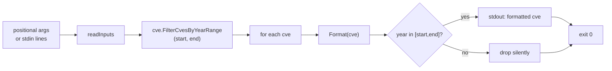

# cve filter by-year-range

:::tip 📂 View Source
[`cmd/filter.go:50`](https://github.com/scagogogo/cve-skills/blob/main/cmd/filter.go#L50-L73) — open the cobra command definition on GitHub (lines L50–L73).
:::

Keep only the CVE identifiers whose year falls inside a closed `[start, end]` range, emitting the survivors one per line in standardized uppercase.

:::tip 🖥️ When to use
- Narrowing a multi-year CVE list to a fixed window — for example, reviewing everything disclosed between 2021 and 2022 — without writing a year-parsing loop.
- Building a time-bounded dataset before feeding it into trend analysis or a vulnerability-density report.
- Cleaning the output of an extraction pipeline (`extract` → `filter by-year-range`) so downstream stages receive only CVEs from the period you care about.
:::

## Command syntax

```bash
cve filter by-year-range --start [year] --end [year] [cve-id...]
```

CVE identifiers are accepted as positional arguments, or — when none are given — as one item per line on stdin.

## Arguments and options

- `[cve-id...]` (positional, repeatable): One or more CVE identifiers. Unlike some list-taking subcommands, each argument is treated as a single identifier and is **not** split on commas.
- stdin fallback: When no positional arguments are supplied and stdin is piped, each non-empty line is treated as one input identifier.
- `--start, -s` (int, required, inclusive): Lower bound of the year range. Must be a non-zero integer.
- `--end, -e` (int, required, inclusive): Upper bound of the year range. Must be a non-zero integer.
- This command defines no other flags of its own. The global `-q, --quiet` flag is inherited from the root command.

## Examples

Keep only CVEs from 2021 and 2022 — the 2020 entry is dropped:

```bash
$ cve filter by-year-range --start 2021 --end 2022 CVE-2020-1111 CVE-2021-2222 CVE-2022-3333
CVE-2021-2222
CVE-2022-3333
```

Use the short flag aliases `-s` and `-e` for a more compact invocation:

```bash
$ cve filter by-year-range -s 2022 -e 2022 CVE-2021-44228 CVE-2022-26228 CVE-2023-1234
CVE-2022-26228
```

Survivors are normalized to uppercase on output, so lowercase input still matches:

```bash
$ cve filter by-year-range -s 2022 -e 2023 cve-2022-1 CVE-2023-9 CVE-2019-1
CVE-2022-1
CVE-2023-9
```

A single-year window is just a range where `--start` equals `--end`:

```bash
$ cve filter by-year-range --start 2021 --end 2021 CVE-2021-1111 CVE-2022-2222
CVE-2021-1111
```

Feed a list from stdin to filter the output of another command:

```bash
$ printf 'CVE-2021-44228\nCVE-2019-1\nCVE-2022-26228\n' | cve filter by-year-range -s 2021 -e 2022
CVE-2021-44228
CVE-2022-26228
```

## How it works



## Corresponding Go API

This command is a thin wrapper around [`FilterCvesByYearRange`](/api/functions/filter-cves-by-year-range), which iterates the slice, formats each entry with `Format`, extracts its year with `ExtractCveYearAsInt`, and appends the formatted form when the year satisfies `startYear <= year <= endYear`. All formatting and year-extraction logic lives in the library. Use the Go function directly when you need the filtered slice in code rather than printed text.

## Exit codes and output

- Exit code `0`: the command ran to completion. CVEs outside the range are dropped, not errored — a list with zero in-range entries still exits `0` and prints nothing.
- Exit code `1`: either `--start` or `--end` was omitted (or zero), in which case `error: --start and --end are required` is printed to stderr; or no input was supplied (neither positional arguments nor piped stdin), in which case the command exits silently.
- stdout: one line per surviving CVE, in first-seen input order. Each line is the standardized uppercase form — `CVE-YYYY-NNNNN`.
- stderr: only the missing-flag error above. Dropped entries produce no stderr noise.

## Notes

- The range is **inclusive on both ends**: a CVE whose year equals `--start` or `--end` is kept.
- `--start` and `--end` are raw integers with no ordering check — passing `--start 2022 --end 2021` yields an empty result because no year can satisfy the inverted bound, not an error.
- Both flags must be non-zero; `0` is treated as "not provided" and triggers the required-flag error.
- The year is read from the CVE identifier itself (`CVE-YYYY-NNNNN`), not from any external disclosure date — a malformed identifier whose year cannot be extracted will never match and is dropped silently.
- Duplicates are not merged — `CVE-2022-1` and `cve-2022-1` both match and both print as `CVE-2022-1`. Run `cve filter dedup` afterward if you need a deduplicated set.
- Order is preserved (first-seen); the command does not sort. Pipe through `cve compare sort` if you need ascending order.

## Internal Implementation

The `Run` function of `filterByYearRangeCmd` (`cmd/filter.go:57-72`) follows a straight validate-then-collect-then-filter path:

- **Flag reading**: `startYear, _ := cmd.Flags().GetInt("start")` and `endYear, _ := cmd.Flags().GetInt("end")` pull the two required integer flags; the error value is deliberately discarded, so an invalid `--start`/`--end` value surfaces only as the zero value.
- **Required-flag guard**: `if startYear == 0 || endYear == 0` writes `error: --start and --end are required` to stderr via `fmt.Fprintln(os.Stderr, ...)` and calls `os.Exit(1)`. Because `0` is the flag's default, "missing" and "explicitly zero" are indistinguishable and both rejected.
- **Input collection**: `inputs := readInputs(args)` merges positional `args` with stdin lines (one identifier per non-empty line). `if len(inputs) == 0 { os.Exit(1) }` exits silently with code `1` when nothing was supplied.
- **Library call and output**: `filtered := cvepkg.FilterCvesByYearRange(inputs, startYear, endYear)` does the actual year-extraction and inclusive-range test, returning formatted uppercase strings in first-seen order; the loop `for _, c := range filtered { fmt.Println(c) }` writes one survivor per line to stdout. The process then falls off the end of `Run` and exits `0`.

## Argument Flow

```text
+---------------------------+   +---------------------------+
| CLI invocation            |   | Flags parsed by cobra     |
| cve filter by-year-range  |-->| --start (int) --end (int) |
|   --start S --end E       |   | [cve-id...] positional    |
|   CVE-... CVE-...         |   +-------------+-------------+
+---------------------------+                 |
                                              v
                              +---------------+---------------+
                              | cmd.Flags().GetInt("start")   |
                              | cmd.Flags().GetInt("end")     |
                              +---------------+---------------+
                                              |
                                  start==0 || end==0 ?
                              +---------------+---------------+
                              | YES: stderr "error: --start  |
                              | and --end are required";      |
                              | os.Exit(1)                    |
                              +---------------+---------------+
                                              | NO
                                              v
                              +---------------+---------------+
                              | inputs := readInputs(args)    |
                              |  (positional + stdin lines)   |
                              +---------------+---------------+
                                              |
                                  len(inputs)==0 ?
                              +---------------+---------------+
                              | YES: silent os.Exit(1)        |
                              +---------------+---------------+
                                              | NO
                                              v
                              +---------------+---------------+
                              | cvepkg.FilterCvesByYearRange  |
                              |   (inputs, startYear, endYear)|
                              |  -> Format + ExtractCveYear   |
                              |  -> keep if start<=year<=end  |
                              +---------------+---------------+
                                              |
                                              v
                              +---------------+---------------+
                              | for _, c := range filtered    |
                              |   fmt.Println(c)  (stdout)    |
                              +---------------+---------------+
                                              |
                                              v
                                  fall off Run -> exit 0
```

## Edge Cases

| Input | Behavior | Exit code / output |
|---|---|---|
| No `--start` or no `--end` (or either is `0`) | Required-flag guard trips | Exit `1`; stderr `error: --start and --end are required` |
| No positional args and stdin is a TTY (nothing piped) | `readInputs` returns empty | Silent exit `1`; no stdout, no stderr |
| No positional args, stdin piped but empty (e.g. `printf ''`) | `readInputs` returns empty | Silent exit `1`; no output |
| All inputs fall outside the range | `FilterCvesByYearRange` returns empty slice | Exit `0`; stdout empty, no stderr |
| `--start 2022 --end 2021` (inverted bounds) | No year satisfies `2022 <= year <= 2021` | Exit `0`; empty output (not an error) |
| Malformed identifier whose year cannot be extracted | `ExtractCveYearAsInt` yields no valid year; entry dropped | Exit `0`; entry absent from stdout |
| Lowercase or mixed-case input (e.g. `cve-2022-1`) | `Format` normalizes to uppercase before testing/output | Exit `0`; prints `CVE-2022-1` |
| Duplicate identifiers in range | Each occurrence kept and printed | Exit `0`; duplicates printed (use `dedup` to merge) |
| stdin piped alongside positional args | Positional args are used; stdin is not consumed when args are present | Exit `0`; filters the positional list |

## Exit Codes

- **`0`** — success. The `Run` function returns normally after printing survivors. This includes the "empty result" case: filtering that yields zero matches is a successful filter, not an error, so it exits `0` with no stdout output.
- **`1`** — failure, with two distinct triggers, both via `os.Exit(1)`:
  - Missing or zero `--start`/`--end`: writes `error: --start and --end are required` to stderr (`fmt.Fprintln(os.Stderr, ...)`) before exiting.
  - No input supplied (`len(inputs) == 0` after `readInputs`): exits silently — no stderr message is written by this branch.
- The command does not call `os.Exit` with any other code, nor does it print to stderr for in-range/out-of-range decisions. Cobra's own flag-parsing errors (e.g. a non-integer `--start`) are handled by cobra before `Run` is reached and follow cobra's default error reporting.

## Related commands

- [cve filter by-year](/cli/commands/filter-by-year) — filter by a single exact year instead of a range.
- [cve filter recent](/cli/commands/filter-recent) — filter to the most recent N years relative to the current year.
- [cve filter dedup](/cli/commands/filter-dedup) — remove duplicates, often chained after a year filter.
- [cve filter valid](/cli/commands/filter-valid) — drop malformed CVEs before applying a year range.
- [CLI Reference](/cli) — full command tree and I/O conventions.
