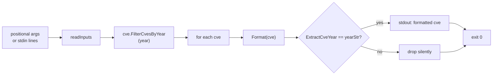

# cve filter by-year

:::tip 📂 View Source
[`cmd/filter.go:25`](https://github.com/scagogogo/cve-skills/blob/main/cmd/filter.go#L25-L48) — open the cobra command definition on GitHub (lines L25–L48).
:::

Keep only the CVE identifiers that belong to a single exact year, emitting the survivors one per line in standardized uppercase.

:::tip 🖥️ When to use
- Pulling every CVE assigned in one specific year out of a multi-year list — for example, isolating all 2022 records — without writing a year-parsing loop.
- Building a single-year dataset before feeding it into an annual report or vulnerability-density calculation.
- Cleaning the output of an extraction pipeline (`extract` → `filter by-year`) so downstream stages receive only CVEs from the year you care about.
:::

## Command syntax

```bash
cve filter by-year --year [year] [cve-id...]
```

CVE identifiers are accepted as positional arguments, or — when none are given — as one item per line on stdin.

## Arguments and options

- `[cve-id...]` (positional, repeatable): One or more CVE identifiers. Each argument is treated as a single identifier and is **not** split on commas.
- stdin fallback: When no positional arguments are supplied and stdin is piped, each non-empty line is treated as one input identifier.
- `--year, -y` (int, required): The target year to match. Must be a non-zero integer.
- This command defines no other flags of its own. The global `-q, --quiet` flag is inherited from the root command.

## Examples

Keep only the 2022 CVEs — the 2021 entry is dropped:

```bash
$ cve filter by-year --year 2022 CVE-2021-1111 CVE-2022-2222
CVE-2022-2222
```

Use the short flag alias `-y` for a more compact invocation:

```bash
$ cve filter by-year -y 2021 CVE-2021-1111 CVE-2022-2222 CVE-2021-3333
CVE-2021-1111
CVE-2021-3333
```

Survivors are normalized to uppercase on output, so mixed-case input still matches:

```bash
$ cve filter by-year -y 2022 cve-2022-1 CvE-2022-9 CVE-2021-1
CVE-2022-1
CVE-2022-9
```

A year with no matching CVEs prints nothing and still exits `0`:

```bash
$ cve filter by-year --year 2025 CVE-2021-1111 CVE-2022-2222
# (no output)
```

Feed a list from stdin to filter the output of another command:

```bash
$ printf 'CVE-2021-44228\nCVE-2019-1\nCVE-2022-26228\n' | cve filter by-year -y 2022
CVE-2022-26228
```

## How it works



## Corresponding Go API

This command is a thin wrapper around [`FilterCvesByYear`](/api/functions/filter-cves-by-year), which iterates the slice, formats each entry with `Format`, extracts its year as a string with `ExtractCveYear`, and appends the formatted form when that year equals `strconv.Itoa(year)`. All formatting and year-extraction logic lives in the library. Use the Go function directly when you need the filtered slice in code rather than printed text.

## Exit codes and output

- Exit code `0`: the command ran to completion. CVEs whose year differs from the target are dropped, not errored — a list with zero matching entries still exits `0` and prints nothing.
- Exit code `1`: `--year` was omitted (or zero), in which case `error: --year is required` is printed to stderr; or no input was supplied (neither positional arguments nor piped stdin), in which case the command exits silently.
- stdout: one line per surviving CVE, in first-seen input order. Each line is the standardized uppercase form — `CVE-YYYY-NNNNN`.
- stderr: only the missing-flag error above. Dropped entries produce no stderr noise.

## Notes

- The match is **exact and single-year**: only CVEs whose year equals `--year` are kept. For a closed multi-year window use `cve filter by-year-range`, and for a relative window of the most recent N years use `cve filter recent`.
- `--year` must be a non-zero integer; `0` is treated as "not provided" and triggers the required-flag error.
- The year is read from the CVE identifier itself (`CVE-YYYY-NNNNN`), not from any external disclosure date — a malformed identifier whose year cannot be extracted will never match and is dropped silently.
- Duplicates are not merged — `CVE-2022-1` and `cve-2022-1` both match and both print as `CVE-2022-1`. Run `cve filter dedup` afterward if you need a deduplicated set.
- Order is preserved (first-seen); the command does not sort. Pipe through `cve compare sort` if you need ascending order.

## Internal Implementation

The cobra command `filterByYearCmd` (registered under `filter` in `cmd/filter.go:25-48`) wires a thin `Run` closure around the library function:

- The `Run` closure receives the parsed `args []string` directly; cobra has already split flags from positional arguments, so `args` holds only the CVE identifiers. The command does **not** call `cmd.ParseFlags` itself.
- It reads the required flag with `year, _ := cmd.Flags().GetInt("year")` (L34). The returned error is intentionally discarded — the flag is declared as `IntP("year", "y", 0, ...)` in `init()` (L155), so cobra guarantees a valid int or terminates parsing before `Run` is reached.
- A `year == 0` sentinel is treated as "not supplied": the closure writes `error: --year is required` to stderr via `fmt.Fprintln(os.Stderr, ...)` and calls `os.Exit(1)` (L35-L38). This is a hard process exit, not a returned error.
- Input collection delegates to the shared `readInputs(args)` helper (L39), which merges positional args with piped stdin lines. If the resulting slice is empty, `os.Exit(1)` runs with no message (L40-L42).
- The library call is `cvepkg.FilterCvesByYear(inputs, year)` (L43), whose return is a `[]string` of formatted survivors. The closure prints them one per line with a plain `fmt.Println(c)` loop (L44-L46) — no delimiter, no header, no trailing summary.

## Argument Flow

```text
+-----------------------+     cobra parses flags     +--------------------------+
| CLI invocation:       |  ----------------------- -> | Run(cmd, args):          |
|   --year/-y N         |     args = CVE ids only     |   GetInt("year") -> year |
|   [cve-id ...]        |                             +--------------------------+
+-----------------------+                                        |
                                                                 v
                                                        +-----------------+
                                                        | year == 0 ?     |
                                                        +-----------------+
                                                           |          |
                                                          yes         no
                                                           |          |
                                                           v          v
                                             +-------------+   +-----------------+
                                             | stderr:     |   | readInputs(args) |
                                             | error: ...  |   | -> inputs []     |
                                             | os.Exit(1)  |   +-----------------+
                                             +-------------+          |
                                                                      v
                                                              +-----------------+
                                                              | len(inputs)==0? |
                                                              +-----------------+
                                                                 |          |
                                                               yes         no
                                                                 |          |
                                                                 v          v
                                                  +-------------+   +-----------------------------+
                                                  | os.Exit(1)  |   | cvepkg.FilterCvesByYear(     |
                                                  | (silent)    |   |   inputs, year) -> filtered  |
                                                  +-------------+   +-----------------------------+
                                                                          |
                                                                          v
                                                              +-----------------------------+
                                                              | for _, c := range filtered: |
                                                              |   fmt.Println(c)  (stdout)  |
                                                              +-----------------------------+
                                                                          |
                                                                          v
                                                                  exit 0 (implicit)
```

## Edge Cases

| Input | Behavior | Exit code / output |
|---|---|---|
| `--year` omitted, e.g. `cve filter by-year CVE-2021-1` | `year` defaults to `0`, sentinel fires | exit `1`; stderr `error: --year is required` |
| `--year 0 CVE-2021-1` | Explicit `0` is indistinguishable from omitted | exit `1`; stderr `error: --year is required` |
| No CVE ids and no stdin, e.g. `cve filter by-year -y 2022` (interactive tty) | `readInputs` returns empty slice | exit `1`; silent (no stderr) |
| Valid year, no matches, e.g. `-y 2025 CVE-2021-1` | `FilterCvesByYear` returns empty slice | exit `0`; no stdout output |
| Mixed-case matches, e.g. `-y 2022 cve-2022-1` | Library `Format` uppercases; year matches | exit `0`; stdout `CVE-2022-1` |
| Malformed id whose year cannot be extracted, e.g. `-y 2022 CVE-9999` | `ExtractCveYear` does not equal `2022` | dropped silently; exit `0` |
| Duplicate ids, e.g. `-y 2022 CVE-2022-1 cve-2022-1` | Both match, neither merged | exit `0`; stdout `CVE-2022-1` twice |
| stdin piped with blank lines, e.g. `printf '\nCVE-2022-1\n\n'` | `readInputs` skips empty lines | exit `0`; stdout `CVE-2022-1` |
| Non-numeric `--year` value, e.g. `--year abc` | cobra flag parser rejects before `Run` | exit `1`; cobra usage error to stderr |

## Exit Codes

The command controls its exit code through three explicit `os.Exit` paths and one implicit success:

- **Exit `0` (implicit):** the `Run` closure returns normally after the print loop. This covers the common success case **and** the zero-match case — `FilterCvesByYear` returning an empty slice simply means the loop body never executes, and the process exits `0` with no output.
- **Exit `1` — missing `--year`:** triggered by `year == 0` at L35-L38. The only stderr output is the single line `error: --year is required`; nothing is written to stdout.
- **Exit `1` — no input:** triggered by `len(inputs) == 0` at L40-L42. This path is **silent**: it writes nothing to stderr or stdout before exiting.
- **Exit `1` — cobra flag parse failure:** for an invalid `--year` (non-integer) or unknown flag, cobra itself prints a usage error to stderr and exits before `Run` is invoked. The closure's own logic is never reached.
- The command never calls `os.Exit(2)` or returns a Go `error`; there is no explicit "usage error" path inside `Run`. All non-zero exits are the two `os.Exit(1)` calls above plus any cobra-level rejection.

## Related commands

- [cve filter by-year-range](/cli/commands/filter-by-year-range) — filter by a closed `[start, end]` year range instead of a single year.
- [cve filter recent](/cli/commands/filter-recent) — filter to the most recent N years relative to the current year.
- [cve filter group-by-year](/cli/commands/filter-group-by-year) — group all CVEs by year rather than selecting one.
- [cve filter dedup](/cli/commands/filter-dedup) — remove duplicates, often chained after a year filter.
- [CLI Reference](/cli) — full command tree and I/O conventions.
