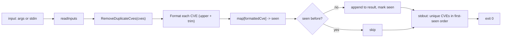

# cve filter dedup

:::tip 📂 View Source
[`cmd/filter.go:128`](https://github.com/scagogogo/cve-skills/blob/main/cmd/filter.go#L128-L145) — open the cobra command definition on GitHub (lines L128–L145).
:::

Remove duplicate CVE identifiers from a list, comparing case-insensitively and emitting each unique CVE in canonical uppercase form.

:::tip 🖥️ When to use
- De-duplicating a merged CVE list assembled from multiple advisory feeds, scanners, or reports.
- Cleaning user input before piping into grouping, sorting, or validation commands.
- Normalizing inconsistent capitalization (e.g. `cve-2022-1111` vs `CVE-2022-1111`) into a single canonical form.
:::

## Command syntax

```bash
cve filter dedup [cve-id...]
```

The command accepts CVE identifiers as positional arguments. When no arguments are supplied and stdin is piped, it reads one identifier per line from stdin instead. It defines no flags of its own.

## Arguments and options

- `[cve-id...]` (positional, optional): Zero or more CVE identifiers, e.g. `CVE-2021-44228`. When omitted, the command falls back to stdin (one per line, blank lines skipped).
- This command defines **no flags** of its own. The global `-q, --quiet` flag is inherited from the root command.
- If no arguments are provided and stdin is a terminal (not piped), `readInputs` returns `nil` and the command exits with code `1` without printing anything.

## Examples

Remove an exact duplicate plus a case variant; only the first occurrence is kept and re-emitted in canonical uppercase:

```bash
$ cve filter dedup CVE-2022-1111 cve-2022-1111 CVE-2022-2222
CVE-2022-1111
CVE-2022-2222
```

Pipe a list from stdin when the input comes from another tool; blank lines are skipped and order is preserved by first appearance:

```bash
$ printf 'CVE-2020-5\ncve-2020-5\nCVE-2020-9\n' | cve filter dedup
CVE-2020-5
CVE-2020-9
```

Duplicates spread across a longer input collapse to their first occurrence only:

```bash
$ cve filter dedup CVE-2021-1 CVE-2021-2 CVE-2021-1 CVE-2021-3 CVE-2021-2
CVE-2021-1
CVE-2021-2
CVE-2021-3
```

Chain dedup with grouping to get clean, non-repeating per-year buckets:

```bash
$ cve filter dedup cve-2022-1111 CVE-2022-1111 cve-2022-2222 | cve filter group-by-year
2022:
  CVE-2022-1111
  CVE-2022-2222
```

## How it works



## Corresponding Go API

This command is a thin wrapper around [`RemoveDuplicateCves`](/api/functions/remove-duplicate-cves), which returns the de-duplicated `[]string` slice. Each CVE is normalized through `Format` (uppercase + trim whitespace) before the seen-set lookup, so casing and surrounding whitespace differences collapse to a single canonical entry. The CLI prints each unique CVE on its own line; when you call the Go function directly you receive the slice and are responsible for your own rendering.

## Exit codes and output

- Exit code `0`: the command ran to completion and printed the de-duplicated list to stdout.
- Exit code `1`: no inputs were supplied (empty arguments and no piped stdin). Nothing is printed.
- stdout: each unique CVE on its own line, in first-appearance order, in canonical uppercase form.
- stderr: nothing is written under normal operation.

## Notes

- Comparison is **case-insensitive** because each CVE is passed through `Format` (`strings.ToUpper` + `strings.TrimSpace`) before the seen-set lookup. `cve-2022-1111`, `CVE-2022-1111`, and `  cve-2022-1111  ` all count as the same identifier.
- The **first occurrence wins**: the canonical uppercase form of the first-seen variant is emitted, and later duplicates are dropped. The output order therefore reflects input order, not lexicographic order. Use `cve compare sort` afterward if you need sorted output.
- Whitespace-only padding is stripped by `Format`; an input like `" CVE-2022-1 "` is treated as `CVE-2022-1`.
- The command does **not validate** that inputs are well-formed CVE identifiers. A non-CVE token is still normalized (uppercased) and de-duplicated like any other string. Validate first with `cve validate` if malformed entries should be rejected.
- There is no flag to switch to case-sensitive deduplication or to preserve the original casing; the output is always canonical uppercase.
- Sequence-number width is not normalized here. `CVE-2022-1` and `CVE-2022-0001` are treated as distinct identifiers because `Format` only changes case and trims whitespace. Use `cve format` if you also need sequence padding before dedup.

## Internal Implementation

The `dedup` cobra command (`cmd/filter.go:128-145`) is a thin positional-argument wrapper with no flags of its own. Its `Run` function works as follows:

- **Receives positional args via cobra**: `Run: func(cmd *cobra.Command, args []string)` gets the raw CVE tokens as `args`. No flags are read — `dedup` registers none in `init()`, so only inherited root flags apply.
- **Reads inputs through `readInputs(args)`**: this helper merges positional arguments with piped stdin (one per line, blanks skipped) and returns `nil` when neither is available.
- **Calls `cvepkg.RemoveDuplicateCves(inputs)`**: the library function normalizes each token through `Format` (uppercase + trim), tracks a seen-set, and returns the unique `[]string` in first-appearance order.
- **Prints to stdout**: the result is iterated with `for _, c := range unique { fmt.Println(c) }`, emitting one canonical CVE per line.

## Argument Flow

```text
+--------------------------+      +---------------------+      +--------------------------------+
| argv: cve filter dedup   | ---> | readInputs(args)    | ---> | cvepkg.RemoveDuplicateCves(    |
|   [cve-id...]            |      |  - use args if any  |      |   inputs                       |
+--------------------------+      |  - else read stdin  |      | ) -> []string (unique, upper)  |
                                  |  - skip blank lines  |      +--------------------------------+
+--------------------------+              |                              |
| stdin (one CVE per line | -----pipe---+                              |
|  when no args)          |                                             v
+--------------------------+      +--------------------------------------------+
                                  | for _, c := range unique {                |
                                  |   fmt.Println(c)   // stdout, one per line|
                                  | }                                          |
                                  +--------------------------------------------+
                                                  |
                                                  v
                                  +--------------------------------------------+
                                  | exit 0 (output written)                    |
                                  | exit 1 (if readInputs returned empty)      |
                                  +--------------------------------------------+
```

## Edge Cases

| Input | Behavior | Exit code / output |
|---|---|---|
| No args, stdin is a terminal (no pipe) | `readInputs` returns `nil`; `len(inputs) == 0` triggers early exit | Exit `1`; nothing printed to stdout or stderr |
| No args, stdin piped with only blank lines | blanks are skipped, leaving zero inputs | Exit `1`; nothing printed |
| Single CVE | one entry in, one out (no duplicate to drop) | Exit `0`; that CVE printed in canonical uppercase |
| Case variants (`cve-2022-1` vs `CVE-2022-1`) | both `Format` to the same key; second is dropped | Exit `0`; first canonical form printed |
| Surrounding whitespace (`" CVE-2022-1 "`) | `Format` trims it; treated as `CVE-2022-1` | Exit `0`; trimmed canonical form printed |
| Non-CVE tokens (`FOO`, `bar-123`) | not validated; uppercased and de-duplicated like any string | Exit `0`; tokens normalized and printed |
| Sequence-width variants (`CVE-2022-1` vs `CVE-2022-0001`) | `Format` only changes case/trims; widths differ, so both kept | Exit `0`; both printed as distinct |
| All duplicates collapse | first occurrence wins, rest dropped | Exit `0`; one entry printed |

## Exit Codes

- **Success (exit `0`)**: reached whenever `readInputs` returns a non-empty slice. The de-duplicated list is written to stdout; stderr is left untouched.
- **Failure (exit `1`)**: when `len(inputs) == 0` (no positional args and no piped stdin). The command calls `os.Exit(1)` immediately without printing — there is no explicit error message on stderr for this path, unlike the sibling `by-year`/`recent` commands which write `error: --flag is required`.
- The command does not trap runtime panics or library errors; any unexpected panic propagates and the process exits with Go's default non-zero code.

## Related commands

- [cve filter group-by-year](/cli/commands/filter-group-by-year) — bucket unique CVEs by year after dedup.
- [cve format](/cli/commands/format) — canonicalize case and sequence-number width before de-duplicating.
- [cve compare sort](/cli/commands/compare-sort) — sort the de-duplicated output by year then sequence.
- [cve validate batch](/cli/commands/validate-batch) — reject malformed identifiers before dedup.
- [CLI Reference](/cli) — full command tree and I/O conventions.
