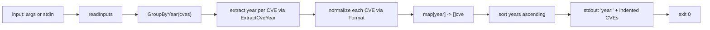

# cve filter group-by-year

:::tip 📂 View Source
[`cmd/filter.go:99`](https://github.com/scagogogo/cve-skills/blob/main/cmd/filter.go#L99-L126) — open the cobra command definition on GitHub (lines L99–L126).
:::

Group a set of CVE identifiers by year, printing each year on its own line followed by all CVEs of that year, one per indented line.

:::tip 🖥️ When to use
- Bucketing a raw CVE list by publication year before reporting or visualizing trends.
- Quickly seeing which years dominate a vulnerability feed or advisory bundle.
- Splitting a mixed-year input into per-year buckets for downstream year-specific processing.
:::

## Command syntax

```bash
cve filter group-by-year [cve-id...]
```

The command accepts CVE identifiers as positional arguments. When no arguments are supplied and stdin is piped, it reads one identifier per line from stdin instead. It defines no flags of its own.

## Arguments and options

- `[cve-id...]` (positional, optional): Zero or more CVE identifiers, e.g. `CVE-2021-44228`. When omitted, the command falls back to stdin (one per line, blank lines skipped).
- This command defines **no flags** of its own. The global `-q, --quiet` flag is inherited from the root command.
- If no arguments are provided and stdin is a terminal (not piped), `readInputs` returns `nil` and the command exits with code `1` without printing anything.

## Examples

Group three CVEs across two years; years print sorted ascending with each CVE indented two spaces:

```bash
$ cve filter group-by-year CVE-2021-1111 CVE-2022-2222 CVE-2021-3333
2021:
  CVE-2021-1111
  CVE-2021-3333
2022:
  CVE-2022-2222
```

Pipe a list from stdin when the input comes from another tool:

```bash
$ printf 'CVE-2020-5\nCVE-2023-7\nCVE-2020-9\n' | cve filter group-by-year
2020:
  CVE-2020-5
  CVE-2020-9
2023:
  CVE-2023-7
```

Mix years freely — every distinct year in the input becomes a bucket:

```bash
$ cve filter group-by-year CVE-1999-1 CVE-2024-1 CVE-1999-2 CVE-2024-2
1999:
  CVE-1999-1
  CVE-1999-2
2024:
  CVE-2024-1
  CVE-2024-2
```

Combine with `cve filter dedup` in a pipeline to de-duplicate before grouping:

```bash
$ cve filter dedup CVE-2022-1111 cve-2022-1111 CVE-2022-2222 | cve filter group-by-year
2022:
  CVE-2022-1111
  CVE-2022-2222
```

## How it works



## Corresponding Go API

This command is a thin wrapper around [`GroupByYear`](/api/functions/group-by-year), which returns `map[string][]string` keyed by the extracted year. Each CVE is normalized through `Format` before being added to its bucket. The CLI then sorts the keys and prints them; when you call the Go function directly you receive the raw map and are responsible for your own ordering and rendering.

## Exit codes and output

- Exit code `0`: the command ran to completion and printed the grouped output to stdout.
- Exit code `1`: no inputs were supplied (empty arguments and no piped stdin). Nothing is printed.
- stdout: for each year (sorted ascending), a `year:` header line followed by one indented CVE per line.
- stderr: nothing is written under normal operation.

## Notes

- Years are sorted **ascending as strings** via `sort.Strings` before printing. Because CVE years are four-digit zero-padded values this matches numeric order, but the comparison is textual, not numeric.
- Each CVE is reformatted by `Format` before grouping, so `cve-2022-1111` and `CVE-2022-1111` land in the same bucket and are printed with the canonical capitalization.
- Year extraction is purely textual; a malformed identifier whose year segment is non-numeric or missing is bucketed under whatever `ExtractCveYear` returns (typically an empty string). Validate inputs first with `cve validate` if this matters.
- There is no check that the year falls in `1999..currentYear` — a hypothetical `CVE-1800-1` is grouped under `1800` without error.
- The command does not de-duplicate; duplicate CVEs appear multiple times within their year bucket. Pipe through `cve filter dedup` first if you need unique entries.
- Within a year bucket, CVEs print in the **order they appeared in the input**, not sorted by sequence number. Use `cve compare sort` afterward if you need per-bucket ordering.

## Internal Implementation

The `groupByYearCmd` cobra command (defined at `cmd/filter.go:99-126`) runs a straightforward pipeline with no flags of its own:

- **Input gathering**: `Run` receives `args []string` and passes them straight to `readInputs(args)`, the shared helper that returns positional args when present, otherwise reads stdin line by line (skipping blanks). No flag parsing happens in this subcommand.
- **Empty guard**: `if len(inputs) == 0 { os.Exit(1) }` aborts before any library call when nothing was supplied, so the grouping logic never runs on an empty slice.
- **Library call**: `groups := cvepkg.GroupByYear(inputs)` returns a `map[string][]string` keyed by extracted year. Each CVE is normalized via `Format` and bucketed by `ExtractCveYear` inside that function — the CLI does not touch formatting itself.
- **Output formatting**: the CLI collects the map keys into a `[]string`, sorts them with `sort.Strings`, then for each year prints `fmt.Printf("%s:\n", y)` as a header followed by `fmt.Printf("  %s\n", c)` for every CVE in that bucket (two-space indent, input order preserved within the bucket).

## Argument Flow

```text
+----------------------+   +----------------------+   +---------------------------+
| CLI args / stdin     |-->| readInputs(args)     |-->| []string inputs           |
| (cve-id per line)    |   | (positional or pipe) |   | (empty? -> os.Exit(1))    |
+----------------------+   +----------------------+   +---------------------------+
                                                                |
                                                                v
                          +---------------------------------------+
                          | cvepkg.GroupByYear(inputs)            |
                          |   ExtractCveYear per CVE              |
                          |   Format per CVE (normalize case)     |
                          |   -> map[string][]string (year->cves) |
                          +---------------------------------------+
                                                                |
                                                                v
                          +---------------------------------------+
                          | collect map keys into []string years  |
                          | sort.Strings(years)  (ascending)      |
                          +---------------------------------------+
                                                                |
                                                                v
                          +---------------------------------------+
                          | for each year y:                      |
                          |   fmt.Printf("%s:\n", y)              |
                          |   for each c in groups[y]:            |
                          |     fmt.Printf("  %s\n", c)           |
                          +---------------------------------------+
                                                                |
                                                                v
                          stdout (grouped, indented) -> exit 0
```

## Edge Cases

| Input | Behavior | Exit code / output |
|---|---|---|
| No positional args, stdin is a TTY | `readInputs` returns `nil`; the empty guard trips immediately | Exit `1`, nothing printed to stdout or stderr |
| No positional args, stdin piped but empty | `readInputs` returns an empty slice; guard trips | Exit `1`, nothing printed |
| Args with blank lines via stdin | `readInputs` skips blank lines; only non-empty tokens reach `GroupByYear` | Exit `0`, grouped output of non-empty inputs |
| Malformed CVE (non-numeric/missing year) | `ExtractCveYear` returns its textual result (often empty string); the CVE lands under that key | Exit `0`, bucket header may be an empty line |
| Out-of-range year (e.g. `CVE-1800-1`) | No range check; grouped under the literal year `1800` | Exit `0`, prints `1800:` bucket |
| Duplicate CVEs in input | Not de-duplicated; each duplicate reappears within its year bucket | Exit `0`, repeats printed |
| Mixed-case inputs (`cve-2022-1`, `CVE-2022-1`) | `Format` normalizes to canonical form before bucketing | Exit `0`, single bucket, canonical casing |
| Empty result after grouping (should not happen) | Unreachable: any non-empty input yields at least one bucket | N/A |

## Exit Codes

- **Success (exit `0`)**: `readInputs` returned a non-empty slice and `GroupByYear` produced the map; the loop prints grouped output to stdout. The command does not call `os.Exit` on the success path, so Go's default exit code `0` applies.
- **Failure (exit `1`)**: the only explicit failure is the empty-input guard, `if len(inputs) == 0 { os.Exit(1) }`. It exits `1` immediately **without** printing anything to stderr — contrast with sibling subcommands like `by-year` which emit `error: --year is required` first.
- **stderr**: this subcommand never writes to stderr; all diagnostics would come from cobra's own flag/usage handling, but `group-by-year` defines no flags so that path is not exercised here.

## Related commands

- [cve filter by-year](/cli/commands/filter-by-year) — keep only CVEs of a single given year.
- [cve filter by-year-range](/cli/commands/filter-by-year-range) — keep CVEs within an inclusive year range.
- [cve filter recent](/cli/commands/filter-recent) — keep CVEs from the most recent N years.
- [cve filter dedup](/cli/commands/filter-dedup) — remove duplicate CVE identifiers before grouping.
- [CLI Reference](/cli) — full command tree and I/O conventions.
