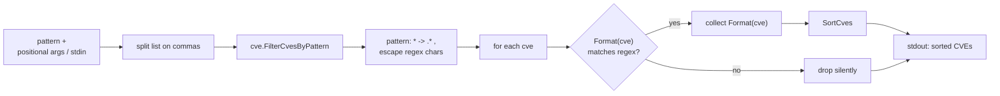

# cve filter-pattern

:::tip 📂 View Source
[`cmd/pattern.go:12`](https://github.com/scagogogo/cve-skills/blob/main/cmd/pattern.go#L12-L32) — open the cobra command definition on GitHub (lines L12–L32).
:::

Filter a list of CVE identifiers with a **wildcard pattern**, keeping only the entries whose standardized uppercase form matches and emitting the survivors one per line in sorted order.

:::tip 🖥️ When to use
- Selecting every CVE from a specific year (`CVE-2022-*`) out of a merged multi-year list without writing a grep loop.
- Finding all entries that share a sequence suffix across years (`CVE-*-1111`) when correlating related advisories.
- Pre-filtering a large dump before heavier analysis — pattern matching is cheap and runs before you hand off to validate or diff.
:::

## Command syntax

```bash
cve filter-pattern <pattern> <cve-list>
```

`<cve-list>` accepts the same flexible input shape shared by every list-taking subcommand: multiple positional arguments, comma-separated values within each argument, or — when no arguments are given — one item per line on stdin. The `<pattern>` is always the **first** input, the rest of the inputs form the CVE list.

## Arguments and options

- `<pattern>` (positional, first): A wildcard pattern such as `CVE-2022-*` or `CVE-*-1111`. The `*` matches any run of characters; other characters are matched literally. Surrounding whitespace is trimmed.
- `<cve-list>` (positional, repeatable, after the pattern): One or more CVE identifiers. Each argument is split further on commas, so `"CVE-2022-1,CVE-2022-2"` is equivalent to two separate arguments.
- stdin fallback: When no positional arguments are supplied and stdin is piped, each non-empty line is treated as an input — the first line is the pattern and the remaining lines are the CVE list.
- This command defines **no flags** of its own. The global `-q, --quiet` flag is inherited from the root command.

## Examples

Filter a comma-separated list down to 2022 CVEs — survivors are normalized to uppercase and sorted:

```bash
$ cve filter-pattern "CVE-2022-*" "CVE-2021-44228,CVE-2022-12345,CVE-2022-0001"
CVE-2022-0001
CVE-2022-12345
```

Match a shared sequence suffix across all years with `CVE-*-1111`:

```bash
$ cve filter-pattern "CVE-*-1111" "CVE-2020-1111,CVE-2022-9999,CVE-2023-1111"
CVE-2020-1111
CVE-2023-1111
```

Pass items as separate arguments — the result is identical to the comma form:

```bash
$ cve filter-pattern "CVE-2021-*" CVE-2021-44228 CVE-2022-12345
CVE-2021-44228
```

Lowercase input is matched case-insensitively and emitted in standardized uppercase:

```bash
$ cve filter-pattern "cve-2022-*" "cve-2022-0001,not-a-cve,CVE-2022-12345"
CVE-2022-0001
CVE-2022-12345
```

Feed pattern and list from stdin — first line is the pattern, the rest are CVEs:

```bash
$ printf 'CVE-2022-*\nCVE-2021-44228\ncve-2022-0001\n' | cve filter-pattern
CVE-2022-0001
```

## How it works



## Corresponding Go API

This command is a thin wrapper around [`FilterCvesByPattern`](/api/functions/filter-cves-by-pattern), which compiles the wildcard into a regular expression (`*` becomes `.*`, and regex metacharacters such as `.` `+` `(` `)` `[` `]` `{` `}` `\` `^` `$` `|` are escaped), then tests the standardized uppercase form of each CVE against it. Every matching entry is collected and the final slice is sorted with `SortCves` before return. Use the Go function directly when you need the filtered slice in code rather than printed text.

## Exit codes and output

- Exit code `0`: the command ran to completion. CVEs that do not match the pattern are **dropped, not errors** — a list with zero matches still exits `0` and prints nothing.
- Exit code `1`: fewer than two inputs were supplied (pattern and CVE list). The error `requires pattern and CVE list` is printed to stderr.
- stdout: one line per matching CVE, **sorted** by year and sequence number, each in standardized uppercase form `CVE-YYYY-NNNNN`.
- stderr: only the usage error above. Non-matching entries produce no stderr noise.

## Notes

- Only `*` is a wildcard. There is no `?` or character-class support — `CVE-2022-1?` matches literally (and matches nothing, since `?` never appears in a formatted CVE).
- Regex metacharacters in the pattern are escaped, so a pattern like `CVE-2022.1` matches the literal dot, not "any character". This keeps patterns predictable for CVE-shaped input.
- Matching is done against the **standardized uppercase** form, so `cve-2022-0001` and `CVE-2022-0001` are both matched by `CVE-2022-*` and both emit as `CVE-2022-0001`. Run `cve filter dedup` afterward if you need a deduplicated set.
- Output is **sorted** (year ascending, then sequence ascending), unlike `cve filter valid` which preserves input order. Pipe elsewhere if you need original order.
- An invalid pattern that fails to compile as a regex causes the library to return `nil`; the CLI then prints nothing and exits `0`. Keep patterns well-formed.
- Duplicates are **not** merged by this command itself, though sorting places identical entries adjacent for easy downstream dedup.

## Internal Implementation

The cobra command `filterPatternCmd` (`cmd/pattern.go:12-L32`) implements its `RunE` in a few straight-line steps with **no flags of its own**:

- `readInputs(args)` collects inputs from positional `args`, falling back to stdin line-by-line when none are given. The slice is then checked: if `len(inputs) < 2`, the command returns `fmt.Errorf("requires pattern and CVE list")` and cobra prints usage to stderr.
- `inputs[0]` is taken as the pattern after `strings.TrimSpace`; the remaining `inputs[1:]` are flattened into `cveList` by splitting each on commas via `strings.Split(input, ",")`, so comma-form and multi-arg inputs collapse to the same slice.
- The library call `cve.FilterCvesByPattern(cveList, pattern)` does the matching, normalization, and `SortCves` ordering, returning the final `[]string`.
- The result is written with a plain `for _, v := range result { fmt.Println(v) }` loop — one survivor per stdout line, no extra formatting, no trailing separator beyond the newlines `Println` adds.

## Argument Flow

```text
+--------------------------+
| CLI args / stdin lines   |
| (pattern first, then CVEs)|
+-----------+--------------+
            |
            v
+--------------------------+
| readInputs(args)         |
| positional -> stdin      |
| fallback when empty      |
+-----------+--------------+
            |
            v
+--------------------------+
| len(inputs) < 2 ?        |
+-----+--------------+-----+
      |yes             |no
      v                v
+----------+  +--------------------------+
| error:   |  | pattern = TrimSpace(     |
| requires |  |   inputs[0])             |
| pattern  |  | cveList = append each    |
| and CVE  |  |   inputs[1:] split on ","|
| list     |  +-----------+--------------+
+---------+  |           v
             |  +--------------------------+
             |  | cve.FilterCvesByPattern( |
             |  |   cveList, pattern)      |
             |  |  * -> .* , escape meta   |
             |  |  match Format(cve)       |
             |  |  collect + SortCves      |
             |  +-----------+--------------+
             |              |
             |              v
             |  +--------------------------+
             |  | for v := range result    |
             |  |   fmt.Println(v)         |
             |  +-----------+--------------+
             |              |
             |              v
             |  +--------------------------+
             |  | stdout: sorted CVEs      |
             |  | (one per line)           |
             |  +--------------------------+
             v
        exit 1 + stderr
```

## Edge Cases

| Input | Behavior | Exit code / output |
| --- | --- | --- |
| No arguments, no piped stdin | `readInputs` yields an empty slice; `len(inputs) < 2` triggers the guard | Exit `1`; stderr `requires pattern and CVE list` |
| Only one input (pattern, no list) | `len(inputs) == 1` still fails the `< 2` guard | Exit `1`; stderr `requires pattern and CVE list` |
| Pattern with leading/trailing spaces | `strings.TrimSpace(inputs[0])` strips spaces before matching | Exit `0`; matches against the trimmed pattern |
| CVE list with embedded commas | Each `inputs[1:]` is split on `,`, so `"a,b"` becomes two entries | Exit `0`; treated as separate CVEs |
| Lowercase CVEs / pattern | Library matches on standardized uppercase form | Exit `0`; survivors emitted as `CVE-YYYY-NNNNN` |
| No CVE matches the pattern | `FilterCvesByPattern` returns an empty (or `nil`) slice; the print loop iterates zero times | Exit `0`; no stdout output |
| Invalid pattern (regex compile failure) | Library returns `nil`; CLI prints nothing | Exit `0`; empty stdout |
| Duplicates in the list | Sorting places identical entries adjacent; no merging | Exit `0`; duplicates still appear in output |
| Stdin with blank lines | `readInputs` skips empty lines; first non-empty line is the pattern, the rest are CVEs | Exit `0`; matches proceed on non-empty inputs |

## Exit Codes

- `0` (success): `RunE` returns `nil`. This happens whenever at least two inputs are supplied — including the zero-match and invalid-pattern cases, because the library returns `nil`/empty rather than an error and the print loop simply emits nothing.
- `1` (usage error): returned only when `len(inputs) < 2`. `RunE` returns the error `requires pattern and CVE list`; cobra prints that message to stderr along with the command usage. No stdout is produced in this path.
- No explicit `os.Exit` call exists in `filterPatternCmd`; cobra's root runner translates the non-nil `error` from `RunE` into a process exit code of `1`, and a `nil` return into `0`.

## Related commands

- [cve filter valid](/cli/commands/filter-valid) — keep only well-formed CVEs by validation rather than by pattern.
- [cve filter dedup](/cli/commands/filter-dedup) — remove duplicates, often chained after `filter-pattern`.
- [cve filter by-year-range](/cli/commands/filter-by-year-range) — filter by year bounds instead of a wildcard.
- [CLI Reference](/cli) — full command tree and I/O conventions.
