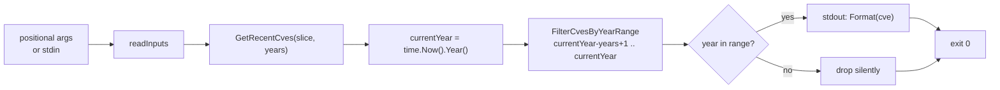

# cve filter recent

:::tip 📂 View Source
[`cmd/filter.go:75`](https://github.com/scagogogo/cve-skills/blob/main/cmd/filter.go#L75-L97) — open the cobra command definition on GitHub (lines L75–L97).
:::

Keep only the CVE identifiers whose year falls within the most recent N years — a rolling window anchored at the current calendar year — and emit the survivors one per line in standardized uppercase.

:::tip 🖥️ When to use
- Building a "recent vulnerabilities" view from a mixed list without hard-coding year boundaries — the window auto-advances with the clock.
- Trimming an imported CVE feed down to the last few years before reporting, so stale entries from a decade ago never reach the dashboard.
- Pre-filtering before `compare sort` or `filter dedup` so downstream stages process only a time-bounded subset.
:::

## Command syntax

```bash
cve filter recent --years [n] [cve-id...]
```

When positional `cve-id` arguments are supplied they are used directly; when none are given and stdin is piped, the command reads one identifier per non-empty line instead. The `--years` flag is required.

## Arguments and options

- `[cve-id...]` (positional, repeatable): One or more CVE identifiers, each passed as its own argument. Unlike some list subcommands, arguments are **not** split on commas — `"CVE-2022-1,CVE-2023-2"` is treated as a single malformed input, so pass items as separate arguments or via stdin.
- stdin fallback: When no positional arguments are supplied and stdin is piped, each non-empty line is treated as one input.
- `--years, -n` (int, required): Number of recent years to keep, counting the current year as the first. For example, `--years 2` keeps the current year and the previous year. A value of `0` is rejected as "required".
- The global `-q, --quiet` flag is inherited from the root command.

## Examples

Keep CVEs from the most recent 2 years — in 2026 the window is 2025–2026, so the 2023 entry is dropped:

```bash
$ cve filter recent --years 2 CVE-2020-1111 CVE-2022-2222 CVE-2023-3333 CVE-2025-4444
CVE-2025-4444
```

Use the short flag `-n` with a 3-year window — in 2026 the window is 2024–2026:

```bash
$ cve filter recent -n 3 CVE-2021-1111 CVE-2024-2222 CVE-2026-3333
CVE-2024-2222
CVE-2026-3333
```

Lowercase input is normalized to uppercase on output, and input order is preserved:

```bash
$ cve filter recent --years 1 cve-2026-0001 CVE-2024-9999
CVE-2026-0001
```

Feed a list from stdin to filter the output of another command:

```bash
$ printf 'CVE-2020-1111\nCVE-2026-3333\nCVE-2025-4444\n' | cve filter recent --years 2
CVE-2026-3333
CVE-2025-4444
```

Omitting `--years` fails immediately with a usage error and prints nothing to stdout:

```bash
$ cve filter recent CVE-2026-3333
error: --years is required
```

## How it works



## Corresponding Go API

This command is a thin wrapper around [`GetRecentCves`](/api/functions/get-recent-cves), which computes the window as `(currentYear - years + 1)` through `currentYear` and delegates to `FilterCvesByYearRange`. Each CVE is `Format`-ed to uppercase and kept when its extracted year is within the inclusive range. All time logic — `time.Now().Year()` evaluated at runtime — and the uppercase normalization live in the library. Call the Go function directly when you need the filtered slice in code rather than printed text.

## Exit codes and output

- Exit code `0`: the command ran to completion. Out-of-window CVEs are **dropped, not errors** — a list where nothing matches still exits `0` and prints nothing.
- Exit code `1`: either `--years` was not supplied (or was `0`), printing `error: --years is required` to stderr; or no input was supplied (neither positional arguments nor piped stdin), in which case nothing is printed.
- stdout: one line per surviving CVE, in first-seen input order. Each line is the standardized uppercase form `CVE-YYYY-NNNNN`.
- stderr: only the usage error above. Filtered-out entries produce no stderr noise.

## Notes

- The window is anchored to the **current calendar year** via `time.Now().Year()`, so `--years 2` always means "this year and last year" and advances automatically — no need to bump flags each January.
- `--years` counts inclusively: `--years 1` keeps only the current year, `--years 2` keeps the current and previous year, and so on. The lower bound is `currentYear - years + 1`.
- A CVE dated for a future year (beyond `currentYear`) is never kept — the upper bound is the current year, not a future one.
- Duplicates are **not** merged and order is **not** sorted — pipe through `cve filter dedup` or `cve compare sort` if you need that.
- Arguments are not split on commas; pass each CVE as a separate argument or one per stdin line.
- Invalid identifiers are not validated out of the list — their year is extracted after `Format`, and if extraction yields `0` they fall outside the window and are dropped silently. For strict validation first, run `cve filter-valid`.

## Internal Implementation

The `filterRecentCmd` cobra command (`cmd/filter.go:75`) runs a small, linear pipeline inside its `Run` closure:

- **Flag parsing**: `years, _ := cmd.Flags().GetInt("years")` reads the required `-n/--years` int flag registered in `init()` at `cmd/filter.go:158`. The returned error is intentionally discarded; a missing or zero value is caught by the explicit `if years == 0` guard below it.
- **Required-flag guard**: when `years == 0`, the command writes `error: --years is required` to stderr via `fmt.Fprintln(os.Stderr, ...)` and calls `os.Exit(1)` immediately — no further processing, nothing on stdout.
- **Input gathering**: `inputs := readInputs(args)` (helper at `cmd/helpers.go:11`) returns the positional `args` slice verbatim when non-empty; otherwise, when stdin is piped (not a char device, checked via `os.Stdin.Stat()`), it scans line by line and collects every non-empty line. An empty `inputs` slice triggers `os.Exit(1)` with no output.
- **Library call and output**: `filtered := cvepkg.GetRecentCves(inputs, years)` computes the rolling window `(currentYear - years + 1)` .. `currentYear` (using `time.Now().Year()` inside `filter.go:187`) and delegates to `FilterCvesByYearRange`, which `Format`s each entry to uppercase and keeps those whose extracted year is within the inclusive range. The loop `for _, c := range filtered { fmt.Println(c) }` then prints one survivor per line to stdout. The command never sorts or deduplicates; output order mirrors first-seen input order.

## Argument Flow

```text
+-------------------+     +-----------------------------+     +-------------------------------+
| CLI invocation    |     | cobra flag parse            |     | Required-flag guard           |
| cve filter recent | --> | years = GetInt("years")    | --> | if years == 0:                |
| --years N [ids..] |     | (error discarded)           |     |   stderr "error: --years ..." |
+-------------------+     +-----------------------------+     |   os.Exit(1)                  |
                                                              +---------------+---------------+
                                                                              | years != 0
                                                                              v
                                            +-----------------------------------+-------------------------------+
                                            | readInputs(args)  (cmd/helpers.go:11)                         |
                                            |  args non-empty? -> return args                               |
                                            |  else stdin piped (not TTY)? -> scan non-empty lines         |
                                            |  else -> return nil                                          |
                                            +-------------------------------+-------------------------------+
                                                                            | inputs
                                                                            v
                                            +-------------------------------+-------------------------------+
                                            | if len(inputs) == 0: os.Exit(1) (no output)                  |
                                            +-------------------------------+-------------------------------+
                                                                            | inputs
                                                                            v
                  +---------------------------------------------------------+-------------------------------+
                  | cvepkg.GetRecentCves(inputs, years)   (filter.go:187)                                  |
                  |   currentYear = time.Now().Year()                                                     |
                  |   return FilterCvesByYearRange(inputs, currentYear-years+1, currentYear)              |
                  +---------------------------------------------------------+-------------------------------+
                                                                            |
                                                                            v
                  +---------------------------------------------------------+-------------------------------+
                  | FilterCvesByYearRange  (filter.go:139)                                                 |
                  |   for each cve:                                                                        |
                  |     formattedCve = Format(cve)            (base.go:45, ToUpper+TrimSpace)             |
                  |     yearInt = ExtractCveYearAsInt(formattedCve)                                        |
                  |     keep when startYear <= yearInt <= endYear                                          |
                  +---------------------------------------------------------+-------------------------------+
                                                                            |
                                                                            v
                  +---------------------------------------------------------+-------------------------------+
                  | for _, c := range filtered { fmt.Println(c) }   -> stdout, one per line               |
                  | return from main -> exit code 0                                                       |
                  +---------------------------------------------------------------------------------------+
```

## Edge Cases

| Input | Behavior | Exit code / output |
| --- | --- | --- |
| No `--years` flag (or `--years 0`) | Required-flag guard fires before any input is read | Exit `1`; stderr `error: --years is required`; stdout empty |
| `--years` given, no positional args, stdin is a TTY (interactive, no pipe) | `readInputs` returns `nil` because `os.Stdin.Stat()` reports a char device | Exit `1`; no stdout, no stderr |
| `--years` given, no positional args, stdin piped but empty (e.g. `printf ''`) | `readInputs` scans zero non-empty lines, returns empty slice | Exit `1`; no stdout, no stderr |
| `--years` given, args present but none match the window | `GetRecentCves` returns an empty slice; the print loop emits nothing | Exit `0`; stdout empty |
| `--years` given, all args match the window | Every formatted CVE is printed in first-seen order | Exit `0`; one line per CVE on stdout |
| Lowercase or whitespace-padded input (e.g. `  cve-2026-1  `) | `Format` uppercases and trims before year extraction | Exit `0`; printed as `CVE-2026-1` if in window |
| Comma-joined pseudo-list (e.g. `"CVE-2026-1,CVE-2025-2"`) | Treated as one positional arg; `Format` cannot normalize it, year extraction yields `0`, falls outside the window | Exit `0`; dropped silently unless other args match |
| Future-year CVE (year > currentYear) | Above the inclusive upper bound `currentYear` | Exit `0`; dropped silently |
| Invalid identifier (e.g. `CVE-2026-` or `not-a-cve`) | `Format` leaves it mostly intact; `ExtractCveYearAsInt` returns `0`; `0` is below the lower bound | Exit `0`; dropped silently |
| Negative `--years` (e.g. `-n -1`) | `years != 0` passes the guard; window becomes `currentYear-(-1)+1 = currentYear+2` .. `currentYear`, an empty/inverted range | Exit `0`; everything dropped (no entry's year is both `<= currentYear` and `>= currentYear+2`) |

## Exit Codes

- **Exit `0`** — success path. Reached whenever `--years` is non-zero and at least one input is supplied (positional or piped). The command returns normally from `Run`; cobra then exits with `0`. Note that "no matches" is **not** a failure: an empty `filtered` slice still loops zero times and exits `0` with empty stdout. There is no explicit success message — survivors are the only stdout content.
- **Exit `1`** — failure path, triggered by two explicit `os.Exit(1)` calls in `Run`:
  1. `--years` missing or `0`: prints `error: --years is required\n` to **stderr** (via `fmt.Fprintln(os.Stderr, ...)`) and exits `1` before reading any input.
  2. Empty input (`len(inputs) == 0`, i.e. no positional args and no piped stdin): exits `1` with **no output** on either stream — no diagnostic is printed, the process simply terminates with code `1`.
- **stderr** — only the `error: --years is required` line above is ever written. Dropped, out-of-window, or invalid entries produce no stderr noise; they are silently omitted from stdout.
- The command does not return a `RunE` error, so cobra's own error/usage printing is not involved; all non-zero exits come from the explicit `os.Exit(1)` calls.

## Related commands

- [cve filter by-year](/cli/commands/filter-by-year) — single fixed year instead of a rolling window.
- [cve filter by-year-range](/cli/commands/filter-by-year-range) — explicit `--start`/`--end` boundaries when you need a non-rolling range.
- [cve filter dedup](/cli/commands/filter-dedup) — remove duplicates, often chained after `filter recent`.
- [cve filter-valid](/cli/commands/filter-valid) — drop malformed entries before year filtering.
- [CLI Reference](/cli) — full command tree and I/O conventions.
