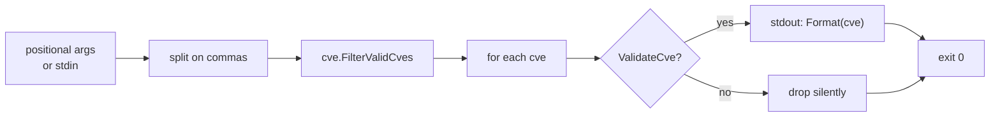

# cve filter-valid

:::tip 📂 View Source
[`cmd/validate_batch.go:36`](https://github.com/scagogogo/cve-skills/blob/main/cmd/validate_batch.go#L36-L55) — open the cobra command definition on GitHub (lines L36–L55).
:::

Filter a list of CVE identifiers down to **only the valid ones**, dropping every malformed or out-of-range entry silently and emitting the survivors one per line in standardized uppercase.

:::tip 🖥️ When to use
- Cleaning a noisy list before importing into a database or vulnerability tracker — bad rows are dropped without you writing a filter loop.
- Trimming the output of an extraction pipeline (`extract` → `filter-valid`) so downstream stages receive only well-formed CVEs.
- Normalizing mixed-case input (`cve-2022-1`, `CVE-2022-1`) into a single canonical form while simultaneously validating.
:::

## Command syntax

```bash
cve filter-valid <cve-list>
```

`<cve-list>` accepts the same flexible input shape shared by every list-taking subcommand: multiple positional arguments, comma-separated values within each argument, or — when no arguments are given — one item per line on stdin.

## Arguments and options

- `<cve-list>` (positional, repeatable): One or more CVE identifiers. Each argument is split further on commas, so `"CVE-2022-1,CVE-2022-2"` is equivalent to two separate arguments.
- stdin fallback: When no positional arguments are supplied and stdin is piped, each non-empty line is treated as an input (commas within a line are still split).
- This command defines **no flags** of its own. The global `-q, --quiet` flag is inherited from the root command.

## Examples

Filter a comma-separated list — only the valid identifiers survive, standardized to uppercase:

```bash
$ cve filter-valid "CVE-2022-12345,bad,CVE-2021-44228"
CVE-2022-12345
CVE-2021-44228
```

Pass items as separate arguments — the result is identical to the comma form:

```bash
$ cve filter-valid CVE-2022-12345 bad CVE-2021-44228
CVE-2022-12345
CVE-2021-44228
```

Lowercase and leading-zero entries are valid and are normalized to uppercase on output:

```bash
$ cve filter-valid "cve-2022-0001"
CVE-2022-0001
```

Out-of-range years and bad sequences are dropped silently — there is no failure reason line, unlike `validate-batch`:

```bash
$ cve filter-valid "CVE-1998-1,CVE-2099-1,CVE-2022-ABC,CVE-2022-12345"
CVE-2022-12345
```

Feed a list from stdin to clean the output of another command:

```bash
$ printf 'CVE-2021-44228\nnot-a-cve\ncve-2022-0\n' | cve filter-valid
CVE-2021-44228
```

## How it works



## Corresponding Go API

This command is a thin wrapper around [`FilterValidCves`](/api/functions/filter-valid-cves), which iterates the slice, tests each entry with `ValidateCve`, and appends `Format(cve)` for every passing entry. All validation logic — format check, year range `1999..currentYear`, positive sequence — and the uppercase normalization live in the library. Use the Go function directly when you need the filtered slice in code rather than printed text.

## Exit codes and output

- Exit code `0`: the command ran to completion. Invalid CVEs are **dropped, not errors** — a list with zero valid entries still exits `0` and prints nothing.
- Exit code `1`: no input was supplied (neither positional arguments nor piped stdin). The error `requires at least 1 argument (CVE list)` is printed to stderr.
- stdout: one line per surviving (valid) CVE, in first-seen input order. Each line is the standardized uppercase form — `CVE-YYYY-NNNNN` with surrounding whitespace trimmed.
- stderr: only the usage error above. Filtered-out entries produce no stderr noise.

## Notes

- Unlike `validate-batch`, this command **normalizes** survivors: `cve-2022-1` is emitted as `CVE-2022-1`. If you need the original input preserved verbatim, use `validate-batch` instead.
- An entry is kept only if it passes full validation: format `CVE-YYYY-NNNNN` (case-insensitive), year in `1999..currentYear`, and a positive integer sequence number.
- The upper year bound is `time.Now().Year()` evaluated at runtime, so a CVE dated for next year is dropped today but kept next year.
- Duplicates are **not** merged — `cve-2022-1` and `CVE-2022-1` both pass and both print as `CVE-2022-1`. Run `cve filter dedup` afterward if you need a deduplicated set.
- Order is preserved (first-seen); the command does not sort. Pipe through `cve compare sort` if you need ascending order.

## Internal Implementation

The cobra command `filterValidCmd` (defined at `cmd/validate_batch.go:36-L55`) drives a four-step `RunE`:

- **Arg capture via `readInputs(args)`** — the positional `args` slice is handed to `readInputs`, the shared helper that also falls back to stdin lines when no arguments are given. The returned `inputs` slice is checked for emptiness and the run aborts with `fmt.Errorf("requires at least 1 argument (CVE list)")` when nothing was supplied.
- **Comma flattening** — each element of `inputs` is split on `,` with `strings.Split` and appended onto a single `cveList []string`, so `"CVE-2022-1,CVE-2022-2"` and two bare arguments produce identical slices.
- **Library call `cve.FilterValidCves(cveList)`** — all validation and normalization logic lives in the library, not the command. The function returns `result`, a slice of already-standardized uppercase CVE strings that passed `ValidateCve`.
- **stdout output** — the command loops `for _, v := range result` and calls `fmt.Println(v)` for each survivor, one per line. There is no flag handling, no formatting switch, and no stderr write on the success path.

## Argument Flow

```text
+-------------------+     +-------------------+     +-------------------------+
| CLI args / stdin  | --> | readInputs(args)  | --> | inputs []string         |
+-------------------+     +-------------------+     +-------------------------+
                                                              |
                                                              v
                                                  +-----------------------------+
                                                  | len(inputs) == 0 ?          |
| no -->                          yes ----------> | return error:               |
|                                                 | "requires at least 1 arg"  |
|                                                 +-----------------------------+
|                                                              |
|                                                              v no
|                               +-------------------------------+
|                               | for _, input := range inputs: |
|                               |   cveList = append(cveList,   |
|                               |     strings.Split(input,",")  |
|                               |           ...)                |
|                               +-------------------------------+
|                                              |
|                                              v
|                               +-------------------------------+
|                               | cve.FilterValidCves(cveList)  |
|                               | -> result []string            |
|                               |   (uppercase, validated only) |
|                               +-------------------------------+
|                                              |
|                                              v
|                               +-------------------------------+
|                               | for _, v := range result:     |
|                               |   fmt.Println(v)   // stdout  |
|                               +-------------------------------+
|                                              |
|                                              v
|                                        return nil  (exit 0)
```

## Edge Cases

| Input | Behavior | Exit code / output |
|---|---|---|
| No args, no piped stdin | `readInputs` returns empty slice; `RunE` returns error | Exit `1`; stderr: `requires at least 1 argument (CVE list)` |
| Args supplied, all entries invalid (e.g. `bad,CVE-2099-1`) | `FilterValidCves` returns empty slice; loop body never runs | Exit `0`; stdout empty |
| Single comma-separated arg `"CVE-2022-1,CVE-2022-2"` | `strings.Split` flattens into two-element `cveList` | Exit `0`; both survivors printed |
| Lowercase input `cve-2022-1` | `ValidateCve` is case-insensitive; survivor normalized via `Format` | Exit `0`; stdout `CVE-2022-1` |
| Duplicate that differs only in case (`cve-2022-1`, `CVE-2022-1`) | Both pass validation; both appear in `result` | Exit `0`; `CVE-2022-1` printed twice |
| stdin with blank lines | `readInputs` skips empty lines; non-empty lines split on commas | Exit `0`; survivors printed in first-seen order |
| Mixed valid + invalid | Invalid entries silently absent from `result`; valid ones printed | Exit `0`; no stderr noise for dropped entries |

## Exit Codes

- **Exit `0`** — `RunE` returns `nil` after printing survivors. A run with zero valid entries still returns `nil` and exits `0`, because invalid CVEs are dropped rather than treated as errors.
- **Exit `1`** — the only failure path: `len(inputs) == 0`, where `RunE` returns `fmt.Errorf("requires at least 1 argument (CVE list)")`. cobra prints this message to stderr and exits non-zero.
- **stderr** — written only on the no-input failure path (cobra renders the returned error). Dropped invalid entries emit nothing on stderr; all survivor output goes to stdout via `fmt.Println`.

## Related commands

- [cve validate-batch](/cli/commands/validate-batch) — per-item verdict with failure reasons, input preserved verbatim.
- [cve validate](/cli/commands/validate) — per-item `formatted-cve<TAB>bool` output without dropping anything.
- [cve filter dedup](/cli/commands/filter-dedup) — remove duplicates, often chained after `filter-valid`.
- [CLI Reference](/cli) — full command tree and I/O conventions.
