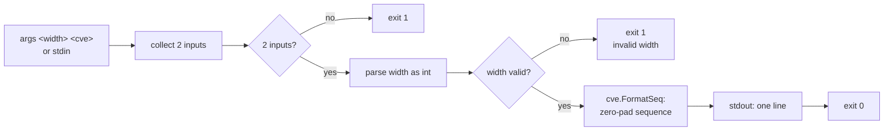

# cve format-seq

:::tip 📂 View Source
[`cmd/pattern.go:34`](https://github.com/scagogogo/cve-skills/blob/main/cmd/pattern.go#L34-L51) — open the cobra command definition on GitHub (lines L34–L51).
:::

Zero-pad a CVE's sequence number to a fixed width with leading zeros — `CVE-2022-123` becomes `CVE-2022-000123` at width 6.

:::tip 🖥️ When to use
- Standardizing CVE sequence numbers to a uniform width before database storage or reporting.
- Aligning CVE columns in tables and diffs so that short and long sequence numbers line up.
- Producing sortable, fixed-width identifiers from mixed-length CVE inputs scraped from advisories.
:::

## Command syntax

```bash
cve format-seq <width> <cve>
```

The first positional argument is the target width; the second is the CVE identifier to format. When no arguments are supplied and stdin is piped, the first non-empty line is read as the width and the second as the CVE.

## Arguments and options

- `<width>` (positional, required): Target width for the sequence number, parsed as an integer. Leading zeros are added when the original sequence is shorter; the sequence is left unchanged when it already meets or exceeds the width.
- `<cve>` (positional, required): The CVE identifier whose sequence number will be zero-padded. Only the second input is formatted — this command does **not** iterate multiple CVEs.
- stdin fallback: When no positional arguments are supplied and stdin is piped, each non-empty line is one input. Empty lines are skipped.
- This command defines **no flags** of its own. The global `-q, --quiet` flag is inherited from the root command.

## Examples

Pad a short sequence to width 6 so it sorts lexicographically:

```bash
$ cve format-seq 6 CVE-2022-123
CVE-2022-000123
```

Width 4 pads `CVE-2022-42` to four digits — already-four-digit sequences pass through:

```bash
$ cve format-seq 4 CVE-2022-42
CVE-2022-0042
$ cve format-seq 4 CVE-2022-1234
CVE-2022-1234
```

A width smaller than the existing sequence leaves it untouched — no truncation:

```bash
$ cve format-seq 2 CVE-2022-12345
CVE-2022-12345
```

Feed width and CVE from stdin via a pipeline — the five-digit sequence `44228` pads to six digits:

```bash
$ printf '6\nCVE-2021-44228\n' | cve format-seq
CVE-2021-044228
```

An invalid CVE is returned unchanged — `FormatSeq` only formats inputs that pass `IsCve`:

```bash
$ cve format-seq 6 not-a-cve
not-a-cve
```

## How it works



## Corresponding Go API

This command is a thin wrapper around [`FormatSeq`](/api/functions/format-seq). The library function first checks `IsCve`; if the input is not a valid CVE it returns the string unchanged. Otherwise it splits the CVE into year and sequence, parses the sequence as an integer, and reformats it with `fmt.Sprintf("CVE-%s-%0*d", year, width, seqInt)`. The CLI parses the width argument and prints the single result. Use the Go function directly when you need a fixed-width CVE string in code rather than printed output.

## Exit codes and output

- Exit code `0`: width and CVE were supplied and the result was printed.
- Exit code `1`: fewer than two inputs were supplied, or the width argument could not be parsed as an integer. An error message is written to stderr.
- stdout: exactly one line — the formatted CVE (or the input unchanged if it was not a valid CVE).
- stderr: error message when the width is invalid or inputs are missing; nothing on success.

## Notes

- Only `inputs[1]` is formatted — this command processes a **single** CVE, not a list. To format many CVEs, loop in shell or combine with `cve format`.
- The CVE must pass `IsCve` to be reformatted; invalid inputs are returned verbatim, so pair with `cve validate` or `cve filter-valid` when correctness matters.
- The width pads the sequence number only — the year and `CVE-` prefix are never modified.
- When the original sequence already has at least `width` digits, it is left unchanged (no truncation, no extra padding).
- When stdin is a terminal (not piped) and no arguments are given, the command exits `1` immediately rather than blocking on interactive input.

## Internal Implementation

The `formatSeqCmd` cobra command is defined in `cmd/pattern.go:34-51` with `Use: "format-seq <width> <cve>"` and a `RunE` handler. Its execution proceeds as follows:

- **Input collection**: `RunE` receives the raw `args []string` and immediately passes them to `readInputs(args)` (defined in `cmd/helpers.go:11`). When `args` is non-empty it is returned verbatim; otherwise the function checks `os.Stdin.Stat()` and, if stdin is not a character device (i.e. piped), scans it line by line, collecting every non-empty line into the returned slice. When stdin is a terminal and no args are given, `readInputs` returns `nil`, so `inputs` is empty.
- **Arity check**: `if len(inputs) < 2` returns `fmt.Errorf("requires width and CVE identifier")`. Because the handler is `RunE`, cobra prints this error to stderr and exits with code `1`; no flags are consulted.
- **Width parsing**: `strconv.Atoi(strings.TrimSpace(inputs[0]))` trims surrounding whitespace from the first input and parses it as an integer. A parse failure returns `fmt.Errorf("invalid width: %s", inputs[0])`, again surfaced via `RunE` as an exit-`1` error.
- **Library call and output**: `cve.FormatSeq(inputs[1], width)` is called with the second input and the parsed width; the single returned string is written to stdout via `fmt.Println(result)`. The command defines no flags of its own and does not loop — exactly one CVE is formatted per invocation.

## Argument Flow

```text
+-----------------------+   +-------------------------+   +------------------------+
| argv: <width> <cve>   |   | stdin (piped, lines)    |   | stdin = tty, no argv   |
+-----------+-----------+   +-----------+-------------+   +-----------+------------+
            |                           |                             |
            v                           v                             v
   +---------------------+     +---------------------+       +---------------------+
   | readInputs(args)    |     | readInputs(args)    |       | readInputs(args)    |
   | returns args as-is  |     | scans non-empty     |       | returns nil         |
   |                     |     | stdin lines         |       | (ModeCharDevice set) |
+-> inputs []string      |   +-> inputs []string     |     +-> inputs = nil        |
   +----------+----------+     +----------+----------+       +----------+----------+
              |                           |                             |
              +-----------+---------------+-------------+---------------+
                          |                             |
                          v                             v
               +--------------------+       +---------------------------+
               | len(inputs) < 2 ?  | yes   | return error              |
               |                    |-----> | "requires width and CVE   |
               +---------+----------+       |  identifier" -> exit 1    |
                         | no               +---------------------------+
                         v
            +---------------------------+   no   +--------------------------------+
            | strconv.Atoi(TrimSpace    |------> | return error                   |
            |   (inputs[0]))            |       | "invalid width: <inputs[0]>"   |
            +-----------+---------------+       | -> exit 1                      |
                        | yes                   +--------------------------------+
                        v
         +------------------------------+
         | cve.FormatSeq(inputs[1],     |
        >   width)                      |
         +--------------+---------------+
                        |
                        v
         +------------------------------+
         | fmt.Println(result) -> stdout|
         | return nil -> exit 0         |
         +------------------------------+
```

## Edge Cases

| Input | Behavior | Exit code / output |
| --- | --- | --- |
| No arguments, stdin is a terminal | `readInputs` returns `nil`; `len(inputs) < 2` triggers the arity error | Exit `1`; stderr: `requires width and CVE identifier` |
| No arguments, stdin piped but empty (or only blank lines) | All lines are skipped; `inputs` is empty | Exit `1`; stderr: `requires width and CVE identifier` |
| Only one input (e.g. `cve format-seq 6`) | `len(inputs) < 2` after `readInputs` | Exit `1`; stderr: `requires width and CVE identifier` |
| Width is not an integer (e.g. `cve format-seq abc CVE-2022-1`) | `strconv.Atoi` fails on `"abc"` | Exit `1`; stderr: `invalid width: abc` |
| Width with surrounding whitespace (e.g. `cve format-seq " 6 " CVE-2022-1`) | `strings.TrimSpace` strips it before parsing | Exit `0`; stdout: padded CVE |
| CVE is not a valid CVE (e.g. `cve format-seq 6 not-a-cve`) | `FormatSeq` sees `IsCve` fail and returns the string unchanged | Exit `0`; stdout: `not-a-cve` |
| Width smaller than the sequence length (e.g. `cve format-seq 2 CVE-2022-12345`) | `FormatSeq` does not truncate; the original sequence is preserved | Exit `0`; stdout: `CVE-2022-12345` |
| Extra positional arguments (e.g. `cve format-seq 6 CVE-2022-1 extra`) | Only `inputs[0]` and `inputs[1]` are used; extras are ignored | Exit `0`; stdout: padded CVE |
| stdin with comma-separated lines | `readInputs` does not split on commas for this command (unlike `filter-pattern`); each line is one input | Exit `1` if fewer than 2 non-empty lines, else exit `0` |

## Exit Codes

- **Exit `0`**: `readInputs` returned at least two inputs, `strconv.Atoi` parsed the width successfully, and `cve.FormatSeq` returned a string that was printed to stdout. The handler returns `nil`, so cobra exits `0`.
- **Exit `1`**: returned by cobra when `RunE` returns a non-nil error. Two cases are handled explicitly in source: missing inputs (`"requires width and CVE identifier"`) and an unparseable width (`"invalid width: <value>"`). In both cases cobra writes the error message to stderr.
- **stderr on success**: nothing is written; the handler returns `nil` without emitting to stderr.
- **No explicit `os.Exit` call**: the command relies entirely on cobra's `RunE` semantics — returning an error propagates to a non-zero process exit, and returning `nil` yields exit `0`. There is no `SilenceErrors`/`SilenceUsage` configuration in `formatSeqCmd`, so cobra may also print usage text alongside the error.

## Related commands

- [cve format](/cli/commands/format) — normalize casing and whitespace without changing the sequence width.
- [cve extract seq](/cli/commands/extract-seq) — extract the raw sequence segment before padding it.
- [cve validate](/cli/commands/validate) — full validation (format + year + sequence) before formatting.
- [CLI Reference](/cli) — full command tree and I/O conventions.
