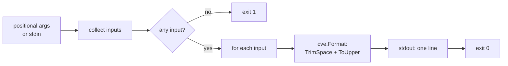

# cve format

:::tip 📂 View Source
[`cmd/format.go:11`](https://github.com/scagogogo/cve-skills/blob/main/cmd/format.go#L11-L31) — open the cobra command definition on GitHub (lines L11–L31).
:::

Normalize CVE identifiers to the standard uppercase form — trim surrounding whitespace and upper-case the `CVE` prefix — one identifier per line.

:::tip 🖥️ When to use
- Cleaning mixed-case or whitespace-padded CVEs scraped from advisories, tickets, or spreadsheets before storage.
- Preparing input for case-sensitive downstream tools that expect the canonical `CVE-YYYY-NNNNN` shape.
- A no-op-safe normalization step in a pipeline (`extract` → `format` → `validate`) so later stages see consistent casing.
:::

## Command syntax

```bash
cve format [cve-id...]
```

Inputs are read from positional arguments when any are given; otherwise the command reads CVE identifiers from stdin, one per line.

## Arguments and options

- `[cve-id...]` (positional, repeatable, optional): One or more CVE identifiers to format. Each argument is printed on its own line after normalization.
- stdin fallback: When no positional arguments are supplied and stdin is piped, each non-empty line is treated as one input. Empty lines are skipped.
- This command defines **no flags** of its own. The global `-q, --quiet` flag is inherited from the root command.

## Examples

Normalize a lowercase identifier and a whitespace-padded identifier in one call:

```bash
$ cve format cve-2022-12345 " CVE-2021-44228 "
CVE-2022-12345
CVE-2021-44228
```

Mixed-case inputs are upper-cased; the digit portion is left untouched:

```bash
$ cve format Cve-2022-1 cVe-2022-2
CVE-2022-1
CVE-2022-2
```

Feed identifiers from stdin to normalize the output of another command:

```bash
$ printf 'cve-2021-44228\n cve-2022-12345 \n' | cve format
CVE-2021-44228
CVE-2022-12345
```

Normalization is idempotent — already-canonical identifiers pass through unchanged:

```bash
$ cve format CVE-2022-12345
CVE-2022-12345
```

The command does not validate the CVE — any non-empty string is trimmed and upper-cased:

```bash
$ cve format " not-a-cve "
NOT-A-CVE
```

## How it works



## Corresponding Go API

This command is a thin wrapper around [`Format`](/api/functions/format), which returns `strings.ToUpper(strings.TrimSpace(cve))`. The CLI simply iterates the inputs and prints the formatted result for each. All transformation logic lives in the library — use the Go function directly when you need normalized strings in code rather than printed lines. Note that `Format` performs **no validation**: it formats any string, valid CVE or not.

## Exit codes and output

- Exit code `0`: at least one input was supplied and every line was printed.
- Exit code `1`: no input was supplied — neither positional arguments nor non-empty piped stdin. No message is printed.
- stdout: one formatted CVE per input line, preserving input order.
- stderr: nothing. This command writes only to stdout.

## Notes

- `Format` trims leading/trailing whitespace and upper-cases the whole string. It does **not** validate format, year, or sequence — pair it with `cve validate` or `cve filter-valid` when correctness matters.
- Input is not deduplicated; each input line produces exactly one output line.
- When stdin is a terminal (not piped) and no arguments are given, the command exits `1` immediately rather than blocking on interactive input.
- For zero-padding the sequence number to a fixed width, use `cve format-seq` instead.

## Internal Implementation

The `formatCmd` cobra command (defined at `cmd/format.go:11-L31`) runs through a short, flag-free pipeline:

- **Argument intake**: `Run` receives `args []string` directly from cobra's positional parsing — no flags are registered on this command, so `cmd` is only used as a receiver. It immediately delegates to `readInputs(args)` (`cmd/helpers.go:11`), which returns `args` verbatim when non-empty, otherwise scans piped stdin line by line (skipping empty lines) and returns `nil` when stdin is a terminal (`os.ModeCharDevice`).
- **Empty-input guard**: `if len(inputs) == 0 { os.Exit(1) }` short-circuits before any formatting. There is no usage message — the process simply exits `1`.
- **Library call**: for each input, `fmt.Println(cvepkg.Format(input))` invokes `github.com/scagogogo/cve-skills.Format`, which returns `strings.ToUpper(strings.TrimSpace(cve))`. The CLI holds no transformation logic of its own.
- **Output format**: one formatted string per line on stdout via `fmt.Println`, preserving input order. stderr is never written; no trailing summary is printed.

## Argument Flow

```text
+--------------------------+        +--------------------------+
| positional args          |        | piped stdin              |
| cve format A B " C "     |        | echo ... | cve format    |
+------------+-------------+        +------------+-------------+
             |                                   |
             v                                   v
      +------+------------------------------------+------+
      | readInputs(args)            cmd/helpers.go:11    |
      |  args non-empty? -> return args verbatim         |
      |  else if stdin is pipe? -> scan lines, drop ""   |
      |  else (terminal)        -> return nil            |
      +----------------------+---------------------------+
                             |
                             v
                  inputs []string
                             |
                  +----------+----------+
                  | len==0?  |          |
                  +----------+----------+
                  yes|              no|
                     v                v
              os.Exit(1)     for _, input := range inputs
                                  |
                                  v
                         cvepkg.Format(input)
                         = ToUpper(TrimSpace(input))
                                  |
                                  v
                         fmt.Println -> stdout
                                  |
                                  v
                            exit 0 (default)
```

## Edge Cases

| Input | Behavior | Exit code / output |
| --- | --- | --- |
| No args, stdin is a terminal (interactive) | `readInputs` detects `os.ModeCharDevice` and returns `nil`; the empty-input guard fires | Exit `1`, no stdout, no stderr |
| No args, empty piped stdin (`printf '' \| cve format`) | Scanner yields no non-empty lines; `inputs` is `nil` | Exit `1`, no output |
| No args, piped stdin with only blank lines | Every line is `""` and skipped; `inputs` ends `nil` | Exit `1`, no output |
| Whitespace-only input (`"   "`) | Not empty after `TrimSpace` only inside `Format`; `readInputs` keeps the raw arg, `Format` trims it to `""` and prints an empty line | Exit `0`, one blank line on stdout |
| Invalid CVE string (`" not-a-cve "`) | No validation in `Format`; trimmed and upper-cased | Exit `0`, prints `NOT-A-CVE` |
| Mixed-case digits (`"cVe-2022-007"`) | Whole string upper-cased, digits unaffected | Exit `0`, prints `CVE-2022-007` |
| Duplicate inputs (`CVE-2022-1 CVE-2022-1`) | No deduplication; each input emits one line | Exit `0`, two identical lines |
| Already-canonical input (`CVE-2022-12345`) | `Format` is idempotent | Exit `0`, prints `CVE-2022-12345` |
| Very long stdin line (>64 KiB) | `bufio.Scanner`'s default token limit is exceeded | Scan loop aborts, partial result may be missing; no explicit error, exit `0` if any line printed |

## Exit Codes

- **Success — exit `0`**: when at least one input reaches the `for` loop, `fmt.Println` prints each formatted line and `Run` returns normally; cobra's default behavior then exits the process with code `0`.
- **No input — exit `1`**: `os.Exit(1)` is called explicitly when `len(inputs) == 0` (no positional args and no non-empty piped stdin). This is the only explicit exit-code branch in the source.
- **stderr**: the command never writes to stderr in either path. Failure is signaled solely by the non-zero exit code — there is no error message and no usage hint.
- **Scan errors**: `readInputs` ignores the `bufio.Scanner` error state, so an interrupted or oversized stdin read does not surface as a distinct exit code; it is folded into whichever branch the collected `inputs` triggers.

## Related commands

- [cve format-seq](/cli/commands/format-seq) — zero-pad the sequence number to a fixed width.
- [cve validate](/cli/commands/validate) — full validation (format + year + sequence) with `formatted-cve<TAB>bool` output.
- [cve filter-valid](/cli/commands/filter-valid) — keep only the valid CVEs from a list.
- [CLI Reference](/cli) — full command tree and I/O conventions.
