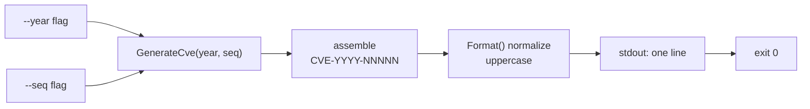

# cve generate cve

:::tip 📂 View Source
[`cmd/generate.go:19`](https://github.com/scagogogo/cve-skills/blob/main/cmd/generate.go#L19-L35) — open the cobra command definition on GitHub (lines L19–L35).
:::

Assemble a canonical `CVE-YYYY-NNNNN` identifier from an explicit year and sequence number — a deterministic generator that prints exactly one normalized CVE string per invocation.

:::tip 🖥️ When to use
- Constructing a CVE identifier from components you already hold (year + sequence) for reports, scripts, or pipelines.
- Normalizing user-supplied year/sequence pairs into the official uppercase `CVE-YYYY-NNNNN` form.
- Building deterministic test fixtures where the same inputs must always yield the same CVE string.
:::

## Command syntax

```bash
cve generate cve --year [year] --seq [sequence]
```

Both flags are required. The short aliases `-y` and `-s` may be used in place of `--year` and `--seq` respectively. The command takes no positional arguments.

## Arguments and options

- `--year, -y` (int, required): the CVE year, e.g. `2022`. There is no default — omitting it (or leaving it `0`) triggers the required-flag error.
- `--seq, -s` (int, required): the CVE sequence number, e.g. `12345`. No default; leaving it `0` triggers the same error.
- The command inherits the global `-q, --quiet` flag from the root command but otherwise defines no other options.
- No positional arguments are accepted; year and sequence are read solely from the two flags.

## Examples

Generate a well-known historical CVE:

```bash
$ cve generate cve --year 2021 --seq 44228
CVE-2021-44228
```

Use the short flag aliases for brevity:

```bash
$ cve generate cve -y 2022 -s 12345
CVE-2022-12345
```

Omitting a required flag prints an error and produces no CVE:

```bash
$ cve generate cve --year 2022
error: --year and --seq are required
```

Generate a sequence of CVEs by combining the command with a shell loop over sequence numbers:

```bash
$ for s in 100 101 102; do cve generate cve -y 2023 -s "$s"; done
CVE-2023-100
CVE-2023-101
CVE-2023-102
```

Feed generated identifiers straight into another subcommand for a deterministic pipeline:

```bash
$ cve generate cve -y 2022 -s 12345 | cve filter-valid
CVE-2022-12345	true
```

## How it works



## Corresponding Go API

This command is a thin wrapper around [`GenerateCve`](/api/functions/generate-cve), which takes `year int` and `seq int` and returns a `string`. The library function builds the literal `CVE-<year>-<seq>` via `fmt.Sprintf` and then passes it through `Format()` to normalize the result to canonical uppercase form. The CLI reads the two flags, validates that neither is zero, and prints the returned string. Call the Go function directly when you need the CVE as a string value in code rather than as printed output — it makes no I/O assumptions and is safe to compose with other library helpers.

## Exit codes and output

- Exit code `0`: the command succeeded and printed one identifier.
- If either `--year` or `--seq` is omitted (or left at the default `0`), the command prints `error: --year and --seq are required` to stdout and returns without generating a CVE — note that this path still exits `0` because the error is handled inline rather than via `cobra`'s error machinery.
- stdout: exactly one line — either the generated `CVE-YYYY-NNNNN` identifier or the error message above.
- stderr: nothing. This command writes only to stdout.

## Notes

- ⚠️ The generator performs **no validation** of the year or sequence beyond the zero-check: it does not verify that the year falls within the CVE program's historical range (1999 onward), nor that the sequence has a realistic digit count. Arbitrary integers are accepted and formatted as-is.
- The sequence is not zero-padded — `--seq 100` yields `CVE-2023-100`, not `CVE-2023-00100`. CVE sequence numbers are not fixed-width.
- Output is always uppercase (`CVE-`), regardless of how flags were supplied, because the result passes through `Format()`.
- For a non-deterministic placeholder CVE using the current year and a random sequence, use `cve generate fake` instead.

## Internal Implementation

The `generateCveCmd` cobra command (defined at `cmd/generate.go:19-35`) wires its `Run` function directly to the library — no intermediate service layer. The behavior breaks down into four points:

- **Flag intake, not positional args**: `Run` ignores the `args []string` slice entirely. It pulls the year and sequence from the cobra flag set via `cmd.Flags().GetInt("year")` and `cmd.Flags().GetInt("seq")` (lines 27-28). The `0` default registered in `init()` (lines 56-57) is the sentinel that drives validation.
- **Inline zero-check validation**: rather than marking the flags `required` with cobra's built-in mechanism, `Run` checks `if year == 0 || seq == 0` (line 29). When either is zero it prints `error: --year and --seq are required` through `fmt.Println` and `return`s early — no CVE is generated and cobra's error machinery is bypassed.
- **Library delegation**: on the happy path `Run` calls `cvepkg.GenerateCve(year, seq)` (line 33), the imported `github.com/scagogogo/cve-skills` package. That function assembles the literal `CVE-<year>-<seq>` via `fmt.Sprintf` and normalizes it through `Format()` before returning a `string`.
- **Output formatting**: the returned string is written to stdout with `fmt.Println` (line 33) — a single trailing newline, no decoration, no logging. stderr is never touched on this path.

## Argument Flow

```text
+------------------+     +------------------------+     +-----------------------------+
| CLI invocation   |     | cobra flag parsing     |     | Run(cmd, args)              |
| cve generate cve | --> | --year/-y -> int year  | --> | year, _ := GetInt("year")   |
| --year 2022      |     | --seq/-s  -> int seq   |     | seq, _  := GetInt("seq")    |
| --seq 12345      |     | (defaults: 0)          |     |                             |
+------------------+     +------------------------+     +--------------+--------------+
                                                                        |
                                                                        v
                                                          +-------------+--------------+
                                                          | if year == 0 || seq == 0   |
                                                          +----+----------------+------+
                                                               | yes            | no
                                                               v                v
                                          +--------------------+   +-----------+----------------+
                                          | fmt.Println(error) |   | cvepkg.GenerateCve(year,seq)|
                                          | return (no CVE)    |   |  -> fmt.Sprintf CVE-...-.. |
                                          +--------------------+   |  -> Format() uppercase     |
                                                                   +-----------+----------------+
                                                                               |
                                                                               v
                                                                   +-----------+-----------+
                                                                   | fmt.Println(cve string)|
                                                                   | stdout: CVE-YYYY-NNNNN |
                                                                   +-----------------------+
```

## Edge Cases

| Input | Behavior | Exit code / output |
| --- | --- | --- |
| Both flags omitted (`cve generate cve`) | `year` and `seq` default to `0`; zero-check fires | stdout: `error: --year and --seq are required`; exit `0` (inline return, not cobra error) |
| Only `--year` provided | `seq` stays `0`; zero-check fires on `seq` | stdout: `error: --year and --seq are required`; exit `0` |
| Only `--seq` provided | `year` stays `0`; zero-check fires on `year` | stdout: `error: --year and --seq are required`; exit `0` |
| `--year 0 --seq 12345` | explicit zero is indistinguishable from omitted | stdout: `error: --year and --seq are required`; exit `0` |
| `--year 2022 --seq 12345` | happy path, library called | stdout: `CVE-2022-12345`; exit `0` |
| Negative values (e.g. `--year -1 --seq 5`) | not zero, so zero-check passes; formatted as-is by `GenerateCve` | stdout: `CVE--1-5`; exit `0` (no range validation) |
| Extra positional args (`cve generate cve foo`) | `args` is ignored by `Run`; flags still drive output | depends on flags; `foo` has no effect |
| Stdin piped in | not read — command consumes no stdin | stdin is ignored entirely |
| Empty result | cannot occur — `GenerateCve` always returns a non-empty string when the zero-check passes | stdout always has one line |

## Exit Codes

- **Success (exit `0`)**: when both `--year` and `--seq` are non-zero, `Run` calls `cvepkg.GenerateCve` and prints the resulting `CVE-YYYY-NNNNN` to stdout. The process exits `0` because `Run` returns normally and cobra reports no error.
- **Missing-flag path (also exit `0`)**: when the zero-check trips, `Run` prints `error: --year and --seq are required` to **stdout** (note: not stderr) via `fmt.Println` and returns early. Because the error is handled inline rather than propagated through `cmd.RunE`/`cobra`'s error handling, cobra sees a clean return and the process still exits `0`. There is no non-zero exit code path in this command's source.
- **stderr output**: none. The command writes exclusively to stdout in both branches; `cobra`'s default error printing is never triggered because no error is returned to the framework.

## Related commands

- [cve generate fake](/cli/commands/generate-fake) — generate a random fake CVE using the system year (non-deterministic).
- [cve format](/cli/commands/format) — normalize an existing CVE string to canonical form.
- [cve extract-seq](/cli/commands/extract-seq) — pull the sequence number out of a CVE for use as `--seq` here.
- [cve validate](/cli/commands/validate) — full validation (format + year + sequence) of any CVE.
- [CLI Reference](/cli) — full command tree and I/O conventions.
