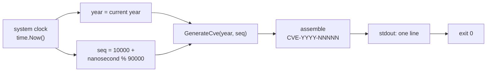

# cve generate fake

:::tip 📂 View Source
[`cmd/generate.go:37`](https://github.com/scagogogo/cve-skills/blob/main/cmd/generate.go#L37-L49) — open the cobra command definition on GitHub (lines L37–L49).
:::

Generate a fake CVE identifier using the current system year and a random sequence number — printed as a single canonical `CVE-YYYY-NNNNN` string with no flags or arguments required.

:::tip 🖥️ When to use
- Producing placeholder CVE identifiers for unit tests, mock datasets, or demo scripts.
- Seeding sample data during development when you need a realistic-looking CVE without a real assignment.
- Quick one-off generation for documentation examples or ad-hoc debugging sessions.
:::

## Command syntax

```bash
cve generate fake
```

The command takes no arguments and no flags — it reads only the system clock and prints one identifier per invocation.

## Arguments and options

- This command defines **no flags** and accepts **no positional arguments**. It inherits the global `-q, --quiet` flag from the root command.
- The year is taken from the system clock (`time.Now().Year()`); the sequence is randomized as `10000 + (nanosecond % 90000)`, yielding a five-digit sequence in the range `10000`–`99999`.

## Examples

Generate one fake CVE — output is non-deterministic, so each run differs:

```bash
$ cve generate fake
CVE-2026-47193
```

Generate several identifiers in a loop for sample data:

```bash
$ for i in $(seq 1 3); do cve generate fake; done
CVE-2026-12804
CVE-2026-80251
CVE-2026-30577
```

Capture a fake identifier into a shell variable for use in a test:

```bash
$ FAKE=$(cve generate fake) && echo "using $FAKE as placeholder"
using CVE-2026-47193 as placeholder
```

Pipe several fakes into another command for a quick end-to-end pipeline test:

```bash
$ for i in $(seq 1 2); do cve generate fake; done | cve filter-valid
CVE-2026-12804	true
CVE-2026-80251	true
```

Because the year follows the system clock, running it in a different calendar year changes the year segment:

```bash
# run in 2027
$ cve generate fake
CVE-2027-21938
```

## How it works



## Corresponding Go API

This command is a thin wrapper around [`GenerateFakeCve`](/api/functions/generate-fake-cve), which takes no arguments and returns a `string`. The library function reads the current year from `time.Now().Year()`, derives a random five-digit sequence from `time.Now().Nanosecond()`, and delegates to [`GenerateCve`](/api/functions/generate-cve) to assemble the final identifier. The CLI simply prints the returned string. Use the Go function directly when you need a fake CVE as a string value in code rather than as printed output.

## Exit codes and output

- Exit code `0`: the command always succeeds — it has no failure path.
- stdout: exactly one line, the generated `CVE-YYYY-NNNNN` identifier.
- stderr: nothing. This command writes only to stdout.

## Notes

- ⚠️ The generated identifier is a **fake** — it does not correspond to any real CVE record and must never be used as a genuine reference in production data, advisories, or reports.
- The sequence is derived from `time.Now().Nanosecond()`, which is **not cryptographically random** and is not seeded across processes; do not rely on it for uniqueness or unpredictability. Two rapid invocations may collide on fast hardware.
- The year segment tracks the system clock, so output changes across calendar years and is environment-dependent.
- For a deterministic identifier with a fixed year and sequence, use `cve generate cve --year [year] --seq [sequence]` instead.

## Internal Implementation

The `fake` subcommand is defined as a `cobra.Command` with `Use: "fake"` and registered under `generateCmd` in `init()` (see `cmd/generate.go:37` and `cmd/generate.go:54`). Its `Run` function is minimal:

- **No argument or flag parsing** — the `Run` signature receives `cmd *cobra.Command, args []string` but never reads either; any positional arguments passed on the command line are silently ignored.
- **Single library call** — it invokes `cvepkg.GenerateFakeCve()` (alias for `github.com/scagogogo/cve-skills`), which returns a `string` containing the assembled `CVE-YYYY-NNNNN` identifier.
- **Output to stdout** — the returned string is written via `fmt.Println(...)`, appending a trailing newline so each invocation yields exactly one line on stdout.
- **No return value handling** — because `GenerateFakeCve` returns only a `string` (no error), the `Run` function has no error branch and never calls `os.Exit` with a non-zero code.

## Argument Flow

```text
+--------------------------+
| command line:            |
|   cve generate fake      |
|   (extra args ignored)   |
+------------+-------------+
             |
             v
+--------------------------+
| cobra dispatches to      |
| generateFakeCmd.Run      |
| (cmd, args unused)       |
+------------+-------------+
             |
             v
+--------------------------+
| cvepkg.GenerateFakeCve() |
|   year  = time.Now().Year()
|   seq   = 10000 +         |
|     (nanosecond % 90000)  |
|   -> GenerateCve(year,seq)
+------------+-------------+
             |
             v
+--------------------------+
| fmt.Println(result)      |
|   one line to stdout     |
+------------+-------------+
             |
             v
+--------------------------+
| process exits 0          |
+--------------------------+
```

## Edge Cases

| Input | Behavior | Exit code / output |
| --- | --- | --- |
| `cve generate fake` (no args) | Nominal path — calls `GenerateFakeCve()` and prints one identifier. | Exit `0`; stdout: `CVE-YYYY-NNNNN`. |
| `cve generate fake extra args` | Positional `args` are received by `Run` but never read; they are silently ignored. | Exit `0`; stdout: one `CVE-YYYY-NNNNN` line. |
| `cve generate fake --year 2024` | `--year` is not a registered flag of `generateFakeCmd`; cobra's flag parser rejects it before `Run` is reached. | Exit non-zero (`1`); stderr: cobra "unknown flag" error plus usage. |
| `cve generate fake --quiet` | The inherited global `-q, --quiet` flag is parsed but `Run` does not consult it, so output is unchanged. | Exit `0`; stdout: one `CVE-YYYY-NNNNN` line. |
| Stdin piped in (`echo foo \| cve generate fake`) | The command never reads stdin; piped input is ignored. | Exit `0`; stdout: one `CVE-YYYY-NNNNN` line. |
| Two rapid invocations | Both derive the sequence from `time.Now().Nanosecond()`; on fast hardware they may produce identical or near-identical sequences. | Exit `0` each; possible duplicate stdout lines. |

## Exit Codes

- **Success (exit `0`)**: the only reachable outcome. `Run` calls `fmt.Println(cvepkg.GenerateFakeCve())` and returns normally; cobra then exits with code `0`.
- **Failure (non-zero)**: there is no explicit failure path in `Run` — it performs no validation and `GenerateFakeCve` returns only a `string`. A non-zero exit can only arise from cobra's own argument parser (for example, an unknown flag), in which case cobra prints a usage error to **stderr** and exits `1` before `Run` executes.
- **stderr on success**: nothing is written. The command emits output exclusively via `fmt.Println` to stdout.

## Related commands

- [cve generate cve](/cli/commands/generate-cve) — generate a CVE from an explicit `--year` and `--seq` (deterministic).
- [cve validate](/cli/commands/validate) — full validation (format + year + sequence) for any CVE.
- [cve filter-valid](/cli/commands/filter-valid) — keep only the valid CVEs from a list.
- [CLI Reference](/cli) — full command tree and I/O conventions.
