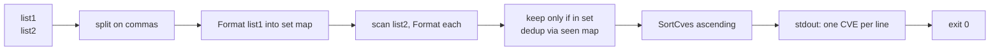

# cve intersect

:::tip 📂 View Source
[`cmd/set.go:11`](https://github.com/scagogogo/cve-skills/blob/main/cmd/set.go#L11-L28) — open the cobra command definition on GitHub (lines L11–L28).
:::

Keep only the CVEs that appear in **both** input lists — the intersection is sorted ascending and de-duplicated, so every shared identifier comes out exactly once.

:::tip 🖥️ When to use
- Finding the CVEs flagged by *both* an internal scanner and a vendor advisory, so the team can prioritize the overlap first.
- Reconciling two intelligence feeds to confirm which identifiers are corroborated by multiple sources.
- Producing a shortlist of CVEs that survived independent filtering passes, as a clean input for downstream commands such as `cve count-by-year`.
:::

## Command syntax

```bash
cve intersect <list1> <list2>
```

Both `<list1>` and `<list2>` are comma-separated CVE lists. Each is split on commas before the set operation, so `"CVE-2021-1,CVE-2022-2"` is equivalent to passing the two identifiers as separate tokens.

## Arguments and options

- `<list1>` (positional, required): The first CVE list. Commas inside the argument are treated as separators, so each argument may carry one or many CVEs.
- `<list2>` (positional, required): The second CVE list, parsed the same way as `<list1>`.
- stdin fallback: When no positional arguments are supplied and stdin is piped, each non-empty line is treated as an input. Because the intersection operation requires **two** lists, stdin must provide at least two lines — the first line is `<list1>`, the second is `<list2>`.
- This command defines **no flags** of its own. The global `-q, --quiet` flag is inherited from the root command.

## Examples

Find the CVEs common to two comma-separated lists — only the shared identifier survives:

```bash
$ cve intersect "CVE-2021-1,CVE-2022-2" "CVE-2022-2,CVE-2023-3"
CVE-2022-2
```

Case differences are normalized away — `Format` upper-cases the `CVE` prefix before comparing, so a lowercase entry in one list still matches the uppercase entry in the other:

```bash
$ cve intersect "cve-2022-1,CVE-2022-2" "CVE-2022-1,CVE-2022-3"
CVE-2022-1
```

When the two lists share more than one CVE, the result is sorted ascending (year, then sequence) and each shared CVE appears only once even if it is duplicated within list2:

```bash
$ cve intersect "CVE-2024-1,CVE-2021-9,CVE-2022-5" "CVE-2022-5,CVE-2021-9,CVE-2021-9"
CVE-2021-9
CVE-2022-5
```

Feed both lists from stdin (first line = list1, second line = list2) to intersect the output of two upstream commands:

```bash
$ printf 'CVE-2021-1,CVE-2022-2\nCVE-2022-2,CVE-2023-3\n' | cve intersect
CVE-2022-2
```

An empty second list (or no overlap at all) yields an empty result and still exits `0`:

```bash
$ cve intersect "CVE-2022-3,CVE-2022-1" ""
$ echo "exit=$?"
exit=0
```

## How it works



## Corresponding Go API

This command is a thin wrapper around [`IntersectCves`](/api/functions/intersect-cves), which takes two `[]string` slices and returns the intersection as a sorted, de-duplicated `[]string`. Internally every identifier in list1 is run through `Format` and stored in a `set` map; list2 is then scanned and each `Format`-ed entry is kept only if it exists in that set, with a second `seen` map guaranteeing that duplicates within list2 are emitted once. The final slice is passed through `SortCves` so the output is always in ascending year-then-sequence order. Use the Go function directly when you need the shared slice in code rather than printed lines.

## Exit codes and output

- Exit code `0`: the intersection was computed and printed. An empty result (no overlap, or either list empty) prints nothing and still exits `0`.
- Exit code `1`: fewer than two inputs were supplied (neither two positional arguments nor two piped stdin lines). The error `requires exactly 2 arguments (two CVE lists)` is printed to stderr.
- stdout: one CVE per line, sorted ascending, de-duplicated. No output when the lists have no CVE in common.
- stderr: only the usage error above. Result lines never go to stderr.

## Notes

- Each input is normalized with `Format` before the set operation, so `cve-2022-1`, `CVE-2022-1`, and `  CVE-2022-1 ` are all treated as the same CVE.
- The output is **always sorted** (year, then sequence) — the command is not order-preserving, even though list2 drives the scan order.
- Invalid or malformed tokens are not filtered out — they are formatted as-is and participate in the comparison. Run `cve filter-valid` first if you want only well-formed CVEs in the intersection.
- Compared to `cve union` (CVEs in *either* list) and `cve diff` (CVEs in list1 *but not* list2), `cve intersect` is the strictest of the three set operations — it never produces more entries than the smaller input list.

## Internal Implementation

The `intersectCmd` is a `cobra.Command` whose `RunE` drives the whole operation (`cmd/set.go:15-27`):

- **Argument intake**: `RunE` receives `args []string` from cobra and immediately delegates to `readInputs(args)` (`cmd/helpers.go:11`). When positional args exist they are returned verbatim; otherwise `readInputs` checks `os.Stdin` with `os.ModeCharDevice` and, if stdin is piped, scans it line by line with `bufio.Scanner`, collecting every non-empty line.
- **No flags**: the command defines no local flags and reads none. The two CVE lists come exclusively from positional args or stdin — `RunE` never calls `cmd.Flags()`.
- **Arity guard**: if `len(inputs) < 2`, `RunE` returns `fmt.Errorf("requires exactly 2 arguments (two CVE lists)")` without doing any further work.
- **Library call + output**: each of `inputs[0]` and `inputs[1]` is split on commas via `strings.Split(..., ",")` into `list1` and `list2`, then `cve.IntersectCves(list1, list2)` is called. The returned `[]string` is printed with `fmt.Println(v)` — one CVE per line — and `nil` is returned so the process exits `0`.

## Argument Flow

```text
+----------------------+    readInputs(args)
| CLI args (positional)|------------------------+
|  <list1>   <list2>   |                        |
+----------------------+                        |
                                                v
+----------------------+                +----------------------+
| stdin (no args)      |  line scan     | inputs []string      |
|  line1 -> list1      |--------------->|  inputs[0]=list1     |
|  line2 -> list2      |  non-empty     |  inputs[1]=list2     |
+----------------------+                +----------------------+
                                                |
                                  len(inputs) < 2 ?  ---> error
                                                |             |
                                                v             v
                                +-------------------+   +----------------+
                         strings.Split(",", -)    |   | return error   |
                                +-------------------+   | "requires ...  |
                                                |       +----------------+
                                                v              |
                                  +-------------------+         |
                                  | cve.IntersectCves |         |
                                  | (Format+set+seen  |         |
                                  |  +SortCves)       |         |
                                  +-------------------+         |
                                                |               |
                                                v               v
                                  +-------------------+   os.Exit(1)
                                  | fmt.Println each  |
                                  |  result line      |
                                  +-------------------+
                                                |
                                                v
                                         exit 0 (stdout)
```

## Edge Cases

| Input | Behavior | Exit code / Output |
|---|---|---|
| No positional args, stdin is a TTY (not piped) | `readInputs` detects a character device and returns `nil`; `len(inputs) < 2` triggers the arity error | Exit `1`; stderr: `requires exactly 2 arguments (two CVE lists)` |
| No positional args, stdin piped with one non-empty line | `inputs` has length 1, so `len(inputs) < 2` | Exit `1`; stderr: `requires exactly 2 arguments (two CVE lists)` |
| No positional args, stdin piped with 3+ non-empty lines | Only `inputs[0]` and `inputs[1]` are used; extra lines are silently ignored | Exit `0`; stdout: the intersection of the first two lines |
| Empty list argument (e.g. `cve intersect "CVE-2021-1" ""`) | `strings.Split("", ",")` yields `[""]`; `IntersectCves` formats the empty token and finds no match in the set | Exit `0`; stdout: nothing |
| Lists with no CVE in common | `IntersectCves` returns an empty `[]string`; the `for` loop prints nothing | Exit `0`; stdout: nothing |
| Lowercase or whitespace-padded tokens (e.g. `cve-2022-1`, `  CVE-2022-1 `) | `Format` normalizes case and trims surrounding whitespace before the set comparison, so variant spellings still match | Exit `0`; stdout: the normalized intersection |
| Duplicates within list2 | The `seen` map inside `IntersectCves` emits each shared CVE only once | Exit `0`; stdout: de-duplicated, sorted |
| Malformed tokens (not real CVEs) | Not filtered — `Format` processes them as-is and they participate in the comparison | Exit `0`; stdout: includes malformed tokens that happen to match |

## Exit Codes

- **Exit `0`**: `RunE` returned `nil`. This covers every successful computation, including an empty result (no overlap, or an empty list argument) where stdout is simply empty.
- **Exit `1`**: `RunE` returned the error `requires exactly 2 arguments (two CVE lists)`. Because the root command sets `SilenceErrors: true` and `SilenceUsage: true` (`cmd/root.go:20-21`), cobra prints neither the error nor usage; the `Execute` wrapper (`cmd/root.go:24-28`) instead writes the error to stderr via `fmt.Fprintln(os.Stderr, err)` and calls `os.Exit(1)`. No result lines are written to stderr.
- **stdout vs stderr**: result CVEs are written only to stdout (one per line via `fmt.Println`); stderr receives only the arity error message above.

## Related commands

- [cve union](/cli/commands/union) — keep every CVE that appears in either list.
- [cve diff](/cli/commands/diff) — keep the CVEs in list1 that are absent from list2.
- [cve filter dedup](/cli/commands/filter-dedup) — remove duplicates from a single list, preserving first-seen order.
- [cve compare sort](/cli/commands/compare-sort) — sort a single list ascending.
- [CLI Reference](/cli) — full command tree and I/O conventions.
