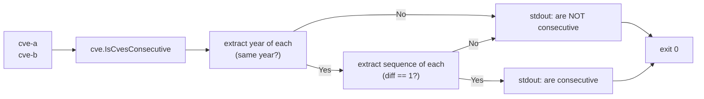

# cve is-consecutive

:::tip 📂 View Source
[`cmd/range.go:32`](https://github.com/scagogogo/cve-skills/blob/main/cmd/range.go#L32-L49) — open the cobra command definition on GitHub (lines L32–L49).
:::

Check whether two CVE identifiers are consecutive — that is, they share the same year and their sequence numbers differ by exactly 1.

:::tip 🖥️ When to use
- Deciding whether a pair of CVEs can be merged into a single `to` / `..` range expression before calling `cve parse-range`.
- Spotting adjacency in a sorted CVE list to detect contiguous identifier runs.
- Validating that two CVEs are truly neighbors (not merely same-year) before building range strings from pairs.
:::

## Command syntax

```bash
cve is-consecutive <cve-a> <cve-b>
```

The command takes exactly two positional CVE identifiers and prints a single human-readable line stating whether they are consecutive. It defines no flags of its own; the global `-q, --quiet` flag is inherited from the root command.

## Arguments and options

- `<cve-a>` (positional, required): The first CVE identifier, e.g. `CVE-2022-12345`.
- `<cve-b>` (positional, required): The second CVE identifier, e.g. `CVE-2022-12346`.
- stdin fallback: When no positional arguments are supplied and stdin is piped, each non-empty line is treated as an input. Because this command requires **exactly two** CVEs, stdin must provide at least two lines — the first line is `<cve-a>`, the second is `<cve-b>`.
- This command defines **no flags** of its own. The global `-q, --quiet` flag is inherited from the root command.

## Examples

Two CVEs from the same year with adjacent sequence numbers are consecutive:

```bash
$ cve is-consecutive CVE-2022-12345 CVE-2022-12346
CVE-2022-12345 and CVE-2022-12346 are consecutive
```

Argument order does not matter — `is-consecutive` is symmetric:

```bash
$ cve is-consecutive CVE-2022-12346 CVE-2022-12345
CVE-2022-12346 and CVE-2022-12345 are consecutive
```

Same year but sequence numbers differ by more than 1 — not consecutive:

```bash
$ cve is-consecutive CVE-2022-12345 CVE-2022-12347
CVE-2022-12345 and CVE-2022-12347 are NOT consecutive
```

Different year, even with the same sequence number — not consecutive:

```bash
$ cve is-consecutive CVE-2022-12345 CVE-2023-12345
CVE-2022-12345 and CVE-2023-12345 are NOT consecutive
```

Identical CVEs or unparseable input are never consecutive (a CVE is not adjacent to itself, and malformed input short-circuits to false):

```bash
$ cve is-consecutive CVE-2022-12345 CVE-2022-12345
CVE-2022-12345 and CVE-2022-12345 are NOT consecutive
$ cve is-consecutive CVE-2022-12345 not-a-cve
CVE-2022-12345 and not-a-cve are NOT consecutive
```

## How it works



## Corresponding Go API

This command is a thin wrapper around [`IsCvesConsecutive`](/api/functions/is-cves-consecutive), which takes two CVE strings and returns a `bool`. Internally it extracts each CVE's year via `ExtractCveYearAsInt` and short-circuits to `false` if either year is `0` (unparseable) or the two years differ; otherwise it extracts the sequences via `ExtractCveSeqAsInt` and returns `true` only when their difference is exactly `1` or `-1` — so the check is symmetric in argument order. Use the Go function directly when you need the boolean result in code rather than a printed line.

## Exit codes and output

- Exit code `0`: the check ran and a single result line was printed — regardless of whether the answer is "consecutive" or "NOT consecutive". A negative answer is a normal result, not an error.
- Exit code `1`: fewer than two inputs were supplied (neither two positional arguments nor two piped stdin lines). The error `requires exactly 2 CVE identifiers` is printed to stderr.
- stdout: exactly one line — either `<cve-a> and <cve-b> are consecutive` or `<cve-a> and <cve-b> are NOT consecutive`.
- stderr: only the usage error above. The result line never goes to stderr.

## Notes

- "Consecutive" means **adjacent**: same year and sequence numbers differing by exactly 1. Same year alone is not enough — `CVE-2022-12345` and `CVE-2022-12347` are NOT consecutive.
- A CVE is not consecutive with itself: `IsCvesConsecutive("CVE-2022-12345", "CVE-2022-12345")` returns false (the difference is 0).
- The check is symmetric — swapping the two arguments yields the same result, since the sequence difference is tested as `1` or `-1`.
- Invalid or malformed inputs never cause an error or non-zero exit; they short-circuit to "NOT consecutive" because year/sequence extraction returns `0`.
- To expand a range of **more than two** CVEs, use `cve parse-range` instead — `is-consecutive` only answers the pairwise adjacency question.

## Internal Implementation

The cobra command `isConsecutiveCmd` (`cmd/range.go:32-49`) is defined with `RunE` rather than `Run`, so it can return errors that cobra propagates to a non-zero exit. Its `Run` logic is a thin pass-through to the library:

- **Input collection** — `inputs := readInputs(args)` gathers positional arguments first; when no arguments are given it falls back to non-empty lines read from stdin. The command itself defines no flags, so only the inherited root flags apply.
- **Arity guard** — `if len(inputs) < 2 { return fmt.Errorf("requires exactly 2 CVE identifiers") }`. Note the guard is `< 2`, so surplus arguments beyond the second are silently ignored; only `inputs[0]` and `inputs[1]` are consumed.
- **Library call** — `result := cve.IsCvesConsecutive(inputs[0], inputs[1])` performs the year/sequence check and returns a plain `bool`. No error is returned from the library; malformed inputs short-circuit to `false` rather than raising.
- **Output formatting** — a single `fmt.Printf` selects between `"%s and %s are consecutive\n"` and `"%s and %s are NOT consecutive\n"` based on the boolean, writing to stdout. The function then `return nil`, so cobra exits `0` whenever the arity guard passes.

## Argument Flow

```text
+---------------------+      +---------------------+      +---------------------------------+
| CLI: cve is-        |      | readInputs(args)    |      | len(inputs) < 2 ?               |
| consecutive A B     | ---> | - positional args   | ---> |   yes -> error                  |
| (args = [A, B])     |      | - else stdin lines  |      |   no  -> continue               |
+---------------------+      +---------------------+      +---------------------------------+
                                                                    |
                                                                    v
                                                +---------------------------------+
                                                | cve.IsCvesConsecutive(          |
                                                |   inputs[0], inputs[1]) -> bool |
                                                +---------------------------------+
                                                                    |
                                              +---------------------+--------------+
                                              |                                    |
                                          true                                  false
                                              |                                    |
                                              v                                    v
                          +------------------------+              +---------------------------+
                          | stdout:                |              | stdout:                   |
                          | "A and B are           |              | "A and B are NOT          |
                          |  consecutive"          |              |  consecutive"             |
                          +------------------------+              +---------------------------+
                                              |                                    |
                                              +-----------------+------------------+
                                                                |
                                                                v
                                                        return nil -> exit 0
```

## Edge Cases

| Input | Behavior | Exit code / output |
|---|---|---|
| No arguments, no stdin | `len(inputs) < 2` triggers the arity guard | exit 1; stderr `requires exactly 2 CVE identifiers` |
| One positional argument only | Arity guard fails | exit 1; stderr `requires exactly 2 CVE identifiers` |
| Two valid, same year, seq diff 1 | `IsCvesConsecutive` returns `true` | exit 0; stdout `<a> and <b> are consecutive` |
| Two valid, same year, seq diff > 1 | Returns `false` | exit 0; stdout `<a> and <b> are NOT consecutive` |
| Two valid, different years | Returns `false` | exit 0; stdout `<a> and <b> are NOT consecutive` |
| Identical CVE (`A A`) | Diff is 0, returns `false` | exit 0; stdout `<a> and <a> are NOT consecutive` |
| Malformed second arg (`A not-a-cve`) | Extraction yields 0, returns `false` | exit 0; stdout `<a> and not-a-cve are NOT consecutive` |
| More than two args (`A B C`) | Only `inputs[0]`, `inputs[1]` used; `C` ignored | exit 0; result based on `A` and `B` |
| stdin with one line only | `len(inputs) < 2` | exit 1; stderr `requires exactly 2 CVE identifiers` |
| stdin with two lines | First line is `cve-a`, second is `cve-b` | exit 0; result line on stdout |

## Exit Codes

- **Success (exit 0):** the command returns `nil` from `RunE` whenever at least two inputs are present. This holds for both "consecutive" and "NOT consecutive" results — a negative answer is a normal outcome, not a failure, and the result line is written to stdout only.
- **Failure (exit 1):** the only explicit error path is the arity guard returning `fmt.Errorf("requires exactly 2 CVE identifiers")`. cobra prints this error to stderr and exits non-zero.
- **stderr:** the error message above is the sole stderr output. Malformed or non-CVE inputs do not produce stderr — they short-circuit to `false` inside the library and surface as a normal stdout result line.

## Related commands

- [cve parse-range](/cli/commands/parse-range) — expand a `to` / `..` / `-` range expression into every CVE in the interval.
- [cve compare sort](/cli/commands/compare-sort) — sort a list ascending, the prerequisite for spotting adjacency in a sequence.
- [cve validate-batch](/cli/commands/validate-batch) — validate that inputs are well-formed CVEs before checking consecutiveness.
- [CLI Reference](/cli) — full command tree and I/O conventions.
