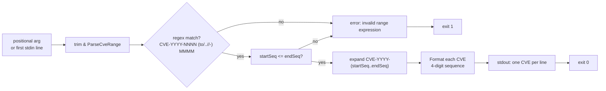

# cve parse-range

:::tip 📂 View Source
[`cmd/range.go:11`](https://github.com/scagogogo/cve-skills/blob/main/cmd/range.go#L11-L30) — open the cobra command definition on GitHub (lines L11–L30).
:::

Parse a CVE **range expression** and expand it into the individual CVE identifiers that fall inside the range, printed one per line.

:::tip 🖥️ When to use
- Expand a compact range such as `CVE-2021-1000 to CVE-2021-1003` into the explicit list of CVEs it covers.
- Materialize a contiguous block of CVEs from a release note or advisory that uses `..` or `-` shorthand.
- Feed an expanded range into a downstream pipeline (validation, filtering, year grouping) that expects one CVE per line.
:::

## Command syntax

```bash
cve parse-range <range-expr>
```

The single positional argument is a range expression in one of three supported syntaxes: `CVE-YYYY-NNNN to CVE-YYYY-MMMM`, `CVE-YYYY-NNNN..MMMM`, or `CVE-YYYY-NNNN - MMMM`. When no argument is supplied and stdin is piped, the first non-empty line is read and used as the expression.

## Arguments and options

- `<range-expr>` (positional, required): A CVE range expression. The start CVE supplies the year; the end is given as a bare sequence number (or a full CVE in the `to` form). The start sequence must be less than or equal to the end sequence.
- stdin fallback: When no positional argument is supplied and stdin is piped, the **first non-empty line** is consumed as the range expression. Additional lines are ignored.
- Supported syntaxes:
  - `CVE-YYYY-NNNN to CVE-YYYY-MMMM` — `to` separator, end given as a full CVE (the year in the end CVE is not used; the start CVE's year applies to the whole range).
  - `CVE-YYYY-NNNN..MMMM` — `..` separator, end given as a bare sequence number.
  - `CVE-YYYY-NNNN - MMMM` — `-` separator (with surrounding spaces), end given as a bare sequence number.
- This command defines **no flags** of its own. The global `-q, --quiet` flag is inherited from the root command.

## Examples

Expand a `to` range into explicit CVEs:

```bash
$ cve parse-range "CVE-2021-1000 to CVE-2021-1003"
CVE-2021-1000
CVE-2021-1001
CVE-2021-1002
CVE-2021-1003
```

Use the `..` shorthand — the end is a bare sequence number sharing the start's year:

```bash
$ cve parse-range "CVE-2022-10..15"
CVE-2022-0010
CVE-2022-0011
CVE-2022-0012
CVE-2022-0013
CVE-2022-0014
CVE-2022-0015
```

Use the `-` separator (note the surrounding spaces, otherwise the dash binds to the number):

```bash
$ cve parse-range "CVE-2023-100 - 102"
CVE-2023-0100
CVE-2023-0101
CVE-2023-0102
```

Pipe a range expression from stdin:

```bash
$ printf 'CVE-2021-44228..44230\n' | cve parse-range
CVE-2021-44228
CVE-2021-44229
CVE-2021-44230
```

A range whose start sequence exceeds its end sequence is invalid and produces no output:

```bash
$ cve parse-range "CVE-2021-1005 to CVE-2021-1002"
# exit code 1, stderr: invalid range expression
```

## How it works



## Corresponding Go API

This command is a thin wrapper around [`ParseCveRange`](/api/functions/parse-cve-range), which matches the expression against a single anchored regex, validates that the start sequence does not exceed the end sequence, and returns a slice of formatted CVE strings spanning the range. The CLI calls `ParseCveRange` once and prints each element. Use the Go function directly when you need the expanded slice in code rather than printed text.

## Exit codes and output

- Exit code `0`: the range expression parsed successfully and every CVE in the range was printed, one per line.
- Exit code `1`: no input was supplied; or the expression did not match the supported syntax; or the start sequence was greater than the end sequence. An error message is written to stderr.
- stdout: one formatted CVE per line, in ascending sequence order, all sharing the start CVE's year.
- stderr: an `invalid range expression` message when parsing fails.

## Notes

- ⚠️ The whole range shares the **start CVE's year** — there is no cross-year expansion. `CVE-2021-99999 to CVE-2022-00001` is not a valid range and will be rejected.
- ⚠️ The start sequence must be **less than or equal to** the end sequence; a reversed range is an error, not an empty list.
- Only the **first** non-empty stdin line is consumed as the expression; additional lines are ignored. To expand multiple ranges, call the command repeatedly in a loop.
- Output CVEs are normalized through `Format`, so sequence numbers are zero-padded to at least 4 digits (`CVE-2022-10` becomes `CVE-2022-0010`).
- The `-` separator requires surrounding spaces; without them the dash is interpreted as part of the next token and the expression will not match.
- Input is case-insensitive and tolerates surrounding whitespace, consistent with the underlying regex.

## Internal Implementation

The `parseRangeCmd` cobra command (`cmd/range.go:11`–`30`) wires a thin `RunE` over the `cve` package. Key points taken from the source:

- **Argument intake**: `RunE` receives `args []string` and immediately passes them to the shared `readInputs(args)` helper. That helper merges positional args with a stdin fallback (first non-empty line when no positional arg is given), returning a `[]string` of inputs. The command consumes only `inputs[0]`.
- **Empty-input guard**: `if len(inputs) == 0` returns `fmt.Errorf("requires at least 1 argument (range expression)")`, surfacing a clear error before any parsing is attempted. No flags are defined on the command itself.
- **Library call**: the trimmed expression is handed to `cve.ParseCveRange(rangeExpr)`. A `nil` return is treated as a parse/validate failure and converted to `fmt.Errorf("invalid range expression: %s", rangeExpr)`. The CLI performs no regex work of its own — all matching, sequence-order validation, and formatting live in the library.
- **Output formatting**: on success the returned `[]string` is iterated with `for _, v := range result { fmt.Println(v) }`, printing one already-formatted CVE per line to stdout. There is no separator, header, or summary line; the slice is printed verbatim in library order.

## Argument Flow

```text
+--------------------------+      +-----------------------+      +----------------------------+
| argv: <range-expr>       |      | readInputs(args)      |      | inputs[0]                  |
| (or piped stdin line)    |---> | merge positional +    |---> | strings.TrimSpace(expr)    |
+--------------------------+      | first non-empty stdin |      +----------------------------+
                                  +-----------------------+                  |
                                                                             v
                                                  +-------------------------------+
                                                  | cve.ParseCveRange(rangeExpr)  |
                                                  | - anchored regex match        |
                                                  | - startSeq <= endSeq check    |
                                                  | - Format each CVE (4-digit)   |
                                                  +---------------+---------------+
                                                                  |
                                                      nil <-------+-------> []string
                                                                  |          |
                                                                  v          v
                                              +---------------------+   +---------------------+
                                              | error: "invalid     |   | for _, v := range   |
                                              | range expression"   |   | result {            |
                                              +----------+----------+   |   fmt.Println(v)    |
                                                         |              | }                   |
                                                         v              +----------+----------+
                                              +---------------------+              |
                                              | RunE returns error  |              v
                                              | -> cobra prints to  |   +---------------------+
                                              |    stderr, exit 1   |   | stdout: one CVE     |
                                              +---------------------+   | per line, ascending |
                                                                        +----------+----------+
                                                                                   |
                                                                                   v
                                                                        +---------------------+
                                                                        | exit 0              |
                                                                        +---------------------+
```

## Edge Cases

| Input | Behavior | Exit code / Output |
| --- | --- | --- |
| No argument and stdin is a TTY (no pipe) | `readInputs` returns an empty slice; the `len(inputs) == 0` guard fires | Exit `1`; stderr: `requires at least 1 argument (range expression)` |
| No argument, stdin piped with a first non-empty line | The first non-empty line becomes `inputs[0]`; additional lines ignored | Exit `0` (if valid); stdout: expanded CVEs |
| Empty positional argument (`""`) | `strings.TrimSpace` yields `""`; `ParseCveRange` returns `nil` | Exit `1`; stderr: `invalid range expression: ` |
| Expression that does not match supported syntax | `ParseCveRange` returns `nil` | Exit `1`; stderr: `invalid range expression: <expr>` |
| Reversed range (`startSeq > endSeq`) | `ParseCveRange` returns `nil` | Exit `1`; stderr: `invalid range expression: <expr>` |
| Cross-year range (end CVE carries a different year) | Only the start CVE's year is used; treated per the sequence comparison | Exit `1` if sequences violate ordering; otherwise exit `0` with start-year CVEs |
| `-` separator without surrounding spaces (`CVE-2023-100-102`) | Regex does not match the expected token shape | Exit `1`; stderr: `invalid range expression: <expr>` |
| Valid range resolving to a single CVE (`startSeq == endSeq`) | `ParseCveRange` returns a one-element slice | Exit `0`; stdout: exactly one CVE line |
| Valid range yielding many CVEs | Slice printed one `fmt.Println` per element | Exit `0`; stdout: N CVE lines, no header/summary |

## Exit Codes

The command relies on cobra's default exit handling driven by `RunE`'s return value; there are no explicit `os.Exit` calls in `cmd/range.go`.

- **Success (exit `0`)**: `RunE` returns `nil` after `ParseCveRange` returns a non-nil slice and every element has been printed via `fmt.Println`. Output goes to stdout.
- **Failure (exit `1`)**: `RunE` returns an error in two cases — the empty-input guard (`requires at least 1 argument (range expression)`) or a `nil` result from `ParseCveRange` (`invalid range expression: <expr>`). Cobra prints the returned error to stderr and exits with code `1`.
- **stderr only on failure**: success writes nothing to stderr; failure writes the error message produced inside `RunE`. There is no debug or progress output to stderr in either path.

## Related commands

- [cve generate-fake](/cli/commands/generate-fake) — generate one or more random CVE identifiers for testing, the inverse need of expanding a known range.
- [cve filter-valid](/cli/commands/filter-valid) — validate the expanded CVEs as a batch.
- [cve filter-group-by-year](/cli/commands/filter-group-by-year) — group the expanded list by year.
- [cve format](/cli/commands/format) — normalize raw CVE strings to the canonical form applied here.
- [CLI Reference](/cli) — full command tree and I/O conventions.
