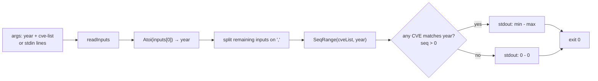

# cve seq-range

:::tip 📂 View Source
[`cmd/stats.go:52`](https://github.com/scagogogo/cve-skills/blob/main/cmd/stats.go#L52-L73) — open the cobra command definition on GitHub (lines L52–L73).
:::

Get the **smallest and largest sequence number** among CVE identifiers that belong to a specific year, printing the range as `min - max`.

:::tip 🖥️ When to use
- See how far CVE numbering has progressed for a given year — the largest sequence is a rough proxy for allocation volume.
- Bracket a year's CVEs by sequence number before slicing into sub-ranges or sampling.
- Sanity-check a CVE list: a max sequence far below the known floor, or a min far above 1, can flag gaps or filtered input.
:::

## Command syntax

```bash
cve seq-range <year> <cve-list...>
```

The **first positional argument is the year**; every argument after it is treated as a CVE list and is comma-split. When no arguments are supplied and stdin is piped, the first non-empty stdin line is the year and the remaining lines are CVE inputs.

## Arguments and options

- `<year>` (positional, required): The CVE year to scope, parsed with `strconv.Atoi` after trimming surrounding whitespace (e.g. `2022`). Non-numeric values are rejected with an error.
- `<cve-list...>` (positional, one or more required after the year): One or more CVE identifiers or comma-separated lists. Each argument is split on `,`, so `CVE-2022-1,CVE-2022-2` and two separate arguments are equivalent.
- stdin fallback: When no positional arguments are supplied and stdin is piped, each non-empty line is one input — the first line is the year, the rest are CVEs. Empty lines are skipped.
- This command defines **no flags** of its own. The global `-q, --quiet` flag is inherited from the root command.

## Examples

Find the sequence range for a single year across a few CVEs:

```bash
$ cve seq-range 2022 CVE-2022-12345 CVE-2022-44228 CVE-2022-9
Year 2022 sequence range: 9 - 44228
```

Pass a comma-separated list in one argument — commas are split, so the result is identical:

```bash
$ cve seq-range 2022 CVE-2022-12345,CVE-2022-44228,CVE-2022-9
Year 2022 sequence range: 9 - 44228
```

CVEs from other years are ignored — only matching-year sequences participate in the range:

```bash
$ cve seq-range 2022 CVE-2021-44228 CVE-2022-9 CVE-2023-50000 CVE-2022-44228
Year 2022 sequence range: 9 - 44228
```

Feed year and CVEs from stdin to compute the range in a pipeline:

```bash
$ printf '2022\nCVE-2022-9\nCVE-2022-44228\n' | cve seq-range
Year 2022 sequence range: 9 - 44228
```

When no CVE in the list matches the given year, both bounds fall back to `0`:

```bash
$ cve seq-range 2099 CVE-2022-12345
Year 2099 sequence range: 0 - 0
```

## How it works



## Corresponding Go API

This command is a thin wrapper around [`SeqRange`](/api/functions/seq-range), which iterates the CVE slice, skips any whose year (via `ExtractCveYearAsInt`) does not equal the requested year or whose sequence (via `ExtractCveSeqAsInt`) is `<= 0`, and tracks the running min and max. When no CVE matches, the function returns `(0, 0)`. The CLI parses the year, comma-splits the remaining inputs, calls `SeqRange`, and prints `Year <year> sequence range: <min> - <max>`. Use the Go function directly when you need the bounds as integers in code rather than as printed text.

## Exit codes and output

- Exit code `0`: the command parsed the year and computed a range (including the `0 - 0` fallback when no CVE matches).
- Exit code `1`: fewer than two inputs were supplied (no year + CVE list), or the year argument could not be parsed as an integer. Nothing is printed.
- stdout: a single line, `Year <year> sequence range: <min> - <max>`.
- stderr: the error message when the year is missing or non-numeric.

## Notes

- ⚠️ The **first argument is the year**, not a CVE. Passing a bare CVE first (e.g. `cve seq-range CVE-2022-9 CVE-2022-44228`) fails with `invalid year: CVE-2022-9`.
- ⚠️ CVEs whose year differs from the requested year are **silently skipped** — they do not error and do not affect the range. Pre-filter with [`cve filter-by-year-range`](/cli/commands/filter-by-year-range) if you need only a specific year's set.
- Sequences of `0` or below are ignored, so malformed or zero-sequence CVEs never drag the min down to `0`.
- When no CVE matches the year, the result is `0 - 0` (not an error). Treat `0 - 0` as "no data for this year" rather than "range starts at zero".
- Input is case-insensitive and tolerates surrounding whitespace, consistent with the underlying `ExtractCve*` helpers.
- There **is** comma-splitting here — `CVE-2022-1,CVE-2022-2` counts as two CVEs. To treat a comma-bearing string as one literal, quote it or pre-process the input.

## Internal Implementation

The `seqRangeCmd` is a cobra command whose `RunE` orchestrates parsing, splitting, and printing:

- **Input collection**: `inputs := readInputs(args)` merges positional args with non-empty stdin lines (stdin only used when no args are supplied). The guard `if len(inputs) < 2 { return fmt.Errorf("requires year and CVE list") }` enforces that both a year and at least one CVE input are present.
- **Year parsing**: `strconv.Atoi(strings.TrimSpace(inputs[0]))` converts the first input into an int; a parse failure returns `fmt.Errorf("invalid year: %s", inputs[0])`.
- **List assembly**: the loop `for _, input := range inputs[1:]` comma-splits each remaining input with `strings.Split(input, ",")` and appends the pieces to `cveList`.
- **Computation and output**: `min, max := cve.SeqRange(cveList, year)` computes the bounds, then `fmt.Printf("Year %d sequence range: %d - %d\n", year, min, max)` prints the single result line. The command defines no flags and returns `nil` on success.

## Argument Flow

```text
+--------------------------+      +--------------------------+
| CLI args                 |      | stdin (only if no args)  |
| [year] [cve ...]         |      | line 1: year             |
|                          |      | line 2+: cve inputs      |
+-----------+--------------+      +-----------+--------------+
            |                               |
            +---------------+---------------+
                            |
                            v
                  +-----------------------+
                  | readInputs(args)      |
                  | -> inputs []string    |
                  +-----------+-----------+
                              |
                  len(inputs) < 2 ?  --yes--> error:
                              |            "requires year and CVE list"
                              | no
                              v
                  +-----------------------+
                  | strconv.Atoi(         |
                  |   TrimSpace(inputs[0]))|
                  | -> year, err          |
                  +-----------+-----------+
                              |
                      err != nil ? --yes--> error:
                              |           "invalid year: <x>"
                              | no
                              v
                  +-----------------------+
                  | for input in inputs[1:]:
                  |   strings.Split(",",  |
                  |     input) -> cveList |
                  +-----------+-----------+
                              |
                              v
                  +-----------------------+
                  | cve.SeqRange(cveList, |
                  |   year) -> min, max   |
                  +-----------+-----------+
                              |
                              v
                  +-----------------------+
                  | fmt.Printf(           |
                  |   "Year %d ... %d-%d")|
                  | -> stdout            |
                  +-----------------------+
```

## Edge Cases

| Input | Behavior | Exit code / output |
| --- | --- | --- |
| No arguments, no stdin | `readInputs` returns empty slice; `len < 2` triggers error | exit 1; stderr `requires year and CVE list`; no stdout |
| Only the year, no CVE input | `len(inputs) == 1`, so `len < 2` triggers error | exit 1; stderr `requires year and CVE list`; no stdout |
| Non-numeric year (e.g. `abc`) | `strconv.Atoi` fails | exit 1; stderr `invalid year: abc`; no stdout |
| Year is a CVE (e.g. `CVE-2022-9` first) | `Atoi` fails on the CVE string | exit 1; stderr `invalid year: CVE-2022-9`; no stdout |
| Year with surrounding spaces (e.g. ` 2022 `) | `TrimSpace` strips spaces before `Atoi` | exit 0; stdout `Year 2022 sequence range: <min> - <max>` |
| Comma-separated list in one arg | `strings.Split` on `,` expands it into multiple CVEs | exit 0; normal range output |
| CVEs from other years only | `SeqRange` skips non-matching years; returns `(0, 0)` | exit 0; stdout `Year <year> sequence range: 0 - 0` |
| Empty/blank stdin lines | `readInputs` skips empty lines | treated as if those inputs were absent |
| stdin piped but no matching year line | first non-empty stdin line is taken as the year | exit 0 with `0 - 0`, or exit 1 if fewer than 2 non-empty lines |

## Exit Codes

- **Success (exit 0)**: returned when `RunE` completes without error. The year parsed successfully and `SeqRange` ran; stdout receives the single line `Year <year> sequence range: <min> - <max>`. This includes the `0 - 0` fallback when no CVE matches the year — empty result is a valid success, not a failure.
- **Failure (exit 1)**: cobra surfaces the error returned by `RunE` and sets exit code 1. Two failure paths: fewer than two inputs (`requires year and CVE list`) and a non-integer year (`invalid year: <input>`). On failure nothing is written to stdout; the error message goes to stderr via cobra's default error handling.
- **stderr on failure**: cobra prints the returned error (prefixed by `Error:` by default) to stderr. The command itself does not write to stderr directly — it only returns the error value.

## Related commands

- [cve year-range](/cli/commands/year-range) — the year-level counterpart: earliest and latest year across a CVE list.
- [cve count-by-year](/cli/commands/count-by-year) — per-year counts for the same list, useful alongside the per-year sequence range.
- [cve extract-seq](/cli/commands/extract-seq) — emit each CVE's sequence number individually rather than collapsing to a range.
- [cve filter-by-year-range](/cli/commands/filter-by-year-range) — narrow a list to a year window before computing its sequence range.
- [CLI Reference](/cli) — full command tree and I/O conventions.
