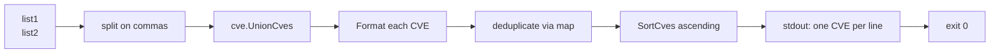

# cve union

:::tip 📂 View Source
[`cmd/set.go:30`](https://github.com/scagogogo/cve-skills/blob/main/cmd/set.go#L30-L47) — open the cobra command definition on GitHub (lines L30–L47).
:::

Merge two CVE lists into a single de-duplicated, sorted set — every CVE that appears in *either* input list comes out once, in ascending order.

:::tip 🖥️ When to use
- Combining CVE lists collected from multiple advisories, scanners, or feeds into one master list.
- Reconciling "what we flagged internally" with "what the vendor published" without keeping duplicates.
- Preparing a clean, deduplicated input for downstream commands such as `cve count-by-year` or `cve compare sort`.
:::

## Command syntax

```bash
cve union <list1> <list2>
```

Both `<list1>` and `<list2>` are comma-separated CVE lists. Each is split on commas before the set operation, so `"CVE-2021-1,CVE-2022-2"` is equivalent to passing the two identifiers as separate tokens.

## Arguments and options

- `<list1>` (positional, required): The first CVE list. Commas inside the argument are treated as separators, so each argument may carry one or many CVEs.
- `<list2>` (positional, required): The second CVE list, parsed the same way as `<list1>`.
- stdin fallback: When no positional arguments are supplied and stdin is piped, each non-empty line is treated as an input. Because the union operation requires **two** lists, stdin must provide at least two lines — the first line is `<list1>`, the second is `<list2>`.
- This command defines **no flags** of its own. The global `-q, --quiet` flag is inherited from the root command.

## Examples

Merge two comma-separated lists; the shared CVE appears only once and the result is sorted:

```bash
$ cve union "CVE-2021-1,CVE-2022-2" "CVE-2022-2,CVE-2023-3"
CVE-2021-1
CVE-2022-2
CVE-2023-3
```

Case differences are normalized away — `Format` upper-cases the `CVE` prefix before comparing, so a lowercase duplicate is dropped:

```bash
$ cve union "cve-2022-1,CVE-2022-2" "CVE-2022-1,CVE-2022-3"
CVE-2022-1
CVE-2022-2
CVE-2022-3
```

Pass the two lists as separate arguments instead of comma-packed strings — the result is identical:

```bash
$ cve union "CVE-2020-5,CVE-2021-9" "CVE-2021-9,CVE-2024-1"
CVE-2020-5
CVE-2021-9
CVE-2024-1
```

Feed both lists from stdin (first line = list1, second line = list2) to union the output of two upstream commands:

```bash
$ printf 'CVE-2021-1,CVE-2022-2\nCVE-2022-2,CVE-2023-3\n' | cve union
CVE-2021-1
CVE-2022-2
CVE-2023-3
```

An empty second list still yields the first list (deduplicated and sorted):

```bash
$ cve union "CVE-2022-3,CVE-2022-1" ""
CVE-2022-1
CVE-2022-3
```

## How it works



## Corresponding Go API

This command is a thin wrapper around [`UnionCves`](/api/functions/union-cves), which takes two `[]string` slices and returns the union as a sorted, de-duplicated `[]string`. Internally every identifier is run through `Format` (so letter case and surrounding whitespace are normalized before comparison), duplicates are tracked with a map, and the final slice is passed through `SortCves` so the output is always in ascending year-then-sequence order. Use the Go function directly when you need the merged slice in code rather than printed lines.

## Exit codes and output

- Exit code `0`: the union was computed and printed. An empty result (both input lists empty) prints nothing and still exits `0`.
- Exit code `1`: fewer than two inputs were supplied (neither two positional arguments nor two piped stdin lines). The error `requires exactly 2 arguments (two CVE lists)` is printed to stderr.
- stdout: one CVE per line, sorted ascending, de-duplicated. No output when both lists are empty.
- stderr: only the usage error above. Result lines never go to stderr.

## Notes

- Each input is normalized with `Format` before the set operation, so `cve-2022-1`, `CVE-2022-1`, and `  CVE-2022-1 ` are all treated as the same CVE.
- The output is **always sorted** (year, then sequence) — the command is not order-preserving. If you need the original input order, use `cve filter dedup` on a single concatenated list instead.
- Invalid or malformed tokens are not filtered out — they are formatted as-is and passed through. Run `cve filter-valid` first if you want only well-formed CVEs in the union.
- Compared to `cve intersect` (CVEs in *both* lists) and `cve diff` (CVEs in list1 *but not* list2), `cve union` is the broadest of the three set operations.

## Internal Implementation

The command is a thin cobra wrapper whose `RunE` does all the work directly — no sub-flags, no helper beyond `readInputs`:

- **Argument acquisition** — `RunE` receives `cmd *cobra.Command` (unused) and `args []string`. It hands `args` straight to `readInputs(args)` (`cmd/helpers.go:11`), which returns the positional args verbatim when any are present, otherwise falls back to scanning stdin line by line (skipping empty lines).
- **Arity check** — `if len(inputs) < 2` returns `fmt.Errorf("requires exactly 2 arguments (two CVE lists)")`; cobra surfaces this on stderr and exits non-zero.
- **List splitting** — each of the two inputs is split on commas with `strings.Split(inputs[0], ",")` and `strings.Split(inputs[1], ",")`, so `"CVE-2021-1,CVE-2022-2"` and separate tokens collapse to the same `[]string`.
- **Library call & output** — `result := cve.UnionCves(list1, list2)` returns a de-duplicated, sorted `[]string`; the loop `for _, v := range result { fmt.Println(v) }` writes one CVE per line to stdout. There is no formatting layer of the command's own — normalization and sorting happen inside `UnionCves`.

## Argument Flow

```text
+--------------------------+
| CLI: cve union <list1>   |
|            <list2>       |
+-----------+--------------+
            |
            v
+--------------------------+    args present?
| readInputs(args)         +----yes----> return args []string
| (cmd/helpers.go:11)      |
+-----------+--------------+
            | no
            v
+--------------------------+
| os.Stdin.Stat() isPipe?  |
| ModeCharDevice == 0      |
+-----------+--------------+
            | yes
            v
+--------------------------+
| bufio.Scanner line by    |
| line; skip empty lines   |
+-----------+--------------+
            |
            v
   inputs []string
            |
            v
   len(inputs) < 2 ? --yes--> error: "requires exactly 2 arguments"
            | no
            v
+--------------------------+
| strings.Split(inputs[0], |
|   ",")  -> list1 []string|
| strings.Split(inputs[1], |
|   ",")  -> list2 []string|
+-----------+--------------+
            |
            v
+--------------------------+
| cve.UnionCves(list1,     |
|   list2) -> result       |
| (Format + map dedup +    |
|   SortCves ascending)    |
+-----------+--------------+
            |
            v
+--------------------------+
| for _, v := range result |
|   fmt.Println(v)         |
+--------------------------+
            |
            v
   stdout: one CVE / line
            |
            v
        exit 0
```

## Edge Cases

| Input | Behavior | Exit code / output |
| --- | --- | --- |
| No positional args, stdin is a TTY (not piped) | `readInputs` returns `nil`; `len(inputs) < 2` triggers the arity error | Exit `1`; stderr `Error: requires exactly 2 arguments (two CVE lists)` plus cobra usage |
| No positional args, stdin piped with only one non-empty line | `inputs` has length 1; arity check fails | Exit `1`; same stderr error as above |
| No positional args, stdin piped with two non-empty lines | First line → `list1`, second line → `list2`; both split on commas | Exit `0`; merged result on stdout |
| Empty string as one argument, e.g. `cve union "" "CVE-2021-1"` | `strings.Split("", ",")` yields `[""]` (a single empty token); passed to `UnionCves` | Exit `0`; empty token is normalized/formatted as-is, deduplicated against the other list |
| Both lists empty (`cve union "" ""`) | Each split yields `[""]`; `UnionCves` produces an empty result | Exit `0`; no stdout output |
| Malformed tokens (`cve union "FOO-1" "BAR-2"`) | Tokens are not validated here; they pass through `Format`/dedup/sort unchanged | Exit `0`; tokens printed as-is, one per line |
| More than two positional args (`cve union a b c`) | `readInputs` returns all args; only `inputs[0]` and `inputs[1]` are consumed, `inputs[2]` ignored | Exit `0`; union of first two lists; extra arg silently dropped |

## Exit Codes

- **Exit `0`** — the `RunE` function returns `nil`. This happens whenever two or more inputs are available, including the degenerate case where both lists are empty (the result is empty and nothing is printed, but the process still exits `0`).
- **Exit non-zero (`1`)** — `RunE` returns the error `requires exactly 2 arguments (two CVE lists)`. cobra prints `Error: <message>` to stderr followed by the command usage text, and the process exits with code `1`. There is no other explicit error path: `strings.Split` never errors, and `UnionCves` returns a slice (possibly empty) rather than an error.
- **stdout** — only the union result, one CVE per line. Empty when both inputs are empty.
- **stderr** — only the arity error and cobra usage banner. Result lines never go to stderr.

## Related commands

- [cve intersect](/cli/commands/intersect) — keep only the CVEs present in both lists.
- [cve diff](/cli/commands/diff) — keep the CVEs in list1 that are absent from list2.
- [cve filter dedup](/cli/commands/filter-dedup) — remove duplicates from a single list, preserving first-seen order.
- [cve compare sort](/cli/commands/compare-sort) — sort a single list ascending.
- [CLI Reference](/cli) — full command tree and I/O conventions.
