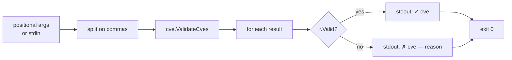

# cve validate-batch

:::tip 📂 View Source
[`cmd/validate_batch.go:11`](https://github.com/scagogogo/cve-skills/blob/main/cmd/validate_batch.go#L11-L34) — open the cobra command definition on GitHub (lines L11–L34).
:::

Validate a list of CVE identifiers in one pass and print a per-item verdict — including a human-readable reason for every failure.

:::tip 🖥️ When to use
- Auditing a pasted or imported CVE list before it enters a database or tracker.
- Producing a quality report that records not only *which* CVEs failed but *why*.
- Validating the output of a pipeline (`extract` → `validate-batch`) without silently dropping bad rows.
:::

## Command syntax

```bash
cve validate-batch <cve-list>
```

`<cve-list>` accepts the same flexible input shape shared by every list-taking subcommand: multiple positional arguments, comma-separated values within each argument, or — when no arguments are given — one item per line on stdin.

## Arguments and options

- `<cve-list>` (positional, repeatable): One or more CVE identifiers. Each argument is split further on commas, so `"CVE-2022-1,CVE-2022-2"` is equivalent to two separate arguments.
- stdin fallback: When no positional arguments are supplied and stdin is piped, each non-empty line is treated as an input (commas within a line are still split).
- This command defines **no flags** of its own. The global `-q, --quiet` flag is inherited from the root command.

## Examples

Validate a comma-separated list and read the per-item verdict:

```bash
$ cve validate-batch "CVE-2022-12345,CVE-1998-1,not-a-cve"
✓ CVE-2022-12345
✗ CVE-1998-1 — year 1998 is before 1999
✗ not-a-cve — invalid CVE format
```

Pass items as separate arguments — the result is identical to the comma form:

```bash
$ cve validate-batch CVE-2022-12345 CVE-1998-1 not-a-cve
✓ CVE-2022-12345
✗ CVE-1998-1 — year 1998 is before 1999
✗ not-a-cve — invalid CVE format
```

Feed a list from stdin to validate the output of another command:

```bash
$ printf 'CVE-2021-44228\nCVE-2022-0\ncve-2022-abc\n' | cve validate-batch
✓ CVE-2021-44228
✗ CVE-2022-0 — sequence number must be positive
✗ cve-2022-abc — sequence number is not a valid number
```

A future-year entry is rejected against the current year at runtime:

```bash
$ cve validate-batch "CVE-2099-1"
✗ CVE-2099-1 — year 2099 is after current year 2026
```

Lowercase and leading-zero sequences are valid; the verdict line echoes the original input verbatim:

```bash
$ cve validate-batch "cve-2022-0001"
✓ cve-2022-0001
```

## How it works



## Corresponding Go API

This command is a thin wrapper around [`ValidateCves`](/api/functions/validate-cves), which returns a `[]CveValidationResult` carrying the original identifier, a `Valid` flag, and a failure `Reason` for each entry. The CLI simply iterates the results and prints `✓`/`✗` lines; all validation logic — format check, year range `1999..currentYear`, positive sequence — lives in the library. Use the Go function directly when you need the structured results in code rather than printed text.

## Exit codes and output

- Exit code `0`: the command ran to completion. Note that **invalid CVEs do not cause a non-zero exit** — every item is reported, valid or not, so the command is safe to chain downstream.
- Exit code `1`: no input was supplied (neither positional arguments nor piped stdin). The error `requires at least 1 argument (CVE list)` is printed to stderr.
- stdout: one line per input item, in input order. Valid items print `✓ <cve>`; invalid items print `✗ <cve> — <reason>`.
- stderr: only the usage error above. Verdict lines never go to stderr.

## Notes

- The verdict line preserves the **original** input verbatim, including surrounding whitespace and original letter case — it is not normalized to uppercase. Run `cve format` first if you need standardized output.
- Possible failure reasons: `invalid CVE format`, `year is not a valid number`, `sequence number is not a valid number`, `year %d is before 1999`, `year %d is after current year %d`, `sequence number must be positive`.
- The upper year bound is `time.Now().Year()` evaluated at runtime, so a CVE dated for next year is rejected today but accepted next year.
- Duplicates are not merged — each input item produces exactly one output line.
- If you only need the valid items (no reasons), `cve filter-valid` is more concise.

## Internal Implementation

The command is defined as a `cobra.Command` (`validateBatchCmd`) with `RunE` doing all the work — it declares no flags of its own and relies on positional args plus a shared stdin helper.

- **Input gathering**: `RunE` calls `readInputs(args)` (from `cmd/helpers.go`), which returns `args` verbatim when non-empty, otherwise falls back to scanning stdin line by line and discarding empty lines. When stdin is a character device (a TTY with no pipe), it returns `nil`.
- **Comma flattening**: each returned input is split on commas via `strings.Split(input, ",")` and appended into a single `cveList []string`, so `"CVE-2021-1,CVE-2021-2"` and two separate arguments produce the same slice.
- **Library call**: the flattened slice is passed to `cve.ValidateCves(cveList)`, which returns `[]CveValidationResult` — each entry carries the original `Cve` string, a `Valid` bool, and a `Reason`. All format and range logic lives in the library, not the CLI.
- **Output formatting**: the command ranges over the results and prints `fmt.Printf("✓ %s\n", r.Cve)` for valid entries and `fmt.Printf("✗ %s — %s\n", r.Cve, r.Reason)` for invalid ones, preserving the input verbatim. It always returns `nil` from `RunE` on success, so the only non-zero exit path is the explicit "requires at least 1 argument" error.

## Argument Flow

```text
+--------------------------+      +-------------------------+
| positional args          |----->| readInputs(args)        |
| (or piped stdin lines)  |      | - args non-empty? ->    |
+--------------------------+      |   return args           |
                                  | - else scan stdin,      |
                                  |   skip empty lines      |
                                  | - TTY with no pipe? ->  |
                                  |   return nil            |
                                  +-----------+-------------+
                                              |
                                              v
                                  +-------------------------+
                                  | for each input:         |
                                  |   strings.Split(",", -1)|
                                  |   append to cveList     |
                                  +-----------+-------------+
                                              |
                                              v
                                  +-------------------------+
                                  | cve.ValidateCves(cveList)|
                                  | -> []CveValidationResult|
                                  +-----------+-------------+
                                              |
                                              v
                                  +-------------------------+
                                  | for each result r:      |
                                  |   r.Valid? -> stdout    |
                                  |     "✓ %s\n", r.Cve     |
                                  |   else -> stdout        |
                                  |     "✗ %s — %s\n",      |
                                  |     r.Cve, r.Reason     |
                                  +-------------------------+
```

## Edge Cases

| Input | Behavior | Exit code / output |
| --- | --- | --- |
| No args, stdin is a TTY (no pipe) | `readInputs` returns `nil`; `RunE` returns an error | Exit `1`; stderr: `requires at least 1 argument (CVE list)` |
| No args, stdin piped but empty (e.g. `printf '' \| cve ...`) | `readInputs` returns `nil` (all lines empty/absent) | Exit `1`; stderr: `requires at least 1 argument (CVE list)` |
| No args, stdin piped with blank lines only | Empty lines are skipped by `readInputs`; result is `nil` | Exit `1`; stderr: `requires at least 1 argument (CVE list)` |
| Args contain commas (`"CVE-2021-1,CVE-2021-2"`) | Each arg split on commas; flattened into one list | Exit `0`; one verdict line per split item |
| Mixed valid and invalid CVEs | Every item still produces a line; invalid items do not abort | Exit `0`; stdout mixes `✓` and `✗` lines |
| Duplicate CVEs in input | Not deduplicated — each occurrence yields its own line | Exit `0`; stdout has repeated lines |
| Whitespace/case preserved | Verbatim echo, no normalization to uppercase | Exit `0`; stdout echoes original string |
| All items invalid | Still exits successfully since `RunE` returns `nil` | Exit `0`; stdout is all `✗` lines |
| `RunE` returns the argument error | cobra prints the error and usage | Exit `1`; stderr has error message |

## Exit Codes

- **Exit `0`** — `RunE` returns `nil` after printing verdicts. This holds even when every supplied CVE is invalid: validation failures are reported on stdout, not treated as command errors, so downstream chaining is safe.
- **Exit `1`** — `RunE` returns `fmt.Errorf("requires at least 1 argument (CVE list)")` when `len(inputs) == 0`. Cobra surfaces this by printing the error message (and usage help) to stderr and exiting non-zero. The source does not call `os.Exit` explicitly; the exit code is cobra's default behavior for a returned error.
- **stderr** — only the "requires at least 1 argument" error (and cobra's usage text) appears on stderr. All `✓`/`✗` verdict lines go to stdout via `fmt.Printf`, never to stderr.

## Related commands

- [cve filter-valid](/cli/commands/filter-valid) — keep only the valid CVEs, drop the rest silently.
- [cve validate](/cli/commands/validate) — per-item `formatted-cve<TAB>bool` output without reasons.
- [cve validate is-cve](/cli/commands/validate-is-cve) — strict "is this text exactly a CVE" check.
- [CLI Reference](/cli) — full command tree and I/O conventions.
