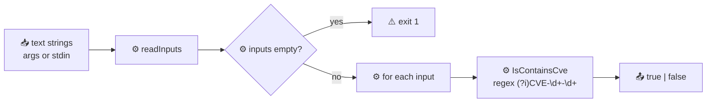

# cve validate contains-cve

:::tip 📂 View Source
[`cmd/validate.go:56`](https://github.com/scagogogo/cve-skills/blob/main/cmd/validate.go#L56-L74) — open the cobra command definition on GitHub (lines L56–L74).
:::

Check whether each input text contains at least one CVE identifier (case-insensitive substring match against the pattern `CVE-<digits>-<digits>`) and print a single `true`/`false` verdict per line.

:::tip 🖥️ When to use
- Triaging security advisories, commit messages, or log lines to decide whether a CVE-extraction step is worth running at all.
- Building a cheap pre-filter in a shell pipeline before handing text off to `cve extract`.
- Sentiment-free gating: "does this blob mention any CVE?" without caring which one.
:::

## Command syntax

```bash
cve validate contains-cve [text...]
```

When no positional arguments are supplied, the command reads input text from stdin, one line per item.

## Arguments and options

- `text...` (positional, repeatable): One or more text strings to test. Each argument is treated as one input item and is matched as a whole — spaces, punctuation, and surrounding prose are fine. When omitted, stdin is read line by line (empty lines are skipped).
- stdin fallback: If no arguments are given and stdin is piped, each non-empty line becomes one input.
- This command defines **no flags** of its own. The global `-q, --quiet` flag is inherited from the root command.

## Examples

A sentence that mentions a CVE prints `true`:

```bash
$ cve validate contains-cve "System affected by CVE-2021-44228"
true
```

Plain prose with no CVE anywhere prints `false`:

```bash
$ cve validate contains-cve "No known vulnerabilities here"
false
```

Matching is case-insensitive, so lowercase `cve-` still hits:

```bash
$ cve validate contains-cve "see cve-2020-1234 for details"
true
```

Multiple CVEs in the same text still yield a single `true` — the check is "contains any", not a count:

```bash
$ cve validate contains-cve "CVE-2021-44228 and CVE-2014-0160 both mentioned"
true
```

Test several texts at once, one verdict per line, in input order:

```bash
$ cve validate contains-cve "CVE-2022-12345" "nothing here" "cve-2020-1"
true
false
true
```

## How it works



## Corresponding Go API

This command is a thin wrapper around [`IsContainsCve`](/api/functions/is-contains-cve). The library function runs the compiled regex `(?i)CVE-\d+-\d+` against the input via `regexp.MatchString` — a case-insensitive **substring** match, so the CVE can appear anywhere in the text. Unlike [`ValidateCve`](/api/functions/validate-cve), it does **not** range-check the year or validate the sequence number; any `CVE-<digits>-<digits>` token, even a far-future or single-digit one, triggers `true`. The CLI iterates the inputs, calls `IsContainsCve` for each, and prints the boolean alone on its own line (no input echo). Use the Go function directly when you need the boolean in code rather than printed text.

## Exit codes and output

- Exit code `0`: the command ran to completion. A `false` verdict does **not** cause a non-zero exit — each item is reported with its own boolean, so the command is safe to chain downstream.
- Exit code `1`: no input was supplied (neither positional arguments nor piped stdin).
- stdout: one line per input item, in input order, containing only `true` or `false`. Unlike `cve validate`, the input text is **not** echoed back.
- stderr: silent on normal runs.

## Notes

- ⚠️ The check is a pure substring/regex match — `CVE-9999-0` and `CVE-0000-1` both return `true`. When you need year-range and sequence validation, follow up with `cve validate` or `cve validate-batch`.
- ⚠️ Only **one** boolean is printed per input, no matter how many CVEs the text contains. To enumerate the actual identifiers, use `cve extract`.
- ⚠️ The regex is case-insensitive (`(?i)`), so `cve-`, `Cve-`, and `CVE-` all match.
- ✅ Output is input-echo-free: each line is just `true` or `false`, which makes it easy to `grep` or count in a pipeline.
- ✅ Empty lines from stdin are skipped before matching, so they never produce a verdict.

## Internal Implementation

The cobra command `containsCveCmd` (defined at `cmd/validate.go:56`) wires its work into a `Run` closure that takes the parsed positional `args` and produces one verdict per item:

- **Input gathering**: The `Run` function receives `args []string` directly from cobra and passes them to the shared `readInputs(args)` helper. When `args` is non-empty, each argument becomes one input item as-is; when `args` is empty, the helper falls back to reading stdin line by line and skips blank lines. The command defines **no flags** of its own — `cutoff`, `format`, etc. are not consulted here.
- **Empty-input guard**: Immediately after gathering, `if len(inputs) == 0 { os.Exit(1) }` short-circuits the run. This is the only explicit exit-code branch in the command: no arguments and no piped stdin means exit `1` with no stdout.
- **Per-item dispatch**: The loop `for _, input := range inputs` calls `cvepkg.IsContainsCve(input)` once per item. That library function runs the compiled regex `(?i)CVE-\d+-\d+` via `regexp.MatchString`, a case-insensitive **substring** test that ignores year range and sequence validity.
- **Output formatting**: Each result is printed with `fmt.Printf("%v\n", cvepkg.IsContainsCve(input))` — the boolean alone on its own line, with **no input echo** and no tab separator. This differs from sibling `validate`/`is-cve`/`year-ok`, which print `input\tbool`. Output goes to stdout in input order; stderr is never written to explicitly.

## Argument Flow

```text
+-------------------------+
| command-line invocation |
| cve validate contains-cve|
|   [text...]  (or stdin) |
+-----------+-------------+
            |
            v
+-------------------------+
| cobra parses args       |
| -> args []string        |
| (no flags defined)      |
+-----------+-------------+
            |
            v
+-------------------------+
| readInputs(args)        |
|  args present?          |
|   yes -> use args       |
|   no  -> read stdin     |
|         skip blank line |
+-----------+-------------+
            |
            v
+-------------------------+
| len(inputs) == 0 ?      |
|   yes -> os.Exit(1)     |   (no stdout, exit 1)
|   no  -> continue       |
+-----------+-------------+
            |
            v
+-------------------------+
| for each input:         |
|  cvepkg.IsContainsCve() |
|   regexp (?i)CVE-\d+-\d+|
|   -> bool (substring)   |
+-----------+-------------+
            |
            v
+-------------------------+
| fmt.Printf("%v\n", b)   |   (stdout, no input echo)
+-----------+-------------+
            |
            v
+-------------------------+
| exit 0                  |   (after loop completes)
+-------------------------+
```

## Edge Cases

| Input | Behavior | Exit code / output |
| --- | --- | --- |
| No positional args, no piped stdin | `readInputs` returns an empty slice; `len(inputs) == 0` triggers `os.Exit(1)` | Exit `1`; no stdout, no stderr |
| Empty string argument (`""`) | `readInputs` keeps it as one item (non-blank arg), `IsContainsCve("")` returns `false` | Exit `0`; prints `false` |
| Stdin with blank lines | `readInputs` skips blank lines before matching; only non-empty lines become inputs | Exit `0`; one verdict per non-empty line |
| Stdin with only blank lines | All lines skipped, so `len(inputs) == 0` | Exit `1`; no stdout |
| Text with `CVE-9999-9999` (far-future year) | Regex matches the token; year range is not checked by `IsContainsCve` | Exit `0`; prints `true` |
| Text with `cve-2020-1` (lowercase, single-digit seq) | Case-insensitive `(?i)` matches; sequence width not validated | Exit `0`; prints `true` |
| Text with no CVE-shaped token | `regexp.MatchString` fails, `IsContainsCve` returns `false` | Exit `0`; prints `false` (not an error) |
| Multiple CVEs in one input | The match is "contains any"; only one `true` is printed per item | Exit `0`; prints a single `true` |
| Many arguments at once | Loop iterates in argument order, one verdict per line | Exit `0`; N lines of `true`/`false` |

## Exit Codes

- **`0`** — the loop ran to completion. Note that a `false` verdict is **not** treated as failure: the command reports each item's boolean and exits successfully so it can be chained in a pipeline.
- **`1`** — forced by the explicit `os.Exit(1)` guard when `readInputs(args)` yields zero items, i.e. neither positional arguments nor non-blank stdin lines were provided. No stdout is written in this path.
- **stderr** — the source writes nothing to stderr explicitly; on both exit paths stderr stays silent. Errors from the library's `regexp.MatchString` (e.g. an invalid pattern, which does not happen with the hard-coded `(?i)CVE-\d+-\d+`) would surface through Go's normal return values rather than being printed by this command, so in practice stderr is always empty.

## Related commands

- [cve validate](/cli/commands/validate) — strict full validation (format + year + sequence) of a whole CVE identifier.
- [cve validate is-cve](/cli/commands/validate-is-cve) — check whether text is **exactly** a CVE identifier, not merely containing one.
- [cve extract](/cli/commands/extract) — pull every CVE identifier out of text once a `contains-cve` hit is confirmed.
- [cve filter-valid](/cli/commands/filter-valid) — keep only the valid CVEs from a mixed list.
