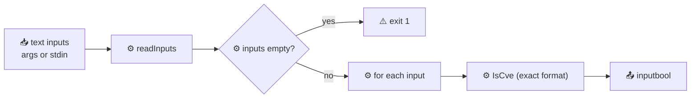

# cve validate is-cve

:::tip 📂 View Source
[`cmd/validate.go:35`](https://github.com/scagogogo/cve-skills/blob/main/cmd/validate.go#L35-L54) — open the cobra command definition on GitHub (lines L35–L54).
:::

Check whether each input string is **exactly** a valid CVE identifier (format only) and print a per-item `text<TAB>bool` verdict — `true` when the whole string matches the CVE format, `false` otherwise.

:::tip 🖥️ When to use
- Guarding an input field that must contain *only* a CVE ID and nothing else.
- Quickly telling a bare CVE apart from free text in a pipeline.
- Pre-filtering candidates before a stricter (year/sequence) check downstream.
:::

## Command syntax

```bash
cve validate is-cve [text...]
```

When no positional arguments are supplied, the command reads inputs from stdin, one per line.

## Arguments and options

- `text...` (positional, repeatable): One or more strings to test. Each argument is one input — spaces inside an argument are kept, so quote free text. When omitted, stdin is read line by line (empty lines are skipped).
- stdin fallback: If no arguments are given and stdin is piped, each non-empty line becomes one input.
- This command defines **no flags** of its own. The global `-q, --quiet` flag is inherited from the root command.

## Examples

A well-formed identifier passes — the verdict prints `true`:

```bash
$ cve validate is-cve CVE-2022-12345
CVE-2022-12345	true
```

Lowercase input still matches the format, and the original text is printed verbatim (not normalized):

```bash
$ cve validate is-cve cve-2022-12345
cve-2022-12345	true
```

Text that merely *contains* a CVE is rejected, because the whole string is not exactly a CVE:

```bash
$ cve validate is-cve "affected by CVE-2021-44228"
affected by CVE-2021-44228	false
```

A future year still passes the format check — `is-cve` checks format only, not the year range:

```bash
$ cve validate is-cve CVE-2099-1
CVE-2099-1	true
```

Test several inputs at once, supplied as separate arguments:

```bash
$ cve validate is-cve CVE-2021-44228 "not a cve" CVE-2099-1
CVE-2021-44228	true
not a cve	false
CVE-2099-1	true
```

## How it works



## Corresponding Go API

This command is a thin wrapper around [`IsCve`](/api/functions/is-cve). The library function matches the input against the exact CVE regular expression — leading/trailing whitespace is tolerated, but no other surrounding characters are allowed. Unlike [`ValidateCve`](/api/functions/validate-cve), `IsCve` checks **format only**: it does not range-check the year against 1999..current year, nor verify the sequence number is positive. The CLI iterates the inputs, calls `IsCve` for each, and prints `input<TAB>bool` — note the input is printed **verbatim**, not normalized. Use the Go function directly when you need the boolean result in code rather than printed text.

## Exit codes and output

- Exit code `0`: the command ran to completion. Inputs that fail the format check do **not** cause a non-zero exit — each item is reported with its own boolean, so the command is safe to chain downstream.
- Exit code `1`: no input was supplied (neither positional arguments nor piped stdin).
- stdout: one line per input item, in input order, formatted as `<input><TAB>true|false`. The input is printed verbatim — no uppercasing, no trimming of internal characters.
- stderr: silent on normal runs.

## Notes

- ⚠️ The input is printed **verbatim** — `cve-2022-12345` stays `cve-2022-12345`. If you want normalized output (uppercase, trimmed), use `cve validate` instead.
- ⚠️ `is-cve` checks **format only**. A future-year CVE such as `CVE-2099-1` returns `true` here even though `cve validate` would reject it. Use `cve validate year-ok` to range-check the year.
- ✅ The verdict is a single boolean with no failure reason. When you need a human-readable cause, use `cve validate-batch`.
- ✅ Duplicates are not merged — each input item produces exactly one output line.
- ✅ To detect a CVE *anywhere inside* free text rather than as the whole string, use `cve validate contains-cve`.

## Internal Implementation

The `isCveCmd` is a cobra command defined in [`cmd/validate.go:35-54`](https://github.com/scagogogo/cve-skills/blob/main/cmd/validate.go#L35-L54). Its `Run` function is a thin loop with no flags of its own:

- **Argument intake**: `Run` receives the raw `args []string` from cobra and hands them straight to `readInputs(args)` (shared helper). When `args` is empty, `readInputs` falls back to reading stdin line by line, skipping blank lines.
- **Empty guard**: if `readInputs` returns zero items, the command calls `os.Exit(1)` immediately — no output, no per-item loop. This is the only non-zero exit path in the command.
- **Per-item dispatch**: it iterates `inputs` and calls `cvepkg.IsCve(input)` for each. `IsCve` does an exact-format CVE regex match (whitespace tolerated at the edges only); it does **not** range-check the year or sequence number.
- **Output formatting**: each verdict is printed with `fmt.Printf("%s\t%v\n", input, cvepkg.IsCve(input))`. The input string is printed **verbatim** — no uppercasing, no trimming — followed by a TAB and the Go `bool` rendered as `true`/`false`.

## Argument Flow

```text
+------------------+     +------------------+     +-------------------+
| CLI args / stdin | --> | readInputs(args) | --> | []string inputs   |
+------------------+     +------------------+     +-------------------+
                                                          |
                                          +---------------+---------------+
                                          | len(inputs)==0                 | len(inputs)>0
                                          v                               v
                                  +----------------+          +-------------------------+
                                  | os.Exit(1)     |          | for _, input := range   |
                                  | (no output)    |          |     inputs              |
                                  +----------------+          +-------------------------+
                                                                        |
                                                                        v
                                                            +-------------------------+
                                                            | cvepkg.IsCve(input)     |
                                                            | (exact format regex)    |
                                                            +-------------------------+
                                                                        |
                                                                        v
                                                            +-------------------------+
                                                            | fmt.Printf              |
                                                            |   "%s\t%v\n", input, b  |
                                                            +-------------------------+
                                                                        |
                                                                        v
                                                            +-------------------------+
                                                            | stdout: input<TAB>bool  |
                                                            +-------------------------+
```

## Edge Cases

| Input | Behavior | Exit code / output |
| --- | --- | --- |
| No positional args, no piped stdin | `readInputs` returns empty slice; `os.Exit(1)` is called before any loop | Exit `1`; no stdout, no stderr |
| Empty string argument (`""`) | Treated as one input; `IsCve("")` returns `false` | Exit `0`; prints `<TAB>false` |
| Whitespace-only argument (`"   "`) | One input; edges are trimmed by `IsCve`, leaving empty → `false` | Exit `0`; prints `   \tfalse` (verbatim) |
| Lowercase input (`cve-2022-12345`) | Matches format regex; printed verbatim, not uppercased | Exit `0`; prints `cve-2022-12345\ttrue` |
| Free text containing a CVE (`"see CVE-2021-44228"`) | Whole string is not exactly a CVE → `IsCve` returns `false` | Exit `0`; prints the text + `\tfalse` |
| Future-year CVE (`CVE-2099-1`) | Format-only check passes; year range is not validated | Exit `0`; prints `CVE-2099-1\ttrue` |
| Multiple arguments | Each argument is one input; loop prints one line per item in order | Exit `0`; one line per argument |
| Stdin with blank lines | `readInputs` skips blank lines; only non-empty lines become inputs | Exit `0` (or `1` if all lines blank) |

## Exit Codes

- **Exit `0`**: the per-item loop completed. Note that a `false` verdict does **not** raise the exit code — each item carries its own boolean, so the command is safe to chain in a pipeline.
- **Exit `1`**: triggered solely by the empty-input guard (`if len(inputs) == 0 { os.Exit(1) }`) when neither positional args nor piped stdin produced any input.
- **stderr**: the command writes nothing to stderr in either path — `os.Exit(1)` is called directly with no diagnostic message. The exit code itself is the only failure signal.
- **stdout**: only the per-item `input<TAB>bool` lines are written, and only when at least one input exists.

## Related commands

- [cve validate](/cli/commands/validate) — full check (format + year range + sequence), with normalized output.
- [cve validate contains-cve](/cli/commands/validate-contains-cve) — does the text contain a CVE anywhere.
- [cve validate year-ok](/cli/commands/validate-year-ok) — year-range check only, with optional `--cutoff` for future years.
- [cve validate-batch](/cli/commands/validate-batch) — per-item verdict with a human-readable failure reason.
