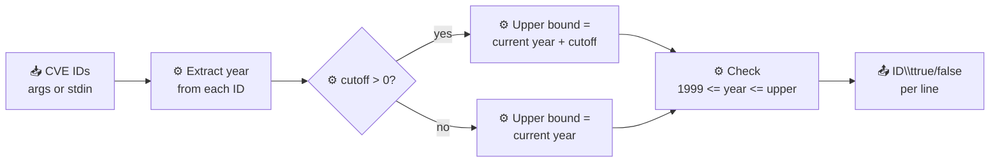

# cve validate year-ok

:::tip 📂 View Source
[`cmd/validate.go:76`](https://github.com/scagogogo/cve-skills/blob/main/cmd/validate.go#L76-L102) — open the cobra command definition on GitHub (lines L76–L102).
:::

Check whether the CVE identifier carries a year within the accepted range (1999 to current year), with optional tolerance for future years.

:::tip 🖥️ Use case
Use this when you only care about the year plausibility of a CVE ID — for example, filtering out typo'd IDs like `CVE-1998-12345` or flagging suspiciously far-future IDs like `CVE-2099-12345` in a feed, without running the full format and sequence validation of `cve validate`.
:::

## Command syntax

```bash
cve validate year-ok [cve-id...] [flags]
```

Reads CVE IDs from arguments or stdin (one per line) when no arguments are given.

## Parameters and options

- `cve-id...` — One or more CVE identifiers to check. When omitted, reads from stdin, one ID per line.
- `-c, --cutoff N` — Allow the year to be up to N years into the future (integer, default `0`). When `0` (or not set), the upper bound is the current year; when `> 0`, the upper bound becomes `current year + cutoff`.
- No `--cutoff` is equivalent to `--cutoff 0`: only years up to the current year are accepted.

## Examples

```bash
# A normal, in-range CVE ID → true
cve validate year-ok CVE-2022-12345
# CVE-2022-12345	true

# 1998 is before the CVE program's 1999 start → false
cve validate year-ok CVE-1998-12345
# CVE-1998-12345	false

# Without --cutoff, a future year exceeds the current year → false
cve validate year-ok CVE-2030-12345
# CVE-2030-12345	false

# With --cutoff 5, a year up to current+5 is accepted → true
cve validate year-ok CVE-2030-12345 --cutoff 5
# CVE-2030-12345	true

# Batch check from stdin, allowing 3 future years
printf "CVE-2022-12345\nCVE-1998-99999\nCVE-2030-1\n" | cve validate year-ok --cutoff 3
# CVE-2022-12345	true
# CVE-1998-99999	false
# CVE-2030-1	true
```

## Workflow



## Corresponding Go API

- [`IsCveYearOk`](/api/functions/is-cve-year-ok) — checks that the year is `>= 1999` and `<= current year` (i.e. cutoff `0`).
- `IsCveYearOkWithCutoff` — same check with a configurable future-year tolerance; the CLI uses this when `--cutoff` is greater than `0`.

The CLI is a thin wrapper: it formats each input via the library's normalizer, then calls `IsCveYearOk` (no cutoff) or `IsCveYearOkWithCutoff` (with cutoff) and prints `formatted-id<TAB>bool` per line. The validation logic — including the `1999` lower bound and the `time.Now().Year()` upper bound — lives entirely in the Go library.

## Exit codes and output

- Exits with code `1` when no input is provided (no arguments and empty stdin).
- On success, exits with code `0`.
- Output is one line per input: `<formatted-cve-id><TAB>true|false`. The CVE ID is normalized/formatted before printing, so `cve-2022-12345` prints as `CVE-2022-12345`.
- Only the year range is checked. A `true` result does not imply the overall ID format or sequence number is valid; use `cve validate` for full validation.

## Notes

- ⚠️ The lower bound is fixed at `1999` (the CVE program's first year); IDs with years before 1999 always return `false`.
- ⚠️ The upper bound depends on the host clock's current year, so the same input can return `true` today and `false` next year if `--cutoff` is `0`.
- ⚠️ This command checks the year only — it does not verify the CVE prefix, dashes, or sequence number. A malformed ID may still return `true` if its year digits happen to fall in range.
- ✅ Use `--cutoff` when ingesting reserved or pre-published CVE IDs whose years may legitimately be slightly in the future.
- ✅ For full format + year + sequence validation, use `cve validate` instead.

## Internal Implementation

The `yearOkCmd` cobra command (`cmd/validate.go:76-102`) is a thin wrapper around the Go library. Its `Run` function works as follows:

- **Flag parsing first**: before reading any input, it calls `cmd.Flags().GetInt("cutoff")` to obtain the `--cutoff` integer (default `0`); the discarded error is intentional — an invalid value surfaces as a cobra flag error before `Run` is reached.
- **Input collection**: `readInputs(args)` returns a `[]string`. When `args` is non-empty the arguments are used directly; otherwise the function reads stdin one ID per line. If the resulting slice is empty, the command calls `os.Exit(1)` immediately and prints nothing.
- **Per-input dispatch**: for each input it branches on `cutoff > 0` — calling `cvepkg.IsCveYearOkWithCutoff(input, cutoff)` when a tolerance is set, otherwise `cvepkg.IsCveYearOk(input)`. The `1999` lower bound and the `time.Now().Year()` upper bound are enforced inside those library functions, not in the CLI.
- **Output formatting**: each result is printed with `fmt.Printf("%s\t%v\n", cvepkg.Format(input), result)`, so the ID is normalized via the library's `Format` before printing and the boolean renders as Go's `true`/`false`.

## Argument Flow

```text
+----------------------+     +------------------------+     +------------------------------+
| command-line args    | --> | cmd.Flags().GetInt     | --> | readInputs(args)             |
| [cve-id...] --cutoff |     | ("cutoff") -> int      |     | args? args : stdin lines     |
+----------------------+     +------------------------+     +---------------+--------------+
                                                                              |
                                                                              v
                       +--------------------------------------------+   <---+ empty? os.Exit(1)
                       | for each input:                            |
                       |   cutoff > 0 ?                             |
                       |     yes -> IsCveYearOkWithCutoff(id, cutoff)|
                       |     no  -> IsCveYearOk(id)                 |
                       +---------------------+----------------------+
                                             |
                                             v
                       +--------------------------------------------+
                       | fmt.Printf("%s\t%v\n",                     |
                       |   Format(input), result)                   |
                       |   -> "CVE-2022-12345\ttrue"                |
                       +--------------------------------------------+
```

## Edge Cases

| Input | Behavior | Exit code / output |
| --- | --- | --- |
| No arguments, empty stdin | `readInputs` returns an empty slice; `Run` calls `os.Exit(1)` before any output | Exit `1`, no stdout |
| No arguments, stdin has blank lines | Blank lines are treated as inputs and passed to `IsCveYearOk`/`IsCveYearOkWithCutoff`; the year check fails on non-CVE text | Exit `0`, one `\tfalse` line per blank line |
| Single valid in-range ID (e.g. `CVE-2022-12345`) | `IsCveYearOk` returns `true`; `Format` normalizes the case | Exit `0`, `CVE-2022-12345\ttrue` |
| Year before 1999 (e.g. `CVE-1998-12345`) | Library lower bound `1999` rejects it | Exit `0`, `CVE-1998-12345\tfalse` |
| Future year, no `--cutoff` (e.g. `CVE-2030-12345`) | Upper bound is the current year, so it is rejected | Exit `0`, `CVE-2030-12345\tfalse` |
| Future year with `--cutoff 5` | `cutoff > 0` routes to `IsCveYearOkWithCutoff`; upper bound becomes current year + 5 | Exit `0`, `CVE-2030-12345\ttrue` |
| Lowercase or mixed-case ID (e.g. `cve-2022-12345`) | The ID is checked as-is, then `Format` upper-cases it for display only | Exit `0`, `CVE-2022-12345\t<result>` |
| Malformed ID whose year digits fall in range | Only the year is inspected, so it may still return `true` | Exit `0`, `<formatted>\ttrue` |
| Negative or non-integer `--cutoff` | cobra rejects the flag before `Run`; `GetInt`'s error is discarded | Exit non-zero, cobra error on stderr |

## Exit Codes

- **Success**: exit code `0`. The command does not call `os.Exit(0)` explicitly — it returns normally from `Run` after printing one line per input, and cobra exits with `0`.
- **No input**: exit code `1`, set explicitly by `os.Exit(1)` when `readInputs(args)` returns an empty slice (no arguments and empty stdin). No message is printed to stderr in this case — the command exits silently.
- **Flag errors**: an invalid `--cutoff` value (non-integer) is caught by cobra's flag parser before `Run` executes; cobra prints an error to stderr and exits with a non-zero code. The `GetInt` call inside `Run` discards its error because the value is already guaranteed valid at that point.
- **stderr usage**: the `Run` function itself never writes to stderr — all of its output goes to stdout via `fmt.Printf`. Stderr activity, if any, comes from cobra's flag/error handling, not from this command's logic.

## Related commands

- [cve validate](/cli/commands/validate) — full CVE validation (format, year, sequence).
- [cve validate is-cve](/cli/commands/validate-is-cve) — strict exact-format CVE check.
- [cve validate contains-cve](/cli/commands/validate-contains-cve) — detect CVE IDs embedded in free text.
