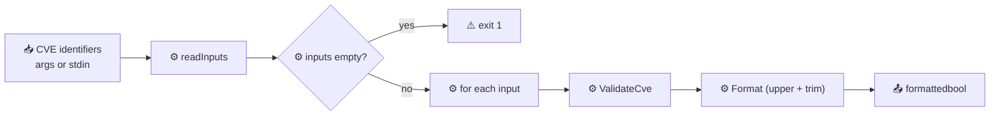

# cve validate

:::tip 📂 View Source
[`cmd/validate.go:11`](https://github.com/scagogogo/cve-skills/blob/main/cmd/validate.go#L11-L33) — open the cobra command definition on GitHub (lines L11–L33).
:::

Validate CVE identifiers with a single comprehensive check — format, year range (1999 to current year), and a positive sequence number — and print a per-item `formatted-cve<TAB>bool` verdict.

:::tip 🖥️ When to use
- Sanity-checking a CVE identifier before recording it in a tracker, ticket, or report.
- Quick one-liner validation in shell pipelines where you only need a boolean per line.
- Guarding the entry point of a workflow that expects strictly well-formed CVE IDs downstream.
:::

## Command syntax

```bash
cve validate [cve-id...]
```

When no positional arguments are supplied, the command reads CVE identifiers from stdin, one per line.

## Arguments and options

- `cve-id...` (positional, repeatable): One or more CVE identifiers to validate. When omitted, stdin is read line by line (empty lines are skipped).
- stdin fallback: If no arguments are given and stdin is piped, each non-empty line becomes one input.
- This command defines **no flags** of its own. The global `-q, --quiet` flag is inherited from the root command.

## Examples

Validate a well-formed identifier — the verdict prints `true`:

```bash
$ cve validate CVE-2022-12345
CVE-2022-12345	true
```

A year before the CVE program's 1999 start is rejected:

```bash
$ cve validate CVE-1998-12345
CVE-1998-12345	false
```

Lowercase input is normalized to uppercase on the output line, but the verdict still reflects the full check:

```bash
$ cve validate cve-2022-0001
CVE-2022-0001	true
```

A future year exceeds the current-year upper bound and prints `false`:

```bash
$ cve validate CVE-2099-1
CVE-2099-1	false
```

Validate several identifiers at once, supplied as separate arguments:

```bash
$ cve validate CVE-2021-44228 CVE-2099-1 not-a-cve
CVE-2021-44228	true
CVE-2099-1	false
NOT-A-CVE	false
```

Read a list from stdin to validate the output of another command:

```bash
$ printf 'CVE-2021-44228\nCVE-1998-1\n' | cve validate
CVE-2021-44228	true
CVE-1998-1	false
```

## How it works



## Corresponding Go API

This command is a thin wrapper around [`ValidateCve`](/api/functions/validate-cve). The library function performs the full check: the identifier must first pass [`IsCve`](/api/functions/is-cve) (exact CVE format), then its year must be `>= 1999` and `<= time.Now().Year()`, and its sequence number must be a positive integer. The CLI iterates the inputs, calls `ValidateCve` for each, and prints `Format(input)<TAB>bool` — where `Format` uppercases and trims the identifier so the output is normalized regardless of input case. Use the Go function directly when you need the boolean result in code rather than printed text.

## Exit codes and output

- Exit code `0`: the command ran to completion. Invalid CVEs do **not** cause a non-zero exit — each item is reported with its own boolean, so the command is safe to chain downstream.
- Exit code `1`: no input was supplied (neither positional arguments nor piped stdin).
- stdout: one line per input item, in input order, formatted as `<formatted-cve><TAB>true|false`. The identifier is normalized via `Format` (uppercase, trimmed) before printing.
- stderr: silent on normal runs.

## Notes

- ⚠️ The printed identifier is **normalized** to uppercase and trimmed — `cve-2022-12345` prints as `CVE-2022-12345`. If you need the original input preserved verbatim, use `cve validate-batch` instead.
- ⚠️ The upper year bound is `time.Now().Year()` evaluated at runtime, so a future-year CVE is rejected today but may be accepted next year.
- ✅ The verdict is a single boolean with no failure reason. When you need to know *why* an identifier failed, use `cve validate-batch`, which reports the cause (invalid format, year out of range, non-positive sequence, etc.).
- ✅ Duplicates are not merged — each input item produces exactly one output line.
- ✅ Only the year is range-checked; for a year-only check without format/sequence validation, use `cve validate year-ok`.

## Internal Implementation

The `Run` function (`cmd/validate.go:23-32`) is parameterless beyond the standard cobra signature `Run: func(cmd *cobra.Command, args []string)`:

- **No flags read**: the command never calls `cmd.Flags()`. All input flows through positional `args`; the inherited global `-q, --quiet` is therefore a no-op for this subcommand's logic.
- **Input via `readInputs(args)`** (`cmd/helpers.go:11`): if `args` is non-empty it is returned verbatim; otherwise `os.Stdin.Stat()` is checked for `os.ModeCharDevice`. A pipe/redirect (non-char device) triggers a `bufio.Scanner` that collects non-empty lines; an interactive TTY returns `nil`.
- **Empty-guard**: `if len(inputs) == 0 { os.Exit(1) }` — the only explicit exit-code branch in the command.
- **Per-item loop**: `valid := cvepkg.ValidateCve(input)` then `fmt.Printf("%s\t%v\n", cvepkg.Format(input), valid)`. `ValidateCve` performs the combined format + year-range + positive-sequence check; `Format` uppercases and trims the input so the printed identifier is normalized regardless of input case. Output goes to stdout via `fmt.Printf`, one line per input, in input order.

## Argument Flow

```text
+-------------------+     +-------------------------------------------+
| CLI args / stdin  | --> | readInputs(args)                          |
| (CVE-... lines)   |     |  - args non-empty? return args            |
+-------------------+     |  - else: stdin pipe? scan non-empty lines |
                          |  - else (TTY): return nil                |
                          +---------------------+---------------------+
                                                |
                                                v
                          +-------------------------------------------+
                          | len(inputs) == 0 ?  --> os.Exit(1)        |
                          +---------------------+---------------------+
                                                |
                                                v
                          +-------------------------------------------+
                          | for each input:                           |
                          |   valid = cvepkg.ValidateCve(input)       |
                          |   fmt.Printf("%s\t%v\n",                  |
                          |       cvepkg.Format(input), valid)        |
                          +---------------------+---------------------+
                                                |
                                                v
                          +-------------------------------------------+
                          | stdout: <formatted-cve><TAB>true|false    |
                          +-------------------------------------------+
```

## Edge Cases

| Input | Behavior | Exit code / output |
| --- | --- | --- |
| No args, TTY stdin (interactive) | `readInputs` returns `nil`; empty-guard fires | Exit `1`; no stdout, no stderr |
| No args, empty pipe (`echo -n \| cve validate`) | Scanner yields no lines; `inputs` empty | Exit `1`; no output |
| No args, pipe of blank lines | Blank lines skipped by scanner; `inputs` empty | Exit `1`; no output |
| Invalid identifier (`not-a-cve`) | `ValidateCve` returns `false`; `Format` uppercases to `NOT-A-CVE` | Exit `0`; `NOT-A-CVE\tfalse` |
| Year out of range (`CVE-1998-1`, `CVE-2099-1`) | Format passes but year check fails | Exit `0`; `CVE-...\tfalse` |
| Lowercase input (`cve-2022-0001`) | `Format` normalizes to uppercase; verdict on full check | Exit `0`; `CVE-2022-0001\ttrue` |
| Duplicate inputs | Not deduplicated; each produces its own line | Exit `0`; one line per duplicate |
| Mixed valid + invalid in one invocation | Each item judged independently; no short-circuit | Exit `0`; per-item lines in order |

## Exit Codes

The command has a single explicit exit branch; all other paths fall through to cobra's default `0`.

- **Exit `0`** — the loop completed normally. This holds even when every input is invalid: a `false` verdict is printed per item, but the process exits successfully, so the command is safe to chain in `&&` pipelines.
- **Exit `1`** — `os.Exit(1)` at `cmd/validate.go:26`, reached only when `readInputs` returns an empty slice (no positional args and either an interactive TTY or an all-blank stdin pipe).
- **stderr** — the command writes nothing to stderr in either path; all diagnostics surface as stdout verdict lines or the bare non-zero exit. There is no `--help`-driven error message beyond what cobra emits itself for unknown flags.

## Related commands

- [cve validate-batch](/cli/commands/validate-batch) — per-item verdict with a human-readable failure reason.
- [cve validate year-ok](/cli/commands/validate-year-ok) — year-range check only, with optional `--cutoff` for future years.
- [cve validate is-cve](/cli/commands/validate-is-cve) — strict "is this text exactly a CVE" check.
- [cve filter-valid](/cli/commands/filter-valid) — keep only the valid CVEs, drop the rest silently.
