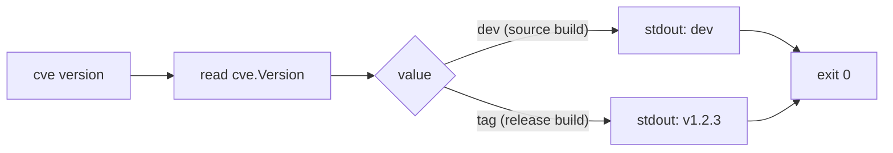

# cve version

:::tip 📂 View Source
[`cmd/version.go:10`](https://github.com/scagogogo/cve-skills/blob/main/cmd/version.go#L10-L17) — open the cobra command definition on GitHub (lines L10–L17).
:::

Print the build version of the `cve` command-line tool — a single line to stdout, no arguments, no flags.

:::tip 🖥️ When to use
- Verifying that a freshly downloaded or installed binary is the release you expect.
- Pinning the exact version at the top of a shell script or CI job log so the run is reproducible later.
- Troubleshooting mismatched behavior across machines — `cve version` is the first thing to compare.
:::

## Command syntax

```bash
cve version
```

The command takes **no positional arguments** and defines **no flags** of its own. It always prints exactly one line and exits `0`.

## Arguments and options

- No positional arguments. Any extra arguments are ignored by the `Run` function — the command simply prints `cve.Version` regardless.
- No own flags. The global `-q, --quiet` flag is inherited from the root command but has no observable effect here, since the version string is the command's only output.
- The printed value comes from the package-level `cve.Version` variable (declared as `var Version = "dev"` in `cve.go`). It is `"dev"` for a plain `go build` from source, and is overwritten at link time by goreleaser with the released tag (e.g. `v1.2.3`) via `-ldflags "-X github.com/scagogogo/cve-skills.Version=<tag>"`.

## Examples

A source build (no ldflags injection) reports the default sentinel:

```bash
$ cve version
dev
```

A released binary built by goreleaser reports the injected tag:

```bash
$ cve version
v1.2.3
```

Use it to confirm an installation succeeded before running anything else:

```bash
$ cve version && cve validate CVE-2022-12345
v1.2.3
CVE-2022-12345	true
```

Capture the version into a shell variable for logging in a pipeline:

```bash
$ TOOL_VERSION="$(cve version)"
$ echo "running with cve-skills $TOOL_VERSION"
running with cve-skills v1.2.3
```

Extra arguments do not change the output — the `Run` function ignores them:

```bash
$ cve version anything-else
dev
```

## How it works



## Corresponding Go API

There is **no dedicated Go function** behind this command — it prints the package-level variable [`Version`](https://pkg.go.dev/github.com/scagogogo/cve-skills#Version) directly via `fmt.Println(cve.Version)`. The variable is declared as `var` (not `const`) precisely so that goreleaser's `-ldflags` can overwrite it at link time; changing it to `const` would silently break release version injection. In your own Go code you can read `cve.Version` the same way to report which version of the library you linked against.

## Exit codes and output

- Exit code `0`: always, as long as the binary runs. The command cannot fail under normal circumstances.
- stdout: exactly one line — the value of `cve.Version` (`dev` for source builds, the released tag for release builds).
- stderr: nothing. This command writes only to stdout.

## Notes

- The printed string is a single token with no formatting, no build commit, and no build date — just the version. If you need more build metadata, layer it on in your own script.
- `dev` is the expected and correct output when you build from source with `go build ./cmd/cve` and pass no ldflags; it does **not** indicate a broken build.
- Because output is a single line with no trailing payload, `cve version` is safe to capture with `$(cve version)` and to embed in logs, lockfiles, or CI step names.
- The global `-q, --quiet` flag is inherited but does not suppress the version line — do not rely on it to silence this command.

## Internal Implementation

The cobra command is registered in `cmd/version.go` (L10–L17) and wired into the root command via `rootCmd.AddCommand(versionCmd)` in `init()`. Its `Run` function is the entire behavior:

- **No argument parsing.** The `Run` signature receives `cmd *cobra.Command, args []string` but never reads `args`. Cobra still parses flags before calling `Run`, but since this command defines none of its own, `args` is discarded entirely.
- **No flag handling.** The command declares no `Flags()` of its own; it only inherits the root command's global flags (e.g. `-q, --quiet`), which have no effect on the single-line output.
- **Direct library call.** It calls `fmt.Println(cve.Version)` — printing the package-level `string` variable `cve.Version` (declared as `var Version = "dev"` in `cve.go`) directly to stdout, with no intermediate helper function.
- **Output format.** Exactly one line: the string value of `cve.Version` followed by a newline (`fmt.Println`), then an implicit `exit 0` because `Run` returns normally without calling `os.Exit`.

## Argument Flow

```text
+-------------------+     +-----------------------+     +-------------------------+     +---------------------+     +------------------+
| CLI: cve version  | --> | cobra parses flags   | --> | Run(cmd, args) executes | --> | fmt.Println(        | --> | stdout: one line |
| (extra args ok)   |     | (no own flags exist) |     | args[] ignored entirely |     |   cve.Version)      |     | exit 0           |
+-------------------+     +-----------------------+     +-------------------------+     +---------------------+     +------------------+
        |                                                                                              ^
        |                                                                                              |
        +------------------------------------------------------------------------------------------------+
                              cve.Version is "dev" (source) or injected tag (release)
```

## Edge Cases

| Input | Behavior | Exit code / output |
| --- | --- | --- |
| `cve version` (no args) | Reads `cve.Version` and prints it as a single line | `0`; stdout = version string |
| `cve version anything-else` (extra positional args) | `Run` ignores `args` entirely; prints `cve.Version` unchanged | `0`; stdout = version string |
| `cve version --quiet` / `-q` (inherited global flag) | Flag is parsed by cobra but has no observable effect; version line still prints | `0`; stdout = version string |
| `cve version` with stdin piped (e.g. `echo foo \| cve version`) | Command never reads stdin; input is ignored | `0`; stdout = version string |
| `cve.Version == "dev"` (plain `go build`) | Prints the sentinel value | `0`; stdout = `dev` |
| `cve.Version` injected to `v1.2.3` (goreleaser `-ldflags`) | Prints the injected tag | `0`; stdout = `v1.2.3` |
| Empty/invalid CVE input (e.g. `cve version CVE-bad`) | Not a validating command — `args` ignored, no parsing performed | `0`; stdout = version string |

## Exit Codes

- **Success (exit `0`):** the only normal outcome. `Run` returns normally after `fmt.Println`, and cobra exits `0`. There is no error path inside `Run` — it does not check `args`, does not open files, does not perform validation, and does not return an error.
- **Failure (non-zero):** not produced by this command's own logic. The only way `cve version` exits non-zero is if the process is killed by a signal or the binary itself fails to start (e.g. corrupt executable, missing shared library on the host) — situations outside the command's source code.
- **stderr:** the command writes nothing to stderr under any input. All output goes to stdout via `fmt.Println`.

## Related commands

- [CLI Reference](/cli) — full command tree and I/O conventions.
- [Download & Install](/download) — prebuilt binaries ship with the injected release tag.
