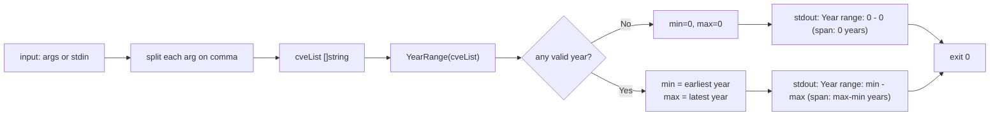

# cve year-range

:::tip 📂 View Source
[`cmd/stats.go:33`](https://github.com/scagogogo/cve-skills/blob/main/cmd/stats.go#L33-L50) — open the cobra command definition on GitHub (lines L33–L50).
:::

Find the earliest (minimum) and latest (maximum) year across a list of CVE identifiers and print the year span — a one-glance summary of how wide the dataset's time window is.

:::tip 🖥️ When to use
- Headline a security report with a "CVEs from YYYY to YYYY" range built straight from raw input.
- Sanity-check that an imported CVE list falls within an expected historical window before deeper analysis.
- Provide boundaries for year-bucketed visualizations or trend summaries in a shell pipeline.
:::

## Command syntax

```bash
cve year-range <cve-list>
```

The command takes one or more positional arguments, each of which may itself be a comma-separated list of CVE identifiers. When no arguments are supplied and stdin is piped, it reads CVEs line by line from stdin instead.

## Arguments and options

- `<cve-list>` (positional, required): One or more CVE identifiers, e.g. `CVE-2021-44228`. Multiple identifiers may be passed as separate arguments or as a single comma-separated value.
- The command defines **no flags** of its own. The global `-q, --quiet` flag is inherited from the root command.
- Input is resolved by `readInputs`: positional arguments take precedence; otherwise the command falls back to piped stdin (one CVE per non-empty line). If neither is available it errors with `requires at least 1 argument (CVE list)`.
- Each positional argument is further split on `,`, so `CVE-2020-1,CVE-2022-2` counts as two CVEs.

## Examples

Mixed years produce `min=2020`, `max=2022`, with a span of `2` years:

```bash
$ cve year-range CVE-2020-1111 CVE-2022-2222 CVE-2021-3333
Year range: 2020 - 2022 (span: 2 years)
```

A single CVE yields `min == max` and a span of `0`:

```bash
$ cve year-range CVE-2024-12345
Year range: 2024 - 2024 (span: 0 years)
```

Comma-separated values and separate arguments are equivalent — both span `2018..2019`:

```bash
$ cve year-range CVE-2019-9999,CVE-2018-1
Year range: 2018 - 2019 (span: 1 years)
```

Invalid entries are silently skipped; only valid CVEs contribute to the range:

```bash
$ cve year-range not-a-cve "" CVE-2018-1 CVE-2019-99999
Year range: 2018 - 2019 (span: 1 years)
```

Pipe a file of CVEs through stdin when arguments are inconvenient:

```bash
$ cat cves.txt | cve year-range
Year range: 2017 - 2023 (span: 6 years)
```

## How it works



## Corresponding Go API

This command is a thin wrapper around [`YearRange`](/api/functions/year-range), which scans a `[]string` of CVE identifiers and returns `(min, max int)`. The CLI splits each positional argument on `,`, hands the flattened slice to `YearRange`, and prints `Year range: <min> - <max> (span: <max-min> years)`. The span is computed in the CLI as `max - min` — the Go function returns only the two boundaries. Use the Go function directly when you need the numeric pair in code rather than formatted text.

## Exit codes and output

- Exit code `0`: the command ran to completion and printed one line to stdout.
- Exit code `1`: no input was available — neither positional arguments nor piped stdin. The error `requires at least 1 argument (CVE list)` is printed to stderr.
- stdout: a single line in the form `Year range: <min> - <max> (span: <span> years)`. With no valid CVE the values are `0 - 0 (span: 0 years)`.
- stderr: only the missing-input error above. The year range never goes to stderr.

## Notes

- An empty or all-invalid input prints `Year range: 0 - 0 (span: 0 years)` rather than erroring — `0` is the sentinel for "no data", mirroring the Go function's `0, 0` return. Treat a `0` boundary as the empty signal, not a real year.
- Year extraction is delegated to `ExtractCveYearAsInt`; entries that fail to parse a positive year are silently skipped, so the range reflects only valid CVEs.
- The result is purely descriptive — `YearRange` does not validate whether the years fall within the realistic `1999..currentYear` window. A hypothetical `CVE-1800-1` parses to year `1800` without error.
- For a per-year breakdown rather than just the boundaries, use `cve count-by-year`; for ordered output use `cve compare sort`.
- Letter case and surrounding whitespace are not normalized before scanning — pass already-formatted identifiers, or run `cve format` first.

## Internal Implementation

The cobra command `yearRangeCmd` (defined at `cmd/stats.go:33-50`) uses `RunE` so any returned error propagates to the shell. Its logic:

- **Input gathering**: calls `readInputs(args)` to collect positional args first, falling back to piped stdin (one CVE per non-empty line). If the resulting `inputs` slice is empty, it returns `fmt.Errorf("requires at least 1 argument (CVE list)")` — no flag parsing of its own.
- **Flattening**: iterates `inputs` and appends `strings.Split(input, ",")...` to a `[]string cveList`, so each argument is expanded into individual CVE tokens on commas.
- **Library call**: hands `cveList` to `cve.YearRange(cveList)`, which returns `(min, max int)` — the CLI itself does no year extraction; that logic lives in the library via `ExtractCveYearAsInt`.
- **Output formatting**: `fmt.Printf("Year range: %d - %d (span: %d years)\n", min, max, max-min)` writes a single line to stdout; the span `max-min` is computed inline by the CLI, not returned by the Go function.

## Argument Flow

```text
+-------------------+     +-----------------------+     +-------------------------+
| CLI args / stdin  -->  | readInputs(args)      | --> | []inputs                |
| (CVE-2020-1, ...) |     | args first, else stdin|     | (one entry per arg/line)|
+-------------------+     +-----------------------+     +-------------------------+
                                                                |
                                                                v
                          +-----------------------------------+
                          | for each input:                   |
                          |   cveList += strings.Split(",",   |
                          |                input)             |
                          +-----------------------------------+
                                |
                                v
                          +-------------------+
                          | cveList []string  |  (flat CVE tokens)
                          +-------------------+
                                |
                                v
                          +-----------------------------------+
                          | cve.YearRange(cveList)            |
                          |   -> ExtractCveYearAsInt per CVE  |
                          |   -> (min, max int)               |
                          +-----------------------------------+
                                |
                                v
                          +-----------------------------------+
                          | fmt.Printf(                       |
                          |   "Year range: %d - %d            |
                          |    (span: %d years)\n",           |
                          |   min, max, max-min)              |
                          | -> stdout                         |
                          +-----------------------------------+
                                |
                                v
                          +-------------------+
                          | exit 0 (return nil)|
                          +-------------------+
```

## Edge Cases

| Input | Behavior | Exit code / output |
| --- | --- | --- |
| No args, no piped stdin | `readInputs` returns empty slice; `RunE` returns `requires at least 1 argument (CVE list)` | Exit 1; error to stderr |
| Args present but all invalid (e.g. `not-a-cve ""`) | Tokens parsed but no valid year extracted; `YearRange` returns `0, 0` | Exit 0; stdout `Year range: 0 - 0 (span: 0 years)` |
| Empty string argument `""` | `strings.Split("", ",")` yields `[""]`; the empty token yields no year and is skipped | Exit 0; contributes nothing to range |
| Single CVE `CVE-2024-12345` | `min == max == 2024` | Exit 0; stdout `Year range: 2024 - 2024 (span: 0 years)` |
| Comma-separated `CVE-2019-1,CVE-2018-2` | Split into two tokens; both contribute | Exit 0; stdout `Year range: 2018 - 2019 (span: 1 years)` |
| Piped stdin only (no args) | `readInputs` reads non-empty lines as inputs; each line then splits on `,` | Exit 0; range reflects stdin CVEs |
| Hypothetical `CVE-1800-1` | Parses to year `1800`; no realism validation | Exit 0; `1800` may appear as a boundary |
| Mixed case / surrounding whitespace | Not normalized before scanning; may fail to parse a year | Exit 0; malformed entries skipped |

## Exit Codes

- **Success (exit 0)**: `RunE` returns `nil` after printing the single `Year range: ...` line to stdout. This includes the all-invalid / empty-input case, where `YearRange` returns `0, 0` and the command still exits 0.
- **Failure (exit 1)**: only when `readInputs` yields no inputs at all (neither args nor stdin). `RunE` returns `fmt.Errorf("requires at least 1 argument (CVE list)")`; cobra prints this error to stderr and sets the process exit code to 1. No other explicit error paths exist in the source — parse failures inside `YearRange` are swallowed and surface as `0` boundaries, not as errors.

## Related commands

- [cve count-by-year](/cli/commands/count-by-year) — group CVEs by year and count each.
- [cve filter by-year](/cli/commands/filter-by-year) — keep only CVEs of a given year.
- [cve filter by-year-range](/cli/commands/filter-by-year-range) — keep CVEs whose year falls within a range.
- [cve compare sort](/cli/commands/compare-sort) — sort a list ascending by year then sequence.
- [CLI Reference](/cli) — full command tree and I/O conventions.
