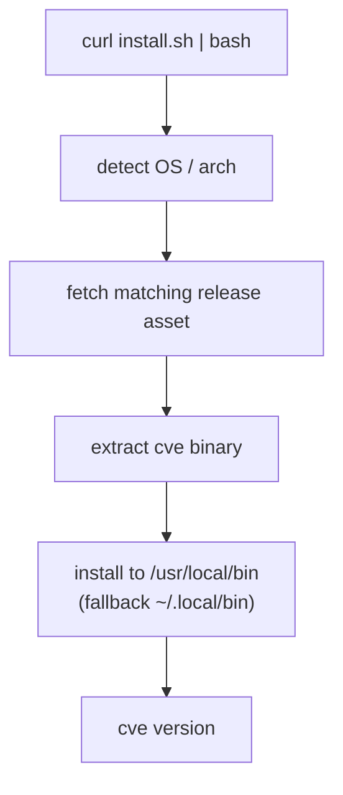

# Download & Install

The `cve` CLI ships as prebuilt static binaries for **every major OS/architecture** — AI agents can download and run directly, no toolchain required.

## One-line install (recommended)

```bash
# macOS / Linux — auto-detects platform
curl -fsSL https://raw.githubusercontent.com/scagogogo/cve-skills/main/scripts/install.sh | bash
```

The script downloads the right archive for your platform, extracts `cve`, and puts it on your `PATH`.



## From source (Go)

```bash
go install github.com/scagogogo/cve-skills/cmd/cve@latest
```

## Prebuilt binaries

Built by [goreleaser](https://goreleaser.com) on every `v*` tag — see the [Releases page](https://github.com/scagogogo/cve-skills/releases).

| OS | amd64 | arm64 | arm | 386 |
|----|:-----:|:-----:|:---:|:---:|
| **Linux** | ✅ tar.gz / deb / rpm / apk | ✅ | ✅ | ✅ |
| **macOS** | ✅ tar.gz | ✅ | — | — |
| **Windows** | ✅ zip | ✅ | — | — |
| **FreeBSD** | ✅ tar.gz | ✅ | — | — |

Every release includes a `checksums.txt` (SHA-256) for verification.

## Verify

```bash
sha256sum -c checksums.txt --ignore-missing
cve version
```

## Package managers

- **Linux (deb/rpm/apk)**: download the matching package from Releases and install with `dpkg -i` / `rpm -i` / `apk add`.

## Version

`cve version` prints the version injected at build time (e.g. `v0.1.0`). A locally-built binary from source reports `dev`.

## Next

Once installed, see the [CLI Reference](/cli) for every subcommand, its input method, and deterministic output.
