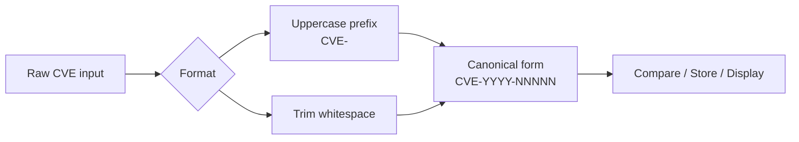

# Example: Format CVE

:::tip 📂 View Source
[`examples/01_format/main.go`](https://github.com/scagogogo/cve-skills/blob/main/examples/01_format/main.go) — open the full runnable example on GitHub.
:::

Normalize a single CVE identifier to its canonical form — uppercase, with surrounding whitespace trimmed — before you compare, store, or display it.

:::tip 🎯 Learning objectives
- See how `Format` converts a lowercase or mixed-case CVE prefix into the canonical `CVE-` form.
- See how `Format` strips leading and trailing whitespace from the input.
- Understand why normalizing before comparison/storage keeps every CVE in your pipeline consistent.
:::

## Scenario

You are ingesting CVE identifiers from several sources — a CSV export, a JSON feed, and free-text pasted into a web form. Each source has its own quirks: one lowercases the prefix (`cve-2022-12345`), another wraps the value in stray spaces (`" CVE-2021-44228 "`), a third mixes case (`Cve-2023-9999`). Before you compare two identifiers for equality, or persist them to a database, you want them all in one canonical shape. The `Format` function does exactly that: it returns the CVE uppercased and whitespace-trimmed, so downstream logic never has to guess.

## Complete code

```go
package main

import (
	"fmt"

	"github.com/scagogogo/cve-skills"
)

func main() {
	// 示例1：格式化包含小写字母的CVE编号
	// Format函数会将CVE编号转换为标准大写格式
	input1 := "cve-2022-12345"
	fmt.Printf("原始输入: %s\n", input1)
	fmt.Printf("格式化后: %s\n\n", cve.Format(input1))
	// 预期输出:
	// 原始输入: cve-2022-12345
	// 格式化后: CVE-2022-12345

	// 示例2：格式化包含空白字符的CVE编号
	// Format函数会移除CVE编号两侧的空白字符
	input2 := " CVE-2021-44228 "
	fmt.Printf("原始输入: %q\n", input2)
	fmt.Printf("格式化后: %q\n\n", cve.Format(input2))
	// 预期输出:
	// 原始输入: " CVE-2021-44228 "
	// 格式化后: "CVE-2021-44228"

	// 示例3：格式化混合大小写的CVE编号
	// Format函数会统一将CVE部分转为大写
	input3 := "Cve-2023-9999"
	fmt.Printf("原始输入: %s\n", input3)
	fmt.Printf("格式化后: %s\n", cve.Format(input3))
	// 预期输出:
	// 原始输入: Cve-2023-9999
	// 格式化后: CVE-2023-9999

	// 总结: Format函数可以用于在比较或存储CVE编号前进行标准化，
	// 确保所有CVE编号遵循相同的格式规范，便于后续处理
}
```

## How to run

```bash
cd examples/01_format && go run main.go
```

## Expected output

```text
原始输入: cve-2022-12345
格式化后: CVE-2022-12345

原始输入: " CVE-2021-44228 "
格式化后: "CVE-2021-44228"

原始输入: Cve-2023-9999
格式化后: CVE-2023-9999
```

## Code walkthrough

The program runs three small demonstrations that each isolate one normalization behaviour of `Format`:

- ▶️ **Lowercase prefix.** `input1` is `cve-2022-12345` — the prefix is fully lowercase. `cve.Format(input1)` returns `CVE-2022-12345`, demonstrating the uppercase rule. Printed with `%s`, the lowercase input and the uppercase output sit side by side.
- 📋 **Surrounding whitespace.** `input2` is `" CVE-2021-44228 "` — note the leading and trailing spaces. This time the code uses `%q`, which quotes the string so the spaces are visible. `cve.Format(input2)` returns `CVE-2021-44228`, and the `%q` output shows it as `"CVE-2021-44228"` with no padding.
- 💡 **Mixed case.** `input3` is `Cve-2023-9999` — a partially-capitalized prefix. `Format` normalizes the whole prefix to `CVE-`, yielding `CVE-2023-9999`. Back to `%s` for plain display.
- 🔗 **The takeaway.** The closing comment ties the three behaviours together: call `Format` before you compare or store an identifier so every CVE in your pipeline follows the same format and downstream processing never has to handle variants.



## Related functions

- [Format](/api/functions/format) — normalizes a CVE identifier to uppercase, whitespace-trimmed canonical form.

## Exercises

- 💡 Pass `Format` an already-canonical identifier (`CVE-2024-1234`) and confirm the output is unchanged — i.e. `Format` is idempotent.
- 💡 Build a tiny slice of messy inputs (`["cve-2020-1", " CVE-2020-2 ", "Cve-2020-3"]`), format each element, and verify the results are all comparable with `==` without further massaging.
- 💡 Pair `Format` with `Validate` in a small pipeline: format each raw input first, then validate the canonical form, and observe how normalization shrinks the number of validation edge cases you have to handle.
