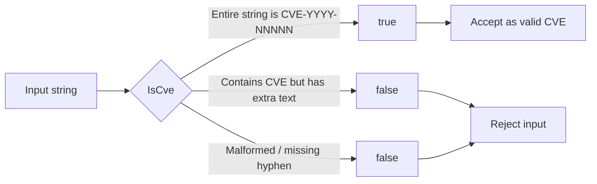

# Example: IsCve

:::tip 📂 View Source
[`examples/02_is_cve/main.go`](https://github.com/scagogogo/cve-skills/blob/main/examples/02_is_cve/main.go) — open the full runnable example on GitHub.
:::

Strictly validate whether a string is a standalone CVE identifier in the form `CVE-YYYY-NNNNN`.

:::tip 🎯 Learning objectives
- Understand that `IsCve` requires the entire string to be a CVE identifier, not just contain one.
- Learn that leading and trailing whitespace around the identifier is tolerated.
- Distinguish `IsCve` (exact, full-string match) from `IsContainsCve` (substring search).
:::

## Scenario

You are building a form where a user must type a single CVE identifier, for example to attach a CVE to a ticket. You cannot accept free-form text or sentences that merely mention a CVE — the value must itself be a valid CVE. `IsCve` is the gatekeeper: it returns `true` only when the whole string (after trimming surrounding whitespace) conforms to the `CVE-YYYY-NNNNN` shape. A pasted advisory sentence, a missing hyphen, or any extra characters all fail the check.

## Complete code

```go
package main

import (
	"fmt"

	"github.com/scagogogo/cve-skills"
)

func main() {
	// 示例1：检查标准格式的CVE编号
	// IsCve函数用于检查字符串是否是标准格式的CVE编号（形如CVE-YYYY-NNNNN）
	input1 := "CVE-2022-12345"
	fmt.Printf("输入: %q, 是否为CVE: %v\n", input1, cve.IsCve(input1))
	// 预期输出:
	// 输入: "CVE-2022-12345", 是否为CVE: true

	// 示例2：检查包含空白字符的CVE编号
	// IsCve函数允许CVE编号两侧有空白字符
	input2 := " CVE-2021-44228 "
	fmt.Printf("输入: %q, 是否为CVE: %v\n", input2, cve.IsCve(input2))
	// 预期输出:
	// 输入: " CVE-2021-44228 ", 是否为CVE: true

	// 示例3：检查非标准格式
	// IsCve函数要求整个字符串都是CVE编号，而不只是包含CVE编号
	input3 := "包含CVE-2023-9999的文本"
	fmt.Printf("输入: %q, 是否为CVE: %v\n", input3, cve.IsCve(input3))
	// 预期输出:
	// 输入: "包含CVE-2023-9999的文本", 是否为CVE: false

	// 示例4：检查错误格式
	// IsCve函数检查格式是否严格符合CVE-YYYY-NNNNN
	input4 := "CVE2022-12345" // 缺少连字符
	fmt.Printf("输入: %q, 是否为CVE: %v\n", input4, cve.IsCve(input4))
	// 预期输出:
	// 输入: "CVE2022-12345", 是否为CVE: false

	// 总结: IsCve函数用于严格验证字符串是否为独立的CVE编号，
	// 常用于验证用户输入的字符串是否为有效的CVE编号，
	// 与IsContainsCve不同，它要求整个字符串就是一个CVE编号
}
```

## How to run

```bash
cd examples/02_is_cve && go run main.go
```

## Expected output

```text
输入: "CVE-2022-12345", 是否为CVE: true
输入: " CVE-2021-44228 ", 是否为CVE: true
输入: "包含CVE-2023-9999的文本", 是否为CVE: false
输入: "CVE2022-12345", 是否为CVE: false
```

## Code walkthrough

The program runs four scenarios back to back, each one isolating a property of `IsCve`:

- ▶️ **Example 1 — a textbook CVE.** The input is `CVE-2022-12345`, matching `CVE-YYYY-NNNNN` exactly. `IsCve` returns `true`, confirming the happy path.
- 📋 **Example 2 — surrounding whitespace.** The input is `" CVE-2021-44228 "` with spaces on both sides. The function tolerates leading and trailing whitespace, so the result is still `true`.
- 💡 **Example 3 — a sentence that merely mentions a CVE.** The string is `"包含CVE-2023-9999的文本"`. Even though a valid CVE is embedded inside, `IsCve` returns `false` because it demands the entire string be a CVE, not just contain one.
- 🔗 **Example 4 — a malformed identifier.** The input `CVE2022-12345` is missing the first hyphen. The strict format check fails, so the result is `false`.

The closing comment summarizes the intent: `IsCve` strictly validates that a string is a standalone CVE identifier, which makes it ideal for validating user input — and it differs from `IsContainsCve`, which only checks for containment.



## Related functions

- [IsCve](/api/functions/is-cve) — the strict full-string validation demonstrated on this page.
- [IsContainsCve](/api/functions/is-contains-cve) — substring search when the surrounding text matters.
- [ValidateCve](/api/functions/validate-cve) — stricter validation that also checks the year and sequence ranges.

## Exercises

- 💡 Feed `IsCve` a lowercase identifier such as `cve-2022-12345` and observe whether the strict check is case-sensitive.
- 💡 Compare `IsCve` and `IsContainsCve` on the same input `"包含CVE-2023-9999的文本"` and explain why the two results differ.
- 💡 Build a small CLI that reads one line from `os.Stdin`, calls `IsCve`, and prints `valid` or `invalid` accordingly.
