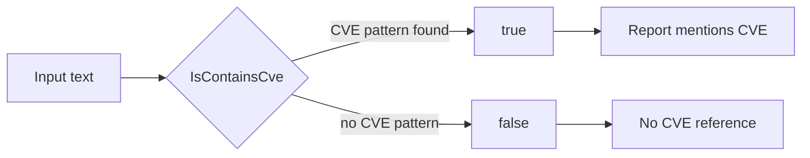

# Example: IsContainsCve

:::tip 📂 View Source
[`examples/03_is_contains_cve/main.go`](https://github.com/scagogogo/cve-skills/blob/main/examples/03_is_contains_cve/main.go) — open the full runnable example on GitHub.
:::

Detect whether an arbitrary piece of text mentions any CVE identifier — without requiring the whole string to be a CVE.

:::tip 🎯 Learning objectives
- Understand the difference between `IsCve` (exact match) and `IsContainsCve` (substring search).
- Learn that `IsContainsCve` is case-insensitive and works on mixed-language text.
- Be able to scan reports, articles, and logs for the presence of CVE numbers.
:::

## Scenario

You are triaging security advisories written in natural language. Each advisory is a free-form sentence that may or may not embed a CVE identifier. You do not need to extract the identifier yet — you only need a fast boolean answer: "does this text mention any CVE?" This is exactly what `IsContainsCve` is for. It scans the string for the CVE pattern and returns `true` as soon as it finds one, regardless of surrounding Chinese, English, or punctuation.

## Complete code

```go
package main

import (
	"fmt"

	"github.com/scagogogo/cve-skills"
)

func main() {
	// 示例1：检查包含一个CVE编号的文本
	// IsContainsCve函数用于检查字符串中是否包含CVE编号，不要求整个字符串就是CVE编号
	text1 := "系统受到CVE-2021-44228漏洞的影响，需要立即修复。"
	fmt.Printf("文本: %q\n", text1)
	fmt.Printf("是否包含CVE: %v\n\n", cve.IsContainsCve(text1))
	// 预期输出:
	// 文本: "系统受到CVE-2021-44228漏洞的影响，需要立即修复。"
	// 是否包含CVE: true

	// 示例2：检查包含多个CVE编号的文本
	// IsContainsCve函数只检查是否包含，不会提取出具体哪些CVE
	text2 := "安全公告：发现多个漏洞，包括CVE-2022-12345和CVE-2023-67890。"
	fmt.Printf("文本: %q\n", text2)
	fmt.Printf("是否包含CVE: %v\n\n", cve.IsContainsCve(text2))
	// 预期输出:
	// 文本: "安全公告：发现多个漏洞，包括CVE-2022-12345和CVE-2023-67890。"
	// 是否包含CVE: true

	// 示例3：检查不包含CVE编号的文本
	// 当文本中没有CVE编号时，返回false
	text3 := "这份文档中没有任何安全漏洞信息。"
	fmt.Printf("文本: %q\n", text3)
	fmt.Printf("是否包含CVE: %v\n\n", cve.IsContainsCve(text3))
	// 预期输出:
	// 文本: "这份文档中没有任何安全漏洞信息。"
	// 是否包含CVE: false

	// 示例4：检查包含小写cve编号的文本
	// IsContainsCve函数不区分大小写，能识别小写的cve编号
	text4 := "注意检查cve-2022-98765漏洞。"
	fmt.Printf("文本: %q\n", text4)
	fmt.Printf("是否包含CVE: %v\n", cve.IsContainsCve(text4))
	// 预期输出:
	// 文本: "注意检查cve-2022-98765漏洞。"
	// 是否包含CVE: true

	// 总结: IsContainsCve函数适用于从文章或报告中检测是否有提及CVE，
	// 与IsCve函数的区别在于它只检查包含关系，不要求整个字符串是CVE编号
}
```

## How to run

```bash
cd examples/03_is_contains_cve && go run main.go
```

## Expected output

```text
文本: "系统受到CVE-2021-44228漏洞的影响，需要立即修复。"
是否包含CVE: true

文本: "安全公告：发现多个漏洞，包括CVE-2022-12345和CVE-2023-67890。"
是否包含CVE: true

文本: "这份文档中没有任何安全漏洞信息。"
是否包含CVE: false

文本: "注意检查cve-2022-98765漏洞。"
是否包含CVE: true
```

## Code walkthrough

The program runs four scenarios back to back, each one isolating a property of `IsContainsCve`:

- ▶️ **Example 1 — single CVE embedded in a sentence.** The text is a Chinese sentence with `CVE-2021-44228` in the middle. `IsContainsCve` returns `true` because the CVE pattern is present as a substring, even though the surrounding text is not a CVE.
- 📋 **Example 2 — multiple CVEs in one string.** The advisory mentions `CVE-2022-12345` and `CVE-2023-67890`. The function only reports presence (`true`); it does not extract or count the identifiers. Use the extraction API when you need the list.
- 💡 **Example 3 — no CVE present.** A plain documentation string with no CVE returns `false`, confirming the function does not produce false positives on ordinary text.
- 🔗 **Example 4 — lowercase `cve-`.** The identifier is written `cve-2022-98765`. The match is case-insensitive, so the result is still `true`.

The closing comment contrasts `IsContainsCve` with `IsCve`: the former checks containment, the latter requires the entire string to be a CVE identifier.



## Related functions

- [IsContainsCve](/api/functions/is-contains-cve) — the containment check demonstrated on this page.
- [IsCve](/api/functions/is-cve) — strict full-string CVE validation.
- [ExtractCve](/api/functions/extract-cve) — when you need the actual identifiers, not just a boolean.

## Exercises

- 💡 Feed `IsContainsCve` a string that contains a malformed CVE such as `CVE-2021-4422` (too few digits) and observe whether it still matches.
- 💡 Combine `IsContainsCve` with `ExtractCve` to first detect, then list, every CVE in a multi-paragraph advisory.
- 💡 Build a small filter that reads lines from `os.Stdin` and prints only the lines where `IsContainsCve` is `true`.
