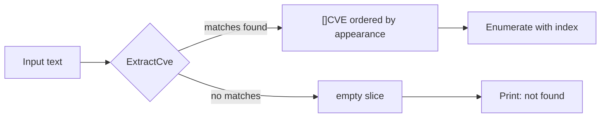

# Example: ExtractCve

:::tip 📂 View Source
[`examples/04_extract_cve/main.go`](https://github.com/scagogogo/cve-skills/blob/main/examples/04_extract_cve/main.go) — open the full runnable example on GitHub.
:::

Pull every CVE identifier out of a free-form piece of text and collect them into an ordered list.

:::tip 🎯 Learning objectives
- Use `ExtractCve` to scan arbitrary text and return all CVE identifiers it finds.
- Understand that the extraction is case-insensitive and preserves the order of first appearance.
- Handle the empty-result case gracefully when the text contains no CVE.
:::

## Scenario

You are parsing security advisories, release notes, and chat logs that mention CVE identifiers inline. You need the actual list of identifiers — not just a boolean "is there a CVE" — so you can deduplicate, sort, and cross-reference them against your vulnerability database. `ExtractCve` walks the string with the CVE regular expression and returns a slice of every match, in the order they appear. This makes it the natural entry point for any pipeline that turns unstructured text into structured CVE records.

## Complete code

```go
package main

import (
	"fmt"

	"github.com/scagogogo/cve-skills"
)

func main() {
	// 示例1：从文本中提取所有CVE编号
	text := `安全公告：系统受到多个漏洞影响，包括：
- cve-2021-44228（Log4Shell）
- CVE-2022-22965（Spring4Shell）
- CVE-2022-1234
建议尽快更新到最新版本。`

	fmt.Println("原始文本:")
	fmt.Println(text)

	fmt.Println("\n提取的CVE编号:")
	cveList := cve.ExtractCve(text)
	for i, c := range cveList {
		fmt.Printf("[%d] %s\n", i+1, c)
	}

	// 示例2：从不包含CVE的文本中提取
	text2 := "这个文本中不包含任何CVE编号。"
	fmt.Println("\n另一个示例文本:")
	fmt.Println(text2)

	cveList2 := cve.ExtractCve(text2)
	fmt.Println("\n提取的CVE编号:")
	if len(cveList2) == 0 {
		fmt.Println("未找到任何CVE编号")
	} else {
		for i, c := range cveList2 {
			fmt.Printf("[%d] %s\n", i+1, c)
		}
	}
}
```

## How to run

```bash
cd examples/04_extract_cve && go run main.go
```

## Expected output

```text
原始文本:
安全公告：系统受到多个漏洞影响，包括：
- cve-2021-44228（Log4Shell）
- CVE-2022-22965（Spring4Shell）
- CVE-2022-1234
建议尽快更新到最新版本。

提取的CVE编号:
[1] CVE-2021-44228
[2] CVE-2022-22965
[3] CVE-2022-1234

另一个示例文本:
这个文本中不包含任何CVE编号。

提取的CVE编号:
未找到任何CVE编号
```

## Code walkthrough

The program demonstrates two scenarios that cover the happy path and the empty path:

- ▶️ **Example 1 — extract from a multi-line advisory.** The text is a Chinese security bulletin listing three CVEs, the first of which is written in lowercase (`cve-2021-44228`). `ExtractCve` scans the whole string and returns three identifiers in the order they appear. Note that the lowercase prefix is normalized to `CVE-` in the result, confirming the match is case-insensitive while the returned identifiers use the canonical uppercase form.
- 💡 **Example 2 — text without any CVE.** A plain sentence with no CVE identifier produces an empty slice. The code guards the result with `len(cveList2) == 0` and prints a friendly "未找到任何CVE编号" message instead of iterating over nothing. This is the recommended pattern when the input may legitimately contain zero CVEs.

The first loop enumerates the results with `fmt.Printf("[%d] %s\n", i+1, c)`, using a 1-based index so the output reads naturally. The same print shape is reused in the second branch, keeping the output format consistent whether the list is populated or not.



## Related functions

- [ExtractCve](/api/functions/extract-cve) — the extraction function demonstrated on this page.
- [ExtractFirstCve](/api/functions/extract-first-cve) — return only the first match when you just need one.
- [ExtractLastCve](/api/functions/extract-last-cve) — return only the last match in the text.
- [IsContainsCve](/api/functions/is-contains-cve) — a boolean check when you only need to know whether any CVE is present.

## Exercises

- 💡 Pipe a multi-paragraph advisory through `ExtractCve` and then remove duplicates with `RemoveDuplicateCves` before reporting.
- 💡 Combine `ExtractCve` with `FilterValidCves` to discard any malformed identifiers that slipped into the text.
- 💡 Read lines from `os.Stdin`, call `ExtractCve` on each line, and print a flat list of every CVE across the whole input.
