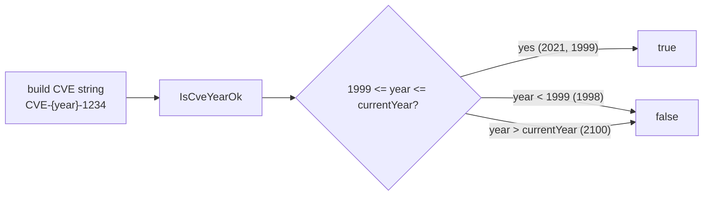

# Example: IsCveYearOk

:::tip 📂 View Source
[`examples/04_is_valid_cve_year/main.go`](https://github.com/scagogogo/cve-skills/blob/main/examples/04_is_valid_cve_year/main.go) — open the full runnable example on GitHub.
:::

Use `cve.IsCveYearOk` to verify that the year segment of a CVE identifier is within the valid range — no earlier than 1999 (when the CVE program began) and no later than the current year — by feeding it a full CVE string such as `CVE-2021-1234`.

:::tip 🎯 Learning objectives
- Understand the valid year range enforced by `IsCveYearOk` (1999 to the current year, inclusive)
- See how the function accepts a full CVE string and inspects only its year segment
- Recognize that years before 1999 and years beyond the current year are both rejected
:::

## Scenario

A vulnerability database ingests CVE identifiers contributed by analysts. A junior analyst hand-types a record as `CVE-1998-1234`, mistakenly believing the program predates 1999; another ticket references `CVE-2100-1234`, a placeholder for a vulnerability that cannot possibly exist yet. Before persisting either record the database runs the identifier through `IsCveYearOk`: the function receives the full CVE string, extracts the year segment, and rejects anything below 1999 or above the current year. This single check catches transcription errors and impossibly-dated entries without needing a separate parsing step.

## Full code

```go
package main

import (
	"fmt"

	"github.com/scagogogo/cve-skills"
)

func main() {
	// 示例1：检查有效的CVE年份
	// CVE编号的年份部分从1999年开始，到当前年份有效
	year1 := 2021
	fmt.Printf("年份: %d\n", year1)
	fmt.Printf("是否为有效的CVE年份: %v\n\n", cve.IsCveYearOk(fmt.Sprintf("CVE-%d-1234", year1)))
	// 预期输出:
	// 年份: 2021
	// 是否为有效的CVE年份: true

	// 示例2：检查1999年（CVE编号的第一个有效年份）
	// 1999年是CVE编号系统开始使用的年份，是有效的
	year2 := 1999
	fmt.Printf("年份: %d\n", year2)
	fmt.Printf("是否为有效的CVE年份: %v\n\n", cve.IsCveYearOk(fmt.Sprintf("CVE-%d-1234", year2)))
	// 预期输出:
	// 年份: 1999
	// 是否为有效的CVE年份: true

	// 示例3：检查1998年（早于CVE编号系统开始的年份）
	// 1999年之前的年份对CVE编号无效
	year3 := 1998
	fmt.Printf("年份: %d\n", year3)
	fmt.Printf("是否为有效的CVE年份: %v\n\n", cve.IsCveYearOk(fmt.Sprintf("CVE-%d-1234", year3)))
	// 预期输出:
	// 年份: 1998
	// 是否为有效的CVE年份: false

	// 示例4：检查未来年份
	// 超过当前年份的未来年份不是有效的CVE年份
	year4 := 2100
	fmt.Printf("年份: %d\n", year4)
	fmt.Printf("是否为有效的CVE年份: %v\n", cve.IsCveYearOk(fmt.Sprintf("CVE-%d-1234", year4)))
	// 预期输出(假设当前年份小于2100):
	// 年份: 2100
	// 是否为有效的CVE年份: false

	// 总结: IsCveYearOk函数用于验证一个CVE编号的年份部分是否有效
	// 有效范围: 1999年至当前年份(含)
}
```

## How to run

```bash
cd examples/04_is_valid_cve_year && go run main.go
```

## Expected output

The first three cases are fixed. The fourth case depends on the runtime year: `2100` is rejected only when the current year is below 2100 (which holds for any realistic run today). The block below reflects that assumption.

```text
年份: 2021
是否为有效的CVE年份: true

年份: 1999
是否为有效的CVE年份: true

年份: 1998
是否为有效的CVE年份: false

年份: 2100
是否为有效的CVE年份: false
```

## Code walkthrough

The program walks through four representative years, each time building a full CVE string with `fmt.Sprintf("CVE-%d-1234", year)` and passing it directly to `IsCveYearOk`.

- 📋 **A normal year passes** — `year1 = 2021` sits inside `[1999, currentYear]`, so `IsCveYearOk` returns `true`. The function accepts the entire CVE string; you do not have to extract the year yourself.
- ▶️ **The lower boundary is inclusive** — `year2 = 1999` is the very first year the CVE program published records, and the lower bound `1999` is inclusive, so it returns `true`.
- 💡 **Below 1999 is rejected** — `year3 = 1998` predates the CVE program, so the hard-coded lower bound of 1999 rules it out and the result is `false`.
- 🔗 **Beyond the current year is rejected** — `year4 = 2100` exceeds the current year (the upper bound is `time.Now().Year()`), so it returns `false` for any run whose current year is below 2100. The closing comment restates the rule: the valid range is `1999..currentYear`, inclusive at both ends.



## Related functions

- [IsCveYearOk](/api/functions/is-cve-year-ok) — strict year validation with cutoff 0
- [IsCveYearOkWithCutoff](/api/functions/is-cve-year-ok-with-cutoff) — validation with a configurable future-year tolerance
- [ExtractCveYear](/api/functions/extract-cve-year) — extract the year segment as a string
- [ExtractCveYearAsInt](/api/functions/extract-cve-year-as-int) — extract the year segment as an integer
- [ValidateCve](/api/functions/validate-cve) — full structural validation of a CVE identifier

## Extensions

- 🎯 Replace `year1` with `time.Now().Year()` (today's year) and confirm it still returns `true`, since the upper bound is inclusive.
- 🎯 Pass a malformed string such as `"CVE-20XX-1234"` to `IsCveYearOk` and verify it returns `false` because the year segment cannot be parsed.
- 🎯 Use `IsCveYearOkWithCutoff(cve, 10)` on the `2100` case and observe whether widening the upper bound by 10 years changes the verdict in your runtime year.
