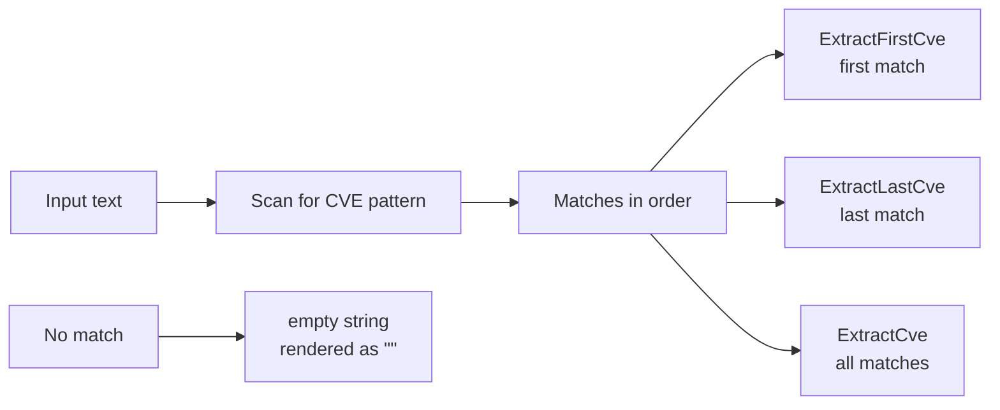

# Example: ExtractFirstCve / ExtractLastCve

:::tip 📂 View Source
[`examples/05_extract_first_last_cve/main.go`](https://github.com/scagogogo/cve-skills/blob/main/examples/05_extract_first_last_cve/main.go) — open the full runnable example on GitHub.
:::

Grab only the first or only the last CVE identifier from a body of text — without scanning the whole list yourself.

:::tip 🎯 Learning objectives
- Understand the difference between `ExtractFirstCve`, `ExtractLastCve`, and the full-list `ExtractCve`.
- Learn what each function returns when the text contains no CVE at all (the empty string, rendered as `""` by `%q`).
- Be able to pick the right extraction function when you only care about one boundary CVE.
:::

## Scenario

You are reading a security report that weaves several CVE identifiers into natural-language prose. Often you do not need the entire list — you only want the bookends. The first CVE is usually the earliest finding mentioned (handy for chronology), and the last CVE is the most recent discovery (handy for "what is still open"). Instead of calling `ExtractCve` and then indexing into a slice, you can reach directly for `ExtractFirstCve` and `ExtractLastCve`. They scan the text once and hand you a single identifier — or an empty string when nothing matches.

## Complete code

```go
package main

import (
	"fmt"

	"github.com/scagogogo/cve-skills"
)

func main() {
	text := `系统安全报告：
首先发现的漏洞是CVE-2021-44228，这是最严重的。
随后还发现了CVE-2022-22965和CVE-2022-33891。
最新发现的漏洞是CVE-2023-12345，正在评估中。`

	fmt.Println("原始文本:")
	fmt.Println(text)

	// 提取第一个CVE
	firstCve := cve.ExtractFirstCve(text)
	fmt.Printf("\n第一个CVE: %s\n", firstCve)

	// 提取最后一个CVE
	lastCve := cve.ExtractLastCve(text)
	fmt.Printf("最后一个CVE: %s\n", lastCve)

	// 提取所有CVE作为对比
	allCves := cve.ExtractCve(text)
	fmt.Println("\n所有CVE:")
	for i, c := range allCves {
		fmt.Printf("[%d] %s\n", i+1, c)
	}

	// 处理没有CVE的文本
	emptyText := "这个文本中没有任何CVE编号信息。"
	fmt.Printf("\n没有CVE的文本中的第一个CVE: %q\n", cve.ExtractFirstCve(emptyText))
	fmt.Printf("没有CVE的文本中的最后一个CVE: %q\n", cve.ExtractLastCve(emptyText))
}
```

## How to run

```bash
cd examples/05_extract_first_last_cve && go run main.go
```

## Expected output

```text
原始文本:
系统安全报告：
首先发现的漏洞是CVE-2021-44228，这是最严重的。
随后还发现了CVE-2022-22965和CVE-2022-33891。
最新发现的漏洞是CVE-2023-12345，正在评估中。

第一个CVE: CVE-2021-44228
最后一个CVE: CVE-2023-12345

所有CVE:
[1] CVE-2021-44228
[2] CVE-2022-22965
[3] CVE-2022-33891
[4] CVE-2023-12345

没有CVE的文本中的第一个CVE: ""
没有CVE的文本中的最后一个CVE: ""
```

## Code walkthrough

The program builds a single Chinese security report containing four CVEs in prose order, then exercises three extraction APIs on it:

- ▶️ **Print the source text.** `fmt.Println(text)` echoes the report verbatim so the rest of the output is easy to follow.
- 📋 **First CVE.** `cve.ExtractFirstCve(text)` returns the leftmost match `CVE-2021-44228` — the earliest finding in the report. You get a single string, no slice handling.
- 📋 **Last CVE.** `cve.ExtractLastCve(text)` returns the rightmost match `CVE-2023-12345` — the most recent discovery. Same single-string contract.
- 💡 **Full list for contrast.** `cve.ExtractCve(text)` returns every match as a slice; the `for i, c := range` loop prints them numbered from 1 via `i+1`. This confirms the two bookend functions agree with the first and last elements of the full list.
- 🔗 **Empty-text behaviour.** `emptyText` contains no CVE, so both `ExtractFirstCve` and `ExtractLastCve` return the empty string. Printed with `%q`, it shows up as `""`, which is the signal you check for when a report mentions no identifier.



## Related functions

- [ExtractFirstCve](/api/functions/extract-first-cve) — returns the first CVE found in the text.
- [ExtractLastCve](/api/functions/extract-last-cve) — returns the last CVE found in the text.
- [ExtractCve](/api/functions/extract-cve) — returns every CVE in the text as a slice.

## Exercises

- 💡 Feed `ExtractLastCve` a report whose most recent CVE is written in lowercase (`cve-2024-0001`) and confirm the match is still the last one.
- 💡 Combine `ExtractFirstCve` and `ExtractLastCve` to print a compact "earliest → latest" summary line for a multi-paragraph advisory, falling back to a "no CVE found" message when the result is empty.
- 💡 Benchmark `ExtractFirstCve` against `ExtractCve(text)[0]` on a large log file and reason about why the dedicated first-match function avoids collecting the rest of the matches.
