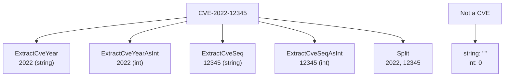

# Example: Extract Year & Seq

:::tip 📂 View Source
[`examples/06_extract_year_seq/main.go`](https://github.com/scagogogo/cve-skills/blob/main/examples/06_extract_year_seq/main.go) — open the full runnable example on GitHub.
:::

Pull just the year or just the sequence number out of a CVE identifier — as a string or as an integer — and see exactly what comes back when the input is not a CVE at all.

:::tip 🎯 Learning objectives
- Tell apart the four extraction helpers: `ExtractCveYear`, `ExtractCveYearAsInt`, `ExtractCveSeq`, and `ExtractCveSeqAsInt`.
- Understand what each function returns for an invalid input (empty string, zero) and why `%q` renders the empty string as `""`.
- Reach for `Split` as a one-call alternative when you want both halves at once.
:::

## Scenario

You are normalizing a feed of CVE identifiers and need to index every record by year and by sequence number. The raw identifiers arrive as strings like `CVE-2022-12345`, but downstream you sometimes want the year as an integer for range comparisons and the sequence as an integer for numeric sorting. Rather than splitting the string yourself and juggling `strconv` calls, the package gives you four dedicated extractors plus a `Split` helper. Each one returns a clean value for a well-formed CVE, and a safe zero value (empty string or `0`) for anything that does not parse — so you can detect bad input without a panic.

## Complete code

```go
package main

import (
	"fmt"

	"github.com/scagogogo/cve-skills"
)

func main() {
	// 示例CVE编号
	cveID := "CVE-2022-12345"
	fmt.Printf("CVE编号: %s\n\n", cveID)

	// 提取年份（字符串形式）
	year := cve.ExtractCveYear(cveID)
	fmt.Printf("年份(字符串): %s\n", year)

	// 提取年份（整数形式）
	yearInt := cve.ExtractCveYearAsInt(cveID)
	fmt.Printf("年份(整数): %d\n\n", yearInt)

	// 提取序列号（字符串形式）
	seq := cve.ExtractCveSeq(cveID)
	fmt.Printf("序列号(字符串): %s\n", seq)

	// 提取序列号（整数形式）
	seqInt := cve.ExtractCveSeqAsInt(cveID)
	fmt.Printf("序列号(整数): %d\n\n", seqInt)

	// 演示处理无效输入
	invalidCve := "这不是CVE格式"
	fmt.Printf("无效输入: %s\n", invalidCve)
	fmt.Printf("无效输入的年份(字符串): %q\n", cve.ExtractCveYear(invalidCve))
	fmt.Printf("无效输入的年份(整数): %d\n", cve.ExtractCveYearAsInt(invalidCve))
	fmt.Printf("无效输入的序列号(字符串): %q\n", cve.ExtractCveSeq(invalidCve))
	fmt.Printf("无效输入的序列号(整数): %d\n", cve.ExtractCveSeqAsInt(invalidCve))

	// 使用Split函数作为替代方法
	fmt.Println("\n使用Split函数:")
	splitYear, splitSeq := cve.Split(cveID)
	fmt.Printf("Split解析的年份: %s\n", splitYear)
	fmt.Printf("Split解析的序列号: %s\n", splitSeq)
}
```

## How to run

```bash
cd examples/06_extract_year_seq && go run main.go
```

## Expected output

```text
CVE编号: CVE-2022-12345

年份(字符串): 2022
年份(整数): 2022

序列号(字符串): 12345
序列号(整数): 12345

无效输入: 这不是CVE格式
无效输入的年份(字符串): ""
无效输入的年份(整数): 0
无效输入的序列号(字符串): ""
无效输入的序列号(整数): 0

使用Split函数:
Split解析的年份: 2022
Split解析的序列号: 12345
```

## Code walkthrough

The program takes a single CVE identifier and exercises every year/sequence extractor on it, then repeats the same calls on garbage input to show the failure contract, and finally demos `Split`:

- 📋 **Year as string.** `cve.ExtractCveYear(cveID)` returns `"2022"` — the year segment kept as a string, useful when you just want to echo or concatenate it.
- 📋 **Year as integer.** `cve.ExtractCveYearAsInt(cveID)` returns `2022` — the same segment parsed to an `int`, so you can do range checks like "is this CVE from after 2020?".
- 📋 **Sequence as string.** `cve.ExtractCveSeq(cveID)` returns `"12345"` — the sequence segment kept as a string, handy for display or padding.
- 📋 **Sequence as integer.** `cve.ExtractCveSeqAsInt(cveID)` returns `12345` — the sequence parsed to an `int`, so you can sort CVEs from the same year numerically instead of lexicographically.
- 💡 **Invalid input.** The string `"这不是CVE格式"` is not a CVE. The string extractors return the empty string (rendered as `""` by `%q`), and the integer extractors return `0`. No error, no panic — the zero values are the signal you check for.
- 🔗 **Split as alternative.** `cve.Split(cveID)` returns both halves at once as `(year, seq)`. When you need both, one call beats two separate extractors.



## Related functions

- [ExtractCveYear](/api/functions/extract-cve-year) — returns the year segment as a string.
- [ExtractCveYearAsInt](/api/functions/extract-cve-year-as-int) — returns the year segment as an int.
- [ExtractCveSeq](/api/functions/extract-cve-seq) — returns the sequence segment as a string.
- [ExtractCveSeqAsInt](/api/functions/extract-cve-seq-as-int) — returns the sequence segment as an int.
- [Split](/api/functions/split) — returns both the year and the sequence in one call.

## Exercises

- 💡 Feed the extractors a CVE with a sequence longer than five digits (for example `CVE-2024-999999`) and confirm `ExtractCveSeqAsInt` still returns the full integer.
- 💡 Build a small index that groups CVEs by `ExtractCveYearAsInt` and sorts each group by `ExtractCveSeqAsInt`, then compare the output to a lexicographic sort of the raw identifiers.
- 💡 Wrap the four extractors in a guard that prints a "skipped invalid input" warning whenever the string result is empty, and count how many records in a sample feed get skipped.
