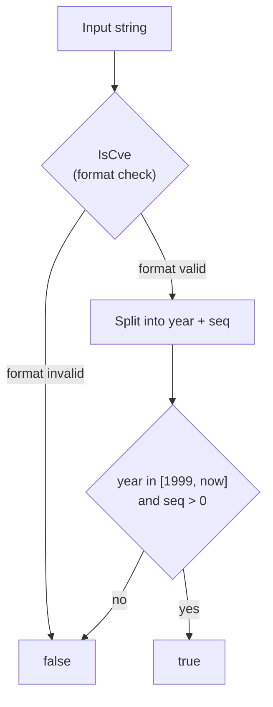

# Example: ValidateCve

:::tip 📂 View Source
[`examples/08_validate_cve/main.go`](https://github.com/scagogogo/cve-skills/blob/main/examples/08_validate_cve/main.go) — open the full runnable example on GitHub.
:::

Run a full validation pass on a CVE identifier — format, year range, and sequence number — all in one boolean call.

:::tip 🎯 Learning objectives
- Understand the three rules `ValidateCve` enforces: format, year range, and positive sequence number.
- See why a future-year CVE or an embedded CVE inside a sentence is rejected.
- Be able to filter user input down to identifiers that are safe to look up in a vulnerability database.
:::

## Scenario

You are ingesting CVE identifiers typed by hand into a triage tool. Users paste CVEs copied from emails, chat messages, and PDF reports, and the data is messy: some entries are missing the hyphen, some embed the CVE inside a sentence, and some quote a year that has not happened yet. Before you hit the NVD API with any of these strings, you need a single strict gatekeeper that rejects everything that is not a clean, year-valid CVE. `ValidateCve` is that gatekeeper: it returns `true` only when the whole string is a well-formed `CVE-YYYY-NNNNN` whose year falls between 1999 and the current year and whose sequence number is a positive integer.

## Complete code

```go
package main

import (
	"fmt"
	"time"

	"github.com/scagogogo/cve-skills"
)

func main() {
	currentYear := time.Now().Year()

	fmt.Println("CVE全面验证示例:")

	// 有效的CVE示例
	validCVEs := []string{
		fmt.Sprintf("CVE-%d-12345", currentYear),   // 当前年份
		fmt.Sprintf("CVE-%d-12345", currentYear-1), // 去年
		"CVE-2020-1234", // 2020年
		"CVE-1999-0001", // 较早的CVE
	}

	fmt.Println("\n有效的CVE示例:")
	for _, id := range validCVEs {
		fmt.Printf("%s: %v\n", id, cve.ValidateCve(id))
	}

	// 无效的CVE示例
	invalidCVEs := []string{
		fmt.Sprintf("CVE-%d-12345", currentYear+1), // 未来年份
		"CVE-1998-1234",      // 早于1999
		"CVE-2022-ABC",       // 序列号不是数字
		"CVE2022-1234",       // 格式错误，缺少连字符
		"包含CVE-2022-1234的文本", // 非独立CVE
		"cve-2022--1234",     // 双连字符
		"CVE-2022-0",         // 序列号太短
	}

	fmt.Println("\n无效的CVE示例:")
	for _, id := range invalidCVEs {
		fmt.Printf("%s: %v\n", id, cve.ValidateCve(id))
	}

	// 解释验证规则
	fmt.Println("\nValidateCve函数验证规则说明:")
	fmt.Println("1. 必须是完整的CVE格式 (如 'CVE-YYYY-NNNNN')")
	fmt.Println("2. 年份必须在1999年至当前年份之间")
	fmt.Println("3. 序列号必须是正整数")
}
```

## How to run

```bash
cd examples/08_validate_cve && go run main.go
```

## Expected output

The output depends on the year the program runs. With `currentYear = 2026`:

```text
CVE全面验证示例:

有效的CVE示例:
CVE-2026-12345: true
CVE-2025-12345: true
CVE-2020-1234: true
CVE-1999-0001: true

无效的CVE示例:
CVE-2027-12345: false
CVE-1998-1234: false
CVE-2022-ABC: false
CVE2022-1234: false
包含CVE-2022-1234的文本: false
cve-2022--1234: false
CVE-2022-0: false

ValidateCve函数验证规则说明:
1. 必须是完整的CVE格式 (如 'CVE-YYYY-NNNNN')
2. 年份必须在1999年至当前年份之间
3. 序列号必须是正整数
```

## Code walkthrough

The program builds two slices — one of identifiers expected to pass, one of identifiers expected to fail — and feeds each through `cve.ValidateCve`. It computes `currentYear := time.Now().Year()` so that the boundary cases (current year, last year, next year) move with the clock.

- ▶️ **Valid block.** Four identifiers are constructed to sit inside the legal range. `CVE-{currentYear}-12345` and `CVE-{currentYear-1}-12345` exercise the upper boundary: today and yesterday are both accepted. `CVE-2020-1234` is a normal historical entry. `CVE-1999-0001` pins the lower boundary — 1999 is the first year the CVE program recognizes, and a sequence number of `0001` is still a positive integer, so it passes.
- 📋 **Invalid block.** Seven identifiers each break exactly one rule. `CVE-{currentYear+1}-12345` is a future year, rejected by the year upper bound. `CVE-1998-1234` predates 1999. `CVE-2022-ABC` has a non-numeric sequence. `CVE2022-1234` drops the first hyphen, breaking format. `包含CVE-2022-1234的文本` is a sentence that merely contains a CVE rather than being one. `cve-2022--1234` introduces a double hyphen. `CVE-2022-0` has a sequence of zero, which is not a positive integer.
- 💡 **Rule summary.** The closing `fmt.Println` block restates the three rules so the program is self-documenting: full `CVE-YYYY-NNNNN` format, year in `[1999, currentYear]`, and a positive integer sequence number.



## Related functions

- [ValidateCve](/api/functions/validate-cve) — the single-string validator demonstrated on this page.
- [ValidateCves](/api/functions/validate-cves) — batch version that returns a per-item result slice.
- [IsCve](/api/functions/is-cve) — the format-only check that `ValidateCve` calls first.

## Exercises

- 💡 Replace the `currentYear+1` entry with a hardcoded `CVE-1999-0001` and a `CVE-1998-0001` pair to confirm the boundary is inclusive on the 1999 side.
- 💡 Feed the same seven invalid strings through `IsCve` and compare which ones `IsCve` alone would catch versus which need the year/sequence rules of `ValidateCve`.
- 💡 Build a pipeline that reads identifiers from `os.Stdin`, runs `ValidateCve` on each line, and prints only the rejected ones together with a short reason.
