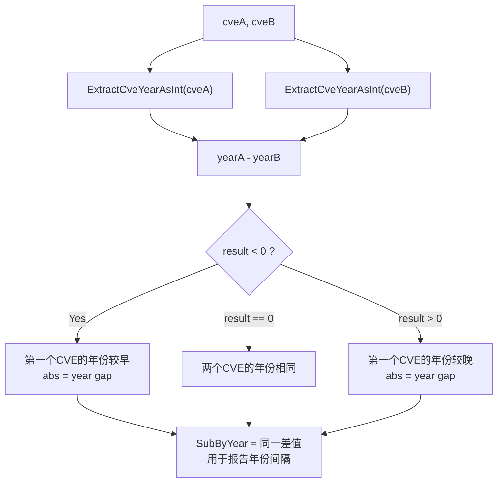

# Example: CompareByYear

:::tip 📂 View Source
[`examples/09_compare_by_year/main.go`](https://github.com/scagogogo/cve-skills/blob/main/examples/09_compare_by_year/main.go) — open the full runnable example on GitHub.
:::

Compare two CVE identifiers purely by their year segment with `cve.CompareByYear`. It subtracts the year of the second CVE from the year of the first and returns the raw integer difference, so the sign tells you which CVE is earlier while the magnitude tells you how many years apart they are.

:::tip 🎯 Learning objectives
- Understand the signature and behavior of `cve.CompareByYear` and its alias `cve.SubByYear`
- See how the raw year difference differs from the `-1 / 0 / 1` contract of `CompareCves`
- Use the sign and magnitude together to order CVEs and measure the year gap between them
:::

## Scenario

A vulnerability researcher is building a timeline of disclosures and wants to know not just which of two CVEs came first, but how many years separate them. Comparing only the year segment with `cve.CompareByYear` returns `yearA - yearB`: a negative value means the first CVE was disclosed earlier, a positive value means later, and the absolute value is the year gap. The companion call `cve.SubByYear` is an alias that returns the same difference and reads naturally when the gap itself, rather than the ordering, is what matters. The example exercises a cross-year pair, a same-year pair, and a reversed pair to confirm the comparator is antisymmetric.

## Full code

```go
package main

import (
	"fmt"

	"github.com/scagogogo/cve-skills"
)

func main() {
	// 比较不同年份的CVE
	cve1 := "CVE-2020-1234"
	cve2 := "CVE-2022-5678"

	fmt.Printf("比较 %s 和 %s:\n", cve1, cve2)

	// 使用CompareByYear比较
	result := cve.CompareByYear(cve1, cve2)
	if result < 0 {
		fmt.Printf("CompareByYear结果: %d (第一个CVE的年份较早)\n", result)
	} else if result > 0 {
		fmt.Printf("CompareByYear结果: %d (第一个CVE的年份较晚)\n", result)
	} else {
		fmt.Printf("CompareByYear结果: %d (两个CVE的年份相同)\n", result)
	}

	// 使用SubByYear计算年份差
	diff := cve.SubByYear(cve1, cve2)
	fmt.Printf("SubByYear结果: %d (两个CVE的年份相差%d年)\n\n", diff, abs(diff))

	// 比较相同年份的CVE
	cve3 := "CVE-2022-1111"
	cve4 := "CVE-2022-9999"

	fmt.Printf("比较 %s 和 %s:\n", cve3, cve4)

	// 使用CompareByYear比较
	result2 := cve.CompareByYear(cve3, cve4)
	fmt.Printf("CompareByYear结果: %d (年份相同)\n", result2)

	// 使用SubByYear计算年份差
	diff2 := cve.SubByYear(cve3, cve4)
	fmt.Printf("SubByYear结果: %d (年份相同，无差异)\n\n", diff2)

	// 反向比较
	fmt.Printf("反向比较 %s 和 %s:\n", cve2, cve1)
	fmt.Printf("CompareByYear结果: %d\n", cve.CompareByYear(cve2, cve1))
	fmt.Printf("SubByYear结果: %d\n", cve.SubByYear(cve2, cve1))
}

// 辅助函数：计算绝对值
func abs(x int) int {
	if x < 0 {
		return -x
	}
	return x
}
```

## How to run

```bash
cd examples/09_compare_by_year && go run main.go
```

## Expected output

```text
比较 CVE-2020-1234 和 CVE-2022-5678:
CompareByYear结果: -2 (第一个CVE的年份较早)
SubByYear结果: -2 (两个CVE的年份相差2年)

比较 CVE-2022-1111 和 CVE-2022-9999:
CompareByYear结果: 0 (年份相同)
SubByYear结果: 0 (年份相同，无差异)

反向比较 CVE-2022-5678 和 CVE-2020-1234:
CompareByYear结果: 2
SubByYear结果: 2
```

## Code walkthrough

The example walks through three comparison shapes that highlight the raw-difference behavior of `CompareByYear` and its alias `SubByYear`.

- 📋 **Different years** — `CVE-2020-1234` vs `CVE-2022-5678`: `CompareByYear` computes `2020 - 2022 = -2`. The negative sign triggers the "earlier" branch and the magnitude `2` is the year gap, recovered with the local `abs` helper and printed by `SubByYear`.
- ▶️ **Same year, different sequence** — `CVE-2022-1111` vs `CVE-2022-9999`: the year segments are equal, so `CompareByYear` returns `0` regardless of the sequence numbers. This is the key difference from `CompareCves`, which would descend into the sequence and return `-1`.
- 🔗 **Reversed order** — swapping the arguments flips the sign from `-2` to `2`, confirming the comparator is antisymmetric while preserving the magnitude, which is exactly what `SubByYear` exposes as the year gap.
- 💡 **Sign vs magnitude** — `CompareByYear` and `SubByYear` return the same integer; the `< 0 / > 0` branches consume only the sign, while `abs(diff)` consumes the magnitude, so one call serves both an ordering decision and a gap measurement.



## Related functions

- [CompareByYear](/api/functions/compare-by-year) — the function used in this example
- [SubByYear](/api/functions/sub-by-year) — alias of `CompareByYear`, reads as a year subtraction
- [CompareCves](/api/functions/compare-cves) — year-then-sequence comparator returning `-1 / 0 / 1`
- [ExtractCveYearAsInt](/api/functions/extract-cve-year-as-int) — the year extractor that powers the subtraction
- [SortCves](/api/functions/sort-cves) — sort a CVE slice using the full comparator

## Extensions

- 🎯 Replace `CompareByYear` with `CompareCves` on the same-year pair and confirm the result changes from `0` to `-1`, proving the sequence is only consulted by the full comparator.
- 🎯 Feed a slice of CVEs into `sort.Slice` using `cve.CompareByYear` as the less function and observe that CVEs sharing a year keep their original relative order (the sort is stable on the sequence within a year).
- 🎯 Pass an invalid string such as `"CVE-2021-44228-xxx"` as one operand and observe that its year still parses to `2021`, then pass `"not-a-cve"` and confirm it falls back to year `0`.
