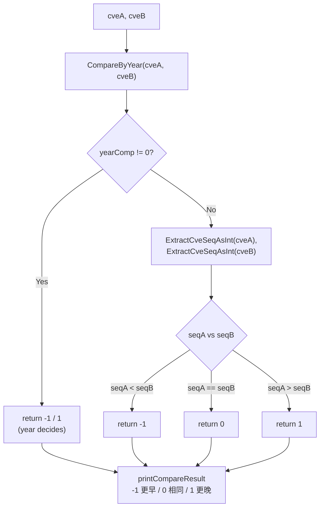

# Example: CompareCves

:::tip 📂 View Source
[`examples/10_compare_cves/main.go`](https://github.com/scagogogo/cve-skills/blob/main/examples/10_compare_cves/main.go) — open the full runnable example on GitHub.
:::

Compare two CVE identifiers end to end with `cve.CompareCves`. It compares the year first and then the sequence number, returning a stable `-1 / 0 / 1` result that tells you which CVE is earlier and is ready to drop into `sort.Slice`.

:::tip 🎯 Learning objectives
- Understand the signature and behavior of `cve.CompareCves`
- See how year-first, sequence-second comparison handles same-year, identical, and reversed pairs
- Use the return value to decide the chronological order of two CVEs in a real workflow
:::

## Scenario

A vulnerability analyst is correlating two well-known exploits — Log4Shell (`CVE-2021-44228`) and Spring4Shell (`CVE-2022-22965`) — and needs to confirm which one was disclosed first. Comparing CVE strings as plain text would be wrong (the sequence digits are not zero-padded across years), so the analyst reaches for `CompareCves`, which compares the year first and then the sequence number, and returns `-1` when the first CVE is earlier, `0` when they are identical, and `1` when the first is later. The same call also handles edge cases such as identical CVEs written in different cases and reversed argument order.

## Full code

```go
package main

import (
	"fmt"

	"github.com/scagogogo/cve-skills"
)

func main() {
	fmt.Println("CVE完整比较示例")
	// 预期输出:
	// CVE完整比较示例

	// 比较不同年份的CVE
	cve1 := "CVE-2020-1234"
	cve2 := "CVE-2022-5678"

	fmt.Printf("1. 比较不同年份的CVE: %s 和 %s\n", cve1, cve2)
	result1 := cve.CompareCves(cve1, cve2)
	printCompareResult(result1)
	// 预期输出:
	// 1. 比较不同年份的CVE: CVE-2020-1234 和 CVE-2022-5678
	// CompareCves结果: -1 (第一个CVE更早)

	// 比较相同年份但不同序列号的CVE
	cve3 := "CVE-2022-1111"
	cve4 := "CVE-2022-9999"

	fmt.Printf("\n2. 比较相同年份不同序列号的CVE: %s 和 %s\n", cve3, cve4)
	result2 := cve.CompareCves(cve3, cve4)
	printCompareResult(result2)
	// 预期输出:
	// 2. 比较相同年份不同序列号的CVE: CVE-2022-1111 和 CVE-2022-9999
	// CompareCves结果: -1 (第一个CVE更早)

	// 比较完全相同的CVE
	cve5 := "CVE-2022-1111"
	cve6 := "cve-2022-1111" // 大小写不同，但格式化后相同

	fmt.Printf("\n3. 比较完全相同的CVE (大小写不同): %s 和 %s\n", cve5, cve6)
	result3 := cve.CompareCves(cve5, cve6)
	printCompareResult(result3)
	// 预期输出:
	// 3. 比较完全相同的CVE (大小写不同): CVE-2022-1111 和 cve-2022-1111
	// CompareCves结果: 0 (两个CVE完全相同)

	// 反向比较
	fmt.Printf("\n4. 反向比较: %s 和 %s\n", cve2, cve1)
	result4 := cve.CompareCves(cve2, cve1)
	printCompareResult(result4)
	// 预期输出:
	// 4. 反向比较: CVE-2022-5678 和 CVE-2020-1234
	// CompareCves结果: 1 (第一个CVE更晚)

	// 演示使用场景
	fmt.Println("\n5. 使用场景示例 - 确定两个CVE的时间顺序:")
	cveA := "CVE-2021-44228" // Log4Shell漏洞
	cveB := "CVE-2022-22965" // Spring4Shell漏洞

	fmt.Printf("比较 %s 和 %s:\n", cveA, cveB)

	result := cve.CompareCves(cveA, cveB)
	if result < 0 {
		fmt.Printf("%s 出现在 %s 之前\n", cveA, cveB)
	} else if result > 0 {
		fmt.Printf("%s 出现在 %s 之后\n", cveA, cveB)
	} else {
		fmt.Printf("%s 和 %s 在同一时间点发布\n", cveA, cveB)
	}
	// 预期输出:
	// 5. 使用场景示例 - 确定两个CVE的时间顺序:
	// 比较 CVE-2021-44228 和 CVE-2022-22965:
	// CVE-2021-44228 出现在 CVE-2022-22965 之前
}

// 辅助函数：打印比较结果
func printCompareResult(result int) {
	fmt.Printf("CompareCves结果: %d ", result)
	switch result {
	case -1:
		fmt.Println("(第一个CVE更早)")
	case 0:
		fmt.Println("(两个CVE完全相同)")
	case 1:
		fmt.Println("(第一个CVE更晚)")
	}
}
```

## How to run

```bash
cd examples/10_compare_cves && go run main.go
```

## Expected output

```text
CVE完整比较示例
1. 比较不同年份的CVE: CVE-2020-1234 和 CVE-2022-5678
CompareCves结果: -1 (第一个CVE更早)

2. 比较相同年份不同序列号的CVE: CVE-2022-1111 和 CVE-2022-9999
CompareCves结果: -1 (第一个CVE更早)

3. 比较完全相同的CVE (大小写不同): CVE-2022-1111 和 cve-2022-1111
CompareCves结果: 0 (两个CVE完全相同)

4. 反向比较: CVE-2022-5678 和 CVE-2020-1234
CompareCves结果: 1 (第一个CVE更晚)

5. 使用场景示例 - 确定两个CVE的时间顺序:
比较 CVE-2021-44228 和 CVE-2022-22965:
CVE-2021-44228 出现在 CVE-2022-22965 之前
```

## Code walkthrough

The example walks through four comparison shapes and then applies the result to a real ordering decision.

- 📋 **Different years** — `CVE-2020-1234` vs `CVE-2022-5678`: the year segment differs, so `CompareCves` decides immediately and returns `-1` without looking at the sequence.
- ▶️ **Same year, different sequence** — `CVE-2022-1111` vs `CVE-2022-9999`: the years are equal, so the sequence numbers `1111` and `9999` are extracted and compared, again yielding `-1`.
- 💡 **Case-insensitive equality** — `CVE-2022-1111` vs `cve-2022-1111`: the inputs differ only in case, but the library normalizes the format internally, so both year and sequence match and the result is `0`.
- 🔗 **Reversed order** — swapping the arguments flips the sign to `1`, confirming the comparator is antisymmetric.
- 🎯 **Real workflow** — `CVE-2021-44228` (Log4Shell) vs `CVE-2022-22965` (Spring4Shell): a single `< 0` branch tells the analyst that Log4Shell was disclosed first, which is exactly the `cmp` contract that `sort.Slice` expects.



## Related functions

- [CompareCves](/api/functions/compare-cves) — the function used in this example
- [CompareByYear](/api/functions/compare-by-year) — compare by year only (returns the raw year difference)
- [SortCves](/api/functions/sort-cves) — sort and standardize a CVE slice using this comparator
- [SubByYear](/api/functions/sub-by-year) — year difference alias of `CompareByYear`
- [DiffCves](/api/functions/diff-cves) — set difference between two CVE collections

## Extensions

- 🎯 Feed `CompareCves` into `sort.Slice` to order a list of CVEs chronologically and verify the output matches the year-then-sequence rule.
- 🎯 Pass an invalid string such as `"CVE-2021-44228-xxx"` as one operand and observe that it falls back to year `0` / sequence `0` and sorts to the front.
- 🎯 Combine `CompareCves` with `RemoveDuplicateCves` to deduplicate a list and then sort it into a single canonical timeline.
