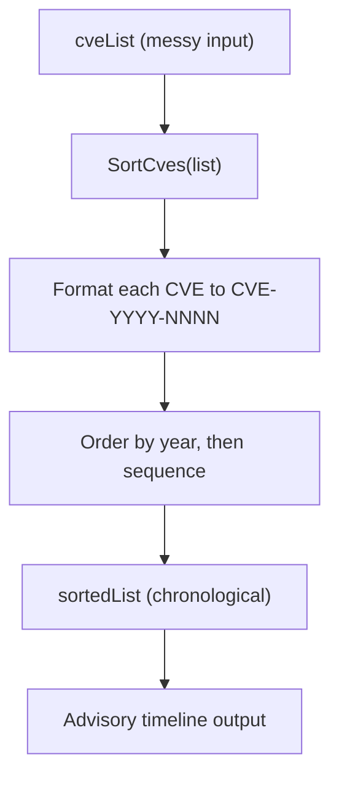

# Example: SortCves

:::tip 📂 View Source
[`examples/11_sort_cves/main.go`](https://github.com/scagogogo/cve-skills/blob/main/examples/11_sort_cves/main.go) — open the full runnable example on GitHub.
:::

Order a messy CVE list chronologically with `cve.SortCves`. The function also normalizes every identifier to the canonical `CVE-YYYY-NNNN` form, so a single call both formats and sorts.

:::tip 🎯 Learning objectives
- Understand the signature and behavior of `cve.SortCves`
- See how lowercase prefixes, extra whitespace, and out-of-order years are handled in one pass
- Build a chronologically ordered security-advisory view from a raw CVE feed
:::

## Scenario

A vulnerability management dashboard pulls CVE identifiers from several feeds, and the input order is essentially random: some entries are lowercase, some carry leading whitespace, and the years are interleaved. Before publishing the advisory timeline, the team needs every identifier normalized to the canonical `CVE-YYYY-NNNN` form and sorted first by year, then by sequence number. `SortCves` does both jobs in a single call — it formats every entry and returns a new slice ordered by year and sequence.

## Full code

```go
package main

import (
	"fmt"

	"github.com/scagogogo/cve-skills"
)

func main() {
	fmt.Println("CVE排序示例")
	// 预期输出:
	// CVE排序示例

	// 创建一个混乱顺序的CVE列表
	cveList := []string{
		"CVE-2022-22965", // Spring4Shell
		"cve-2021-44228", // Log4Shell (小写格式)
		"CVE-2022-1234",  // 随机示例
		"CVE-2020-1337",  // 较早的CVE
		"CVE-2022-0000",  // 相同年份，序列号较小
		" CVE-2023-9999", // 带有空格的CVE
	}

	fmt.Println("原始CVE列表:")
	printCveList(cveList)
	// 预期输出:
	// 原始CVE列表:
	// [1] CVE-2022-22965
	// [2] cve-2021-44228
	// [3] CVE-2022-1234
	// [4] CVE-2020-1337
	// [5] CVE-2022-0000
	// [6]  CVE-2023-9999

	// 使用SortCves函数对列表进行排序
	sortedList := cve.SortCves(cveList)

	fmt.Println("\n排序后的CVE列表:")
	printCveList(sortedList)
	// 预期输出:
	// 排序后的CVE列表:
	// [1] CVE-2020-1337
	// [2] CVE-2021-44228
	// [3] CVE-2022-0000
	// [4] CVE-2022-1234
	// [5] CVE-2022-22965
	// [6] CVE-2023-9999

	// 演示SortCves函数的格式化功能
	fmt.Println("\n注意事项:")
	fmt.Println("1. SortCves函数会自动对所有CVE进行格式化")
	fmt.Println("2. 排序首先按年份，然后按序列号进行")
	// 预期输出:
	// 注意事项:
	// 1. SortCves函数会自动对所有CVE进行格式化
	// 2. 排序首先按年份，然后按序列号进行

	// 实际应用场景
	fmt.Println("\n应用场景示例 - 按时间顺序显示CVE的安全公告:")
	for i, id := range sortedList {
		var description string
		switch id {
		case "CVE-2020-1337":
			description = "Windows内核权限提升漏洞"
		case "CVE-2021-44228":
			description = "Log4Shell远程代码执行漏洞"
		case "CVE-2022-0000":
			description = "示例低序列号漏洞"
		case "CVE-2022-1234":
			description = "示例中等序列号漏洞"
		case "CVE-2022-22965":
			description = "Spring4Shell远程代码执行漏洞"
		case "CVE-2023-9999":
			description = "示例未来漏洞"
		}
		fmt.Printf("%d. %s - %s\n", i+1, id, description)
	}
	// 预期输出:
	// 应用场景示例 - 按时间顺序显示CVE的安全公告:
	// 1. CVE-2020-1337 - Windows内核权限提升漏洞
	// 2. CVE-2021-44228 - Log4Shell远程代码执行漏洞
	// 3. CVE-2022-0000 - 示例低序列号漏洞
	// 4. CVE-2022-1234 - 示例中等序列号漏洞
	// 5. CVE-2022-22965 - Spring4Shell远程代码执行漏洞
	// 6. CVE-2023-9999 - 示例未来漏洞
}

// 辅助函数：打印CVE列表
func printCveList(list []string) {
	for i, id := range list {
		fmt.Printf("[%d] %s\n", i+1, id)
	}
}
```

## How to run

```bash
cd examples/11_sort_cves && go run main.go
```

## Expected output

```text
CVE排序示例
原始CVE列表:
[1] CVE-2022-22965
[2] cve-2021-44228
[3] CVE-2022-1234
[4] CVE-2020-1337
[5] CVE-2022-0000
[6]  CVE-2023-9999

排序后的CVE列表:
[1] CVE-2020-1337
[2] CVE-2021-44228
[3] CVE-2022-0000
[4] CVE-2022-1234
[5] CVE-2022-22965
[6] CVE-2023-9999

注意事项:
1. SortCves函数会自动对所有CVE进行格式化
2. 排序首先按年份，然后按序列号进行

应用场景示例 - 按时间顺序显示CVE的安全公告:
1. CVE-2020-1337 - Windows内核权限提升漏洞
2. CVE-2021-44228 - Log4Shell远程代码执行漏洞
3. CVE-2022-0000 - 示例低序列号漏洞
4. CVE-2022-1234 - 示例中等序列号漏洞
5. CVE-2022-22965 - Spring4Shell远程代码执行漏洞
6. CVE-2023-9999 - 示例未来漏洞
```

## Code walkthrough

The example starts from a deliberately messy `cveList`: the entries are out of chronological order, one is lowercase (`cve-2021-44228`), one has a leading space (` CVE-2023-9999`), and two share the same year with different sequence numbers.

- 📋 **Build the messy list** — `cveList` is printed first via the `printCveList` helper, so you can see the raw input including the lowercase prefix and the leading space.
- ▶️ **Sort and format in one call** — `cve.SortCves(cveList)` returns a new slice where every identifier has been normalized to `CVE-YYYY-NNNN` and ordered by year first, then by sequence number. The lowercase `cve-` becomes `CVE-`, and the leading space is stripped.
- 💡 **Notes block** — the two `fmt.Println` calls restate the two guarantees the function gives you: automatic formatting, and year-then-sequence ordering.
- 🔗 **Advisory timeline** — the closing loop walks `sortedList` and matches each ID to a human-readable description via a `switch`, demonstrating how a sorted, canonical list slots directly into a chronological advisory view.



## Related functions

- [SortCves](/api/functions/sort-cves) — the function used in this example
- [Format](/api/functions/format) — normalize a single CVE identifier without sorting
- [CompareCves](/api/functions/compare-cves) — compare two CVE identifiers by year then sequence
- [RemoveDuplicateCves](/api/functions/remove-duplicate-cves) — deduplicate a CVE list before or after sorting
- [GroupByYear](/api/functions/group-by-year) — group CVEs by year instead of flattening into a sorted slice

## Extensions

- 🎯 Add a duplicate entry (for example a second `CVE-2022-22965`) and combine `SortCves` with `RemoveDuplicateCves` to produce a sorted, deduplicated list.
- 🎯 Insert an invalid string such as `"CVE-2021-999"` (too few digits) and observe whether `SortCves` still normalizes and places it.
- 🎯 After sorting, pipe the result through `GroupByYear` to render a year-grouped advisory view instead of a flat timeline.
