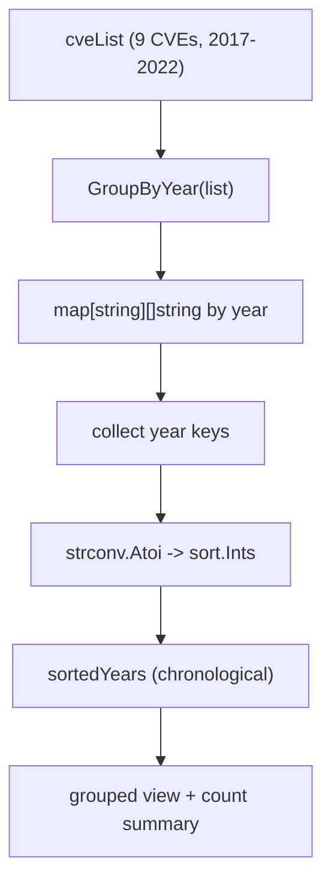

# Example: GroupByYear

:::tip 📂 View Source
[`examples/12_group_by_year/main.go`](https://github.com/scagogogo/cve-skills/blob/main/examples/12_group_by_year/main.go) — open the full runnable example on GitHub.
:::

Bucket a flat CVE list into a `map[string][]string` keyed by year with `cve.GroupByYear`, then sort the years and render a per-year breakdown plus a yearly count summary — the starting point for trend analysis and year-organized vulnerability reports.

:::tip 🎯 Learning objectives
- Understand the signature and return value of `cve.GroupByYear` (a `map[string][]string`)
- Learn how to sort map keys (years) deterministically when Go map iteration is randomized
- Build a per-year grouped report and a yearly count summary from a raw CVE list
:::

## Scenario

A vulnerability management team keeps a flat list of well-known CVEs spanning several years — Log4Shell, Spring4Shell, Dirty Pipe, BlueKeep, EternalBlue and more. For the yearly review they need the list organized by year: each year shown with its own CVEs and a count, in chronological order. Because `GroupByYear` returns a `map[string][]string`, the year keys come back in random iteration order, so the team also sorts the keys numerically before printing — producing a stable, year-by-year view suitable for trend analysis, prioritization, and report generation.

## Full code

```go
package main

import (
	"fmt"
	"sort"
	"strconv"

	"github.com/scagogogo/cve-skills"
)

func main() {
	fmt.Println("按年份分组CVE示例")
	// 预期输出:
	// 按年份分组CVE示例

	// 创建一个CVE列表
	cveList := []string{
		"CVE-2022-22965", // Spring4Shell
		"CVE-2021-44228", // Log4Shell
		"CVE-2020-1337",  // 2020年的CVE
		"CVE-2021-3156",  // Sudo漏洞
		"CVE-2022-0847",  // Dirty Pipe
		"CVE-2020-0601",  // Windows CryptoAPI
		"CVE-2019-0708",  // BlueKeep
		"CVE-2017-0144",  // EternalBlue
		"CVE-2022-42889", // Text4Shell
	}

	fmt.Println("原始CVE列表:")
	for i, id := range cveList {
		fmt.Printf("[%d] %s\n", i+1, id)
	}
	// 预期输出:
	// 原始CVE列表:
	// [1] CVE-2022-22965
	// [2] CVE-2021-44228
	// [3] CVE-2020-1337
	// [4] CVE-2021-3156
	// [5] CVE-2022-0847
	// [6] CVE-2020-0601
	// [7] CVE-2019-0708
	// [8] CVE-2017-0144
	// [9] CVE-2022-42889

	// 按年份分组
	groupedCves := cve.GroupByYear(cveList)

	// 获取所有年份并排序，以便按年份顺序打印
	years := make([]string, 0, len(groupedCves))
	for year := range groupedCves {
		years = append(years, year)
	}

	// 转换为整数进行排序
	yearInts := make([]int, len(years))
	for i, year := range years {
		yearInt, _ := strconv.Atoi(year)
		yearInts[i] = yearInt
	}
	sort.Ints(yearInts)

	// 将排序后的整数年份转回字符串
	sortedYears := make([]string, len(yearInts))
	for i, yearInt := range yearInts {
		sortedYears[i] = strconv.Itoa(yearInt)
	}

	// 打印分组结果
	fmt.Println("\n按年份分组结果:")
	for _, year := range sortedYears {
		yearInt, _ := strconv.Atoi(year)
		fmt.Printf("%d年的CVE (%d个):\n", yearInt, len(groupedCves[year]))
		for i, id := range groupedCves[year] {
			fmt.Printf("  [%d] %s\n", i+1, id)
		}
	}
	// 预期输出:
	// 按年份分组结果:
	// 2017年的CVE (1个):
	//   [1] CVE-2017-0144
	// 2019年的CVE (1个):
	//   [1] CVE-2019-0708
	// 2020年的CVE (2个):
	//   [1] CVE-2020-0601
	//   [2] CVE-2020-1337
	// 2021年的CVE (2个):
	//   [1] CVE-2021-3156
	//   [2] CVE-2021-44228
	// 2022年的CVE (3个):
	//   [1] CVE-2022-0847
	//   [2] CVE-2022-22965
	//   [3] CVE-2022-42889

	// 示例：统计每年的CVE数量
	fmt.Println("\n每年CVE数量统计:")
	for _, year := range sortedYears {
		yearInt, _ := strconv.Atoi(year)
		fmt.Printf("%d年: %d个CVE\n", yearInt, len(groupedCves[year]))
	}
	// 预期输出:
	// 每年CVE数量统计:
	// 2017年: 1个CVE
	// 2019年: 1个CVE
	// 2020年: 2个CVE
	// 2021年: 2个CVE
	// 2022年: 3个CVE

	// 应用场景
	fmt.Println("\n应用场景示例:")
	fmt.Println("1. 漏洞趋势分析：对比不同年份的CVE数量和类型")
	fmt.Println("2. 漏洞响应优先级：优先处理最近年份的CVE")
	fmt.Println("3. 报告生成：按年份组织CVE列表，生成漏洞报告")
	// 预期输出:
	// 应用场景示例:
	// 1. 漏洞趋势分析：对比不同年份的CVE数量和类型
	// 2. 漏洞响应优先级：优先处理最近年份的CVE
	// 3. 报告生成：按年份组织CVE列表，生成漏洞报告
}
```

## How to run

```bash
cd examples/12_group_by_year && go run main.go
```

## Expected output

```text
按年份分组CVE示例
原始CVE列表:
[1] CVE-2022-22965
[2] CVE-2021-44228
[3] CVE-2020-1337
[4] CVE-2021-3156
[5] CVE-2022-0847
[6] CVE-2020-0601
[7] CVE-2019-0708
[8] CVE-2017-0144
[9] CVE-2022-42889

按年份分组结果:
2017年的CVE (1个):
  [1] CVE-2017-0144
2019年的CVE (1个):
  [1] CVE-2019-0708
2020年的CVE (2个):
  [1] CVE-2020-0601
  [2] CVE-2020-1337
2021年的CVE (2个):
  [1] CVE-2021-3156
  [2] CVE-2021-44228
2022年的CVE (3个):
  [1] CVE-2022-0847
  [2] CVE-2022-22965
  [3] CVE-2022-42889

每年CVE数量统计:
2017年: 1个CVE
2019年: 1个CVE
2020年: 2个CVE
2021年: 2个CVE
2022年: 3个CVE

应用场景示例:
1. 漏洞趋势分析：对比不同年份的CVE数量和类型
2. 漏洞响应优先级：优先处理最近年份的CVE
3. 报告生成：按年份组织CVE列表，生成漏洞报告
```

## Code walkthrough

The example starts from a flat `cveList` of nine well-known CVEs whose years are interleaved (2022, 2021, 2020, 2021, 2022, 2020, 2019, 2017, 2022), so the need for grouping is immediately visible.

- 📋 **Print the raw list** — the first loop numbers the CVEs `1..9` with `fmt.Printf("[%d] %s\n", i+1, id)`, showing the ungrouped, out-of-order input.
- ▶️ **Group by year** — `cve.GroupByYear(cveList)` walks the slice, extracts each year, and returns a `map[string][]string` mapping the year string (for example `"2022"`) to the CVEs belonging to that year, in their original relative order.
- 💡 **Sort the year keys** — Go map iteration is randomized, so the years are collected into a `years` slice, parsed to integers with `strconv.Atoi`, sorted with `sort.Ints`, and converted back to strings with `strconv.Itoa` into `sortedYears`. This guarantees chronological, deterministic output.
- 🔗 **Render the grouped view** — the loop walks `sortedYears`; for each year it prints a header (`%d年的CVE (%d个):`) with the count from `len(groupedCves[year])`, then lists each CVE indented under it.
- 📋 **Yearly count summary** — a second pass over `sortedYears` prints a compact `%d年: %d个CVE` line per year, turning the grouped map into a quick trend table.
- 💡 **Use cases** — the closing three `fmt.Println` calls restate the three motivations: trend analysis across years, prioritizing recent CVEs, and generating year-organized reports.



## Related functions

- [GroupByYear](/api/functions/group-by-year) — the function used in this example
- [CountByYear](/api/functions/count-by-year) — count CVEs per year instead of collecting the IDs
- [ExtractCveYear](/api/functions/extract-cve-year) — extract the year string from a single CVE
- [FilterCvesByYear](/api/functions/filter-cves-by-year) — narrow the list to a single year before grouping
- [SortCves](/api/functions/sort-cves) — flatten the list into a chronologically sorted slice instead of grouping

## Extensions

- 🎯 Add a duplicate entry (for example a second `CVE-2022-22965`) and observe how `GroupByYear` keeps both copies in the 2022 bucket; combine with `RemoveDuplicateCves` first to deduplicate.
- 🎯 Insert a malformed string such as `"not-a-cve"` and confirm it is silently dropped — the per-year counts stay unchanged and no new year bucket appears.
- 🎯 After grouping, combine `GroupByYear` with `FilterCvesByYearRange` to render only the 2020–2022 buckets and compare the counts against the full list.
