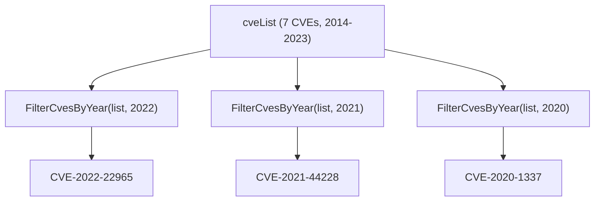

# Example: FilterCvesByYear

:::tip 📂 View Source
[`examples/13_filter_by_year/main.go`](https://github.com/scagogogo/cve-skills/blob/main/examples/13_filter_by_year/main.go) — open the full runnable example on GitHub.
:::

Quickly narrow a mixed CVE list down to a single year with `cve.FilterCvesByYear`. This is the fastest way to isolate all CVEs published in a given year for trend analysis or compliance scoping.

:::tip 🎯 Learning objectives
- Understand the signature and behavior of `cve.FilterCvesByYear`
- Learn how non-CVE strings and mismatched years are filtered out automatically
- Build a year-based CVE view for security analysis workflows
:::

## Scenario

A security team maintains a raw feed of CVE identifiers collected from multiple sources, spanning several years. For an annual review they need to pull out every CVE assigned in a specific year (for example, 2021 — the year Log4Shell was disclosed) and analyze that cohort separately. `FilterCvesByYear` takes the full list and a target year, then returns only the matching CVEs, ignoring any string that is not a valid CVE identifier.

## Full code

```go
package main

import (
	"fmt"

	"github.com/scagogogo/cve-skills"
)

func main() {
	fmt.Println("按年份筛选CVE示例")
	// 预期输出:
	// 按年份筛选CVE示例

	// 创建一个包含不同年份CVE的列表
	cveList := []string{
		"CVE-2022-22965", // Spring4Shell
		"CVE-2021-44228", // Log4Shell
		"CVE-2020-1337",  // 2020年的CVE
		"CVE-2019-0708",  // BlueKeep
		"CVE-2017-0144",  // EternalBlue
		"CVE-2014-0160",  // Heartbleed
		"CVE-2023-9999",  // 2023年的CVE
	}

	fmt.Println("原始CVE列表:")
	for i, id := range cveList {
		fmt.Printf("[%d] %s\n", i+1, id)
	}
	// 预期输出:
	// 原始CVE列表:
	// [1] CVE-2022-22965
	// [2] CVE-2021-44228
	// [3] CVE-2020-1337
	// [4] CVE-2019-0708
	// [5] CVE-2017-0144
	// [6] CVE-2014-0160
	// [7] CVE-2023-9999

	// 筛选2022年的CVE
	cves2022 := cve.FilterCvesByYear(cveList, 2022)
	fmt.Println("\n2022年的CVE:")
	for i, id := range cves2022 {
		fmt.Printf("[%d] %s\n", i+1, id)
	}
	// 预期输出:
	// 2022年的CVE:
	// [1] CVE-2022-22965

	// 筛选2021年的CVE
	cves2021 := cve.FilterCvesByYear(cveList, 2021)
	fmt.Println("\n2021年的CVE:")
	for i, id := range cves2021 {
		fmt.Printf("[%d] %s\n", i+1, id)
	}
	// 预期输出:
	// 2021年的CVE:
	// [1] CVE-2021-44228

	// 筛选2020年的CVE
	cves2020 := cve.FilterCvesByYear(cveList, 2020)
	fmt.Println("\n2020年的CVE:")
	for i, id := range cves2020 {
		fmt.Printf("[%d] %s\n", i+1, id)
	}
	// 预期输出:
	// 2020年的CVE:
	// [1] CVE-2020-1337

	// 应用场景示例
	fmt.Println("\n应用场景示例 - 安全分析:")
	fmt.Println("安全团队需要对特定年份的CVE进行单独分析")
	fmt.Println("例如分析2021年的Log4Shell漏洞及相关CVE")
	// 预期输出:
	// 应用场景示例 - 安全分析:
	// 安全团队需要对特定年份的CVE进行单独分析
	// 例如分析2021年的Log4Shell漏洞及相关CVE

	// 注意事项
	fmt.Println("\n注意事项:")
	fmt.Println("1. 年份必须是有效的CVE年份(1999年至今)")
	fmt.Println("2. 非CVE格式的字符串会被自动过滤")
	fmt.Println("3. 年份不匹配的CVE会被过滤掉")
	// 预期输出:
	// 注意事项:
	// 1. 年份必须是有效的CVE年份(1999年至今)
	// 2. 非CVE格式的字符串会被自动过滤
	// 3. 年份不匹配的CVE会被过滤掉
}
```

## How to run

```bash
cd examples/13_filter_by_year && go run main.go
```

## Expected output

```text
按年份筛选CVE示例
原始CVE列表:
[1] CVE-2022-22965
[2] CVE-2021-44228
[3] CVE-2020-1337
[4] CVE-2019-0708
[5] CVE-2017-0144
[6] CVE-2014-0160
[7] CVE-2023-9999

2022年的CVE:
[1] CVE-2022-22965

2021年的CVE:
[1] CVE-2021-44228

2020年的CVE:
[1] CVE-2020-1337

应用场景示例 - 安全分析:
安全团队需要对特定年份的CVE进行单独分析
例如分析2021年的Log4Shell漏洞及相关CVE

注意事项:
1. 年份必须是有效的CVE年份(1999年至今)
2. 非CVE格式的字符串会被自动过滤
3. 年份不匹配的CVE会被过滤掉
```

## Code walkthrough

The example first builds a `cveList` containing seven CVEs spanning 2014 to 2023, each annotated with its well-known name (Spring4Shell, Log4Shell, BlueKeep, EternalBlue, Heartbleed, and so on).

- 📋 **Build the source list** — `cveList` mixes years deliberately so the filter has something to narrow down. The slice is printed first so you can see the input order.
- ▶️ **Filter by year** — `cve.FilterCvesByYear(cveList, year)` is called three times with `2022`, `2021`, and `2020`. Each call returns a new slice containing only the CVE whose year segment matches the target.
- 💡 **Automatic cleanup** — strings that are not valid CVE identifiers are dropped during filtering, so you do not need to pre-sanitize the input.
- 🔗 **Scenario and notes** — the closing `fmt.Println` calls illustrate a realistic security-analysis use case and remind the reader of the valid year range (1999 to the present).



## Related functions

- [FilterCvesByYear](/api/functions/filter-cves-by-year) — the function used in this example
- [FilterCvesByYearRange](/api/functions/filter-cves-by-year-range) — filter by a range of years instead of a single year
- [FilterCvesByPattern](/api/functions/filter-cves-by-pattern) — filter by a regex pattern
- [FilterValidCves](/api/functions/filter-valid-cves) — keep only valid CVE identifiers
- [GroupByYear](/api/functions/group-by-year) — group CVEs by year instead of filtering

## Extensions

- 🎯 Add a non-CVE string (for example `"CVE-2021-44228-xxx"`) to `cveList` and confirm it is dropped from every result.
- 🎯 Replace the single-year calls with one `FilterCvesByYearRange` call covering 2019–2021 and compare the output.
- 🎯 Combine `FilterCvesByYear` with `GroupByYear` to first isolate 2021 and then break it down by CVE prefix.
