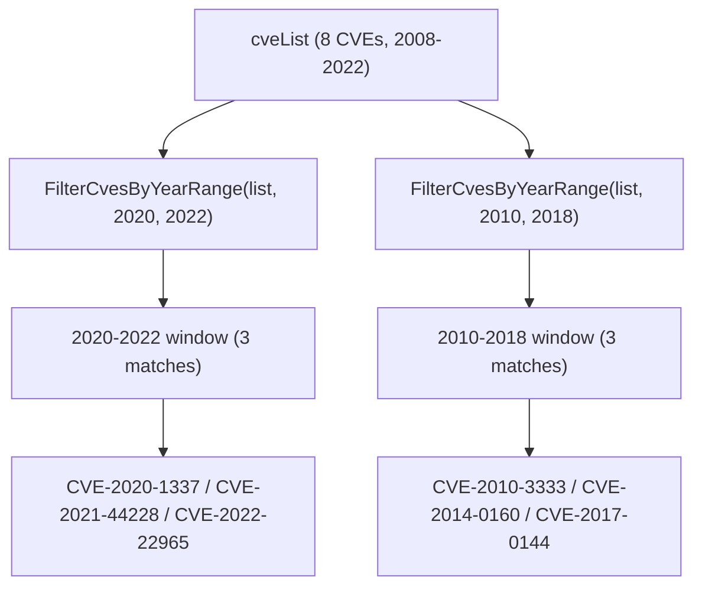

# Example: FilterCvesByYearRange

:::tip 📂 View Source
[`examples/14_filter_by_year_range/main.go`](https://github.com/scagogogo/cve-skills/blob/main/examples/14_filter_by_year_range/main.go) — open the full runnable example on GitHub.
:::

Narrow a multi-year CVE list down to a closed year window with `cve.FilterCvesByYearRange`. This is the natural choice for isolating every CVE published inside a reporting period (a fiscal year, a quarter, a multi-year compliance scope) from a single cumulative feed.

:::tip 🎯 Learning objectives
- Understand the signature and inclusive-range behavior of `cve.FilterCvesByYearRange`
- Learn how malformed strings and out-of-range CVEs are dropped silently during filtering
- Build a year-window CVE view for trend analysis and compliance workflows
:::

## Scenario

A security operations center keeps a running list of CVE identifiers accumulated over many years — from legacy disclosures like Conficker (2008) and Heartbleed (2014) up to recent ones like Spring4Shell (2022). For an annual review they need to extract every CVE whose year falls inside a closed window, for example 2020–2022, and then a second window 2010–2018 for a legacy-system audit. `FilterCvesByYearRange` takes the full list plus a `startYear` and `endYear` (both inclusive) and returns only the matching CVEs, ignoring any string that is not a valid CVE identifier.

## Full code

```go
package main

import (
	"fmt"

	"github.com/scagogogo/cve-skills"
)

func main() {
	fmt.Println("按年份区间筛选CVE示例")
	// 预期输出:
	// 按年份区间筛选CVE示例

	// 创建一个包含不同年份CVE的列表
	cveList := []string{
		"CVE-2022-22965", // Spring4Shell
		"CVE-2021-44228", // Log4Shell
		"CVE-2020-1337",  // 2020年的CVE
		"CVE-2019-0708",  // BlueKeep
		"CVE-2017-0144",  // EternalBlue
		"CVE-2014-0160",  // Heartbleed
		"CVE-2010-3333",  // RTF Stack Buffer Overflow
		"CVE-2008-4250",  // Conficker
	}

	fmt.Println("原始CVE列表:")
	for i, id := range cveList {
		fmt.Printf("[%d] %s\n", i+1, id)
	}
	// 预期输出:
	// 原始CVE列表:
	// [1] CVE-2022-22965
	// [2] CVE-2021-44228
	// [3] CVE-2020-1337
	// [4] CVE-2019-0708
	// [5] CVE-2017-0144
	// [6] CVE-2014-0160
	// [7] CVE-2010-3333
	// [8] CVE-2008-4250

	// 筛选2020-2022年的CVE
	startYear := 2020
	endYear := 2022
	filteredCves := cve.FilterCvesByYearRange(cveList, startYear, endYear)

	fmt.Printf("\n%d-%d年的CVE:\n", startYear, endYear)
	for i, id := range filteredCves {
		fmt.Printf("[%d] %s\n", i+1, id)
	}
	// 预期输出:
	// 2020-2022年的CVE:
	// [1] CVE-2020-1337
	// [2] CVE-2021-44228
	// [3] CVE-2022-22965

	// 筛选2010-2018年的CVE
	startYear = 2010
	endYear = 2018
	filteredCves = cve.FilterCvesByYearRange(cveList, startYear, endYear)

	fmt.Printf("\n%d-%d年的CVE:\n", startYear, endYear)
	for i, id := range filteredCves {
		fmt.Printf("[%d] %s\n", i+1, id)
	}
	// 预期输出:
	// 2010-2018年的CVE:
	// [1] CVE-2010-3333
	// [2] CVE-2014-0160
	// [3] CVE-2017-0144

	// 应用场景示例
	fmt.Println("\n应用场景示例:")
	fmt.Println("1. 安全漏洞分析：分析特定时间范围内发布的CVE")
	fmt.Println("2. 合规性检查：检查系统是否受到特定年份范围内发布的CVE影响")
	fmt.Println("3. 趋势分析：分析不同年份区间CVE的数量和类型变化")
	// 预期输出:
	// 应用场景示例:
	// 1. 安全漏洞分析：分析特定时间范围内发布的CVE
	// 2. 合规性检查：检查系统是否受到特定年份范围内发布的CVE影响
	// 3. 趋势分析：分析不同年份区间CVE的数量和类型变化

	// 注意事项
	fmt.Println("\n注意事项:")
	fmt.Println("1. 年份范围包含起始年和结束年")
	fmt.Println("2. 如果开始年份大于结束年份，函数会返回空列表")
	fmt.Println("3. 筛选的年份必须在有效的CVE年份范围内(1999年至今)")
	// 预期输出:
	// 注意事项:
	// 1. 年份范围包含起始年和结束年
	// 2. 如果开始年份大于结束年份，函数会返回空列表
	// 3. 筛选的年份必须在有效的CVE年份范围内(1999年至今)
}
```

## How to run

```bash
cd examples/14_filter_by_year_range && go run main.go
```

## Expected output

```text
按年份区间筛选CVE示例
原始CVE列表:
[1] CVE-2022-22965
[2] CVE-2021-44228
[3] CVE-2020-1337
[4] CVE-2019-0708
[5] CVE-2017-0144
[6] CVE-2014-0160
[7] CVE-2010-3333
[8] CVE-2008-4250

2020-2022年的CVE:
[1] CVE-2020-1337
[2] CVE-2021-44228
[3] CVE-2022-22965

2010-2018年的CVE:
[1] CVE-2010-3333
[2] CVE-2014-0160
[3] CVE-2017-0144

应用场景示例:
1. 安全漏洞分析：分析特定时间范围内发布的CVE
2. 合规性检查：检查系统是否受到特定年份范围内发布的CVE影响
3. 趋势分析：分析不同年份区间CVE的数量和类型变化

注意事项:
1. 年份范围包含起始年和结束年
2. 如果开始年份大于结束年份，函数会返回空列表
3. 筛选的年份必须在有效的CVE年份范围内(1999年至今)
```

## Code walkthrough

The example builds a `cveList` of eight CVEs spanning 2008 to 2022, each annotated with its well-known name (Spring4Shell, Log4Shell, BlueKeep, EternalBlue, Heartbleed, the 2010 RTF stack buffer overflow, and Conficker).

- 📋 **Build the source list** — `cveList` deliberately mixes years so the range filter has something to narrow down. The slice is printed first so the input order is visible.
- ▶️ **Filter by a closed year window** — `cve.FilterCvesByYearRange(cveList, startYear, endYear)` is called twice, first with `(2020, 2022)` and then with `(2010, 2018)`. Each call returns a new slice containing only the CVE whose year segment falls inside the inclusive range `[startYear, endYear]`.
- 💡 **Inclusive bounds** — both endpoints count, so `(2020, 2022)` keeps CVEs from 2020, 2021, and 2022. Setting `startYear == endYear` degenerates into a single-year filter.
- 🔗 **Scenario and notes** — the closing `fmt.Println` calls list realistic use cases (vulnerability analysis, compliance checking, trend analysis) and remind the reader that the range is inclusive, that an inverted range (`startYear > endYear`) yields an empty list, and that years must stay inside the valid CVE year range (1999 to the present).



## Related functions

- [FilterCvesByYearRange](/api/functions/filter-cves-by-year-range) — the function used in this example
- [FilterCvesByYear](/api/functions/filter-cves-by-year) — filter by a single year instead of a range
- [GetRecentCves](/api/functions/get-recent-cves) — filter CVEs from the most recent N years (built on top of this function)
- [GroupByYear](/api/functions/group-by-year) — group CVEs by year instead of filtering
- [CountByYear](/api/functions/count-by-year) — count CVEs per year for trend analysis

## Extensions

- 🎯 Add an inverted range such as `(2022, 2020)` and confirm the function returns an empty slice.
- 🎯 Insert a malformed string like `"CVE-2021-44228-xxx"` into `cveList` and verify it is silently dropped from every range result.
- 🎯 Chain `FilterCvesByYearRange(list, 2019, 2022)` with `SortCves` to produce a strictly year-ascending, sequence-ascending CVE list for a report.
