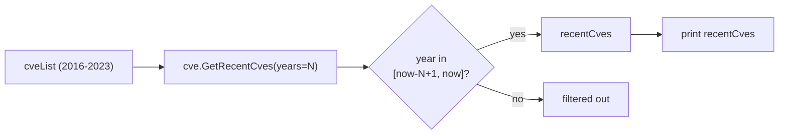

# Example: GetRecentCves

:::tip 📂 View Source
[`examples/15_get_recent_cves/main.go`](https://github.com/scagogogo/cve-skills/blob/main/examples/15_get_recent_cves/main.go) — open the full runnable example on GitHub.
:::

Filter CVEs published within the most recent N years from a list, so you can focus on the vulnerabilities that matter right now.

:::tip 🎯 Learning objectives

- Use `cve.GetRecentCves` to keep only CVEs from the last N years.
- Understand that the year window is computed from the current time.
- Combine the result with triage, trend analysis, and compliance checks.

:::

## Scenario

You maintain a vulnerability backlog that spans many years — Log4Shell, BlueKeep, EternalBlue, plus this year's spring batch. Triage time is finite, so you want to surface only the CVEs from the last 1-3 years: those are the ones most likely to be exploited in the wild and most relevant to your current attack surface. `GetRecentCves` takes a list of CVE IDs and a year count, and returns only those whose year falls inside the rolling window ending at the current year.

## Full code

```go
package main

import (
	"fmt"
	"time"

	"github.com/scagogogo/cve-skills"
)

func main() {
	fmt.Println("获取最近几年的CVE示例")
	// 预期输出:
	// 获取最近几年的CVE示例

	// 创建一个包含多个年份CVE的列表
	cveList := []string{
		"CVE-2023-22965", // 今年的CVE
		"CVE-2022-1111",  // 去年的CVE
		"CVE-2021-44228", // Log4Shell (2年前)
		"CVE-2020-1337",  // 3年前的CVE
		"CVE-2019-0708",  // BlueKeep (4年前)
		"CVE-2018-1000",  // 5年前的CVE
		"CVE-2017-0144",  // EternalBlue (6年前)
		"CVE-2016-0123",  // 7年前的CVE
	}

	fmt.Println("原始CVE列表:")
	for i, id := range cveList {
		fmt.Printf("[%d] %s\n", i+1, id)
	}
	// 预期输出:
	// 原始CVE列表:
	// [1] CVE-2023-22965
	// [2] CVE-2022-1111
	// [3] CVE-2021-44228
	// [4] CVE-2020-1337
	// [5] CVE-2019-0708
	// [6] CVE-2018-1000
	// [7] CVE-2017-0144
	// [8] CVE-2016-0123

	// 获取最近1年的CVE
	years := 1
	recentCves := cve.GetRecentCves(cveList, years)
	fmt.Printf("\n最近%d年的CVE (包含%d年):\n", years, time.Now().Year())
	for i, id := range recentCves {
		fmt.Printf("[%d] %s\n", i+1, id)
	}
	currentYear := time.Now().Year()
	// 预期输出:
	// 最近1年的CVE (包含2023年):
	// [1] CVE-2023-22965

	// 获取最近2年的CVE
	years = 2
	recentCves = cve.GetRecentCves(cveList, years)
	fmt.Printf("\n最近%d年的CVE (包含%d-%d年):\n", years, currentYear-years+1, currentYear)
	for i, id := range recentCves {
		fmt.Printf("[%d] %s\n", i+1, id)
	}
	// 预期输出:
	// 最近2年的CVE (包含2022-2023年):
	// [1] CVE-2022-1111
	// [2] CVE-2023-22965

	// 获取最近3年的CVE
	years = 3
	recentCves = cve.GetRecentCves(cveList, years)
	fmt.Printf("\n最近%d年的CVE (包含%d-%d年):\n", years, currentYear-years+1, currentYear)
	for i, id := range recentCves {
		fmt.Printf("[%d] %s\n", i+1, id)
	}
	// 预期输出:
	// 最近3年的CVE (包含2021-2023年):
	// [1] CVE-2021-44228
	// [2] CVE-2022-1111
	// [3] CVE-2023-22965

	// 应用场景示例
	fmt.Println("\n应用场景示例:")
	fmt.Println("1. 漏洞响应优先级 - 优先修复最近几年的漏洞")
	fmt.Println("2. 安全态势感知 - 分析最近一段时间内的CVE趋势")
	fmt.Println("3. 合规性检查 - 检查系统是否受到最近发布的高危CVE影响")
	// 预期输出:
	// 应用场景示例:
	// 1. 漏洞响应优先级 - 优先修复最近几年的漏洞
	// 2. 安全态势感知 - 分析最近一段时间内的CVE趋势
	// 3. 合规性检查 - 检查系统是否受到最近发布的高危CVE影响

	// 注意事项
	fmt.Println("\n注意事项:")
	fmt.Println("1. 函数会自动基于当前时间计算年份范围")
	fmt.Println("2. 包含参数指定的年数(包括当前年份)")
	fmt.Println("3. 结果会按照CVE的标准格式返回")
	// 预期输出:
	// 注意事项:
	// 1. 函数会自动基于当前时间计算年份范围
	// 2. 包含参数指定的年数(包括当前年份)
	// 3. 结果会按照CVE的标准格式返回
}

// 辅助函数：打印CVE列表
func printCveList(list []string) {
	for i, id := range list {
		fmt.Printf("[%d] %s\n", i+1, id)
	}
}
```

## How to run

```bash
cd examples/15_get_recent_cves && go run main.go
```

## Expected output

The year window is computed from the current time at runtime. The output below is what the source comments record (written when the current year was 2023); run it today to see the window shift forward.

```text
获取最近几年的CVE示例
原始CVE列表:
[1] CVE-2023-22965
[2] CVE-2022-1111
[3] CVE-2021-44228
[4] CVE-2020-1337
[5] CVE-2019-0708
[6] CVE-2018-1000
[7] CVE-2017-0144
[8] CVE-2016-0123

最近1年的CVE (包含2023年):
[1] CVE-2023-22965

最近2年的CVE (包含2022-2023年):
[1] CVE-2022-1111
[2] CVE-2023-22965

最近3年的CVE (包含2021-2023年):
[1] CVE-2021-44228
[2] CVE-2022-1111
[3] CVE-2023-22965

应用场景示例:
1. 漏洞响应优先级 - 优先修复最近几年的漏洞
2. 安全态势感知 - 分析最近一段时间内的CVE趋势
3. 合规性检查 - 检查系统是否受到最近发布的高危CVE影响

注意事项:
1. 函数会自动基于当前时间计算年份范围
2. 包含参数指定的年数(包括当前年份)
3. 结果会按照CVE的标准格式返回
```

## Walkthrough

📋 **Build the input list.** `cveList` mixes eight CVEs from 2016 to 2023, including well-known names (Log4Shell, BlueKeep, EternalBlue). This deliberately spans a wide year range so the filter has something to cut away.

▶️ **Call `cve.GetRecentCves(cveList, years)`.** The function reads the current year with `time.Now().Year()`, forms the inclusive window `[currentYear-years+1, currentYear]`, parses the year out of each CVE ID, and keeps only those that fall inside the window. Results are returned in CVE-standard format.

💡 **Vary `years` from 1 to 3.** With `years=1` only the current-year CVE survives; `years=2` adds the previous year; `years=3` adds the year before that. Older entries like BlueKeep (2019) and EternalBlue (2017) stay filtered out until `years` grows large enough to reach them.

🔗 **Mind the rolling window.** Because the window anchors on `time.Now()`, the same call produces different results in different calendar years. The source comments encode the 2023 snapshot; re-run to see the window slide forward.



## Functions used

- [GetRecentCves](/api/functions/get-recent-cves)

## Exercises

- Filter to the last 5 years and confirm BlueKeep (2019) and EternalBlue (2017) appear in the result.
- Chain `cve.GetRecentCves` with `cve.SortCves` to print recent CVEs in ascending order.
- Build a report that prints two groups side by side: CVEs from the last year, and CVEs older than 5 years.
