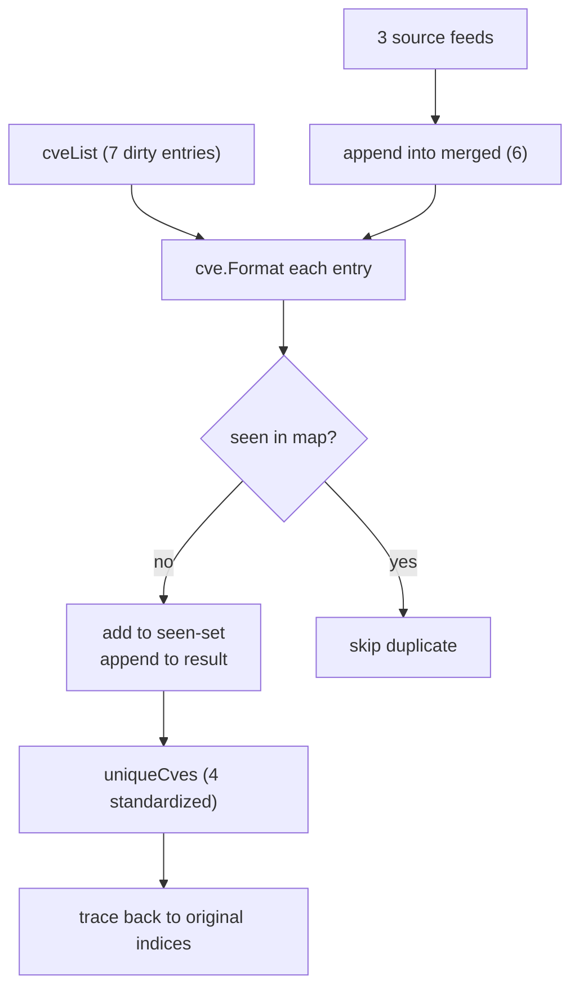

# Example: RemoveDuplicateCves

:::tip 📂 View Source
[`examples/16_remove_duplicate_cves/main.go`](https://github.com/scagogogo/cve-skills/blob/main/examples/16_remove_duplicate_cves/main.go) — open the full runnable example on GitHub.
:::

Remove case-insensitive and whitespace-tolerant duplicates from a CVE list, keeping only the first occurrence in standardized format.

:::tip 🎯 Learning objectives

- Use `cve.RemoveDuplicateCves` to deduplicate a CVE list case-insensitively.
- Understand that comparisons run on the standardized (uppercased, trimmed) form, and the result keeps the first occurrence.
- Apply it to merge CVEs collected from multiple sources into one clean set.

:::

## Scenario

You aggregate CVEs from several feeds — a scanner, an SBOM, a manual ticket, a vendor advisory. The same vulnerability shows up multiple times: once as `CVE-2022-1111`, once as `cve-2022-1111` from a lowercase feed, once with stray whitespace ` CVE-2021-3333 `. Before you triage or report, you need a single clean list with no duplicates. `RemoveDuplicateCves` normalizes each entry (uppercase, trim) and keeps only the first occurrence, returning a standardized list.

## Full code

```go
package main

import (
	"fmt"

	"github.com/scagogogo/cve-skills"
)

func main() {
	fmt.Println("去除重复CVE示例")

	// 创建一个包含重复CVE的列表
	cveList := []string{
		"CVE-2022-1111",
		"cve-2022-1111", // 与第一个相同，但大小写不同
		"CVE-2022-2222",
		"CVE-2021-3333",
		"CVE-2022-2222",   // 与第三个完全相同
		" CVE-2021-3333 ", // 与第四个相同，但有空格
		"CVE-2020-4444",
	}

	fmt.Println("原始CVE列表:")
	for i, id := range cveList {
		fmt.Printf("[%d] %q\n", i+1, id)
	}

	// 去除重复的CVE
	uniqueCves := cve.RemoveDuplicateCves(cveList)

	fmt.Println("\n去重后的CVE列表:")
	for i, id := range uniqueCves {
		fmt.Printf("[%d] %s\n", i+1, id)
	}

	// 演示时显示每个去重后CVE的来源
	fmt.Println("\n去重效果分析:")

	// 创建映射表示原始索引
	originalIndices := make(map[string][]int)
	for i, id := range cveList {
		formattedID := cve.Format(id)
		originalIndices[formattedID] = append(originalIndices[formattedID], i+1)
	}

	// 显示每个去重后的CVE来自哪些原始项
	for i, id := range uniqueCves {
		indices := originalIndices[id]
		indicesStr := ""
		for j, idx := range indices {
			if j > 0 {
				indicesStr += ", "
			}
			indicesStr += fmt.Sprintf("%d", idx)
		}
		fmt.Printf("[%d] %s - 来自原始列表中的第 %s 项\n", i+1, id, indicesStr)
	}

	// 应用场景示例
	fmt.Println("\n应用场景示例 - 合并多个来源的CVE:")

	// 模拟来自不同来源的CVE列表
	source1 := []string{"CVE-2022-1111", "CVE-2022-2222"}
	source2 := []string{"cve-2022-1111", "CVE-2022-3333"}
	source3 := []string{"CVE-2022-4444", "CVE-2022-2222"}

	fmt.Println("来源1的CVE:", source1)
	fmt.Println("来源2的CVE:", source2)
	fmt.Println("来源3的CVE:", source3)

	// 合并所有来源
	merged := make([]string, 0)
	merged = append(merged, source1...)
	merged = append(merged, source2...)
	merged = append(merged, source3...)

	fmt.Println("\n合并后的CVE列表:")
	for i, id := range merged {
		fmt.Printf("[%d] %s\n", i+1, id)
	}

	// 去重
	uniqueMerged := cve.RemoveDuplicateCves(merged)

	fmt.Println("\n合并并去重后的CVE列表:")
	for i, id := range uniqueMerged {
		fmt.Printf("[%d] %s\n", i+1, id)
	}
	fmt.Printf("\n总计: 从%d个条目中提取出%d个唯一的CVE\n",
		len(merged), len(uniqueMerged))
}
```

## How to run

```bash
cd examples/16_remove_duplicate_cves && go run main.go
```

## Expected output

```text
去除重复CVE示例
原始CVE列表:
[1] "CVE-2022-1111"
[2] "cve-2022-1111"
[3] "CVE-2022-2222"
[4] "CVE-2021-3333"
[5] "CVE-2022-2222"
[6] " CVE-2021-3333 "
[7] "CVE-2020-4444"

去重后的CVE列表:
[1] CVE-2022-1111
[2] CVE-2022-2222
[3] CVE-2021-3333
[4] CVE-2020-4444

去重效果分析:
[1] CVE-2022-1111 - 来自原始列表中的第 1, 2 项
[2] CVE-2022-2222 - 来自原始列表中的第 3, 5 项
[3] CVE-2021-3333 - 来自原始列表中的第 4, 6 项
[4] CVE-2020-4444 - 来自原始列表中的第 7 项

应用场景示例 - 合并多个来源的CVE:
来源1的CVE: [CVE-2022-1111 CVE-2022-2222]
来源2的CVE: [cve-2022-1111 CVE-2022-3333]
来源3的CVE: [CVE-2022-4444 CVE-2022-2222]

合并后的CVE列表:
[1] CVE-2022-1111
[2] CVE-2022-2222
[3] cve-2022-1111
[4] CVE-2022-3333
[5] CVE-2022-4444
[6] CVE-2022-2222

合并并去重后的CVE列表:
[1] CVE-2022-1111
[2] CVE-2022-2222
[3] CVE-2022-3333
[4] CVE-2022-4444

总计: 从6个条目中提取出4个唯一的CVE
```

## Walkthrough

📋 **Build a list with dirty duplicates.** `cveList` carries seven entries where only four are truly distinct. Duplicates sneak in as case variants (`cve-2022-1111`), exact repeats (`CVE-2022-2222`), and whitespace-padded copies (` CVE-2021-3333 `). The `%q` format in the print loop makes the whitespace and casing visible.

▶️ **Call `cve.RemoveDuplicateCves(cveList)`.** The function loops over each entry, normalizes it with `cve.Format` (uppercase + trim), and uses a `map[string]struct{}` as a seen-set. The first time a normalized form appears it is appended to the result; every later occurrence is dropped. Output is always standardized format.

💡 **Trace each survivor back to its sources.** A second pass builds `originalIndices` by mapping `cve.Format(id)` back to every original position. This proves which input entries collapsed into each unique CVE — e.g. `CVE-2022-1111` came from both entry 1 (`CVE-2022-1111`) and entry 2 (`cve-2022-1111`).

🔗 **Merge multiple feeds, then dedupe.** Three source slices are concatenated with `append(merged, sourceN...)`, producing six entries with overlaps. A single `cve.RemoveDuplicateCves(merged)` collapses them to four unique CVEs, and the final `fmt.Printf` reports the reduction (`从6个条目中提取出4个唯一的CVE`).



## Functions used

- [RemoveDuplicateCves](/api/functions/remove-duplicate-cves)
- [Format](/api/functions/format)

## Exercises

- Feed in a list where every entry is the same CVE in a different casing, and confirm the result has length 1.
- Combine `cve.RemoveDuplicateCves` with `cve.SortCves` to print a deduplicated list in ascending order.
- After merging three feeds, also pipe the result through `cve.GetRecentCves(_, 2)` to keep only recent unique CVEs.
